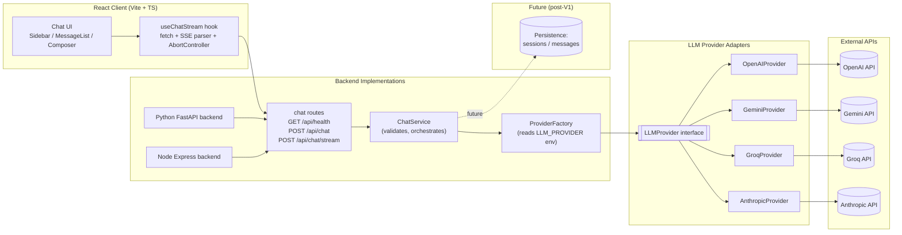

# Fullstack AI Platform

A full-stack streaming chatbot project with:

- Frontend: React + TypeScript + Vite
- Backends: FastAPI (Python) and Express + TypeScript (Node.js)
- LLM providers: OpenAI, Gemini, Groq, and Anthropic (switchable via environment variables)

Current status:

- Frontend chatbot page redesigned with Tailwind CSS v4 into a responsive ChatGPT-like shell
- Sidebar foundation added for future multi-chat sessions, with mobile drawer and tablet collapse behavior
- Stream interruption handling with inline Retry UI
- Typed backend error envelopes and SSE error frames
- Request-size and schema validation on both backends
- Backend and frontend automated test coverage for the main chat flow
- OpenAI, Gemini, Groq, and Anthropic provider support behind the same frontend contract
- Python backend is the active MVP backend in production (Railway)
- Node backend is paused until post-MVP work resumes
- Deployment runbook and prerequisite checklist documented for Railway + Vercel

## Repository Structure

- `backend-python/` - FastAPI active MVP backend
- `backend-nodejs/` - Express + TypeScript post-MVP backend (currently paused)
- `frontend/` - React client with streaming UI
- `docs/` - planning notes (ignored by git in this repo setup)

## Features

- Non-streaming endpoint: `POST /api/chat`
- Streaming SSE endpoint: `POST /api/chat/stream`
- Health endpoint: `GET /api/health`
- Provider abstraction: switch between OpenAI/Gemini/Groq/Anthropic without frontend changes
- Responsive chat shell with persistent desktop sidebar, collapsible tablet sidebar, and mobile drawer
- Tailwind CSS v4-driven chat UI with accessible landmarks, focus states, and sticky composer
- Stop/cancel while streaming
- Retry after interrupted streams
- Standardized error handling for validation, timeout, and provider failures

## System Design Diagram



## Prerequisites

- Python 3.12+
- [uv](https://docs.astral.sh/uv/)
- Node.js 20+ (24 works)
- npm

## Quick Start

### 1) Python Backend

```bash
cd backend-python
cp .env.example .env
# Fill in API keys in .env for the selected provider
uv sync
make run
```

### 2) Node Backend (Optional, Post-MVP)

```bash
cd backend-nodejs
npm install
# Create backend-nodejs/.env and fill in provider keys
PORT=8001 npm run dev
```

### 3) Frontend

```bash
cd frontend
cp .env.example .env
npm install
npm run dev
```

Frontend default URL: `http://localhost:5173`

Frontend highlights:

- Tailwind CSS v4 app shell and chat page styling
- Responsive sidebar behavior across mobile, tablet, and desktop
- Streaming thread UI with retry, stop, and connection error feedback

Python backend default URL: `http://localhost:8000`

Node backend recommended local URL: `http://localhost:8001`

Production backend URL (MVP): `https://fullstack-ai-platform-production.up.railway.app`

Before running locally, make sure the selected backend provider has a real API key in the backend `.env` file you are using.

## Cross-Platform Note (Windows)

The Python backend Makefile commands are convenient, but `make` is not installed by default on native Windows.

- WSL2 users can run the same `make` commands shown in this README.
- Native Windows users can install GNU Make (for example with Chocolatey or Scoop), or run direct alternatives:

```bash
cd backend-python
uv run python -m uvicorn app.main:app --reload --port 8000
uv run python -m ruff check app tests
uv run python -m pytest -q
```

## Developer Onboarding

### Setting Up Pre-Commit Hooks

This repository uses [pre-commit](https://pre-commit.com) to enforce code quality gates locally before commits. Hooks run fast formatting and lint checks across all three app areas (frontend, Node backend, Python backend).

#### Installation (< 10 minutes)

1. **Clone and install dependencies:**

   ```bash
   git clone <repo>
   cd fullstack-ai-platform

   # Install dependencies for all apps
   npm install                    # frontend
   (cd backend-nodejs && npm install)
   (cd backend-python && uv sync)
   ```

2. **Install pre-commit framework and git hooks:**

   ```bash
   pip install pre-commit
   # or with uv:
   uv tool install pre-commit

   # Install git hooks
   pre-commit install
   ```

3. **Verify installation:**
   ```bash
   pre-commit --version
   pre-commit run --all-files
   ```

#### Running Hooks

- **On next commit:** hooks run automatically
- **Check all files:** `pre-commit run --all-files`
- **Skip hooks (emergency only):** `git commit --no-verify` (see bypass policy below)

#### What Hooks Check

| Area              | Check                                 | Auto-Fix          | Runtime |
| ----------------- | ------------------------------------- | ----------------- | ------- |
| `frontend/`       | Prettier format                       | Yes               | < 1s    |
| `frontend/`       | ESLint                                | No (requires fix) | < 2s    |
| `backend-nodejs/` | Prettier format                       | Yes               | < 1s    |
| `backend-nodejs/` | ESLint                                | No (requires fix) | < 2s    |
| `backend-python/` | Ruff check + Black format             | Yes               | < 3s    |
| Shared            | Trailing whitespace, YAML/JSON syntax | Yes               | < 1s    |

**Total typical runtime: < 5 seconds per commit**

### Hook Policy

#### Fast vs Slow Hooks

**Fast hooks (run on every commit):**

- Formatting checks (Prettier, Black)
- Linting checks (ESLint, Ruff)
- File validation (trailing whitespace, JSON/YAML syntax)
- **Why:** Keep developer feedback loop tight, catch issues immediately

**Slow hooks (run in CI only):**

- Full test suites (see `npm test`, `make test`)
- Build validation (see `npm run build`, `make build`)
- **Why:** Reserve CI resources for comprehensive validation; developer commits should be fast

#### Bypass Policy

**When you can use `git commit --no-verify`:**

- Emergency hotfix to production with documented follow-up fix
- Temporary WIP commit that will be squashed/rebased before merge
- Blocked hook that needs temporary bypass while diagnosed (use sparingly)

**Required PR documentation when bypassing:**

- Add line to PR description: `[hook-bypass] Reason: <brief reason> | Follow-up: <link to follow-up issue or PR>`
- Example: `[hook-bypass] Reason: Urgent production hotfix | Follow-up: #42`

**Rules:**

- Bypass is exceptional, not routine
- All bypassed commits must fix issues before merging to `main`
- Team members may ask to validate hooks before merge approval

### Complete Troubleshooting

#### Installation Issues

| Problem                             | Solution                                                                         |
| ----------------------------------- | -------------------------------------------------------------------------------- |
| `pre-commit not found`              | `pip install pre-commit` or `uv tool install pre-commit` (add to PATH if needed) |
| `permission denied: .git/hooks/...` | Run `chmod +x .git/hooks/pre-commit` or reinstall with `pre-commit install`      |
| Hooks not running on commit         | Run `pre-commit install` in repo root again                                      |

#### Runtime Issues

| Problem                         | Cause                              | Solution                                              |
| ------------------------------- | ---------------------------------- | ----------------------------------------------------- |
| `prettier not found`            | Node dependencies missing          | `npm install` in `frontend/` or `backend-nodejs/`     |
| `eslint not found`              | Node dependencies missing          | `npm install` in `frontend/` or `backend-nodejs/`     |
| `ruff not found`                | Python dependencies missing        | `uv sync` in `backend-python/`                        |
| `black not found`               | Python dependencies missing        | `uv sync` in `backend-python/`                        |
| Hooks timeout (> 20s)           | Large diff or missing dependencies | Check dependency installation, try smaller commits    |
| Hooks modify files unexpectedly | Auto-fix hooks reformatting code   | Re-stage auto-fixed files after hook run, then commit |

#### Common Hook Failures

| Hook Failure               | How to Fix                                                                  |
| -------------------------- | --------------------------------------------------------------------------- |
| ESLint errors block commit | Fix the issue in code (cannot auto-fix); see ESLint output for details      |
| Ruff check failures        | Run `cd backend-python && uv run ruff check --fix app tests`, then re-stage |
| Prettier disagreement      | Re-run `pre-commit run --all-files` to auto-fix, then re-stage              |
| Black formatting diff      | Re-run `pre-commit run --all-files` to auto-fix, then re-stage              |

#### Getting Help

If hooks remain broken after troubleshooting:

1. Run `pre-commit clean` to reset cache
2. Reinstall with `pre-commit uninstall && pre-commit install`
3. Run `pre-commit run --all-files` to see detailed error logs
4. Check `.pre-commit-config.yaml` for hook configuration
5. Ask team member or create an issue with full error output

### Onboarding Checklist

- [ ] Clone repo and install app dependencies (npm, uv)
- [ ] Install pre-commit: `pip install pre-commit` or `uv tool install pre-commit`
- [ ] Run `pre-commit install` in repo root
- [ ] Verify: `pre-commit --version` and `pre-commit run --all-files` (should pass)
- [ ] Make a test commit to confirm hooks run
- [ ] Ready to develop!

**Expected time: < 10 minutes**

## CI Image Tagging (Stage C2)

Container images are published by `.github/workflows/build-publish-images.yml` to GHCR:

- `ghcr.io/<owner>/fullstack-ai-platform-frontend`
- `ghcr.io/<owner>/fullstack-ai-platform-backend-nodejs`
- `ghcr.io/<owner>/fullstack-ai-platform-backend-python`

Tag strategy:

- Immutable: `sha-<git_sha>`
- Mutable channels: `main`, `staging`, `prod`

Publish rules:

- Push to `main` publishes changed services with `sha-<git_sha>`, `main`, and `staging`
- Push of release tags (`v*`, `release-*`) publishes all services from the tagged commit with `sha-<git_sha>` and `prod`

Each image build also uploads a metadata artifact (service, ref, sha, digest, tags/labels) as a provenance baseline.

## PR Quality Gates (Stage C3)

`main` is protected with required CI checks and an up-to-date branch requirement.

Required checks:

- `Frontend PR Checks`
- `Backend Node.js PR Checks`
- `Backend Python PR Checks`

Merge policy:

- Merge commits are disabled
- Linear history is required on `main`
- Squash merge or rebase merge should be used

Expected PR checklist:

- [ ] Branch is up to date with `main`
- [ ] Relevant required checks passed for changed app areas
- [ ] No hook bypass remains unresolved in the PR description
- [ ] Scope stays within the intended app area or rollout phase
- [ ] Merge uses squash or rebase, not a merge commit

## Backend Selection

The frontend talks to whichever backend is configured in `frontend/.env`:

```dotenv
VITE_API_BASE_URL=http://localhost:8000
```

Use `8000` for Python and `8001` for Node during side-by-side development.

## Provider Switching

In either backend env file:

- `LLM_PROVIDER=openai` or `LLM_PROVIDER=gemini`
- set provider-specific key/model values

Examples:

```dotenv
LLM_PROVIDER=openai
OPENAI_MODEL=gpt-4o-mini
```

```dotenv
LLM_PROVIDER=gemini
GEMINI_MODEL=gemini-3.1-flash-lite
```

Then restart backend.

For the Node backend, the equivalent env file is `backend-nodejs/.env`.

## API Overview

### Health

```http
GET /api/health
```

Example response:

```json
{
  "status": "ok",
  "provider": "gemini",
  "version": "0.1.0"
}
```

### Non-streaming chat

```http
POST /api/chat
Content-Type: application/json
```

Body:

```json
{
  "messages": [{ "role": "user", "content": "What is FastAPI?" }]
}
```

### Streaming chat (SSE)

```http
POST /api/chat/stream
Content-Type: application/json
```

Returns `text/event-stream` with frames: `start`, `delta`, `end`, and `error`.
Before running locally, make sure the selected backend provider has a real API key in the backend `.env` file you are using.

## Development Commands

### Python Backend

```bash
cd backend-python
make run
make lint
make format
make format-check
make test
uv run pytest
```

### Node Backend

```bash
cd backend-nodejs
npm run dev
npm test
npm run lint
npm run format:check
npm run build
```

### Frontend

```bash
cd frontend
npm run test
npm run lint
npm run format
npm run format:check
npm run build
npm test -- --run
```

## Reliability Notes

- Non-streaming failures return a standard JSON error envelope with codes such as `validation_error`, `provider_timeout`, `provider_rate_limited`, `provider_error`, and `internal_error`.
- Streaming failures surface as SSE `error` frames with the same error codes.
- The frontend preserves partial assistant output on interruption, marks the message as interrupted, and offers Retry.
- Oversized or malformed requests are rejected before hitting the provider.

## Tests

Backend coverage includes:

- health endpoint
- non-streaming chat success and error normalization
- streaming SSE frame sequencing and cancellation behavior
- provider adapter coverage for OpenAI and Gemini
- env-driven provider selection and request-level provider overrides

Frontend coverage includes:

- SSE parser behavior across chunk boundaries
- reducer state transitions
- composer-driven streaming and Stop behavior

Recommended validation commands:

```bash
cd backend-python && uv run pytest
cd backend-nodejs && npm test
cd frontend && npm test -- --run
cd frontend && npm run build
```

## Side-By-Side Workflow

Recommended local ports:

- Python backend: `8000`
- Node backend: `8001`
- Frontend: `5173`

Typical parity workflow:

1. Run the Python backend on `8000` as the reference implementation.
2. Run the Node backend on `8001`.
3. Point `VITE_API_BASE_URL` to `http://localhost:8001` when validating Node behavior.
4. Switch `VITE_API_BASE_URL` back to `http://localhost:8000` when comparing against Python.

## Deployment Status

Deployment prerequisites and the operator runbook are documented in [docs/plans/chatbot-v1.md](docs/plans/chatbot-v1.md).

Staging CD automation is now defined in [CD_STAGING.md](CD_STAGING.md) and implemented by `.github/workflows/cd-staging.yml`.

Production deployment remains a manual promotion step pending Stage D2 controls.

## Notes

- Keep API keys in local `.env` files only.
- Rotate keys immediately if exposed.
