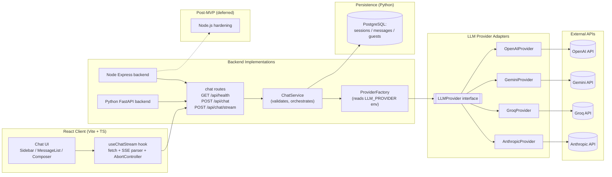

# Fullstack AI Platform

A full-stack streaming chatbot with Google OAuth, guest sessions, multi-provider LLM support, and production-grade Python backend hardening.

- **Frontend:** React + TypeScript + Vite + Tailwind CSS v4
- **Production backend:** FastAPI (Python) on Railway
- **Reference / paused backend:** Express + TypeScript (Node.js) — chat-only parity; hardening deferred post-MVP
- **LLM providers:** OpenAI, Gemini, Groq, and Anthropic (env-driven switching)

## MVP Status (Complete — 2026-07-19)

The MVP engineering track is **complete**. The Python backend is the production reference.

| Area | Status |
| ---- | ------ |
| Env validation & config | Done |
| Structured logging (JSON in production) | Done |
| Correlation IDs (`X-Request-ID`) | Done |
| Centralized error envelope | Done |
| HTTP rate limiting (`Retry-After`) | Done |
| Pyright standard mode + Ruff format/lint | Done |
| CI quality gates (lint, format, typecheck, coverage ≥ 80%) | Done |
| Node.js backend alignment | **Deferred** — see `docs/plans/nodejs-backend-v1.md` |

Validation record: `docs/plans/mvp-completion-implementation-plan.md` (Phase 9).

## Post-MVP V1 Status (Complete — 2026-07-21)

Post-MVP V1 engineering is **complete**. The Python backend is the production reference for the reusable AI platform.

| Capability | Status |
| ---------- | ------ |
| Centralized prompt management (Jinja2, versioned templates) | Done |
| Generic tool platform + web search (non-streaming chat path) | Done |
| Knowledge platform (upload → parse → chunk → embed → pgvector) | Done |
| Generic RAG Framework (domain-agnostic) | Done |
| Evaluation CLI (prompt, retrieval, end-to-end) | Done |
| Document/RAG HTTP API (auth-only) | Done |
| Frontend `/documents` route (upload, list, delete, RAG ask) | Done |

**Feature flags** (default off — MVP unchanged when disabled):

- `RAG_ENABLED=false` — no RAG endpoints; chat/auth/persistence unchanged
- `TOOLS_ENABLED=false` — no tool execution in chat
- `CHAT_STREAMING_ENABLED=true` (default) — SSE streaming via `POST /api/chat/stream`; set `false` to use non-streaming `POST /api/chat`

**Auth policy:** Document upload and RAG ask require authentication. Guests receive **401** on document/RAG API routes and see a login prompt on `/documents`.

**UI:** Chat remains at `/`. Authenticated users access documents and generic RAG at [`/documents`](frontend/src/pages/DocumentsPage.tsx). See [backend-python/README.md](backend-python/README.md) for API, eval CLI, and configuration matrix.

**Release summary:** [docs/releases/post-mvp-v1-release-summary.md](docs/releases/post-mvp-v1-release-summary.md)

Validation record: [docs/plans/post-mvp-v1-implementation-plan.md](docs/plans/post-mvp-v1-implementation-plan.md) (Phase 13 Completion Record).

## Current Capabilities

- Responsive ChatGPT-like UI with sidebar, streaming, stop, and retry
- Google OAuth login with app-issued JWT; anonymous guest token flow
- Chat persistence (sessions, messages, guest quota) when enabled
- Non-streaming and SSE streaming chat across four LLM providers
- Unified chat toggles on main chat (`use_web_search`, `use_documents`) for authenticated users (V1.1b non-streaming; V1.1c adds **streaming web search** via SSE `tool_start` / `tool_end` when `use_web_search=true` on `POST /api/chat/stream`)
- Typed error envelopes and SSE error frames with `request_id`
- Request-size and schema validation; provider timeout normalization

## Repository Structure

- `backend-python/` — **active MVP / production backend**
- `backend-nodejs/` — post-MVP reference backend (paused)
- `frontend/` — React client
- `docs/` — plans and runbooks

## Features

- Non-streaming endpoint: `POST /api/chat`
- Streaming SSE endpoint: `POST /api/chat/stream`
- Health endpoint: `GET /api/health`
- Provider abstraction: switch between OpenAI/Gemini/Groq/Anthropic without frontend changes
- Responsive chat shell with persistent desktop sidebar, collapsible tablet sidebar, and mobile drawer
- Tailwind CSS v4-driven chat UI with accessible landmarks, focus states, and sticky composer
- Stop/cancel while streaming
- Retry after interrupted streams
- Standardized error handling for validation, timeout, and provider failures

## System Design Diagram



## Prerequisites

- Python 3.12+
- [uv](https://docs.astral.sh/uv/)
- Node.js 20+ (24 works)
- npm

## Quick Start

### 1) Python Backend

```bash
cd backend-python
cp .env.example .env
# Fill in API keys in .env for the selected provider
uv sync
make run
```

Important environment note:

- Python dependencies (including Groq) are installed in the uv-managed project environment.
- If you run plain `python` from a different interpreter (for example a global/Conda environment), imports like `groq` can fail even though the project is configured correctly.
- Prefer `uv run ...` and `make ...` commands in this repo so tooling always uses the project environment.

Quick check:

```bash
cd backend-python
python -c "import groq"            # may fail outside uv env
uv run python -c "import groq"     # expected to succeed
```

### 2) Node Backend (Optional, Post-MVP)

```bash
cd backend-nodejs
npm install
# Create backend-nodejs/.env and fill in provider keys
PORT=8001 npm run dev
```

### 3) Frontend

```bash
cd frontend
cp .env.example .env
npm install
npm run dev
```

Frontend default URL: `http://localhost:5173`

Frontend highlights:

- Tailwind CSS v4 app shell and chat page styling
- Responsive sidebar behavior across mobile, tablet, and desktop
- Streaming thread UI with retry, stop, and connection error feedback

Python backend default URL: `http://localhost:8000`

Node backend recommended local URL: `http://localhost:8001`

Production backend URL (MVP): `https://fullstack-ai-platform-production.up.railway.app`

Before running locally, make sure the selected backend provider has a real API key in the backend `.env` file you are using.

## Cross-Platform Note (Windows)

The Python backend Makefile commands are convenient, but `make` is not installed by default on native Windows.

- WSL2 users can run the same `make` commands shown in this README.
- Native Windows users can install GNU Make (for example with Chocolatey or Scoop), or run direct alternatives:

```bash
cd backend-python
uv run python -m uvicorn app.main:app --reload --port 8000
uv run python -m ruff check app tests
uv run pyright app tests
uv run python -m ruff format --check app tests
uv run python -m pytest -q --cov=app --cov-fail-under=80
```

## Developer Onboarding

### Setting Up Pre-Commit Hooks

This repository uses [pre-commit](https://pre-commit.com) to enforce code quality gates locally before commits. Hooks run fast formatting and lint checks across all three app areas (frontend, Node backend, Python backend).

#### Installation (< 10 minutes)

1. **Clone and install dependencies:**

   ```bash
   git clone <repo>
   cd fullstack-ai-platform

   # Install dependencies for all apps
   npm install                    # frontend
   (cd backend-nodejs && npm install)
   (cd backend-python && uv sync)
   ```

2. **Install pre-commit framework and git hooks:**

   ```bash
   pip install pre-commit
   # or with uv:
   uv tool install pre-commit

   # Install git hooks
   pre-commit install
   ```

3. **Verify installation:**
   ```bash
   pre-commit --version
   pre-commit run --all-files
   ```

#### Running Hooks

- **On next commit:** hooks run automatically
- **Check all files:** `pre-commit run --all-files`
- **Skip hooks (emergency only):** `git commit --no-verify` (see bypass policy below)

#### What Hooks Check

| Area              | Check                                 | Auto-Fix          | Runtime |
| ----------------- | ------------------------------------- | ----------------- | ------- |
| `frontend/`       | Prettier format                       | Yes               | < 1s    |
| `frontend/`       | ESLint                                | No (requires fix) | < 2s    |
| `backend-nodejs/` | Prettier format                       | Yes               | < 1s    |
| `backend-nodejs/` | ESLint                                | No (requires fix) | < 2s    |
| `backend-python/` | Ruff check, Ruff format, Pyright | Ruff only   | < 10s   |
| Shared            | Trailing whitespace, YAML/JSON syntax | Yes               | < 1s    |

**Total typical runtime: < 5 seconds per commit**

### Hook Policy

#### Fast vs Slow Hooks

**Fast hooks (run on every commit):**

- Formatting checks (Prettier, Ruff format)
- Linting checks (ESLint, Ruff)
- Type checking (Pyright for Python backend)
- File validation (trailing whitespace, JSON/YAML syntax)
- **Why:** Keep developer feedback loop tight, catch issues immediately

**Slow hooks (run in CI only):**

- Full test suites (see `npm test`, `make test`)
- Build validation (see `npm run build`, `make build`)
- **Why:** Reserve CI resources for comprehensive validation; developer commits should be fast

PR CI for `backend-python/` runs `make lint`, `make format-check`, `make typecheck`, and `make test-cov`.

#### Bypass Policy

**When you can use `git commit --no-verify`:**

- Emergency hotfix to production with documented follow-up fix
- Temporary WIP commit that will be squashed/rebased before merge
- Blocked hook that needs temporary bypass while diagnosed (use sparingly)

**Required PR documentation when bypassing:**

- Add line to PR description: `[hook-bypass] Reason: <brief reason> | Follow-up: <link to follow-up issue or PR>`
- Example: `[hook-bypass] Reason: Urgent production hotfix | Follow-up: #42`

**Rules:**

- Bypass is exceptional, not routine
- All bypassed commits must fix issues before merging to `main`
- Team members may ask to validate hooks before merge approval

### Complete Troubleshooting

#### Installation Issues

| Problem                             | Solution                                                                         |
| ----------------------------------- | -------------------------------------------------------------------------------- |
| `pre-commit not found`              | `pip install pre-commit` or `uv tool install pre-commit` (add to PATH if needed) |
| `permission denied: .git/hooks/...` | Run `chmod +x .git/hooks/pre-commit` or reinstall with `pre-commit install`      |
| Hooks not running on commit         | Run `pre-commit install` in repo root again                                      |

#### Runtime Issues

| Problem                         | Cause                              | Solution                                              |
| ------------------------------- | ---------------------------------- | ----------------------------------------------------- |
| `prettier not found`            | Node dependencies missing          | `npm install` in `frontend/` or `backend-nodejs/`     |
| `eslint not found`              | Node dependencies missing          | `npm install` in `frontend/` or `backend-nodejs/`     |
| `ruff not found`                | Python dependencies missing        | `uv sync` in `backend-python/`                        |
| `ruff format` issues           | Python dependencies missing        | `uv sync` in `backend-python/`                        |
| `pyright not found`             | Python dependencies missing        | `uv sync` in `backend-python/`                        |
| Hooks timeout (> 20s)           | Large diff or missing dependencies | Check dependency installation, try smaller commits    |
| Hooks modify files unexpectedly | Auto-fix hooks reformatting code   | Re-stage auto-fixed files after hook run, then commit |

#### Common Hook Failures

| Hook Failure               | How to Fix                                                                  |
| -------------------------- | --------------------------------------------------------------------------- |
| ESLint errors block commit | Fix the issue in code (cannot auto-fix); see ESLint output for details      |
| Ruff check failures        | Run `cd backend-python && uv run ruff check --fix app tests`, then re-stage |
| Pyright type errors        | Fix reported types; verify with `cd backend-python && make typecheck`       |
| Prettier disagreement      | Re-run `pre-commit run --all-files` to auto-fix, then re-stage              |
| Ruff format diff           | Run `cd backend-python && make format`, then re-stage                       |

#### Getting Help

If hooks remain broken after troubleshooting:

1. Run `pre-commit clean` to reset cache
2. Reinstall with `pre-commit uninstall && pre-commit install`
3. Run `pre-commit run --all-files` to see detailed error logs
4. Check `.pre-commit-config.yaml` for hook configuration
5. Ask team member or create an issue with full error output

### Onboarding Checklist

- [ ] Clone repo and install app dependencies (npm, uv)
- [ ] Install pre-commit: `pip install pre-commit` or `uv tool install pre-commit`
- [ ] Run `pre-commit install` in repo root
- [ ] Verify: `pre-commit --version` and `pre-commit run --all-files` (should pass)
- [ ] Make a test commit to confirm hooks run
- [ ] Ready to develop!

**Expected time: < 10 minutes**

## CI Image Tagging (Stage C2)

Container images are published by `.github/workflows/build-publish-images.yml` to GHCR:

- `ghcr.io/<owner>/fullstack-ai-platform-frontend`
- `ghcr.io/<owner>/fullstack-ai-platform-backend-nodejs`
- `ghcr.io/<owner>/fullstack-ai-platform-backend-python`

Tag strategy:

- Immutable: `sha-<git_sha>`
- Mutable channels: `main`, `staging`, `prod`

Publish rules:

- Push to `main` publishes changed services with `sha-<git_sha>`, `main`, and `staging`
- Push of release tags (`v*`, `release-*`) publishes all services from the tagged commit with `sha-<git_sha>` and `prod`

Each image build also uploads a metadata artifact (service, ref, sha, digest, tags/labels) as a provenance baseline.

## PR Quality Gates (Stage C3)

`main` is protected with required CI checks and an up-to-date branch requirement.

Required checks:

- `Frontend PR Checks` — lint, format check, test, build
- `Backend Node.js PR Checks` — lint, format check, test, build
- `Backend Python PR Checks` — lint, format check, typecheck (Pyright standard), test with coverage (80% minimum on `app/`)

`Backend Python PR Checks` runs, in order:

1. `make lint` — Ruff
2. `make format-check` — Ruff format
3. `make typecheck` — Pyright (`typeCheckingMode = standard`)
4. `make test-cov` — pytest with `--cov-fail-under=80` (baseline ~89%; `app/db/seed.py` omitted as a CLI entrypoint)

CI uploads `backend-python/coverage.xml` as a workflow artifact on Python PRs.

Merge policy:

- Merge commits are disabled
- Linear history is required on `main`
- Squash merge or rebase merge should be used

Expected PR checklist:

- [ ] Branch is up to date with `main`
- [ ] Relevant required checks passed for changed app areas
- [ ] No hook bypass remains unresolved in the PR description
- [ ] Scope stays within the intended app area or rollout phase
- [ ] Merge uses squash or rebase, not a merge commit

## Backend Selection

The frontend talks to whichever backend is configured in `frontend/.env`:

```dotenv
VITE_API_BASE_URL=http://localhost:8000
```

Use `8000` for Python and `8001` for Node during side-by-side development.

## Provider Switching

In the Python backend env file (`backend-python/.env`; see `.env.example` for the full list):

- `LLM_PROVIDER=openai`, `gemini`, `groq`, or `anthropic`
- set provider-specific key/model values

Examples:

```dotenv
LLM_PROVIDER=openai
OPENAI_MODEL=gpt-4o-mini
```

```dotenv
LLM_PROVIDER=gemini
GEMINI_MODEL=gemini-3.1-flash-lite
```

Then restart backend.

For the Node backend, the equivalent env file is `backend-nodejs/.env`.

## API Overview

### Health

```http
GET /api/health
```

Example response:

```json
{
  "status": "ok",
  "provider": "gemini",
  "version": "0.1.0"
}
```

### Non-streaming chat

```http
POST /api/chat
Content-Type: application/json
```

Body:

```json
{
  "messages": [{ "role": "user", "content": "What is FastAPI?" }]
}
```

### Streaming chat (SSE)

```http
POST /api/chat/stream
Content-Type: application/json
```

Returns `text/event-stream` with frames: `start`, `delta`, `end`, and `error`.
Before running locally, make sure the selected backend provider has a real API key in the backend `.env` file you are using.

## Development Commands

### Python Backend

```bash
cd backend-python
make run
make lint
make typecheck
make format
make format-check
make test
make test-cov
uv run pytest
```

### Node Backend

```bash
cd backend-nodejs
npm run dev
npm test
npm run lint
npm run format:check
npm run build
```

### Frontend

```bash
cd frontend
npm run test
npm run lint
npm run format
npm run format:check
npm run build
npm test -- --run
```

## Reliability and Observability

- Every response includes `X-Request-ID`; the frontend forwards it on retry for traceability.
- Non-streaming failures return `{ error: { code, message, request_id } }`.
- Streaming failures surface as SSE `error` frames with the same codes.
- HTTP rate limiting returns `429` with `rate_limit_exceeded` and a `Retry-After` header (separate from guest daily quota).
- Production logs are structured JSON with correlation fields; development logs are human-readable.
- The frontend preserves partial assistant output on interruption, marks the message as interrupted, and offers Retry.
- Oversized or malformed requests are rejected before hitting the provider.

Common error codes: `validation_error`, `invalid_google_token`, `quota_exceeded`, `rate_limit_exceeded`, `provider_timeout`, `provider_rate_limited`, `provider_error`, `database_error`, `internal_error`.

## Tests

| App | Command | Baseline (2026-07-21, Post-MVP V1) |
| --- | ------- | ---------------------------------- |
| Python | `cd backend-python && make test-cov` | 342 passed, 88.25% coverage on `app/` |
| Frontend | `cd frontend && npm test -- --run` | 106 passed |
| Node.js | `cd backend-nodejs && npm test` | 26 passed (baseline, unhardened) |

Recommended pre-push validation:

```bash
cd backend-python && make lint && make format-check && make typecheck && make test-cov
cd frontend && npm run lint && npm run format:check && npm test -- --run && npm run build
cd backend-nodejs && npm run lint && npm run format:check && npm test && npm run build
```

## Side-By-Side Workflow

Recommended local ports:

- Python backend: `8000`
- Node backend: `8001`
- Frontend: `5173`

Typical parity workflow:

1. Run the Python backend on `8000` as the reference implementation.
2. Run the Node backend on `8001`.
3. Point `VITE_API_BASE_URL` to `http://localhost:8001` when validating Node behavior.
4. Switch `VITE_API_BASE_URL` back to `http://localhost:8000` when comparing against Python.

## Deployment Status

Deployment prerequisites and the operator runbook are documented in [docs/plans/chatbot-v1.md](docs/plans/chatbot-v1.md).

Staging CD automation is now defined in [CD_STAGING.md](CD_STAGING.md) and implemented by `.github/workflows/cd-staging.yml`.

Production deployment remains a manual promotion step pending Stage D2 controls.

## Notes

- Keep API keys in local `.env` files only.
- Rotate keys immediately if exposed.
