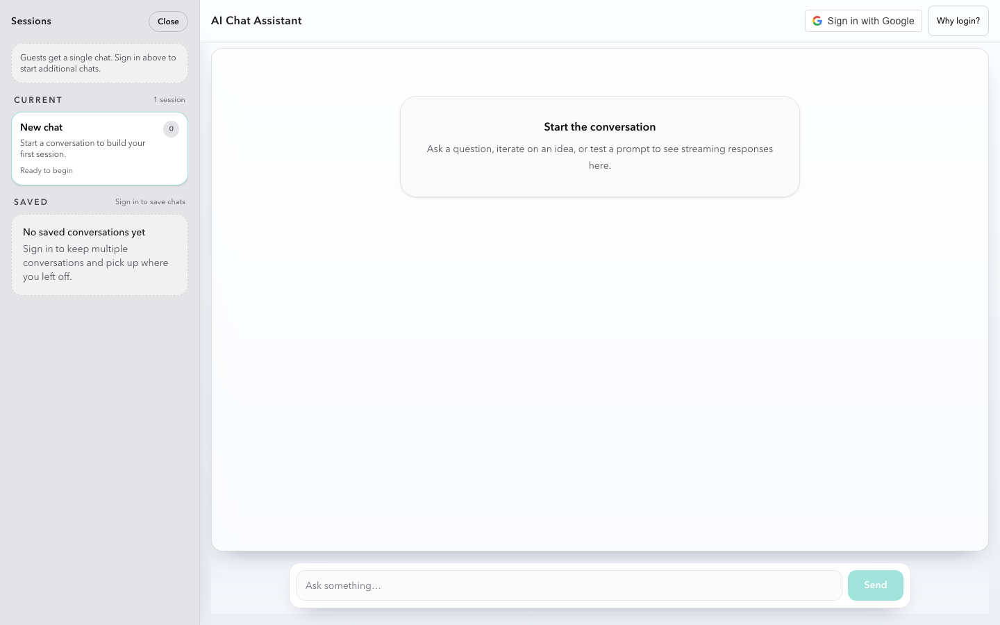
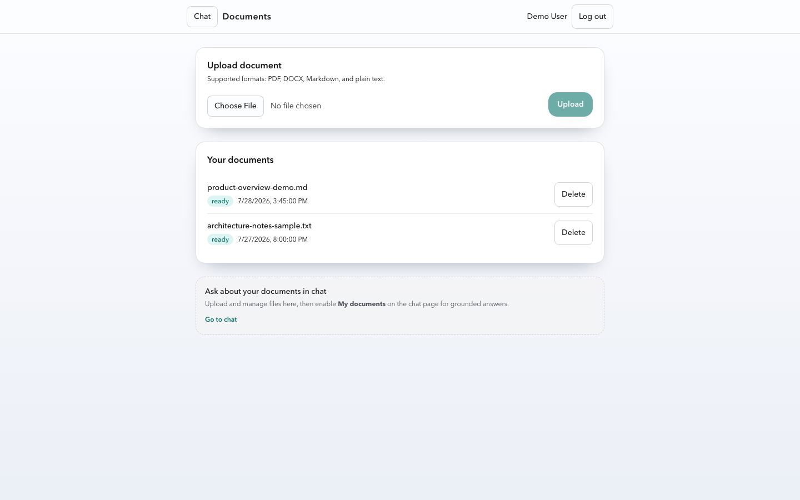
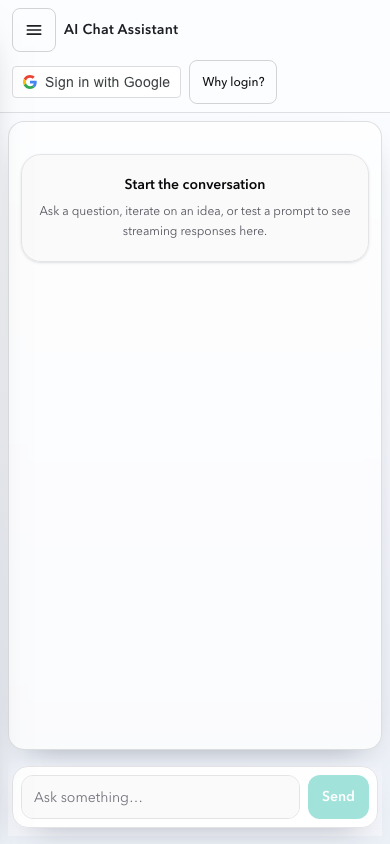
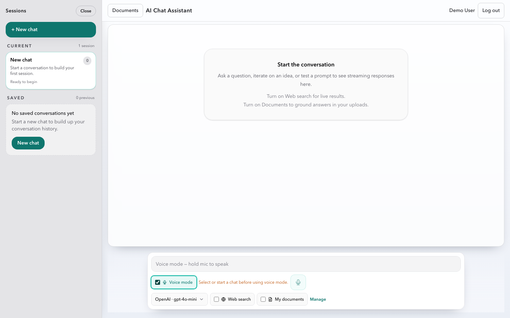
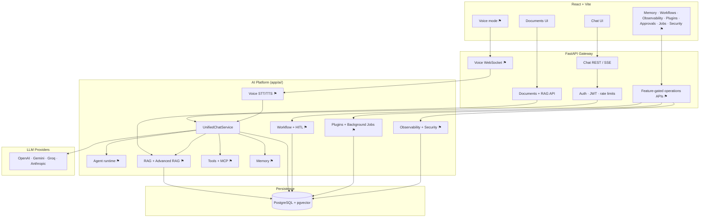

# Fullstack AI Platform

Production-grade full-stack AI platform with chat, RAG, agents, MCP, voice, memory, workflows, plugins, HITL, background jobs, observability, and governance.

[](LICENSE)
[](https://github.com/pateatlau/fullstack-ai-platform/actions/workflows/pr-quality.yml)
[](https://fullstack-ai-platform-umber.vercel.app/)



## Features

- Streaming chat with stop, retry, session persistence, and auto-generated titles
- Google OAuth plus anonymous guest sessions with app-issued JWT
- Multi-provider LLM support: OpenAI, Gemini, Groq, and Anthropic (env-driven switching)
- Document upload, chunking, embedding, and RAG ask via pgvector
- Unified chat toggles for web search and document grounding (streaming and non-streaming)
- Advanced RAG pipeline: hybrid search, query rewrite, rerank, compression, citations (flag-guarded)
- Agent runtime for provider-agnostic tool orchestration (flag-guarded)
- MCP client for remote tool discovery and execution (flag-guarded)
- Voice mode with WebSocket STT/TTS, barge-in, and transcript parity with SSE (flag-guarded)
- Durable semantic memory with preferences, summaries, and a management page (flag-guarded)
- Versioned workflow engine with conditional/parallel execution, approvals, retry, and recovery (flag-guarded)
- OpenTelemetry tracing, Prometheus metrics, cost accounting, and regression-aware evals (flag-guarded)
- In-process plugins for tools, prompts, workflow nodes, and MCP server declarations (flag-guarded)
- Human-in-the-loop approval inbox and inline agent/workflow decisions (flag-guarded)
- Postgres-backed jobs, schedules, retention/sweep handlers, dead letters, and retry UI (flag-guarded)
- Security & Governance with RBAC, trace-correlated audit logs, content guardrails, role-aware limits, and an admin dashboard (flag-guarded)
- Production hardening: correlation IDs, structured logging, rate limits, typed error envelopes
- Responsive ChatGPT-like UI with desktop sidebar, tablet collapse, and mobile drawer
- Evaluation CLI for prompt, retrieval, and end-to-end tuning

**Stack:** React + TypeScript + Vite + Tailwind CSS v4 · FastAPI (Python) · PostgreSQL + pgvector · optional Node.js reference backend (planned to reach feature parity with the Python backend in a future release.)

**Platform status:** MVP through Post-MVP V1.1.1 and the complete V2 program (Epics 01–11) are released. V2 capabilities remain opt-in behind default-off master flags, preserving the core chat path until explicitly enabled.

## V2 Program

| Epic | Capability | Master flag | Primary API / UI | Released |
| ---- | ---------- | ----------- | ---------------- | -------- |
| 01 | [Agent Framework](docs/releases/post-mvp-v2-epic1-release-summary.md) | `AGENT_RUNTIME_ENABLED` | Agent-backed web-search chat on `/` | 2026-07-24 |
| 02 | [Advanced RAG](docs/releases/post-mvp-v2-epic2-release-summary.md) | `ADVANCED_RAG_ENABLED` | Hybrid retrieval and citations on `/` and `/documents` | 2026-07-25 |
| 03 | [MCP Integration](docs/releases/post-mvp-v2-epic3-release-summary.md) | `MCP_ENABLED` | Remote tools through the existing agent/tool pipeline | 2026-07-28 |
| 04 | [Voice Interfaces](docs/releases/post-mvp-v2-epic4-release-summary.md) | `VOICE_ENABLED` | `/api/voice/ws` and voice controls on `/` | 2026-07-29 |
| 05 | [Memory System](docs/releases/post-mvp-v2-epic5-release-summary.md) | `MEMORY_ENABLED` | `/api/memory/*` and `/settings/memory` | 2026-08-04 |
| 06 | [Workflow Engine](docs/releases/post-mvp-v2-epic6-release-summary.md) | `WORKFLOW_ENGINE_ENABLED` | `/api/workflows*` and `/workflows` | 2026-08-05 |
| 07 | [Observability & Evaluation](docs/releases/post-mvp-v2-epic7-release-summary.md) | `OBSERVABILITY_ENABLED` | `/api/observability/usage`, `/metrics`, and `/observability` | 2026-08-10 |
| 08 | [Plugin Architecture](docs/releases/post-mvp-v2-epic8-release-summary.md) | `PLUGINS_ENABLED` | `/api/plugins` and `/plugins` | 2026-08-11 |
| 09 | [Human-in-the-Loop](docs/releases/post-mvp-v2-epic9-release-summary.md) | `HITL_ENABLED` | `/api/approvals` and `/approvals` | 2026-08-12 |
| 10 | [Background Jobs](docs/releases/post-mvp-v2-epic10-release-summary.md) | `BACKGROUND_JOBS_ENABLED` | `/api/jobs` and `/jobs` | 2026-08-13 |
| 11 | [Security & Governance](docs/releases/post-mvp-v2-epic11-release-summary.md) | `SECURITY_GOVERNANCE_ENABLED` | `/api/security/*` and `/security` | 2026-08-21 |

Each release summary records migrations, rollout/rollback behavior, validation evidence, and known limitations. See [CHANGELOG.md](CHANGELOG.md) for the cumulative release history.

## Screenshots

| Chat (desktop)                                                                                                      | Documents                                                                                             |
| ------------------------------------------------------------------------------------------------------------------- | ----------------------------------------------------------------------------------------------------- |
|  |  |

| Mobile chat                                                                                    | Voice mode                                                                                        |
| ---------------------------------------------------------------------------------------------- | ------------------------------------------------------------------------------------------------- |
|  |  |

## Architecture

Production path: **Python FastAPI** (`backend-python/`). The Node.js backend is a reference implementation and is not deployed.

Detailed narrative, package map, and sequence diagrams: [docs/architecture/system-overview.md](docs/architecture/system-overview.md). Static export: [docs/architecture/system-overview.svg](docs/architecture/system-overview.svg).

Modules marked **⚑** are feature-flagged and **default off**.


```mermaid
flowchart TB
  subgraph Client["React + Vite"]
    Chat["Chat UI"]
    DocsUI["Documents UI"]
    VoiceUI["Voice mode ⚑"]
    OpsUI["Memory · Workflows · Observability · Plugins · Approvals · Jobs · Security ⚑"]
  end

  subgraph API["FastAPI Gateway"]
    Auth["Auth · JWT · rate limits"]
    ChatAPI["Chat REST / SSE"]
    VoiceWS["Voice WebSocket ⚑"]
    DocAPI["Documents + RAG API"]
    OpsAPI["Feature-gated operations APIs ⚑"]
  end

  subgraph Platform["AI Platform (app/ai/)"]
    UCS["UnifiedChatService"]
    Agent["Agent runtime ⚑"]
    RAG["RAG + Advanced RAG ⚑"]
    Tools["Tools + MCP ⚑"]
    Voice["Voice STT/TTS ⚑"]
    Memory["Memory ⚑"]
    Workflow["Workflow + HITL ⚑"]
    Extensions["Plugins + Background Jobs ⚑"]
    Governance["Observability + Security ⚑"]
  end

  subgraph Providers["LLM Providers"]
    LLM["OpenAI · Gemini · Groq · Anthropic"]
  end

  subgraph Data["Persistence"]
    PG[("PostgreSQL + pgvector")]
  end

  Chat --> ChatAPI
  VoiceUI --> VoiceWS
  DocsUI --> DocAPI
  OpsUI --> OpsAPI
  ChatAPI --> Auth --> UCS
  VoiceWS --> Voice --> UCS
  DocAPI --> RAG
  UCS --> Agent
  UCS --> RAG
  UCS --> Tools
  UCS --> LLM
  UCS --> Memory
  OpsAPI --> Workflow
  OpsAPI --> Extensions
  OpsAPI --> Governance
  RAG --> PG
  UCS --> PG
  Workflow --> PG
  Extensions --> PG
  Governance --> PG
```

## Quick Start

**Prerequisites:** Python 3.12+, [uv](https://docs.astral.sh/uv/), Node.js 20+, npm, Docker (local Postgres).

### 1. Clone and configure backend

```bash
git clone https://github.com/pateatlau/fullstack-ai-platform.git
cd fullstack-ai-platform/backend-python
cp .env.example .env
# Add at least one LLM provider API key
uv sync
```

### 2. Start Postgres and migrate

From the repository root:

```bash
./scripts/ensure-postgres.sh
cd backend-python && make db-migrate
```

Postgres runs on `localhost:5433` (see `docker-compose.override.yml`). Full container stack: [DOCKER_COMPOSE.md](DOCKER_COMPOSE.md).

### 3. Start the API

From the repository root:

```bash
make backend
```

API: `http://localhost:8000`. Prefer `uv run` / `make` commands so tooling uses the project virtualenv.

### 4. Start the frontend

```bash
cd frontend
cp .env.example .env
npm install
npm run dev
```

App: `http://localhost:5173`. Local dev uses the Vite `/api` proxy (same-origin); set `VITE_API_BASE_URL` only for production builds.

### 5. Verify

Open the app, send a chat message, and confirm `GET /api/health` returns `status: ok`.

**Google sign-in on localhost:** see [docs/tech-references/local-google-oauth.md](docs/tech-references/local-google-oauth.md).

**Windows without `make`:** run `uv run python -m uvicorn app.main:app --reload --port 8000` from `backend-python/`, or use WSL2.

## Configuration

Full flags matrix, API routes, and eval CLI: [backend-python/README.md](backend-python/README.md).

| Flag                     | Default | Enables                                                              |
| ------------------------ | ------- | -------------------------------------------------------------------- |
| `RAG_ENABLED`            | `false` | Document upload grounding and `/api/rag/ask`                         |
| `TOOLS_ENABLED`          | `false` | Web search tool execution in chat                                    |
| `ADVANCED_RAG_ENABLED`   | `false` | Hybrid retrieval, rerank, citations (requires `RAG_ENABLED`)         |
| `AGENT_RUNTIME_ENABLED`  | `false` | Agent-based web-search orchestration                                 |
| `MCP_ENABLED`            | `false` | Remote MCP tool discovery and execution                              |
| `VOICE_ENABLED`          | `false` | WebSocket voice mode (requires `OPENAI_API_KEY` for default STT/TTS) |
| `MEMORY_ENABLED`         | `false` | Semantic memories, preferences, summaries, and `/settings/memory`    |
| `WORKFLOW_ENGINE_ENABLED` | `false` | Durable workflow definitions, runs, approvals, and `/workflows`     |
| `OBSERVABILITY_ENABLED`  | `false` | OTel tracing, metrics, cost accounting, eval extensions, dashboard   |
| `PLUGINS_ENABLED`        | `false` | Trusted in-process tool, prompt, workflow-node, and MCP plugins       |
| `HITL_ENABLED`           | `false` | Agent/workflow approval gates, inbox, revisions, and resume           |
| `BACKGROUND_JOBS_ENABLED` | `false` | Queue, worker, scheduler, maintenance handlers, and `/jobs`          |
| `SECURITY_GOVERNANCE_ENABLED` | `false` | RBAC, audit, guardrails, role-aware limits, and `/security` admin UI |
| `CHAT_STREAMING_ENABLED` | `true`  | SSE streaming via `POST /api/chat/stream`                            |
| `DEMO_MODE_STRICT`       | `false` | Tighter guest token and upload caps for public demos                 |

Set `LLM_PROVIDER` to `openai`, `gemini`, `groq`, or `anthropic` and the matching API key in `backend-python/.env`.

## Demo and deployment

| Resource                | URL / location                                                                                                              |
| ----------------------- | --------------------------------------------------------------------------------------------------------------------------- |
| Live demo (frontend)    | [fullstack-ai-platform-umber.vercel.app](https://fullstack-ai-platform-umber.vercel.app/)                                   |
| Live demo (backend API) | [fullstack-ai-platform-production.up.railway.app](https://fullstack-ai-platform-production.up.railway.app)                  |
| Public demo protection  | [docs/ops/public-demo-protection.md](docs/ops/public-demo-protection.md) — enable `DEMO_MODE_STRICT=true` on public deploys |
| Staging CD              | [CD_STAGING.md](CD_STAGING.md)                                                                                              |
| Production CD           | [CD_PRODUCTION.md](CD_PRODUCTION.md)                                                                                        |
| Container image tags    | [docs/ci-image-tagging.md](docs/ci-image-tagging.md)                                                                        |

Keep API keys in local `.env` files only. Rotate immediately if exposed.

## Project structure

```text
fullstack-ai-platform/
├── backend-python/     # Production FastAPI backend (active)
├── frontend/           # React + Vite client
├── backend-nodejs/     # Reference Express backend (paused)
├── docs/               # Architecture, releases, plans, ops runbooks
├── scripts/            # Dev helpers (e.g. ensure-postgres.sh)
├── .github/workflows/  # CI and CD pipelines
├── LICENSE
├── CONTRIBUTING.md
└── CHANGELOG.md
```

## Development

See [CONTRIBUTING.md](CONTRIBUTING.md) for workflow, pre-commit hooks, PR expectations, and scope policy.

| Area            | Commands                                                                        |
| --------------- | ------------------------------------------------------------------------------- |
| Python          | `make lint` · `make format-check` · `make typecheck` · `make test-cov`          |
| Frontend        | `npm run lint` · `npm run format:check` · `npm test -- --run` · `npm run build` |
| Node (optional) | `npm run lint` · `npm run format:check` · `npm test` · `npm run build`          |

Install pre-commit once: `pip install pre-commit && pre-commit install` (repo root).

**Test baselines (2026-08-21):** Python 2,287 passed, 88.84% coverage on `app/` (88.68% on `app/ai/security/`) · Frontend 326 passed across 54 files · Node 26 passed (reference).

**Optional Node backend:** `cd backend-nodejs && PORT=8001 npm run dev` — point `VITE_API_BASE_URL=http://localhost:8001` in `frontend/.env`.

## Documentation

| Topic                 | Link                                                                         |
| --------------------- | ---------------------------------------------------------------------------- |
| Docs index            | [docs/README.md](docs/README.md)                                             |
| Backend API and flags | [backend-python/README.md](backend-python/README.md)                         |
| Architecture          | [docs/architecture/system-overview.md](docs/architecture/system-overview.md) |
| Release summaries     | [docs/releases/](docs/releases/)                                             |
| Implementation plans  | [docs/plans/](docs/plans/)                                                   |
| Changelog             | [CHANGELOG.md](CHANGELOG.md)                                                 |

## License

[MIT](LICENSE) — Copyright (c) 2026 Laldingliana Tlau Vantawl
