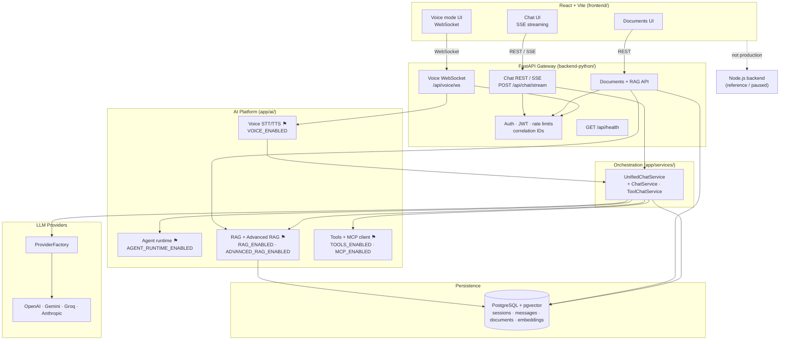
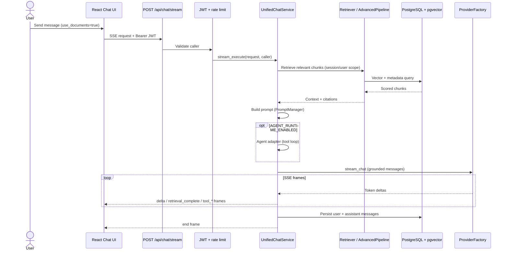

# System Architecture Overview

High-level architecture of the **Fullstack AI Platform** as of **V2 Epic 04** (voice interfaces). The production path is the **Python FastAPI** backend; the Node.js backend is a reference implementation and is not deployed.

For roadmap context and epic ordering, see the [V2 Architecture & Implementation Strategy](../references/fullstack-ai-platform-v2-architecture-implementation-strategy.md) and the [V2 Program Execution Guide](../plans/_program-v2-execution-guide.md).

---

## Layered view

```text
React Client (Chat, Documents, Voice mode)
      │  REST / SSE / WebSocket
      ▼
FastAPI Gateway (auth, rate limits, correlation IDs)
      │
      ├─► UnifiedChatService / ToolChatService / Agent runtime (flagged)
      ├─► RAG stack (dense + Advanced RAG pipeline, flagged)
      ├─► Tool platform + MCP client (flagged)
      ├─► Voice layer (STT/TTS, WebSocket, flagged)
      └─► ProviderFactory → OpenAI | Gemini | Groq | Anthropic
      │
      ▼
PostgreSQL + pgvector (sessions, messages, documents, embeddings)
```

---

## Component diagram

Modules marked **⚑** are guarded by feature flags and **default off** in `.env.example`. Core chat (plain streaming, auth, persistence) works without them.



### Feature-flag legend

| Flag | Module | Default | Enables |
| ---- | ------ | ------- | ------- |
| `RAG_ENABLED` | Document grounding | `false` | Upload indexing, retrieval, chat `use_documents` toggle |
| `ADVANCED_RAG_ENABLED` | Advanced RAG pipeline | `false` | Hybrid retrieval, query rewrite, rerank, compression (requires `RAG_ENABLED`) |
| `TOOLS_ENABLED` | Tool platform | `false` | Web search tool, chat `use_web_search` toggle |
| `MCP_ENABLED` | MCP client | `false` | Remote MCP server tools via stdio transport |
| `AGENT_RUNTIME_ENABLED` | Agent runtime | `false` | Planner/executor loop for unified tool chat |
| `VOICE_ENABLED` | Voice layer | `false` | WebSocket STT/TTS bridged to `UnifiedChatService` |

Always-on capabilities (no epic flag): Google OAuth + JWT, chat persistence (`CHAT_PERSISTENCE_ENABLED`), HTTP rate limiting, structured logging, correlation IDs.

Full flag matrix: [backend-python/README.md](../../backend-python/README.md) and [backend-python/.env.example](../../backend-python/.env.example).

---

## Package map (`app/ai/`)

Dependency direction: **Routers → Services → `app/ai/` → Providers → external APIs**.

| Package | Path | Responsibility |
| ------- | ---- | -------------- |
| **Agent** | `app/ai/agent/` | Reusable agent runtime — planner, executor, scratchpad, reflection, streaming adapters. Wired into unified chat when `AGENT_RUNTIME_ENABLED=true`. |
| **RAG** | `app/ai/rag/` | Retrieval framework — dense retriever, context builder, citations, and `AdvancedRetrievalPipeline` (hybrid, rewrite, rerank, compression). Document ingestion lives in `app/ai/documents/`. |
| **MCP** | `app/ai/mcp/` | MCP client — server registry, stdio transport, tool discovery, permission policy, execution adapter into the existing `ToolExecutor` path. |
| **Voice** | `app/ai/voice/` | STT/TTS providers, session management, streaming audio, and `chat_bridge` into `UnifiedChatService.stream_execute`. |
| **Tools** | `app/ai/tools/` | Tool registry, validation, authorization, execution; production tools (e.g. web search) and MCP-discovered tools share this path. |
| **Supporting** | `app/ai/prompts/`, `embeddings/`, `vectorstores/`, `evaluation/` | Versioned Jinja2 prompts, embedding adapters, pgvector store, RAG evaluation helpers. |

Domain orchestration stays in `app/services/` (`UnifiedChatService` composes chat, tools, RAG, and optional agent handoff without adding business logic inside framework modules).

---

## Happy path: authenticated chat with documents (streaming)

Typical flow when `RAG_ENABLED=true`, user toggles **Documents** on, and sends a message on `/`.



Key behaviours:

- Document retrieval completes **before** the first answer `delta` when streaming with `use_documents=true`.
- Optional `retrieval_complete` SSE frame signals the retrieval phase to the client.
- If `AGENT_RUNTIME_ENABLED=true` and web search is also on, the agent path handles tool iterations; RAG still runs in `UnifiedChatService` first.
- Voice mode (`VOICE_ENABLED=true`) follows the same orchestration after STT — see `app/ai/voice/chat_bridge.py`.

---

## Related documentation

| Document | Purpose |
| -------- | ------- |
| [V2 Architecture Strategy](../references/fullstack-ai-platform-v2-architecture-implementation-strategy.md) | Epic order, platform principles, target architecture |
| [backend-python/README.md](../../backend-python/README.md) | API routes, flags, module deep-dives |
| [backend-nodejs/README.md](../../backend-nodejs/README.md) | Reference Node backend (paused) |
| [Epic release summaries](../releases/) | Shipped capability notes per epic |

Static diagram export (for slides / social preview): [system-overview.svg](./system-overview.svg).
