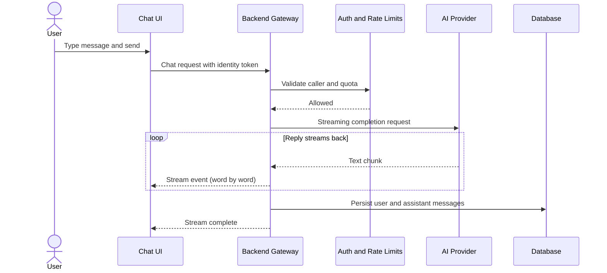

# AI Assistant Platform MVP: Foundational Chat

---

## ⚡ In One Minute

- The **AI Assistant Platform MVP** is the first complete chat release — send a message, receive a streaming reply, return later to the same conversation.
- A **backend gateway** sits between the browser and AI providers. It holds API keys and validates every request.
- Users may **sign in with Google** or chat as a **guest** with a daily message limit.
- Replies arrive **word by word** over a one-way HTTP stream, with stop and retry in the UI.
- **Sessions and messages** are stored so conversations survive page reloads.
- **Four AI providers**, operational guardrails, and config-driven switching support a public deployment without expanding MVP scope.

---

## 🎯 The Big Picture

### What it is

The MVP is the **foundational chat platform** for the Fullstack AI Platform. It closes one loop: a user sends a message, the system calls an AI model, and the answer streams back in real time.

It deliberately limits scope to that loop. Documents, web search, agents, and voice were deferred to later releases.

### Why it exists

Advanced features depend on shared plumbing — authentication, streaming, error handling, provider switching, and storage. Building those features first, without a stable chat core, tends to duplicate work and create inconsistent behavior.

The MVP establishes that plumbing once. Later releases extend the same chat path rather than replacing it.

### Why users and the business benefit

- **Users** can chat with stop, retry, and saved sessions — a familiar interaction pattern.
- **The business** has a deployable baseline for demos, feedback, and phased rollout.
- **Engineering** can add Post-MVP features against known auth, streaming, and storage contracts.

---

## 🌍 An Everyday Analogy

Imagine a **hotel concierge desk**.

You walk up and ask a question. You do not call the chef, travel agency, or city office yourself. You speak only to the concierge.

The concierge:

- **Checks who you are** — registered guest with a room key, or a walk-in visitor with limited access.
- **Routes your request** to the right specialist behind the scenes.
- **Brings the answer back in pieces** as it arrives — not all at once after a long wait.
- **Keeps a record** of what you asked, so a later shift can continue the thread.
- **Handles problems clearly** — if a specialist is unavailable, you hear a plain explanation, not an internal error code.

The **AI Assistant Platform MVP** maps to the same roles:

| Hotel | MVP Platform |
| ----- | ------------ |
| Guest at the desk | User in the chat UI |
| Concierge desk | Backend gateway |
| Specialist services | AI providers |
| Room key / walk-in badge | Google sign-in token or guest token |
| Conversation log at the desk | Stored sessions and messages |
| "Please wait — kitchen is busy" | Rate limits and structured error responses |

You never see the kitchen. You never hold supplier contracts. You interact with one desk.

---

## Request flow (overview)

This diagram shows the happy path. Errors, rate limits, and user-initiated stop branch off at the gateway or client layer.

---

## 🗺️ How It Works

Here is the journey from opening the app to reading a reply.

### 1. Opening the app

**User opens the web app → The chat interface loads.**

The screen shows a message list, a text input, and controls to send or stop a reply.

If the user has signed in before, **saved chat sessions** appear in a sidebar.

### 2. Identity: guest or signed-in

**User arrives without signing in → The system assigns a guest identity.**

Guests receive an anonymous **guest token**. They can chat up to a **daily message quota**. That quota limits cost and abuse on public deployments.

**User signs in with Google → The backend verifies the credential and issues its own token.**

The app does not retain Google credentials for routine requests. An **app-issued token** proves identity on each call.

### 3. Sending a message

**User types a message and presses Send → The UI shows the message immediately.**

The client updates the screen before the server confirms. This **optimistic update** avoids a blank pause after every send.

**The client sends the message to the backend → The backend validates format, size, and identity.**

Invalid input returns a **structured error** — a consistent JSON shape, not a raw stack trace.

### 4. Selecting an AI provider

**The backend reads deployment configuration → It selects a provider and model.**

The MVP supports **OpenAI, Gemini, Groq, and Anthropic**. Switching providers requires configuration changes, not frontend changes.

### 5. Streaming the reply

**The backend opens a streaming call to the selected provider → Text arrives in small chunks.**

The backend forwards each chunk immediately instead of waiting for the full answer.

**The backend streams events to the browser → The UI appends words as they arrive.**

The transport is **Server-Sent Events (SSE)** — a one-way HTTP stream from server to client. Each chat turn is one request followed by one long response.

The user sees the reply grow in real time.

**User clicks Stop → The client cancels the in-flight request → Streaming ends.**

**If the stream breaks → The user can Retry → The client resends the request.**

### 6. Saving the conversation

**When persistence is enabled → The backend stores the user message and assistant reply.**

Each conversation belongs to a **session**. Signed-in users see sessions tied to their account. Guests see sessions tied to their guest identity.

Closing the browser tab does not erase stored messages.

### 7. Operational layers

Every request passes through cross-cutting concerns:

**Request arrives → A correlation ID is assigned and returned in the response header.**

Engineers can tie logs and errors to one user action using that ID.

**Caller exceeds the rate limit → The server responds with a retry hint.**

**Any layer raises an error → A centralized handler returns a uniform error envelope.**

**In production → Logs use structured JSON with sensitive fields redacted.**

These layers add configuration surface area. They exist so failures on a public deployment are traceable, bounded, and readable.

### Major design decisions

**SSE instead of WebSocket for streaming**

- **Decision:** Use a one-way HTTP stream for assistant replies.
- **Why:** Each turn is a single request and a single long response. SSE works over standard HTTP and is straightforward to proxy and deploy.
- **Alternative considered:** WebSocket for a persistent two-way connection.
- **Trade-off:** The client must handle stop and retry itself. SSE over `fetch` does not get the same automatic reconnect behavior as browser `EventSource`.

**Backend gateway owns all AI calls**

- **Decision:** The browser talks only to the backend. The backend holds provider API keys.
- **Why:** Secrets cannot safely live in client code. Validation and rate limiting belong server-side.
- **Alternative considered:** Direct browser-to-provider calls (rejected on security grounds).
- **Trade-off:** Every model call adds a backend hop. That hop is the cost of centralized control.

**Two identity paths: guest and Google sign-in**

- **Decision:** Allow anonymous guest chat with quotas, plus optional Google sign-in for full session ownership.
- **Why:** Lowers trial friction while still supporting durable accounts.
- **Alternative considered:** Require sign-in before any chat.
- **Trade-off:** Guest quotas and abuse controls are required. Signed-in and guest behavior must be tested separately.

**Provider abstraction with configuration switching**

- **Decision:** One backend chat contract routes to OpenAI, Gemini, Groq, or Anthropic based on deployment settings.
- **Why:** Avoids rewriting the client when the active provider changes.
- **Alternative considered:** Ship with a single hard-coded provider.
- **Trade-off:** Each provider needs its own adapter. Capability differences across vendors still require handling.

**Python backend as the deployed production path**

- **Decision:** The Python service is what runs in production. The Node.js backend remains a reference implementation and is not deployed.
- **Why:** MVP hardening — logging, correlation IDs, rate limits, persistence — was completed on the Python stack.
- **Alternative considered:** Maintaining two production backends in parity.
- **Trade-off:** Production behavior is documented against one codebase. Node parity was explicitly deferred.

---

## 🧩 Key Concepts Explained

### Server-Sent Events (SSE)

**Definition:** A one-way stream of server updates over a standard HTTP connection.

**Analogy:** Live captions on a broadcast — new words appear without reloading the page.

### App-issued token (JWT)

**Definition:** A signed credential the backend mints after login; the client sends it on subsequent requests to prove identity.

**Analogy:** A hotel key card — present it at the door; the system knows which guest you are.

### Guest token

**Definition:** An anonymous identity for users who have not signed in, subject to a daily message quota.

**Analogy:** A numbered deli ticket — you can order a limited number of times per day.

### Provider abstraction

**Definition:** One backend interface that can call different AI vendors without changing the client contract.

**Analogy:** A universal power adapter — the plug facing the device stays the same; the wall side changes by region.

### Chat persistence

**Definition:** Storing sessions and messages so conversations survive reloads and return visits.

**Analogy:** The concierge logbook — the next shift knows what you already asked.

### Correlation ID

**Definition:** A unique identifier attached to a request and its responses, linking logs and errors to one action.

**Analogy:** A package tracking number — one ID follows the shipment end to end.

---

## 🚀 Why This Matters

### For Product Managers

The MVP defines a **fixed scope**: chat, identity, persistence, and operational guardrails. Later roadmap items can be prioritized knowing the core loop already exists and is testable.

### For Engineering teams

Later epics plug into the same chat and auth path. That reduces duplicated middleware — each new feature does not need its own streaming or session layer.

### For QA

Test boundaries are explicit: streaming lifecycle, guest vs signed-in behavior, quota enforcement, error envelope shapes, and rate-limit responses.

### For future development

Post-MVP capabilities were planned as optional extensions behind feature flags. The MVP stays narrow so advanced behavior can ship incrementally.

### For maintainability

Centralized configuration, request validation, structured logging, and automated quality checks give contributors a consistent surface to change.

### For scalability

The backend handles concurrent streaming connections asynchronously. Provider switching via configuration avoids vendor lock-in at the API boundary — though each provider still needs adapter maintenance.

### For user experience

Streaming with stop and retry matches expectations set by mainstream chat products. Google sign-in reduces account friction. Guest mode allows trial without registration.

### For business goals

Guest quotas bound cost on a public deployment. That supports demos and staged expansion without committing to full platform scope on day one.

---

## ❓ Common Misconceptions

### "The MVP is just a UI wrapper around ChatGPT."

**Incorrect.** The MVP includes a backend gateway, authentication, persistence, multi-provider routing, rate limiting, and observability hooks. The browser never calls an AI provider directly.

**Correct understanding:** The backend owns secrets, validation, and orchestration. The AI provider is an upstream dependency, not the product itself.

### "Guests and signed-in users are equivalent."

**Incorrect.** Guests use anonymous tokens with daily message quotas. Signed-in users receive account-scoped sessions without guest limits.

**Correct understanding:** Guest mode supports trial use. Sign-in ties conversations to a durable identity.

### "Streaming means the full answer is ready immediately."

**Incorrect.** Streaming delivers the reply incrementally. The first tokens may appear quickly; the complete answer still depends on model latency.

**Correct understanding:** Streaming reduces wait before the user can start reading. Total generation time is similar to a non-streaming call.

### "The Node.js backend runs in production."

**Incorrect.** The Python backend is the deployed production path. The Node.js backend is a reference implementation and is not deployed.

**Correct understanding:** Architecture and operations documentation refer to the Python service for live behavior.

### "MVP includes documents, web search, and voice."

**Incorrect.** Those capabilities shipped in Post-MVP V1 and V2 epics after the foundational chat platform. They are feature-flagged and default off.

**Correct understanding:** MVP scope is chat only — send a message, stream a reply, persist the conversation, enforce identity and limits. Everything else layers on afterward.

---

## 📌 Key Takeaways

- The MVP delivers one complete loop: message in, streamed reply out, conversation stored.
- A **backend gateway** holds API keys and validates traffic; the browser never talks to AI providers directly.
- **SSE streaming** shows replies incrementally; stop and retry are client-managed.
- **Google sign-in** and **guest tokens** cover registered and anonymous use with different limits.
- **Sessions and messages** persist when the persistence flag is enabled.
- **Four AI providers** share one abstraction; switching is a configuration change.
- **Rate limits, correlation IDs, logging, and error envelopes** support public deployment and incident tracing.
- Post-MVP features extend this path; they do not replace it.
- Scope was intentionally narrow so later capabilities could ship incrementally behind flags.

---

## ✅ Conclusion

The **AI Assistant Platform MVP** establishes the chat loop that every later release builds on: identity, streaming, persistence, and operational guardrails in one place.

The sequencing was deliberate. Streaming and storage had to work reliably before document grounding, tools, or voice could attach to the same request path. Deferring those capabilities kept the first release testable and kept integration contracts stable for what followed.

Within the broader product direction — a reusable AI application platform — the MVP defines the baseline behavior. Users can chat, conversations can be stored and resumed, and the system can be operated with traceable errors and bounded guest usage. Later epics add capability; this release defines the path they extend.
