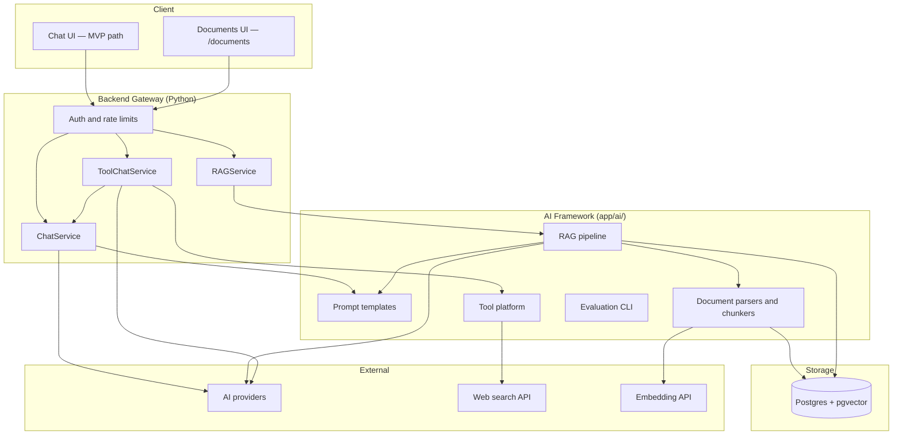
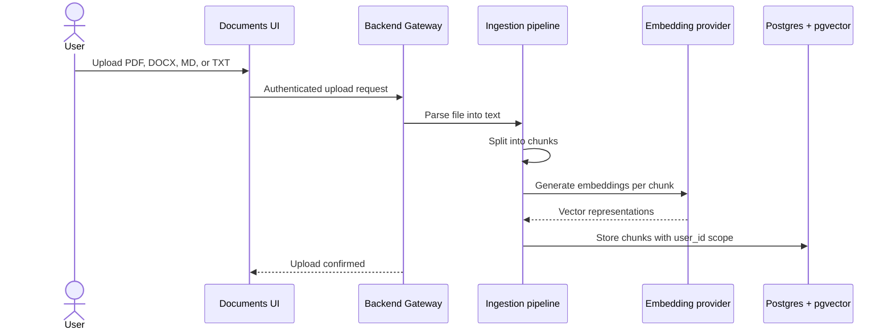
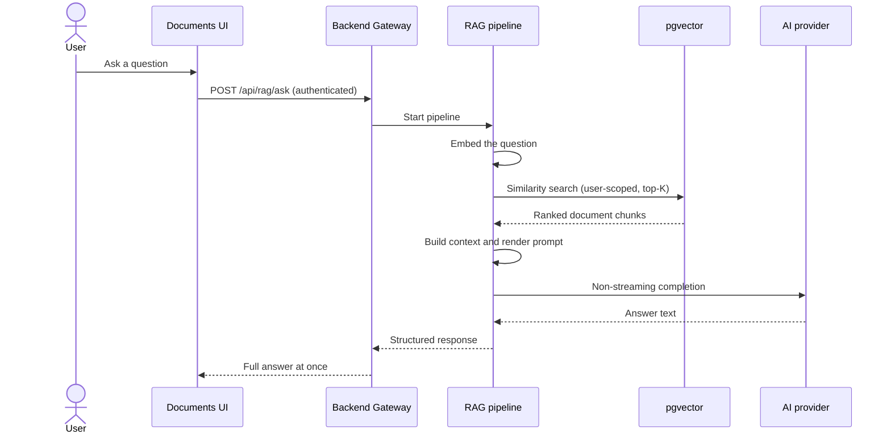

# AI Assistant Platform Post-MVP V1: From Chatbot to AI Platform

---

## ⚡ In One Minute

- **Post-MVP V1** turns the MVP chatbot into a **reusable AI platform** on the Python backend.
- **Prompt infrastructure** centralizes templates — no hardcoded prompts scattered in business logic.
- A **tool platform** runs web search as the first production tool when `TOOLS_ENABLED=true`.
- A **knowledge platform** ingests PDF, DOCX, MD, and TXT files into **pgvector** for similarity search.
- A **Generic RAG Framework** answers questions using retrieved document context — domain-agnostic by design.
- **Feature flags** (`RAG_ENABLED`, `TOOLS_ENABLED`) default off — MVP chat stays unchanged when they are off.
- A separate **`/documents`** route and an **evaluation CLI** let signed-in users manage corpora and measure quality.

---

## 🎯 The Big Picture

### What it is

Post-MVP V1 is the first major expansion after the foundational chat release. It adds modular AI infrastructure behind the same backend gateway: centralized prompts, a tool lifecycle, document ingestion, vector search, and a generic retrieval-augmented generation (RAG) pipeline.

The release deliberately stays **domain-agnostic**. It builds reusable plumbing — not a legal assistant, HR bot, or customer-care product. Those are future consumers of the framework.

### Why it exists

The MVP proved one loop: message in, streamed reply out, conversation stored. Real AI products need more — grounded answers from private documents, live web data, and prompts that can be versioned and tested.

Building those capabilities as one-off features in chat code would duplicate work and break the MVP path. V1 introduces shared infrastructure once. Later releases compose on top of it.

### What problem it solves

- **Prompt sprawl** — prompts lived as hardcoded strings; changes were risky and untested.
- **No grounding** — the model could only use conversation history, not uploaded knowledge.
- **No tools** — the assistant could not reach the live web.
- **No quality measurement** — there was no repeatable way to test retrieval or end-to-end answers.

### Why users and the business benefit

- **Signed-in users** can upload documents and ask questions grounded in their own files.
- **Operators** can enable web search in non-streaming chat without rewriting the client.
- **Engineering** gets a tested framework (`app/ai/`) with clear layer boundaries.
- **The business** can demo document Q&A and search-augmented chat while MVP behavior remains stable for everyone else.

---

## 🌍 An Everyday Analogy

Imagine a **research library with a reference desk**.

The MVP gave you a librarian who could talk about anything from general knowledge. Post-MVP V1 adds three new capabilities to that library:

| Library role | V1 platform |
| ------------ | ----------- |
| Card catalog and filing system | Document upload, parsing, chunking, and vector storage |
| Reading room with indexed shelves | pgvector similarity search scoped to your account |
| Reference librarian with approved sources | Generic RAG — question, retrieve relevant pages, compose an answer |
| Telephone to the outside world | Web search tool (when enabled) |
| Style guide for every department | Centralized prompt templates with versioning |

You still check in at the **same front desk** (the backend gateway). You still show your **library card** (Google sign-in). Guests can still use the general chat desk from the MVP — but they cannot enter the special collections room. **Document upload and RAG require authentication.**

When the new wings are closed (`RAG_ENABLED=false`, `TOOLS_ENABLED=false`), the library behaves exactly like the MVP — same chat, same streaming, same quotas.

---

## Platform overview

Feature flags control which paths are active. With both flags off, only the MVP chat path runs.

---

## Document ingestion flow

Ingestion is **synchronous** in V1 — the user waits until processing finishes. Async queues were deferred.

---

## RAG question flow

RAG responses are **non-streaming only** in V1. The user receives the complete answer after retrieval and generation finish.

---

## 🗺️ How It Works

Here is the journey through the major V1 capabilities.

### 1. Starting from the MVP baseline

**Operator deploys with default flags → MVP behavior is unchanged.**

`RAG_ENABLED=false` and `TOOLS_ENABLED=false` are the defaults. Chat, auth, streaming, persistence, rate limits, and error envelopes work exactly as before. No new secrets are required.

**Operator enables V1 flags → New routes and services activate at startup.**

Startup validation checks configuration. Missing API keys for enabled features produce clear errors rather than silent failures.

### 2. Centralized prompt infrastructure

**Engineer needs a system prompt → They edit a versioned Jinja2 template, not a Python string.**

Prompts live in a central repository under `app/ai/prompts/`. Templates support variable injection — for example, inserting retrieved document context into a RAG prompt.

**Change ships → Regression tests catch unintended prompt drift.**

Hardcoded strings in chat services were migrated. Business logic no longer owns prompt text.

### 3. Document upload and ingestion

**Signed-in user opens `/documents` → They see upload, list, and delete controls.**

Guests cannot access document or RAG endpoints. Every document belongs to the authenticated user's `user_id`.

**User uploads a file → The backend parses, chunks, embeds, and stores it.**

Supported formats: **PDF, DOCX, MD, and TXT**. The pipeline runs: parse text → split into overlapping chunks → generate embeddings → write to Postgres with pgvector.

**Upload exceeds size limit → The server returns a structured validation error.**

V1 allows uploads up to **10 MB**. A route-specific size limit replaced the MVP's global 16 KB body cap for document routes only.

### 4. Vector search with pgvector

**RAG pipeline needs relevant chunks → It embeds the question and queries pgvector.**

Search is scoped to the caller's documents. One user cannot retrieve another user's chunks.

**pgvector returns top-K matches → Chunks are ranked by similarity.**

V1 uses **semantic search only** — no hybrid retrieval, reranking, or metadata filtering yet.

### 5. Generic RAG Framework

**User asks a question on `/documents` → The RAG pipeline runs end to end.**

The flow is chronological:

**Question arrives → Retriever embeds it and fetches top-K chunks from pgvector.**

**Chunks return → Context Builder formats them within a token budget.**

**Context is ready → Prompt Builder renders a template with question plus context.**

**Prompt is complete → The LLM generates a non-streaming answer.**

**Answer returns → The UI displays the full response.**

The framework lives in `app/ai/rag/` and contains **no business-domain logic**. Customer care, legal, or HR rules belong in future application services — not in the framework itself.

### 6. Tool platform and web search

**Operator sets `TOOLS_ENABLED=true` → The tool registry activates.**

Every tool passes through a full lifecycle:

**LLM requests a tool → Registry looks up the tool definition.**

**Definition found → Validation checks inputs against the schema.**

**Inputs valid → Authorization confirms the caller may use this tool.**

**Authorized → Execution calls the external provider (web search).**

**Result returns → Normalization converts it to a standard shape for the LLM.**

Web search is the **first and only production tool** in V1. Calculator, weather, GitHub, and SQL tools were deferred.

**User sends a non-streaming chat message → ToolChatService may run a tool loop.**

`ToolChatService` composes the existing `ChatService` rather than growing it further. The LLM can call web search, receive results, and produce a final answer.

**User sends a streaming chat request → Tools are disabled.**

When `stream=true`, tool calling does not run in V1. Streaming chat follows the MVP SSE path unchanged.

### 7. Evaluation framework

**Engineer runs `make eval` → The CLI tests prompt, retrieval, and end-to-end quality.**

Evaluation levels:

- **Prompt** — template rendering and expected output shape
- **Retrieval** — precision and recall against a sample dataset
- **End-to-end** — full question-to-answer pipeline

Results land in a JSON report. Latency metrics help catch regressions against soft engineering targets (for example, retrieval under 150 ms).

### 8. Observability

**Any V1 operation completes → Structured logs record stage latencies and counters.**

Metrics include RAG request volume, retrieval latency, embedding latency, tool call counts, and document ingestion success/failure totals. V1 uses log-structured metrics — no Prometheus or Grafana requirement yet.

### Major design decisions

**Feature flags default off**

- **Decision:** `RAG_ENABLED` and `TOOLS_ENABLED` default to `false`.
- **Why:** MVP chat must never regress during incremental rollout.
- **Alternative considered:** Ship V1 capabilities always-on.
- **Trade-off:** Operators must explicitly enable and configure new features.

**Separate `/documents` route instead of unified chat**

- **Decision:** Document management and RAG Q&A live on their own frontend route.
- **Why:** Lower risk to MVP chat regression; clearer scope for V1.
- **Alternative considered:** Merge documents into the main chat composer.
- **Trade-off:** Users switch between chat and documents. Unified chat arrived in a later release (V1.1).

**Auth-only document access**

- **Decision:** Guests cannot upload files or call RAG endpoints.
- **Why:** Simpler ownership model — every chunk is scoped to `user_id`.
- **Alternative considered:** Guest-scoped document corpora.
- **Trade-off:** Trial users must sign in to use document features.

**Non-streaming RAG and no tools during SSE**

- **Decision:** RAG returns complete answers; streaming chat skips tool loops.
- **Why:** Simpler pipelines; fewer edge cases in the first release.
- **Alternative considered:** Stream RAG tokens and run tools mid-stream.
- **Trade-off:** RAG feels slower to start reading; streaming chat cannot search the web in V1.

**pgvector as the sole vector store**

- **Decision:** Store embeddings in Postgres using the pgvector extension.
- **Why:** Reuses existing database infrastructure; no extra service to operate.
- **Alternative considered:** Chroma, Pinecone, or Qdrant backends.
- **Trade-off:** Vector search scales with Postgres capacity; alternate backends were documented but not built.

**Generic RAG Framework stays domain-agnostic**

- **Decision:** Framework code handles retrieval, context assembly, and prompt rendering only.
- **Why:** Multiple future products can reuse the same pipeline via configuration.
- **Alternative considered:** Embed customer-care or legal logic in the framework.
- **Trade-off:** Domain-specific assistants require a separate application layer on top.

**ToolChatService composes ChatService**

- **Decision:** Tool orchestration is a separate service that wraps chat completion.
- **Why:** Avoids further growth of an already large `ChatService`.
- **Alternative considered:** Add tool loops directly inside `ChatService`.
- **Trade-off:** Two services to understand; boundaries stay cleaner.

**YAGNI and incremental abstractions**

- **Decision:** Build only what V1 needs; document V2 extension points instead of implementing them.
- **Why:** Every phase must leave a deployable, testable system.
- **Alternative considered:** Plugin systems, generic factories, and multi-backend vector stores upfront.
- **Trade-off:** Some future work requires refactoring rather than flipping a config flag.

---

## 🧩 Key Concepts Explained

### Retrieval-Augmented Generation (RAG)

**Definition:** A pattern where the system retrieves relevant documents first, then asks the LLM to answer using that retrieved context.

**Analogy:** An open-book exam — you look up the right pages before writing your answer.

### Embedding

**Definition:** A numerical vector representation of text that captures semantic meaning for similarity comparison.

**Analogy:** A fingerprint for a paragraph — similar ideas produce similar fingerprints.

### pgvector

**Definition:** A Postgres extension that stores and searches vector embeddings inside the same database as relational data.

**Analogy:** A library shelf where books are sorted by topic closeness, not just alphabet.

### Generic RAG Framework

**Definition:** Domain-independent retrieval infrastructure — retriever, context builder, prompt builder, and LLM orchestration — that any future assistant can configure and reuse.

**Analogy:** A standard kitchen prep line — same stations and workflow; different recipes (prompts and documents) per restaurant.

### Tool platform lifecycle

**Definition:** The ordered stages every tool call passes through: registry lookup, validation, authorization, execution, and result normalization.

**Analogy:** Airport security — check ID, inspect bags, approve access, perform the service, standardize the output.

### Feature flag

**Definition:** An environment setting that turns a capability on or off without code changes.

**Analogy:** A circuit breaker — flip it to power a new wing without rewiring the whole building.

---

## 🚀 Why This Matters

### For Product Managers

V1 defines a clear capability boundary: reusable AI infrastructure plus a minimal documents surface. Roadmap items like unified chat, agents, and memory can be prioritized knowing the plumbing exists and is flag-gated.

### For Engineering teams

Layer boundaries are explicit: Routers → Services → AI Framework → Providers → External APIs. Lower layers never depend on higher ones. New features plug into `app/ai/` instead of forking chat code.

### For QA

Test matrices are separable: MVP regression with flags off; document upload and RAG with `RAG_ENABLED=true`; web search tool loops with `TOOLS_ENABLED=true` on non-streaming chat; auth rejection for guests on document routes.

### For future development

Domain-specific assistants (legal, HR, customer care) are designed as **consumers** of the Generic RAG Framework — different prompts and document sets, same pipeline. V2 extension points (hybrid retrieval, citations, streaming RAG, agents) are documented but not built.

### For maintainability

Centralized prompts with regression tests reduce silent behavior changes. The evaluation CLI gives a repeatable quality baseline. Structured metrics make latency regressions visible in logs.

### For scalability

Async-first ingestion and retrieval avoid blocking the event loop. Stateless AI services (`RAGService`, `Retriever`, tool handlers) scale horizontally with the backend. Sync ingestion is a known V1 limit — async workers were deferred.

### For user experience

Signed-in users get document-grounded answers on a dedicated page. Web search augments non-streaming chat when enabled. MVP users see no change until operators flip flags.

### For business goals

The platform can demo private knowledge Q&A and search-augmented chat without abandoning the stable MVP baseline. Feature flags support phased rollout and cost control.

---

## ❓ Common Misconceptions

### "Post-MVP V1 replaces the MVP chat experience."

**Incorrect.** V1 extends the platform. With feature flags off, chat, auth, streaming, and persistence behave exactly as in the MVP.

**Correct understanding:** V1 adds optional capabilities behind flags. The MVP path is the default deployment.

### "RAG streams word by word like chat."

**Incorrect.** V1 RAG responses are non-streaming. The user waits for retrieval and generation to finish, then receives the full answer.

**Correct understanding:** Streaming RAG was explicitly deferred to a later release.

### "Guests can upload documents."

**Incorrect.** Document upload, list, delete, and RAG ask endpoints require authentication. Guests retain MVP chat only.

**Correct understanding:** Document ownership is tied to signed-in user accounts.

### "The Generic RAG Framework includes legal or HR business logic."

**Incorrect.** The framework is domain-agnostic. It retrieves chunks, assembles context, and renders prompts — nothing more.

**Correct understanding:** Domain rules live in future application services, documents, and prompt templates — not in `app/ai/rag/`.

### "Web search works during streaming chat in V1."

**Incorrect.** Tool calling is disabled when `stream=true`. Web search runs only on the non-streaming chat path when `TOOLS_ENABLED=true`.

**Correct understanding:** Streaming chat in V1 follows the MVP SSE path without tool loops.

### "V1 ships a unified chat plus documents composer."

**Incorrect.** V1 puts document management on a separate `/documents` route. The main chat UI does not include document or search toggles.

**Correct understanding:** Unified chat with per-request toggles arrived in Post-MVP V1.1, a subsequent release.

---

## 📌 Key Takeaways

- Post-MVP V1 transforms the MVP chatbot into a **reusable AI platform** with prompts, tools, documents, and RAG.
- **Feature flags default off** — MVP behavior is preserved until operators enable new capabilities.
- **Centralized prompt templates** replace hardcoded strings and support regression testing.
- The **tool platform** runs web search through a full lifecycle on non-streaming chat only.
- The **knowledge platform** ingests PDF, DOCX, MD, and TXT into **pgvector**, scoped per authenticated user.
- The **Generic RAG Framework** is domain-agnostic — retrieval, context, prompt, LLM — reusable by future assistants.
- **`/documents`** is a separate authenticated route for upload, management, and RAG Q&A.
- An **evaluation CLI** measures prompt, retrieval, and end-to-end quality with latency baselines.
- V1 deliberately defers streaming RAG, unified chat, hybrid retrieval, citations, agents, and async ingestion.
- Layer boundaries (Routers → Services → AI Framework → Providers) keep the codebase maintainable as scope grows.

---

## ✅ Conclusion

**AI Assistant Platform Post-MVP V1** answers a single strategic question: how do you grow a working chatbot into a platform without breaking what already ships?

The answer was incremental infrastructure behind feature flags. Prompts, tools, document ingestion, vector search, and generic RAG each landed as modular components in `app/ai/`, consumed by thin service layers. The MVP chat path stayed untouched when flags were off — a deliberate guardrail for regression safety.

Design choices reflected restraint. RAG is non-streaming. Tools skip streaming chat. Documents require sign-in. The UI lives on a separate route. pgvector is the only vector store. These limits reduced moving parts in the first platform release and documented clear extension points for what followed.

Within the broader product vision — a reusable fullstack AI application platform — V1 establishes the plumbing that later epics compose: unified chat, agents, memory, and workflow automation. V1 does not deliver those capabilities. It delivers the shared foundation they build on.
