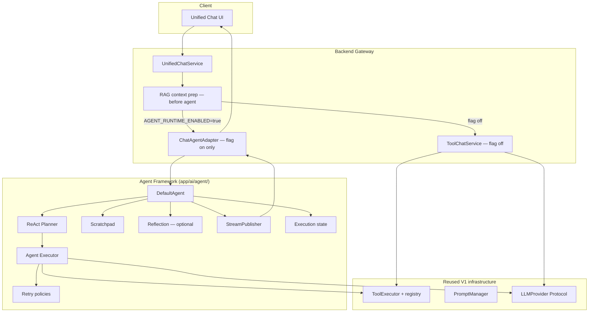
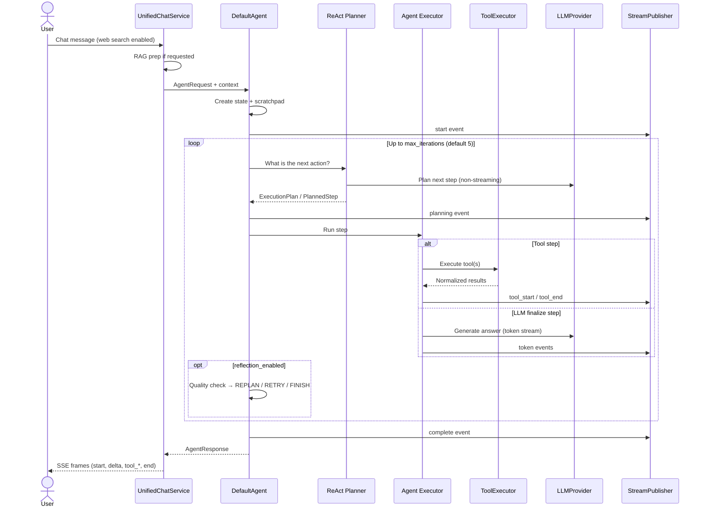

# AI Assistant Platform Post-MVP V2 Epic 1: Agent Framework

---

## ⚡ In One Minute

- **Epic 1** adds a **reusable agent runtime** under `app/ai/agent/` — the execution core for chat, assistants, and future automation.
- The runtime **plans, executes, retries, reflects, and streams** — without hard-coding chat or provider logic into one service.
- **ReAct-style planning** decides the next action each iteration: call a tool, ask the LLM, or finish.
- A **scratchpad** holds ephemeral working notes for one execution only — never auto-saved to the database.
- **Multi-tool execution** runs independent tools in parallel; dependent tools run in order.
- Chat wiring is **behind `AGENT_RUNTIME_ENABLED=false`** — V1.1 behavior stays unchanged when the flag is off.
- When the flag is on, web-search chat uses the agent path with **SSE streaming parity** via a thin chat adapter.

---

## 🎯 The Big Picture

### What it is

Post-MVP V2 Epic 1 is the **Agent Framework** — a provider-agnostic runtime that turns a user request into a planned sequence of LLM calls and tool actions.

It lives in `app/ai/agent/` and exposes stable interfaces: `Agent`, `Planner`, `Executor`, `RetryPolicy`, and `StreamPublisher`. The default implementation is `DefaultAgent`.

This is **not a user-facing product release**. End users see no new screens. Operators and engineers gain a composable execution engine that later epics — RAG, MCP, memory, workflows — can plug into.

### Why it exists

Post-MVP V1 and V1.1 built solid plumbing: prompts, tools, RAG, and unified chat. Web search ran through a **tool loop inside `ToolChatService`**. That worked, but the logic was tied to one chat service.

Real AI products need a shared **agent runtime** — planning, tool orchestration, retries, reflection, and streaming — reusable across chat, automation, and future multi-agent systems. Epic 1 extracts that runtime once instead of duplicating it in every feature.

### What problem it solves

- **Orchestration sprawl** — tool loops, retries, and streaming lived in chat-specific code.
- **No reusable execution core** — new capabilities would reimplement the same plan → act → observe cycle.
- **Tight coupling** — chat services mixed HTTP, persistence, and AI reasoning in one place.
- **Hard to test in isolation** — you could not run an agent without the full HTTP stack.

### Why users and the business benefit

- **Users** see no change until operators enable the flag — then web-search chat follows the same API with agent-backed execution.
- **Engineering** gets a tested, typed runtime with clear boundaries and ≥80% test coverage on `app/ai/agent/`.
- **The business** gains a foundation for V2 epics (advanced RAG, MCP, memory, workflows) without rewriting chat from scratch.
- **Future teams** can build assistants and automation on `DefaultAgent` instead of forking `ToolChatService`.

---

## 🌍 An Everyday Analogy

Imagine a **project manager running a short mission**.

Before Epic 1, the chat service was a single specialist who both **decided what to do** and **did the work** — call search, read results, write the answer — all in one desk drawer.

Epic 1 hires a **project manager with a whiteboard, a checklist, and a progress feed**:

| Project manager role | Agent Framework |
| -------------------- | --------------- |
| Reads the mission brief | `AgentRequest` arrives at `DefaultAgent` |
| Writes notes that disappear after the job | Ephemeral **scratchpad** (in-memory only) |
| Decides the next step | **ReAct planner** — tool, LLM, or finish |
| Sends specialists to do work | **Executor** + existing **ToolExecutor** |
| Retries when a line is busy | **Retry policy** (timeouts, 429s — not bad input) |
| Double-checks quality before closing | Optional **reflection** (default off) |
| Reports progress to the client | **StreamPublisher** → chat adapter → SSE |
| Files the final report | `AgentResponse` back to the chat layer |

The **client still talks to the same front desk** (`UnifiedChatService`). RAG document context is assembled **before** the project manager takes over — that stays in the gateway, not inside the agent core.

When the new manager is on vacation (`AGENT_RUNTIME_ENABLED=false`), the old specialist (`ToolChatService`) handles web search exactly as in V1.1.

---

## Agent runtime overview

The agent core never imports FastAPI, chat schemas, or provider SDKs. Adapters under `adapters/` bridge to HTTP and SSE.

---

## Execution flow

Tool-planning LLM rounds are **non-streaming**. The final answer streams token by token — matching V1.1 chat parity.

---

## 🗺️ How It Works

Here is the journey through the Agent Framework from request to response.

### 1. Starting from the V1.1 baseline

**Operator deploys with default flags → V1.1 chat behavior is unchanged.**

`AGENT_RUNTIME_ENABLED=false` is the default. Web search, streaming, RAG prep, guest denial, persistence, and usage tracking all follow the existing `ToolChatService` path.

**Operator enables the agent flag → Unified chat branches to the agent adapter.**

The public chat API contract does not change. The adapter maps `AgentRequest` / `AgentResponse` and stream events to the same SSE frame names users already expect.

### 2. Request arrives at the agent runtime

**UnifiedChatService finishes RAG prep → It hands an `AgentRequest` to `DefaultAgent`.**

Document grounding and retrieval stay in the gateway. The agent core does not embed RAG logic — that is deferred to Epic 2.

**DefaultAgent creates execution state and a scratchpad → The run begins.**

State tracks lifecycle transitions (`CREATED` through `COMPLETED`). The scratchpad holds working notes for this execution only. Neither replaces session storage in chat services.

### 3. Planning the next action

**Planner asks the LLM → "What should we do next?"**

The **ReAct planner** produces an `ExecutionPlan` with one or more `PlannedStep` entries. Actions include calling tools, invoking the LLM, or finishing.

**Plan is ready → The executor runs the step.**

Planning uses centralized prompt templates (`planner.v1.j2`) and the existing `PromptManager`. The planner depends on the `LLMProvider` Protocol — not a specific vendor SDK.

### 4. Executing tools and LLM steps

**Step requires tools → Agent Executor delegates to the existing ToolExecutor.**

Tool validation, authorization, and normalization stay in `app/ai/tools/`. The agent wraps that platform — it does not reimplement tool lifecycle rules.

**Multiple independent tools → They may run in parallel.**

When tools declare `depends_on` relationships, the dependency resolver runs them sequentially. Parallel execution is configurable and off by default to reduce race risk.

**Step requires a final answer → The LLM streams tokens through the executor.**

Intermediate tool rounds use non-streaming LLM calls. The final user-facing answer streams — preserving V1.1 SSE behavior.

### 5. Retry when things go wrong

**A call hits a timeout, connection error, or rate limit → Retry policy retries with backoff.**

Retries wrap the shared `retry_async` helper from `app/core/retry.py` — no duplicate backoff logic.

**Validation fails, auth is denied, or iteration limit is hit → No retry.**

Bad inputs and policy violations fail fast. Defaults: `max_retries=3`, `retry_base_delay_seconds=1.0`.

### 6. Optional reflection

**Reflection is disabled by default → The executor loop finishes when the planner says FINISH.**

When `reflection_enabled=true`, a quality checker runs after steps. Rule-based decisions come first:

**All tools failed → REPLAN.**

**Empty LLM content → RETRY_STEP.**

**Partial tool failure → CONTINUE.**

**Success → FINISH.**

An optional LLM reflection prompt (`reflection.v1.j2`) handles inconclusive cases. Reflection is bounded by `max_iterations` (default 5; the chat adapter may use 3).

### 7. Streaming progress

**Each meaningful stage emits a typed event → StreamPublisher broadcasts it.**

Event types include start, planning, tool_start, tool_end, token, reflection, complete, and error. The core never formats SSE frames.

**Chat adapter maps events → Existing SSE frame names reach the browser.**

Frames include `start`, `delta`, `tool_start`, `tool_end`, `end`, and `error`. Raw provider text is never exposed in events.

### 8. Response finalization

**Execution completes → DefaultAgent returns `AgentResponse`.**

The adapter preserves `tools_used`, `retrieved_chunks`, usage metadata, guest denial, and message persistence — same contracts as V1.1.

**Scratchpad is discarded → Nothing from the working memory is auto-persisted.**

Long-term memory belongs in Epic 4 (Memory System), not Epic 1.

### Major design decisions

**Provider-agnostic core**

- **Decision:** Agent core depends on the `LLMProvider` Protocol only; no provider SDK imports in `app/ai/agent/`.
- **Why:** Swap OpenAI, Anthropic, Gemini, or Groq without touching agent logic.
- **Alternative considered:** Embed provider clients directly in the executor.
- **Trade-off:** Adapters must translate Protocol calls; relocation of `app/providers/` is deferred.

**Feature flag default off**

- **Decision:** `AGENT_RUNTIME_ENABLED=false` leaves the V1.1 `ToolChatService` path untouched.
- **Why:** Zero regression risk for production chat during incremental rollout.
- **Alternative considered:** Ship the agent path as default immediately.
- **Trade-off:** Operators must explicitly enable and validate the agent path.

**RAG before agent handoff**

- **Decision:** `UnifiedChatService` prepares RAG context before calling the agent.
- **Why:** Keeps the agent core free of retrieval logic; Epic 2 owns advanced RAG inside the platform.
- **Alternative considered:** Embed retrieval in the agent executor.
- **Trade-off:** Two-hop orchestration in the gateway; cleaner agent boundaries.

**Ephemeral scratchpad**

- **Decision:** Working memory is in-memory for one execution; never auto-persisted.
- **Why:** Avoids accidental data retention and keeps Epic 1 scope focused.
- **Alternative considered:** Persist scratchpad entries to the database.
- **Trade-off:** No cross-request agent memory until Epic 4.

**Streaming decoupled from transport**

- **Decision:** Core uses `StreamPublisher` only; SSE mapping lives in chat adapters.
- **Why:** The same runtime can serve REST, voice, or batch jobs without HTTP imports in core.
- **Alternative considered:** Call `format_sse()` directly from the executor.
- **Trade-off:** Adapters must stay in sync with chat frame schemas.

**Reuse over reimplementation**

- **Decision:** Wrap `ToolExecutor`, `retry_async`, and `PromptManager` — do not duplicate them.
- **Why:** Single source of truth for tool auth, backoff, and prompt versioning.
- **Alternative considered:** Agent-specific tool and retry stacks.
- **Trade-off:** Agent behavior inherits tool-platform limits until those platforms evolve.

**Reflection default off**

- **Decision:** `reflection_enabled=false` unless explicitly turned on.
- **Why:** Extra LLM rounds add latency and cost; rule-based retry covers most failures.
- **Alternative considered:** Always-on reflection for maximum quality.
- **Trade-off:** Some edge cases need manual tuning or a later epic's observability tooling.

---

## 🧩 Key Concepts Explained

### Agent runtime

**Definition:** A reusable execution engine that accepts an `AgentRequest`, plans actions, runs tools and LLM steps, and returns an `AgentResponse`.

**Analogy:** A mission control room — one desk coordinates specialists instead of each client hiring freelancers ad hoc.

### ReAct planner

**Definition:** An iterative planning pattern where the LLM **Reasons** about the situation and **Acts** by choosing the next step — tool call, LLM call, or finish.

**Analogy:** A chess player who re-evaluates the board after every move instead of committing to a full game plan upfront.

### Scratchpad

**Definition:** Ephemeral in-memory notes used during a single agent execution to pass context between steps.

**Analogy:** A whiteboard in a meeting room — useful during the session, erased when everyone leaves.

### Execution state

**Definition:** Per-run tracking of lifecycle status, iteration count, and transitions — scoped to one agent execution, not the user's chat session.

**Analogy:** A job ticket on a clipboard — tracks this task only, not the customer's entire account history.

### StreamPublisher

**Definition:** A typed event channel that reports agent progress without knowing about HTTP or SSE.

**Analogy:** A PA system inside the building — adapters decide how that announcement reaches people outside.

### Reflection loop

**Definition:** An optional post-step quality check that can replan, retry a step, continue, or finish based on rule-based and optional LLM evaluation.

**Analogy:** A senior editor reviewing a draft before it goes to print — catches gaps before the client sees the final copy.

---

## 🚀 Why This Matters

### For Product Managers

Epic 1 is **platform infrastructure**, not a feature launch. Roadmap items like MCP tools, durable memory, and workflow automation can assume a stable agent runtime exists. The flag lets you pilot agent-backed chat without forcing a big-bang cutover.

### For Engineering teams

Boundaries are explicit: agent core (`app/ai/agent/`) → reused tool and prompt layers → provider Protocol → chat adapters. Public APIs frozen after Phase 1 reduce churn for downstream epics. 144 agent tests and 91% coverage on the package provide a safety net.

### For QA

Test matrices split cleanly: **flag off** — full V1.1 regression; **flag on** — web-search chat parity (streaming and non-streaming), guest denial, persistence, `tools_used`, and `retrieved_chunks`. No new user-facing routes — same chat API.

### For future development

Epic 2 (Advanced RAG), Epic 3 (MCP), Epic 4 (Memory), Epic 5 (Workflows), and Epic 8 (Human-in-the-Loop) are documented **consumers** of this runtime. They extend capabilities without reimplementing plan → execute → stream.

### For maintainability

Chat services shrink back to gateway concerns: auth, RAG prep, persistence, and adapter mapping. Agent logic is independently testable without spinning up HTTP. Structured log fields (`agent_execution_id`, `agent_iterations`, `agent_tools_used`) support debugging without logging message content.

### For scalability

Async-first execution and parallel tool support (when safe) reduce wall-clock time for multi-tool missions. Stateless agent runs scale with the backend worker pool. Session persistence remains in chat services — not duplicated in the agent layer.

### For user experience

With the flag off, nothing changes. With the flag on, users get the same streaming chat experience — start, token deltas, tool indicators, end — backed by a more modular runtime. RAG-grounded answers still arrive with retrieved chunk metadata.

### For business goals

Epic 1 is the first step in the V2 architecture strategy: transform a chatbot into a **reusable AI application platform**. It delivers the execution core that later epics compose — without breaking the stable V1.1 product.

---

## ❓ Common Misconceptions

### "Epic 1 ships a new chat UI or API."

**Incorrect.** There are no new frontend routes and no breaking API changes. The agent runtime wires into existing unified chat behind a flag.

**Correct understanding:** Epic 1 is backend infrastructure. Users see agent-backed behavior only when operators enable `AGENT_RUNTIME_ENABLED=true`.

### "The agent framework replaces ToolChatService immediately."

**Incorrect.** `ToolChatService` remains the default path when the flag is off. The chat adapter is additive.

**Correct understanding:** Default-off flag preserves V1.1 behavior until an explicit ops decision to flip it.

### "RAG retrieval now runs inside the agent."

**Incorrect.** RAG context is prepared in `UnifiedChatService` before the agent receives the request. RAG-in-agent is Epic 2 scope.

**Correct understanding:** The agent executes reasoning and tools; the gateway still owns document retrieval prep in Epic 1.

### "The scratchpad is long-term memory."

**Incorrect.** The scratchpad is ephemeral and never auto-persisted. It dies when the execution ends.

**Correct understanding:** Durable memory, preferences, and summaries belong in Epic 4 (Memory System).

### "Reflection always runs and can loop forever."

**Incorrect.** Reflection defaults to **off**. When enabled, decisions are rule-based first and bounded by `max_iterations`.

**Correct understanding:** Reflection is an optional quality loop — not a default cost and latency multiplier.

### "The agent core knows about SSE and FastAPI."

**Incorrect.** Core code uses `StreamPublisher` only. SSE frame mapping lives in chat adapters under `adapters/`.

**Correct understanding:** Transport stays at the edge; the runtime stays reusable for non-HTTP clients.

---

## 📌 Key Takeaways

- Epic 1 delivers a **provider-agnostic agent runtime** in `app/ai/agent/` — the V2 execution core.
- **`DefaultAgent`** orchestrates planning, execution, retry, optional reflection, and streaming through stable Protocols and models.
- The **ReAct planner** chooses the next action each iteration; the **executor** runs tools via the existing **ToolExecutor** platform.
- The **scratchpad** is ephemeral working memory — in-memory for one run, never auto-persisted.
- **Multi-tool execution** supports parallel independent tools and sequential `depends_on` chains.
- **Streaming** flows through `StreamPublisher`; chat adapters map events to existing SSE frames.
- **`AGENT_RUNTIME_ENABLED=false`** preserves the full V1.1 `ToolChatService` path — no breaking changes.
- **RAG prep stays in `UnifiedChatService`** before agent handoff; advanced RAG-in-agent is Epic 2.
- **144 agent tests** and **≥80% coverage** on `app/ai/agent/` meet design acceptance criteria.
- Later epics — MCP, memory, workflows, observability, HITL — **compose on this runtime** instead of reimplementing orchestration.

---

## ✅ Conclusion

**AI Assistant Platform Post-MVP V2 Epic 1** answers a foundational question for the V2 roadmap: where does "think, act, observe, retry, and stream" live once chat outgrows a single service?

The answer is a dedicated agent runtime under `app/ai/agent/`. It separates planning from execution, keeps provider and transport concerns at the edges, and reuses the tool, prompt, and retry infrastructure V1 already proved. Chat wiring arrives last — behind a default-off flag — so production behavior stays stable while the new path earns parity tests.

Design choices reflect restraint. Scratchpad memory is ephemeral. Reflection is optional. RAG stays in the gateway for now. The core never imports FastAPI or provider SDKs. These boundaries keep Epic 1 focused on execution plumbing rather than absorbing every future epic's scope.

Within the broader V2 vision — a reusable, production-grade AI application platform — Epic 1 is the layer everything else builds on. Advanced RAG, MCP, memory, workflows, and human-in-the-loop features do not ship here. They inherit `DefaultAgent`, `AgentRequest`, `StreamPublisher`, and `AGENT_RUNTIME_ENABLED` as the stable foundation they compose next.
