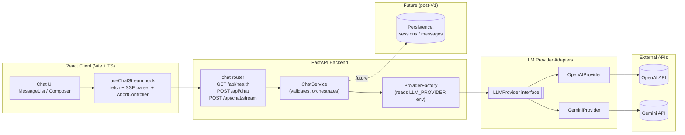

# Chatbot v1 — Architecture & Implementation Plan

## 1. Project Overview

- Full-stack chatbot: TypeScript/React frontend, Python/FastAPI backend, streaming assistant responses token-by-token.
- LLM access is provider-agnostic: OpenAI implemented first, Gemini added behind the same interface without touching API or frontend contracts.
- Single-page chat UI: message list + composer, no login, no persistence in MVP.
- Backend exposes a thin HTTP API (health, non-streaming chat, streaming chat) and owns all provider secrets/config.
- Streaming uses Server-Sent Events (SSE) over a `fetch()` POST, parsed manually on the client.
- Designed to be a portfolio-quality reference: small enough to build in days, structured enough to extend (persistence, multi-session, auth) without rewrites.
- **MVP scope (current)**: Python/FastAPI backend deployed on Railway + React frontend on Vercel, OpenAI and Gemini support, guest + authenticated flows, persistence planning in progress.
- **Post-MVP scope**: Node parity backend resume, retries/reconnect polish, additional abuse controls, markdown rendering, and broader persistence rollout tasks.

## 2. Architecture Decisions

- **Frontend/backend separation**: React app never talks to OpenAI/Gemini directly — API keys must never reach the browser. FastAPI is the only holder of provider secrets, and the only place request validation, provider selection, and error normalization happen.
- **Why FastAPI for streaming**: native `async def` endpoints + `StreamingResponse` let the backend await provider SDK async generators and forward chunks immediately without buffering; built-in Pydantic validation gives typed request/response schemas for free; ASGI (uvicorn) handles concurrent long-lived streaming connections well.
- **Transport: SSE (not WebSocket)**. Chat streaming is one request → one continuous one-directional response (server→client tokens). SSE over `fetch()` gives that with plain HTTP, no special infra, easy to proxy/deploy, and trivial to cancel via `AbortController`. WebSocket would add bidirectional connection lifecycle management we don't need for a single request/response turn. See §17 for the tradeoff writeup (loss of native auto-reconnect since we use `fetch` instead of `EventSource`).
- **React state management**: plain `useState`/`useReducer` + a single `ChatContext` for MVP/V1. Chat state (messages array, streaming status, error) is simple enough that Redux/Zustand would be overengineering for a solo-dev portfolio app. If session list / multi-chat / cross-page state emerges post-V1, revisit and introduce Zustand then — the reducer shape is written to make that swap mechanical (see §6).

## 3. System Design Diagram



## 4. API Contract

| Method | Path               | Purpose                                        |
| ------ | ------------------ | ---------------------------------------------- |
| GET    | `/api/health`      | Liveness + active provider info                |
| POST   | `/api/chat`        | Non-streaming fallback (full response at once) |
| POST   | `/api/chat/stream` | Primary streaming endpoint (SSE)               |

**`ChatMessage`**

```json
{ "role": "user", "content": "What is FastAPI?" }
```

`role` is one of `"system" | "user" | "assistant"`.

**`GET /api/health` → 200**

```json
{ "status": "ok", "provider": "openai", "version": "0.1.0" }
```

**`POST /api/chat` request**

```json
{
  "messages": [
    { "role": "system", "content": "You are a helpful assistant." },
    { "role": "user", "content": "What is FastAPI?" }
  ],
  "model": "gpt-4o-mini",
  "provider": "openai",
  "temperature": 0.7
}
```

`model`, `provider`, `temperature` are optional; server falls back to env defaults.

**`POST /api/chat` response → 200**

```json
{
  "id": "resp_01hz...",
  "role": "assistant",
  "content": "FastAPI is a Python web framework...",
  "model": "gpt-4o-mini",
  "provider": "openai",
  "created_at": "2026-07-09T12:00:00Z"
}
```

**`POST /api/chat/stream` request**: identical body shape to `/api/chat`.

**`POST /api/chat/stream` response**: `Content-Type: text/event-stream`, body is a sequence of SSE frames, each `data:` line containing one JSON object:

```
event: start
data: {"type":"start","id":"resp_01hz","timestamp":"2026-07-09T12:00:00Z"}

event: delta
data: {"type":"delta","id":"resp_01hz","content":"Fast","timestamp":"2026-07-09T12:00:00.05Z"}

event: delta
data: {"type":"delta","id":"resp_01hz","content":"API is","timestamp":"2026-07-09T12:00:00.10Z"}

event: end
data: {"type":"end","id":"resp_01hz","finish_reason":"stop","timestamp":"2026-07-09T12:00:01Z"}
```

On failure mid-stream:

```
event: error
data: {"type":"error","id":"resp_01hz","code":"provider_error","message":"Upstream provider failed","timestamp":"..."}
```

Non-streaming error responses use a standard envelope (see §12):

```json
{
  "error": {
    "code": "validation_error",
    "message": "messages must not be empty"
  }
}
```

## 5. Streaming Design

**Happy-path sequence:**

1. User submits message → frontend appends optimistic user message to local state, opens `fetch(POST /api/chat/stream, {signal})`.
2. Backend validates request (Pydantic), resolves provider via `ProviderFactory`, calls `provider.stream_chat(messages, model)`.
3. Backend immediately emits `start` frame (id, timestamp) before first provider token arrives, so UI can show a "typing" bubble instantly.
4. As provider yields tokens, backend wraps each into a `delta` frame and flushes via `StreamingResponse` generator (no buffering).
5. Frontend's `useChatStream` reads `response.body` via `ReadableStream` reader, decodes chunks, splits on SSE frame boundaries (`\n\n`), parses `data:` JSON, and appends `delta.content` to the in-progress assistant message, triggering re-render per token.
6. Provider finishes → backend emits `end` frame with `finish_reason`; frontend marks message complete, clears streaming flag.

**Cancellation**: Composer's "Stop" button calls `abortController.abort()`. This aborts the `fetch`, which the backend detects via `request.is_disconnected()` polled inside the streaming generator (checked between chunks) — on disconnect, backend stops iterating the provider generator and releases the upstream connection. Frontend keeps whatever partial content was already rendered and marks the message as `stopped` (not `error`).

**Reconnect/retry guidance**: Because streaming uses `fetch` (not native `EventSource`), there is no automatic reconnect. On network drop mid-stream, the frontend catches the stream error, marks the message `interrupted`, and shows a "Retry" affordance that re-sends the same request from scratch (no partial-resume — providers don't support resuming a partial completion). This is an explicit accepted limitation for MVP/V1 (see §17).

## 6. Frontend Plan (React + TS)

**Component architecture**

- `ChatPage` — top-level page, owns `ChatProvider` context, renders `MessageList` + `Composer`.
- `MessageList` — renders array of messages, auto-scrolls to bottom on new content (via `useEffect` + ref, only auto-scrolls if user is already near bottom).
- `MessageBubble` — renders one message (role-based styling), renders partial content while streaming.
- `Composer` — textarea + Send/Stop button; disabled while a response is streaming (Send hidden, Stop shown).
- `StreamingIndicator` — small "typing…" affordance shown between `start` and first `delta`.

**Data model (`frontend/src/types/chat.ts`)**

```ts
export type Role = 'system' | 'user' | 'assistant';

export interface Message {
  id: string;
  role: Role;
  content: string;
  status: 'complete' | 'streaming' | 'stopped' | 'error';
  createdAt: string;
}

export interface ChatRequest {
  messages: Pick<Message, 'role' | 'content'>[];
  model?: string;
  provider?: 'openai' | 'gemini';
  temperature?: number;
}

export type ChatChunk =
  | { type: 'start'; id: string; timestamp: string }
  | { type: 'delta'; id: string; content: string; timestamp: string }
  | { type: 'end'; id: string; finish_reason: string; timestamp: string }
  | {
      type: 'error';
      id: string;
      code: string;
      message: string;
      timestamp: string;
    };

export interface ChatSession {
  id: string; // anticipates future persistence; unused server-side in MVP
  messages: Message[];
}
```

**Streaming consumption strategy**: `useChatStream` hook wraps `fetch` + `ReadableStreamDefaultReader<Uint8Array>` + `TextDecoder`, buffering partial lines until a full `\n\n`-terminated frame is available, then parsing the `data:` payload as `ChatChunk` and dispatching reducer actions (`APPEND_DELTA`, `START_MESSAGE`, `END_MESSAGE`, `STREAM_ERROR`). Chat state lives in `chatReducer.ts` (`useReducer`), exposed through `ChatContext` — kept intentionally swappable for Zustand later without touching consuming components (actions/selectors stay the same shape).

**UX details**: auto-scroll-if-near-bottom, disable Composer input+Send while streaming (Stop replaces Send), skeleton/typing indicator between `start` and first `delta`, render error banner + Retry button on `error`/`interrupted`, preserve scroll position when user has scrolled up to read history.

## 7. Backend Plan (FastAPI)

**App structure**

- `app/main.py` — creates FastAPI app, registers routers, CORS middleware, exception handlers.
- `app/core/config.py` — Pydantic `Settings` (reads env vars, see §11).
- `app/routers/health.py` — `GET /api/health`.
- `app/routers/chat.py` — `POST /api/chat`, `POST /api/chat/stream`.
- `app/services/chat_service.py` — validates/normalizes request, resolves provider via `ProviderFactory`, orchestrates non-stream vs stream calls, converts provider chunks → SSE frames.
- `app/providers/base.py` — `LLMProvider` abstract interface + `ProviderChunk` dataclass.
- `app/providers/openai_provider.py`, `app/providers/gemini_provider.py` — concrete adapters.
- `app/providers/factory.py` — `ProviderFactory.get_provider(name: str | None) -> LLMProvider`, reads `settings.llm_provider` as default.
- `app/schemas/chat.py` — Pydantic models: `ChatMessageSchema`, `ChatRequestSchema`, `ChatResponseSchema`, `ErrorResponseSchema`, plus SSE frame models (`StartFrame`, `DeltaFrame`, `EndFrame`, `ErrorFrame`).

**Streaming endpoint strategy**: `POST /api/chat/stream` returns `StreamingResponse(event_generator(), media_type="text/event-stream")` where `event_generator` is an `async def` that: yields the `start` frame, then `async for chunk in provider.stream_chat(...)` yields `delta` frames (checking `await request.is_disconnected()` each iteration to support cancellation), then yields `end` frame; wraps the whole body in `try/except` to yield an `error` frame on provider failure instead of raising (since HTTP status is already 200 once streaming started).

**CORS/middleware**: `CORSMiddleware` with `allow_origins` from `CORS_ALLOWED_ORIGINS` (comma-separated env var, e.g. `http://localhost:5173` in dev, Vercel domain in prod), `allow_methods=["GET","POST"]`, `allow_credentials=False` (no cookies/auth in MVP). Add a request-size-limit middleware/dependency (reject bodies over e.g. 16KB) and a request-id/logging middleware for basic observability.

## 8. LLM Provider Abstraction

```python
# app/providers/base.py
class ProviderChunk(TypedDict):
    content: str
    finish_reason: str | None

class LLMProvider(Protocol):
    async def stream_chat(
        self,
        messages: list[ChatMessageSchema],
        model: str,
        temperature: float = 0.7,
    ) -> AsyncIterator[ProviderChunk]: ...

    async def complete_chat(
        self,
        messages: list[ChatMessageSchema],
        model: str,
        temperature: float = 0.7,
    ) -> str: ...
```

- `OpenAIProvider.stream_chat` wraps `openai.AsyncOpenAI().chat.completions.create(stream=True, ...)`, mapping each `choices[0].delta.content` into a `ProviderChunk`.
- `GeminiProvider.stream_chat` wraps `google-genai`'s streaming generate call, mapping each candidate's incremental text into the same `ProviderChunk` shape — this normalization (OpenAI's `choices/delta` vs Gemini's `candidates/parts`) is the entire point of the adapter layer; nothing above `ChatService` ever sees provider-specific response shapes.
- `ProviderFactory.get_provider(name)` returns the right adapter instance based on `name or settings.llm_provider`, raising a typed `UnsupportedProviderError` for anything else — this is the single switch point; adding a third provider means adding one adapter file + one factory branch.

## 9. Directory Structure

```
backend/
  app/
    main.py                  # FastAPI app, CORS, exception handlers, router registration
    core/
      config.py               # Settings (env vars)
      logging.py              # basic structured logging setup
    routers/
      health.py
      chat.py
    services/
      chat_service.py         # request orchestration, SSE frame construction
    providers/
      base.py                 # LLMProvider Protocol, ProviderChunk
      openai_provider.py
      gemini_provider.py
      factory.py
    schemas/
      chat.py                 # Pydantic request/response/frame models
  tests/
    test_health.py
    test_chat_endpoint.py
    test_chat_stream.py
    providers/
      test_openai_provider.py
      test_gemini_provider.py
    fakes.py                  # FakeProvider test double implementing LLMProvider
  pyproject.toml               # uv-managed deps
  .env.example
  .python-version

frontend/
  src/
    pages/
      ChatPage.tsx
    components/
      MessageList.tsx
      MessageBubble.tsx
      Composer.tsx
      StreamingIndicator.tsx
    hooks/
      useChatStream.ts
    state/
      chatReducer.ts
    context/
      ChatContext.tsx
    api/
      chatClient.ts            # fetch wrappers for /api/chat and /api/chat/stream
      sseParser.ts              # frame-boundary parsing helper
    types/
      chat.ts
    App.tsx
    main.tsx
  index.html
  package.json
  tsconfig.json
  vite.config.ts
  .env.example

docs/
  plans/
    chatbot-v1.md              # this document
```

- `backend-python/app/providers/` isolates all vendor SDK usage — nothing else imports `openai` or `google-genai` directly.
- `backend-python/tests/fakes.py` gives a deterministic `FakeProvider` for endpoint/streaming tests without network calls.
- `frontend/src/api/sseParser.ts` is a small, independently unit-testable module (frame buffering logic is the trickiest part of the frontend).

## 10. Fine-Grained Implementation Plan

### Phase 0 — Repo scaffolding

1. **Init backend project.** Objective: runnable FastAPI skeleton. Files: `backend-python/pyproject.toml`, `backend-python/app/main.py`, `backend-python/.python-version`. Acceptance: `uv run uvicorn app.main:app --reload` starts, serves empty app. Effort: S.
2. **Init frontend project.** Objective: runnable Vite+React+TS skeleton. Files: `frontend/package.json`, `frontend/src/main.tsx`, `frontend/src/App.tsx`, `frontend/vite.config.ts`. Acceptance: `npm run dev` serves default page at `localhost:5173`. Effort: S. _(parallel with step 1)_

### Phase 1 — Backend health + config

3. **Add Settings + health endpoint.** Objective: env-driven config, liveness check. Files: `backend-python/app/core/config.py`, `backend-python/app/routers/health.py`, wire into `main.py`. Acceptance: `GET /api/health` returns `{status:"ok", provider, version}`. Effort: S. _(depends on 1)_
4. **Add CORS middleware.** Objective: allow frontend origin. Files: `backend-python/app/main.py`. Acceptance: browser fetch from `localhost:5173` to `/api/health` succeeds without CORS error. Effort: S. _(depends on 3)_

### Phase 2 — Provider abstraction

5. **Define `LLMProvider` interface + schemas.** Objective: contract all adapters implement. Files: `backend-python/app/providers/base.py`, `backend-python/app/schemas/chat.py`. Acceptance: mypy/type-checks pass; `ProviderChunk`/`ChatMessageSchema` importable. Effort: S. _(depends on 1)_
6. **Implement `OpenAIProvider`.** Objective: working streaming + non-streaming OpenAI adapter. Files: `backend-python/app/providers/openai_provider.py`. Acceptance: manual script call streams real tokens given a valid `OPENAI_API_KEY`. Effort: M. _(depends on 5)_
7. **Implement `ProviderFactory` + `FakeProvider` test double.** Objective: single switch point + deterministic testing. Files: `backend-python/app/providers/factory.py`, `backend-python/tests/fakes.py`. Acceptance: `ProviderFactory.get_provider("openai")` returns `OpenAIProvider`; unknown name raises `UnsupportedProviderError`. Effort: S. _(depends on 6)_

### Phase 3 — Non-streaming chat endpoint (fallback, but built first as simplest E2E happy path)

8. **Implement `ChatService.complete_chat` + `POST /api/chat`.** Objective: end-to-end non-streaming request. Files: `backend-python/app/services/chat_service.py`, `backend-python/app/routers/chat.py`. Acceptance: `curl -X POST /api/chat` with a valid body returns a complete assistant message. Effort: M. _(depends on 7)_

### Phase 4 — Streaming endpoint

9. **Implement SSE frame models + `event_generator`.** Objective: `POST /api/chat/stream` emits start/delta/end/error frames. Files: `backend-python/app/services/chat_service.py`, `backend-python/app/routers/chat.py`. Acceptance: `curl -N -X POST /api/chat/stream` prints incremental SSE frames ending in `end`. Effort: M. _(depends on 8)_
10. **Add disconnect-aware cancellation.** Objective: stop provider generator when client disconnects. Files: `backend-python/app/services/chat_service.py`. Acceptance: killing curl mid-stream stops backend logging further token fetches (verify via log line). Effort: S. _(depends on 9)_

### Phase 5 — Frontend types, API client, streaming hook

11. **Add shared types.** Objective: typed contracts matching backend schemas. Files: `frontend/src/types/chat.ts`. Acceptance: types compile, match `§4`/`§6` shapes exactly. Effort: S. _(depends on 2)_
12. **Implement `sseParser.ts` + unit tests.** Objective: correctly split buffered chunks into JSON frames across arbitrary chunk boundaries. Files: `frontend/src/api/sseParser.ts`, `frontend/src/api/sseParser.test.ts`. Acceptance: unit test feeds split-mid-frame chunks and asserts correct frame sequence. Effort: M. _(depends on 11)_
13. **Implement `chatClient.ts` + `useChatStream` hook.** Objective: `fetch` + `AbortController` + reader loop wired to `sseParser`. Files: `frontend/src/api/chatClient.ts`, `frontend/src/hooks/useChatStream.ts`. Acceptance: manual call against running backend renders incremental tokens in a `console.log`. Effort: M. _(depends on 12, 10)_

### Phase 6 — Frontend UI

14. **Implement `chatReducer` + `ChatContext`.** Objective: central chat state (messages, status, error). Files: `frontend/src/state/chatReducer.ts`, `frontend/src/context/ChatContext.tsx`. Acceptance: reducer unit tests cover `START_MESSAGE`/`APPEND_DELTA`/`END_MESSAGE`/`STREAM_ERROR`. Effort: M. _(depends on 11)_
15. **Build `MessageList` + `MessageBubble` + `StreamingIndicator`.** Objective: render conversation with auto-scroll. Files: as named in §9. Acceptance: visually renders a hardcoded message list correctly, streaming bubble updates live. Effort: M. _(depends on 14)_
16. **Build `Composer` with Send/Stop states.** Objective: input + submit + cancel wired to `useChatStream`. Files: `frontend/src/components/Composer.tsx`. Acceptance: end-to-end manual test — type message, see streamed response render token-by-token, Stop button cancels mid-stream. Effort: M. _(depends on 15, 13)_
17. **Wire `ChatPage` + `App.tsx`.** Objective: full page assembled. Files: `frontend/src/pages/ChatPage.tsx`, `frontend/src/App.tsx`. Acceptance: this is the MVP demo-ready milestone (see §16). Effort: S. _(depends on 16)_

### Phase 7 — Reliability polish (Stable Demo)

18. **Add error banner + Retry.** Objective: surface `error`/network-interrupted state with retry affordance. Files: `MessageBubble.tsx`, `ChatContext.tsx`. Acceptance: killing backend mid-stream shows retry UI, retry re-sends request. Effort: M.
19. **Add backend error taxonomy + timeout handling.** Objective: map provider timeouts/rate-limits/errors to typed error codes (§12). Files: `backend-python/app/services/chat_service.py`, `backend-python/app/main.py` (exception handlers). Acceptance: forcing a timeout (mock) returns `provider_timeout` error frame/response. Effort: M.
20. **Add request size + basic validation.** Objective: reject oversized/malformed input early. Files: `backend-python/app/schemas/chat.py` (Pydantic `max_length`), `backend-python/app/main.py` middleware. Acceptance: request over limit returns 413/422 with standard error envelope. Effort: S.

### Phase 8 — Tests

21. **Backend tests.** Files: `backend-python/tests/test_health.py`, `test_chat_endpoint.py`, `test_chat_stream.py` (using `FakeProvider`). Acceptance: `uv run pytest` green, covers happy path + one error path + one cancellation path. Effort: M.
22. **Frontend tests.** Files: `sseParser.test.ts` (done in step 12), `chatReducer.test.ts`, `Composer.test.tsx` (RTL, mocked stream). Acceptance: `npm test` green. Effort: M.

### Phase 9 — Gemini adapter (Stable Demo → V1)

23. **Implement `GeminiProvider` + factory branch + tests.** Objective: prove abstraction by adding second provider without touching `ChatService`/routers/frontend. Files: `backend-python/app/providers/gemini_provider.py`, `backend-python/tests/providers/test_gemini_provider.py`. Acceptance: switching `LLM_PROVIDER=gemini` env var and restarting serves streamed Gemini responses through the same endpoints. Effort: M.

### Phase 10 — Deployment

24. **Deploy backend to Render, frontend to Vercel.** Objective: public demo URL. Files: `backend/render.yaml` (or dashboard config), `frontend` Vercel project settings, update `CORS_ALLOWED_ORIGINS`/`VITE_API_BASE_URL` for prod. Acceptance: public Vercel URL successfully streams a chat response from the Render-hosted API. Effort: M.

## 11. Environment Variables

**`backend-python/.env.example`**

```
LLM_PROVIDER=openai            # openai | gemini
OPENAI_API_KEY=sk-placeholder
OPENAI_MODEL=gpt-4o-mini
GEMINI_API_KEY=gm-placeholder
GEMINI_MODEL=gemini-3.1-flash-lite
CORS_ALLOWED_ORIGINS=http://localhost:5173
APP_ENV=development
MAX_MESSAGE_LENGTH=4000
REQUEST_TIMEOUT_SECONDS=30
```

**`frontend/.env.example`**

```
VITE_API_BASE_URL=http://localhost:8000
```

- `LLM_PROVIDER` is the single switch between adapters; both key sets can be present simultaneously (only the selected provider's key is required at startup — `Settings` should validate this and fail fast with a clear message if the selected provider's key is missing).
- No frontend env var ever holds an LLM API key — the frontend only knows the backend's base URL.

## 12. Error Handling & Reliability

**Standard error envelope (non-streaming):**

```json
{
  "error": {
    "code": "provider_rate_limited",
    "message": "Upstream rate limit hit, please retry shortly."
  }
}
```

| Code                    | HTTP status | Cause                                                |
| ----------------------- | ----------- | ---------------------------------------------------- |
| `validation_error`      | 422         | Bad request body (empty messages, over length limit) |
| `provider_timeout`      | 504         | Provider call exceeded `REQUEST_TIMEOUT_SECONDS`     |
| `provider_rate_limited` | 429         | Provider returned rate-limit error                   |
| `provider_error`        | 502         | Provider returned a generic upstream error           |
| `internal_error`        | 500         | Unexpected server exception                          |

For `/api/chat/stream`, since the HTTP status is already `200` once streaming starts, all of the above surface as an `error` SSE frame instead (same `code`/`message` fields), and the connection then closes.

**Frontend fallback on stream interruption**: partial content already rendered is preserved and message status becomes `interrupted`; a "Retry" button re-issues the full request (no partial resume, since providers can't resume a completion). A generic top-of-page banner appears only for total connection failure (e.g., backend unreachable) vs the inline per-message treatment for mid-stream errors.

## 13. Testing Strategy

**Backend** (pytest + httpx `AsyncClient` + `FakeProvider` test double, no real network calls):

- `test_health.py`: `GET /api/health` returns expected shape.
- `test_chat_endpoint.py`: valid request → 200 + expected schema; empty `messages` → 422 `validation_error`.
- `test_chat_stream.py`: consumes SSE body from `FakeProvider`, asserts frame sequence `start → delta* → end`; asserts client-disconnect stops iteration (mock `request.is_disconnected`); asserts `FakeProvider` raising surfaces an `error` frame.

**Frontend** (Vitest + React Testing Library):

- `sseParser.test.ts`: frames split across arbitrary chunk boundaries parse correctly.
- `chatReducer.test.ts`: each action type produces expected state transition.
- `Composer.test.tsx`: mocked `fetch` returning a simulated `ReadableStream` — asserts tokens render incrementally, Stop button aborts and freezes partial content.

**Minimum CI test set**: `uv run pytest`, `npm run lint` (eslint), `npm run typecheck` (`tsc --noEmit`), `npm test -- --run` (vitest), `ruff check backend-python` (or equivalent) — all required to pass before merge.

## 14. Security & Privacy Baseline

- All provider API keys live only in backend env vars, never sent to or read by the frontend; `.env` files are gitignored, only `.env.example` (placeholders) committed.
- Input validation: Pydantic enforces `messages` non-empty, each `content` length-capped (`MAX_MESSAGE_LENGTH`), `role` restricted to the enum — rejects malformed/oversized payloads before hitting the provider.
- No HTML/markdown is executed as-is in the frontend without sanitization if/when markdown rendering is added post-MVP (render via a safe markdown library with HTML disabled, not `dangerouslySetInnerHTML` on raw content).
- **Rate limiting stub (MVP → V1)**: implement a minimal in-memory token-bucket or fixed-window counter per client IP inside FastAPI middleware (e.g. 20 requests/minute default), returning `429` with the standard error envelope (`code: "rate_limited"`) when exceeded. Explicitly note this is not production-grade (resets on restart, not distributed across instances) — a real deployment should move this to an API gateway / reverse proxy (e.g. Render's built-in limits, Cloudflare, or `slowapi`) before scaling beyond a solo-portfolio demo.
- **Request timeout enforcement**: `REQUEST_TIMEOUT_SECONDS` bounds each provider call (`asyncio.wait_for` around `complete_chat`/each `stream_chat` iteration) so a hung upstream provider can't hold a connection indefinitely.
- **Dependency hygiene**: pin backend deps in `pyproject.toml`/`uv.lock` and frontend deps in `package-lock.json`; run `npm audit`/`pip-audit` (or `uv` equivalent) as an optional CI step post-MVP.
- **No PII persistence in MVP**: since there is no database in MVP/Stable Demo, there is no data-at-rest concern yet; this baseline must be revisited when persistence (§17) is added — at minimum, document a data-retention policy and avoid logging full message content at `INFO` level in production.

## 15. Deployment Plan

- **Local dev setup**:
  1. Backend: `cd backend-python && uv sync && cp .env.example .env` (fill in real `OPENAI_API_KEY`), then `uv run uvicorn app.main:app --reload --port 8000`.
  2. Frontend: `cd frontend && npm install && cp .env.example .env` (`VITE_API_BASE_URL=http://localhost:8000`), then `npm run dev` (serves on `:5173`).
  3. Both processes run independently in two terminals; no Docker/orchestration required for MVP (keeps solo-dev friction low).
- **Phase 10 pre-deployment prerequisites**:
  1. **Source control / hosting access**: the project must be pushed to a reachable Git remote (GitHub/GitLab/Bitbucket) because both Render and Vercel deploy from the repository; the operator must have permission to connect that repo to both services.
  2. **Platform accounts**: create and verify both a Render account and a Vercel account; if either platform requires billing activation for the chosen plan, complete that before attempting deployment.
  3. **Provider credentials**: obtain the real production LLM credential for the selected provider before deployment. Minimum required secret set is:
  - `LLM_PROVIDER` = `openai` or `gemini`
  - If `LLM_PROVIDER=openai`: `OPENAI_API_KEY`
  - If `LLM_PROVIDER=gemini`: `GEMINI_API_KEY`
  - Optional model overrides only if deviating from defaults: `OPENAI_MODEL`, `GEMINI_MODEL`
  4. **Backend env decisions**: decide the production values for:
  - `CORS_ALLOWED_ORIGINS`
  - `MAX_MESSAGE_LENGTH`
  - `REQUEST_TIMEOUT_SECONDS`
  - `APP_ENV` (set to a production value rather than `development`)
  5. **Frontend env decision**: know the backend public base URL that will be assigned by Render, because `VITE_API_BASE_URL` must point to it exactly.
  6. **Deploy order awareness**: backend and frontend env vars depend on each other (`CORS_ALLOWED_ORIGINS` needs the frontend URL; `VITE_API_BASE_URL` needs the backend URL). If no custom frontend domain is already known, deployment must be done as a two-pass setup:
  - Pass 1: deploy backend to obtain the Render URL.
  - Pass 2: deploy frontend to obtain the Vercel URL.
  - Pass 3: update backend `CORS_ALLOWED_ORIGINS` with the Vercel production URL and redeploy the backend.
  7. **Local verification before deploy**: the operator should complete these checks locally before any hosting attempt:
  - Backend: `cd backend-python && uv run pytest`
  - Frontend: `cd frontend && npm test -- --run`
  - Frontend build: `cd frontend && npm run build`
  - Optional but recommended: backend/frontend lint commands
  8. **Browser validation readiness**: have a browser session ready to test the deployed app, because deployment acceptance requires validating health, non-streaming, and streaming chat behavior against the public URLs.
  9. **CORS preview limitation**: the current backend expects an explicit comma-separated origin list. Vercel preview URLs are not automatically covered by a single production origin, so preview deployments will fail browser chat requests unless their exact URLs are also added to `CORS_ALLOWED_ORIGINS` or preview browser testing is intentionally skipped.
  10. **Secret handling rule**: production secrets must be entered only in Render/Vercel environment settings; they must not be committed to `.env.example`, repo files, or frontend env vars.
- **Recommended deployment (simple, solo-dev friendly)**:
  - **Backend → Render**: deploy `backend-python/` as a Render "Web Service" (Python runtime, build command `uv sync`, start command `uv run uvicorn app.main:app --host 0.0.0.0 --port $PORT`). Set `OPENAI_API_KEY`, `LLM_PROVIDER`, `CORS_ALLOWED_ORIGINS` (set to the Vercel prod URL) as Render environment variables (never committed).
  - **Frontend → Vercel**: deploy `frontend/` as a static Vite build (Vercel auto-detects `npm run build` → `dist/`). Set `VITE_API_BASE_URL` to the Render service's public URL as a Vercel project environment variable (per-environment: Preview vs Production can point at different backend URLs if desired).
- **Operator deployment runbook (manual)**:
  1. Push the current deployment-ready branch to the remote repository.
  2. In Render, create a new Web Service rooted at `backend-python/`.
  3. Configure Render build/start commands:
  - Build: `uv sync`
  - Start: `uv run uvicorn app.main:app --host 0.0.0.0 --port $PORT`
  4. Enter Render environment variables:
  - `LLM_PROVIDER`
  - `OPENAI_API_KEY` or `GEMINI_API_KEY` depending on provider
  - `OPENAI_MODEL` and/or `GEMINI_MODEL` if overriding defaults
  - `MAX_MESSAGE_LENGTH`
  - `REQUEST_TIMEOUT_SECONDS`
  - `APP_ENV`
  - Temporary `CORS_ALLOWED_ORIGINS` value:
  - If a production frontend domain is already known, use that value now.
  - Otherwise use a temporary placeholder value, deploy once, and plan to update this after the Vercel deployment reveals the real frontend URL.
  5. Deploy the backend and capture the Render public URL.
  6. Verify the deployed backend responds before touching the frontend:
  - `GET /api/health`
  - `POST /api/chat`
  - `POST /api/chat/stream`
  7. In Vercel, create a new project rooted at `frontend/`.
  8. Configure the Vercel environment variable `VITE_API_BASE_URL` with the Render backend URL from step 5.
  9. Deploy the frontend and capture the Vercel production URL.
  10. Return to Render and set `CORS_ALLOWED_ORIGINS` to the exact Vercel production URL (or a comma-separated list if a custom domain and the raw Vercel domain both need access), then redeploy the backend.
  11. If Vercel env vars were edited after the first frontend deployment, trigger a frontend redeploy as well.
  12. Perform final browser and HTTP validation against the public production URLs.
- **Per-environment config**: `CORS_ALLOWED_ORIGINS` on the backend and `VITE_API_BASE_URL` on the frontend are the only two values that change between local/dev, Preview, and Production — everything else (provider selection, model names, timeouts) stays identical across environments unless explicitly overridden.
- **Manual deployment acceptance checklist (must be executed by operator)**:
  1. Backend health check returns `200` with the expected active provider.
  2. Public frontend loads successfully from the Vercel production URL.
  3. Submitting a prompt from the browser produces a streamed assistant response end-to-end.
  4. Browser network tab shows `/api/chat/stream` succeeding without CORS failures.
  5. Stop/cancel works against the deployed backend.
  6. Retry-after-interruption UI still works if the backend is restarted mid-stream.
  7. If Gemini is the selected provider, the public deployment still responds correctly through the same frontend and backend contracts.
  8. `GET /api/health` on the deployed backend reports the intended provider after the final redeploy.

## 16. Milestones (MVP → V1)

- **MVP** (Phases 0-6 in §10): OpenAI-only streaming chat, running locally, single in-memory conversation lost on refresh, no tests, no deployment, no rate limiting. Done when a user can type a message in the browser and watch a real OpenAI response stream token-by-token with working Stop/cancel.
- **Stable Demo** (Phases 7-10 in §10): error taxonomy + timeout handling, retry-on-interruption UX, backend + frontend test suites green in CI, Gemini adapter implemented and switchable via `LLM_PROVIDER`, deployed publicly on Vercel + Render with correct CORS/env config. Done when the public URL is shareable in a portfolio/resume with confidence it won't visibly break.
- **V1 improvements** (post-Stable-Demo, not yet broken into fine-grained steps): persistence (store `ChatSession`/`Message` rows, e.g. SQLite/Postgres + SQLAlchemy), multi-chat session list UI, markdown rendering of assistant responses (sanitized), production-grade rate limiting, basic auth (if needed for a hosted demo to prevent API-cost abuse), structured logging / minimal observability (request IDs, latency metrics).

## 17. Risks, Tradeoffs, and Alternatives

- **SSE vs WebSocket**: SSE was chosen because chat streaming in this app is a single request → one continuous server→client stream per turn; SSE needs only plain HTTP, is simpler to implement/deploy/proxy, and cancellation maps cleanly onto `AbortController`/client disconnect. WebSocket would be justified if the app later needed bidirectional mid-stream client messages (e.g. live collaborative editing, server-initiated pushes unrelated to a request, or multi-user chat rooms) — none of which are in scope for V1. Tradeoff accepted: using `fetch` instead of native `EventSource` means no built-in auto-reconnect, requiring manual retry UX (§5, §12).
- **OpenAI-first vs Gemini-first**: OpenAI was chosen as the first implementation because its streaming SDK/docs are more mature and widely recognized in a portfolio context, letting Phases 0-6 move fastest with the least SDK-specific risk. The cost is that the `LLMProvider` abstraction is initially validated by only one implementation; this risk is deliberately retired early in Stable Demo (§10 Phase 9) by adding `GeminiProvider` before calling the abstraction "proven," rather than leaving it as a purely theoretical interface.
- **Persistence and multi-chat sessions (future path)**: the `ChatSession` type and `id` field are already present in the frontend data model (§6) and the directory structure anticipates a `services/` layer boundary on the backend, so adding persistence later means: (1) add a `models/` + `db.py`/SQLAlchemy session layer on the backend, (2) extend `ChatService` to read/write messages against a `session_id` instead of taking the full message array from the client each request, (3) add `GET/POST /api/sessions` endpoints, (4) add a session-list sidebar component on the frontend. This is deliberately deferred past V1 to keep MVP/Stable Demo scope minimal — no schema migrations or ORM decisions need to be made up front.
