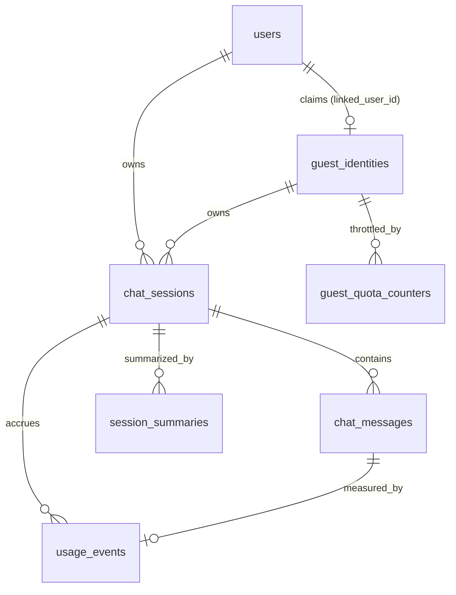

# Database Persistence Plan — PostgreSQL + Prisma + SQLAlchemy

Status: Planning only. No code changes. Implementation-ready design for adding PostgreSQL persistence (chat sessions, messages, summaries, usage/quota) across both interchangeable backends.

---

## 1) Objective, Scope, and Non-Goals

### 1.1 Objective

Introduce a single canonical PostgreSQL schema that persists users, guest identities, chat sessions, messages, session summaries, and token/usage accounting. Both backends (`backend-nodejs/` via Prisma, `backend-python/` via SQLAlchemy) must read and write this schema through one shared contract, with exactly one migration owner. The design must support guest and authenticated chat, session resume, long-session summarization, and quota/usage tracking.

### 1.2 In Scope

- Relational schema for users, guest identities, sessions, messages, summaries, usage events, and guest quota counters.
- One canonical migration owner (**Prisma**) plus a non-owning-ORM (SQLAlchemy) synchronization + drift-detection strategy.
- Repository/data-access layer design for both backends.
- Database health/readiness checks extending the existing `GET /api/health`.
- Docker Compose Postgres integration and local dev workflow.
- CI/CD integration using the reserved migration insertion points already present in `.github/workflows/cd-staging.yml` and `.github/workflows/cd-production.yml`.
- Incremental delivery plan and backlog.

### 1.3 Out of Scope (this phase)

- Full authentication (login, password/credential storage, OAuth exchange, sessions/JWT issuance).
- Financial billing, invoicing, or ledger-grade accounting.
- Event sourcing, CQRS, table partitioning, materialized views, browser fingerprinting SDKs.
- Kubernetes, Nx, Turborepo, or any new orchestration infrastructure.
- Frontend persistence UI beyond confirming existing client contracts remain compatible.

### 1.4 Constraints and Assumptions

- **Runtime topology (fixed):** both backends target the _same_ physical PostgreSQL database, but only one backend runs at any time. They are interchangeable, switched over as desired, never concurrent. Design for switch-over, not concurrent multi-backend access.
- **Exactly one** migration owner for shared tables. The other ORM never applies migrations to shared tables.
- Backward compatibility: existing `POST /api/chat`, `POST /api/chat/stream`, and `GET /api/health` request/response contracts must remain valid; persistence is additive.
- Production-aware secrets: no plain-text secrets committed; connection strings come from environment/GitHub Environment secrets.
- Incremental, low-risk delivery.

### 1.5 Current-State Repository Assessment

Observed (verified in repo):

- **No persistence exists today.** Neither backend has a database dependency: `backend-nodejs/package.json` has `express`, `openai`, `@google/genai`, `cors`, `dotenv`, `zod` (no Prisma); `backend-python/pyproject.toml` has `fastapi`, `uvicorn`, `openai`, `google-genai`, `pydantic-settings` (no SQLAlchemy/Alembic).
- **Config** is environment-driven and symmetric across backends: `backend-nodejs/src/core/config.ts` (Zod schema) and `backend-python/app/core/config.py` (Pydantic `Settings`). Neither defines a database URL yet.
- **Chat domain** is stateless request/response. Node: [backend-nodejs/src/schemas/chat.ts](../../backend-nodejs/src/schemas/chat.ts), [backend-nodejs/src/services/chatService.ts](../../backend-nodejs/src/services/chatService.ts). Python: [backend-python/app/schemas/chat.py](../../backend-python/app/schemas/chat.py), [backend-python/app/services/chat_service.py](../../backend-python/app/services/chat_service.py). Response IDs are generated in app code as `resp_<12 hex>`.
- **Providers do not currently return token usage.** Node `ProviderChunk` = `{ content, finishReason }`; `completeChat` returns a plain `string`. Python `ProviderChunk` = `{ content, finish_reason }`; `complete_chat` returns `str`. **Provider usage extraction is a proposed change** required for token accounting.
- **Health** endpoints return `{ status, provider, version }` in both backends and are consumed by Docker healthchecks and CD probes.
- **Docker Compose** ([docker-compose.yml](../../docker-compose.yml)) has `frontend`, `backend-nodejs` (profile `nodejs`), `backend-python` (profile `python`). **No `postgres` service exists.** Profiles already encode the "one backend at a time" model.
- **CI/CD** has four workflows and reserved, no-op DB migration jobs plus reserved secrets/variables documented in [CD_STAGING.md](../../CD_STAGING.md) and [CD_PRODUCTION.md](../../CD_PRODUCTION.md) (e.g., `STAGING_DATABASE_URL`, `STAGING_DB_MIGRATION_EXECUTOR_URL`, `STAGING_DB_MIGRATION_STRATEGY`). This plan fills those insertion points.
- **Frontend** already anticipates persistence: [frontend/src/types/chat.ts](../../frontend/src/types/chat.ts) declares `Message.id`, `ChatSession`, and `ChatSessionSummary` with a comment noting `id` is "unused server-side in MVP".

Proposed (new in this phase): Postgres service, Prisma schema/migrations in Node backend, SQLAlchemy models + Alembic (drift-check only) in Python backend, repository layers, DB health probes, provider usage extraction, and CI migration/drift gates.

---

## 2) Domain Model and Schema Design

All tables live in the default `public` schema of one shared database. Field lists below are the canonical contract; both ORMs must map to them exactly.

### 2.1 Conventions

- **Primary keys:** native PostgreSQL `uuid` columns. IDs are **generated in application code as UUIDv7** (time-ordered) before insert. Rationale in §2.11 and §13.
- **Timestamps:** `timestamptz`, UTC. Every table has `created_at`; mutable tables have `updated_at`.
- **Soft delete:** `deleted_at timestamptz NULL` on `users` and `chat_sessions` (rows filtered by `deleted_at IS NULL`). Messages/usage are immutable append-only and are not soft-deleted individually; they are removed via session cascade during hard-delete/retention jobs.
- **Enums:** implemented as PostgreSQL `text` columns with `CHECK` constraints (portable across Prisma and SQLAlchemy without native enum type coupling).

### 2.2 `users`

Minimal identity for ownership now; full auth deferred.

| Field              | Type                           | Req | Notes                                                                                                               |
| ------------------ | ------------------------------ | --- | ------------------------------------------------------------------------------------------------------------------- |
| `id`               | uuid PK                        | yes | App-generated UUIDv7. Ownership FK target.                                                                          |
| `email`            | citext UNIQUE NULL             | no  | Nullable now; natural key for future auth linkage. Unique when present.                                             |
| `display_name`     | text NULL                      | no  | Optional label for UI.                                                                                              |
| `auth_provider`    | text NULL                      | no  | Future linkage (`google`, `github`, `password`…). Nullable; CHECK against allowed set can be added when auth lands. |
| `external_auth_id` | text NULL                      | no  | Provider subject id for future linkage. Unique with `auth_provider` when set.                                       |
| `status`           | text NOT NULL DEFAULT `active` | yes | CHECK in (`active`,`disabled`). Enables ban/disable for abuse.                                                      |
| `created_at`       | timestamptz                    | yes | Audit.                                                                                                              |
| `updated_at`       | timestamptz                    | yes | Audit.                                                                                                              |
| `deleted_at`       | timestamptz NULL               | no  | Soft delete.                                                                                                        |

**Field justification (why now):** `id` is required as the ownership anchor for `chat_sessions.user_id`. `created_at/updated_at/deleted_at` are baseline audit/soft-delete. `status` supports abuse response (disable a user) without a full role system. `email`, `auth_provider`, `external_auth_id` are nullable placeholders so the auth phase can attach identities without a migration to the core ownership table (reduces future churn), and `email` doubles as a de-dup key. **Deferred (intentionally excluded now):** `password_hash`/credentials, `email_verified`, roles/permissions/RBAC, MFA, profile fields, billing, and any OAuth token storage — including these now would prematurely commit the auth model, which §1.3 and the prompt exclude.

Partial unique indexes: `UNIQUE (email) WHERE email IS NOT NULL`; `UNIQUE (auth_provider, external_auth_id) WHERE external_auth_id IS NOT NULL`.

### 2.3 `guest_identities`

Server-owned guest continuity token. **Never trust a raw client UUID alone** (§2.10, §13).

| Field             | Type                   | Req | Notes                                                               |
| ----------------- | ---------------------- | --- | ------------------------------------------------------------------- |
| `id`              | uuid PK                | yes | App-generated. Server-issued guest identity.                        |
| `token_hash`      | text NOT NULL UNIQUE   | yes | SHA-256 of the opaque token handed to the client (store hash only). |
| `first_seen_at`   | timestamptz            | yes | Continuity + retention.                                             |
| `last_seen_at`    | timestamptz            | yes | Continuity + abuse windows.                                         |
| `created_ip_hash` | text NULL              | no  | Hashed/truncated IP for abuse correlation (privacy-minimized).      |
| `linked_user_id`  | uuid FK→users(id) NULL | no  | Set when a guest later authenticates (claim/merge path).            |

The client stores the opaque token (cookie/localStorage); the server stores only `token_hash`. Guest continuity = present a valid token → resolve `guest_identities.id`.

### 2.4 `chat_sessions`

| Field             | Type                              | Req | Notes                                                       |
| ----------------- | --------------------------------- | --- | ----------------------------------------------------------- |
| `id`              | uuid PK                           | yes | App-generated UUIDv7. Matches frontend `ChatSession.id`.    |
| `user_id`         | uuid FK→users(id) NULL            | no  | Owner if authenticated.                                     |
| `guest_id`        | uuid FK→guest_identities(id) NULL | no  | Owner if guest.                                             |
| `title`           | text NULL                         | no  | Populates `ChatSessionSummary.title`.                       |
| `provider`        | text NOT NULL                     | yes | CHECK in (`openai`,`gemini`). Provider at session creation. |
| `model`           | text NOT NULL                     | yes | Model at session creation.                                  |
| `next_seq`        | integer NOT NULL DEFAULT 1        | yes | Monotonic per-session message counter (§2.11).              |
| `last_message_at` | timestamptz NULL                  | no  | Ordering session lists / previews.                          |
| `created_at`      | timestamptz                       | yes | Audit.                                                      |
| `updated_at`      | timestamptz                       | yes | Audit.                                                      |
| `deleted_at`      | timestamptz NULL                  | no  | Soft delete.                                                |

**Ownership invariant:** exactly one owner. `CHECK ((user_id IS NOT NULL) <> (guest_id IS NOT NULL))` (XOR). Enforced in DB.

### 2.5 `chat_messages`

Append-only; immutable after write.

| Field               | Type                                        | Req | Notes                                                                                                                                             |
| ------------------- | ------------------------------------------- | --- | ------------------------------------------------------------------------------------------------------------------------------------------------- |
| `id`                | uuid PK                                     | yes | App-generated UUIDv7. Matches frontend `Message.id`.                                                                                              |
| `session_id`        | uuid FK→chat_sessions(id) ON DELETE CASCADE | yes | Owning session.                                                                                                                                   |
| `seq`               | integer NOT NULL                            | yes | Per-session monotonic order key (§2.11).                                                                                                          |
| `role`              | text NOT NULL                               | yes | CHECK in (`system`,`user`,`assistant`).                                                                                                           |
| `content`           | text NOT NULL                               | yes | Message text.                                                                                                                                     |
| `status`            | text NOT NULL DEFAULT `complete`            | yes | CHECK in (`complete`,`stopped`,`error`,`interrupted`). Mirrors frontend `Message.status`; `streaming` is transient client-only and not persisted. |
| `finish_reason`     | text NULL                                   | no  | For assistant messages.                                                                                                                           |
| `client_message_id` | text NULL                                   | no  | Client-provided idempotency handle (§2.11).                                                                                                       |
| `created_at`        | timestamptz                                 | yes | Timestamp; not the primary ordering key.                                                                                                          |

Constraints/indexes: `UNIQUE (session_id, seq)`; `UNIQUE (session_id, client_message_id) WHERE client_message_id IS NOT NULL` (idempotent append); index `(session_id, seq)` for ordered reads.

### 2.6 `session_summaries`

Deterministic summarization boundary (§13).

| Field                | Type                                        | Req | Notes                                                         |
| -------------------- | ------------------------------------------- | --- | ------------------------------------------------------------- |
| `id`                 | uuid PK                                     | yes | App-generated.                                                |
| `session_id`         | uuid FK→chat_sessions(id) ON DELETE CASCADE | yes | Owning session.                                               |
| `version`            | integer NOT NULL                            | yes | Increments per new summary for the session.                   |
| `covers_through_seq` | integer NOT NULL                            | yes | Summary covers all messages with `seq <= covers_through_seq`. |
| `content`            | text NOT NULL                               | yes | Summary text.                                                 |
| `provider`           | text NOT NULL                               | yes | Provider that produced the summary.                           |
| `model`              | text NOT NULL                               | yes | Model that produced the summary.                              |
| `created_at`         | timestamptz                                 | yes | Audit.                                                        |

Constraints/indexes: `UNIQUE (session_id, version)`; index `(session_id, covers_through_seq DESC)` to fetch the latest valid summary quickly.

**Context assembly rule (deterministic):** latest summary for the session (max `version`) + all `chat_messages` with `seq > covers_through_seq`, ordered by `seq`. This combines exactly one summary with only subsequent messages, with no timestamp ambiguity.

### 2.7 `usage_events`

Append-only per-generation token/cost accounting. One row per assistant generation (and optionally per summary generation).

| Field                | Type                                        | Req | Notes                                                                           |
| -------------------- | ------------------------------------------- | --- | ------------------------------------------------------------------------------- |
| `id`                 | uuid PK                                     | yes | App-generated.                                                                  |
| `session_id`         | uuid FK→chat_sessions(id) ON DELETE CASCADE | yes | Aggregation by session.                                                         |
| `user_id`            | uuid FK→users(id) NULL                      | no  | Denormalized owner for user-level rollups.                                      |
| `guest_id`           | uuid FK→guest_identities(id) NULL           | no  | Denormalized owner for guest-level rollups.                                     |
| `message_id`         | uuid FK→chat_messages(id) NULL              | no  | Assistant message this usage belongs to (NULL for summary usage).               |
| `kind`               | text NOT NULL DEFAULT `chat`                | yes | CHECK in (`chat`,`summary`).                                                    |
| `provider`           | text NOT NULL                               | yes | Provider used.                                                                  |
| `model`              | text NOT NULL                               | yes | Model used.                                                                     |
| `prompt_tokens`      | integer NULL                                | no  | Provider-reported or estimated.                                                 |
| `completion_tokens`  | integer NULL                                | no  | Provider-reported or estimated.                                                 |
| `total_tokens`       | integer NULL                                | no  | Sum or provider-reported total.                                                 |
| `token_source`       | text NOT NULL                               | yes | CHECK in (`provider_reported`,`estimated`). Distinguishes exact vs approximate. |
| `estimated_cost_usd` | numeric(12,6) NULL                          | no  | Approximate cost (observability only, not billing).                             |
| `request_id`         | text NULL                                   | no  | Idempotency handle for the generation (§2.11).                                  |
| `created_at`         | timestamptz                                 | yes | Audit.                                                                          |

Constraints/indexes: `UNIQUE (request_id) WHERE request_id IS NOT NULL` (prevents double-counting on retry); indexes `(user_id, created_at)`, `(guest_id, created_at)`, `(session_id, created_at)`. Token/cost aggregation is done via queries in this phase — no rollup tables or materialized views (§1.3).

### 2.8 `guest_quota_counters`

Durable, windowed guest usage for quota enforcement (distinct from abuse rate limiting, §2.10).

| Field           | Type                                           | Req | Notes                                    |
| --------------- | ---------------------------------------------- | --- | ---------------------------------------- |
| `guest_id`      | uuid FK→guest_identities(id) ON DELETE CASCADE | yes | Part of composite PK.                    |
| `window_start`  | date NOT NULL                                  | yes | UTC daily bucket (part of composite PK). |
| `message_count` | integer NOT NULL DEFAULT 0                     | yes | Guest messages in window.                |
| `total_tokens`  | integer NOT NULL DEFAULT 0                     | yes | Optional token ceiling support.          |
| `updated_at`    | timestamptz                                    | yes | Audit.                                   |

Primary key: `(guest_id, window_start)`. Counter increments happen inside the append transaction via `INSERT ... ON CONFLICT (guest_id, window_start) DO UPDATE`, making the check-and-increment atomic under Postgres row locking. Quota limits (e.g., messages/day) are configuration, not schema.

### 2.9 Relationships (overview)

### 2.10 Guest continuity vs quota vs abuse (three distinct concerns)

- **Continuity:** server-issued opaque token → `guest_identities.token_hash`. Lets a guest resume sessions.
- **Durable quota accounting:** `guest_quota_counters` persists windowed counts for enforcement/analytics.
- **Abuse-resistant rate limiting:** application-layer limiter keyed on hashed IP (+ token) protecting the endpoint from burst/DoS, independent of the DB counter. A client-provided UUID alone is never sufficient for enforcement (§13). This phase implements DB quota + a simple per-IP limiter; heavier bot defenses are deferred.

### 2.11 ID generation, ordering, retries, idempotency

- **ID strategy (cross-ORM):** application-generated **UUIDv7** stored as native `uuid`. Both Prisma and SQLAlchemy set `id` explicitly before insert; the database column also carries a `DEFAULT gen_random_uuid()` as a safety net for any direct SQL insert. App-side generation guarantees identical behavior across both ORMs and avoids divergent DB defaults; UUIDv7 gives time-sortable keys that improve index locality and provide a stable secondary ordering signal.
- **Deterministic message ordering:** ordering is by `chat_messages.seq` (per-session integer), **not** by timestamp. `seq` is assigned inside the append transaction by reading/incrementing `chat_sessions.next_seq` under `SELECT ... FOR UPDATE` (or `UPDATE ... RETURNING next_seq`). This yields gap-free, collision-free ordering even under identical/near-identical `created_at` values.
- **Retry/idempotency:** appends carry a `client_message_id`; the `UNIQUE (session_id, client_message_id)` constraint makes a retried append a no-op instead of a duplicate. Generation usage carries a `request_id` with a unique constraint so retried generations do not double-count tokens/cost or corrupt `guest_quota_counters`. Summaries are versioned via `UNIQUE (session_id, version)`.

### 2.12 Retention and privacy

- Guest data: retention job hard-deletes `guest_identities` (and cascaded sessions/messages/usage) after an inactivity window (e.g., N days on `last_seen_at`). Policy value is configuration.
- PII minimization: store only hashed IPs and hashed guest tokens; no raw IPs, no fingerprint payloads.
- Message content is user data: covered by soft-delete on session + hard-delete/retention path; document in privacy notes.

---

## 3) Migration Strategy (Single Canonical Owner)

### 3.1 Canonical owner: **Prisma** (in `backend-nodejs/`)

Justification against repository evidence:

- Prisma Migrate provides a single declarative `schema.prisma` that serves as a human-readable, reviewable schema **contract** — ideal for a shared, cross-ORM source of truth.
- `prisma migrate diff` is purpose-built to compare a target (schema or migrations) against a live database and **emit a non-empty diff on drift**, which cleanly powers the CI drift gate for both backends.
- The Node backend is the reference implementation for shared contracts here (chat schema, response ID format), and Prisma's migration DX minimizes hand-written SQL.
- SQLAlchemy remains fully supported at runtime; it simply does not own migrations. Alembic is used in **check-only** mode for drift detection, not to mutate shared tables.

The other ORM (SQLAlchemy/Alembic) **must not apply migrations to shared tables.**

### 3.2 Non-owning ORM synchronization + drift detection

- SQLAlchemy models are hand-authored to mirror the canonical schema exactly (field names, types, constraints, indexes named to match).
- **Python drift gate (CI):** run Alembic `revision --autogenerate` against a database migrated by Prisma; a non-empty autogenerated diff = drift → fail. Alembic here is configured with `target_metadata` = SQLAlchemy models but is **never** used to `upgrade` shared tables.
- **Node/authoritative drift gate (CI):** `prisma migrate diff` between committed migrations and the schema, and between schema and a freshly migrated DB, must both be empty.
- Column naming is kept identical between Prisma and SQLAlchemy (snake_case) so autogenerate comparisons are apples-to-apples.

### 3.3 Baseline, naming, environments

- **Baseline:** since no tables exist today, the first Prisma migration is the greenfield baseline. Existing environments (staging/prod) currently have no DB; the baseline is applied on first rollout.
- **Naming/versioning:** Prisma default timestamped migration folders (`<timestamp>_<slug>`), slugs describing intent (e.g., `init_chat_persistence`). Alembic revisions (check-only) mirror intent in messages.
- **Environments:** local (Docker Compose Postgres), staging, production — same schema, separate `DATABASE_URL` values sourced from environment/secret stores. Matches reserved `STAGING_DATABASE_URL` / production equivalents in the CD contracts.

### 3.4 Roll-forward / rollback

- **Roll-forward preferred.** Use expand-contract for any later destructive change: add new structures, migrate/backfill, switch reads/writes, then contract in a later migration. Aligns with the reserved `STAGING_DB_MIGRATION_STRATEGY = expand-contract` variable.
- **Rollback:** greenfield baseline rollback = drop schema (only safe pre-traffic). Post-traffic, rollback is a forward compensating migration, never an in-place destructive down-migration.

### 3.5 Seed strategy

- Local/dev seed script (Node/Prisma-owned) inserts a demo user, a demo guest identity, one session with a few messages, and one summary — for manual testing and integration fixtures. Seeds never run in production.

---

## 4) Repository / Data Access Layer Design

### 4.1 Node.js (Prisma)

- **Client lifecycle:** a single `PrismaClient` instance created at startup and injected into services (constructor injection, mirroring how `ChatService` already receives `config`/provider overrides in [backend-nodejs/src/services/chatService.ts](../../backend-nodejs/src/services/chatService.ts)). Disconnect on shutdown. Do not instantiate per request.
- **Repository boundaries:** `UserRepository`, `GuestRepository`, `SessionRepository`, `MessageRepository`, `SummaryRepository`, `UsageRepository` — thin classes wrapping Prisma calls, exposing intent-named methods (e.g., `appendMessage`, `nextSeqForSession`). Services depend on repository interfaces, not on Prisma directly, preserving testability.
- **Transaction boundaries:** the append-message write flow (increment `next_seq`, insert message, upsert `guest_quota_counters`, insert `usage_events`) runs inside a single `prisma.$transaction`.
- **DI approach:** wire repositories in `createApp`/composition root ([backend-nodejs/src/app.ts](../../backend-nodejs/src/app.ts)) and pass into routers/services, matching the existing factory-style wiring.

### 4.2 Python (SQLAlchemy)

- **Session lifecycle:** async engine + `async_sessionmaker` created at startup; a FastAPI dependency yields a request-scoped `AsyncSession` (commit on success, rollback on exception, close always). Injected via `Depends`, consistent with the existing `Depends(get_settings)` pattern in [backend-python/app/routers/health.py](../../backend-python/app/routers/health.py).
- **Repository boundaries:** same six repositories as Node, mirrored names/methods, each accepting an `AsyncSession`.
- **Transaction boundaries:** append flow wrapped in one transaction (`async with session.begin()`), using `SELECT ... FOR UPDATE` on the session row for `next_seq`.
- **DI approach:** repositories constructed from the request session dependency; `ChatService` (see [backend-python/app/services/chat_service.py](../../backend-python/app/services/chat_service.py)) gains repository parameters.

### 4.3 Idempotency & consistency

- Enforced primarily by DB constraints (§2.11). Repositories translate unique-violation on `(session_id, client_message_id)` / `request_id` into "return existing" semantics rather than surfacing an error.

### 4.4 Error mapping

- Extend existing error models rather than inventing new envelopes:
  - Node: map Prisma errors to `AppError` in [backend-nodejs/src/core/errors.ts](../../backend-nodejs/src/core/errors.ts). Connectivity/timeouts → `internal_error` (500) or a new `db_unavailable` mapped to 503; unique-violation handled as idempotent success where applicable; not-found → 404 via a mapped code.
  - Python: map SQLAlchemy exceptions to the existing `ChatServiceError` hierarchy in [backend-python/app/services/chat_service.py](../../backend-python/app/services/chat_service.py). Keep the response envelope `{ error: { code, message } }` unchanged.
- Quota exceeded is a first-class, mapped error (HTTP 429) with a dedicated code (e.g., `quota_exceeded`).

### 4.5 Testability

- Node: extend the existing fake pattern ([backend-nodejs/tests/fakes/fakeProvider.ts](../../backend-nodejs/tests/fakes/fakeProvider.ts)) with in-memory repository fakes for unit tests; add integration tests against a real Postgres (Testcontainers or a CI service container) for constraint/transaction behavior.
- Python: extend [backend-python/tests/fakes.py](../../backend-python/tests/fakes.py) with repository fakes; integration tests against a Postgres service container validate the same invariants.
- Both: a shared "invariant test suite" (ordering, idempotency, XOR ownership, quota atomicity) run against each backend to prove contract parity.

---

## 5) Chat Lifecycle Flows (Write + Read)

Notation: "append flow" = the single transaction described in §4.

### 5.1 Start chat as guest (quota enforced)

1. Resolve guest: validate incoming opaque token → `token_hash` lookup. If absent/invalid, issue a new token and create `guest_identities` (return token to client).
2. Check quota: read `guest_quota_counters` for today's window; if `message_count >= limit`, reject with `quota_exceeded` (429) before any provider call.
3. Create `chat_sessions` (guest_id set, user_id null, XOR satisfied).
4. Append user message (seq assigned), call provider, append assistant message, record `usage_events`, increment `guest_quota_counters` — all coherent with the append flow.

- **Failure paths:** provider error/timeout → persist user message + an assistant message with `status=error` (and finish_reason if any); do **not** increment quota for a failed generation beyond the (already-counted) user message per policy; usage row omitted or marked estimated=0. DB unavailable → 503, nothing persisted (transaction rolled back).

### 5.2 Start chat as authenticated user

Same as guest but ownership uses `user_id`; quota counters are **not** applied (or a higher/authenticated policy applies). All other steps identical. (Auth resolution itself is out of scope; assume an upstream mechanism supplies a verified `user_id` when present.)

### 5.3 Append message to session

1. Load session (must exist, not soft-deleted, owned by caller). Ownership mismatch → 404 (avoid leaking existence).
2. Guest: quota check as in §5.1.
3. Append flow: `next_seq` under lock → insert user message (idempotent on `client_message_id`) → provider generation → insert assistant message → `usage_events` → counter upsert.

- **Failure paths:** duplicate `client_message_id` → return existing message (idempotent). Provider failure → assistant message `status=error`; partial stream captured as far as received.

### 5.4 Resume session

1. Resolve caller (user or guest token).
2. Fetch session by id filtered by ownership + `deleted_at IS NULL`.
3. Return messages ordered by `seq` (paginated by seq for long sessions). Powers `ChatSession`/`ChatSessionSummary` on the client.

- **Failure paths:** not found/not owned → 404. Guest token invalid → treated as new guest (no access to prior session).

### 5.5 Trigger and store long-session summary

1. Trigger condition (config): message count or token threshold since last summary.
2. Assemble input: prior latest summary (if any) + messages with `seq > covers_through_seq`.
3. Call provider to summarize; insert `session_summaries` with `version = prev+1` and `covers_through_seq = max(seq) at cut point`.
4. Record summary generation in `usage_events` (`kind=summary`, `request_id` for idempotency).

- **Failure paths:** provider failure → no summary row written; next request retries (idempotent via version/request_id). Concurrent trigger (not expected under single-backend, single-writer, but guarded) → `UNIQUE (session_id, version)` prevents duplicates.

### 5.6 Use summary for subsequent context assembly

1. Load latest summary (max `version`).
2. Load messages with `seq > covers_through_seq`, ordered by `seq`.
3. Compose provider input = summary + those messages (+ current user message). Deterministic by construction (§2.6).

- **Failure paths:** no summary yet → use full message history (bounded by config). Summary present but subsequent messages exceed budget → summarize again (§5.5) before generating.

### 5.7 Record and aggregate token usage during generation

1. On generation completion, read provider-reported usage if available; else compute an estimate. Set `token_source` accordingly.
2. Insert one `usage_events` row (idempotent on `request_id`).
3. Aggregation (per user/session/guest, by model/provider) is query-time over `usage_events` in this phase.

- **Failure paths:** provider omits usage → `token_source=estimated`, best-effort token counts, cost approximate. Retry → unique `request_id` prevents double counting.
- **Dependency:** requires provider adapters to surface usage. Today they do not (§1.5); adding usage extraction to `ProviderChunk`/completion returns in both backends is a prerequisite task (see backlog).

---

## 6) Health Checks and Observability

### 6.1 Readiness vs liveness

- **Liveness:** keep existing `GET /api/health` returning `{ status, provider, version }` — process-up only, no DB dependency (so a DB blip doesn't kill the container).
- **Readiness:** add `GET /api/health/ready` (both backends) that runs a lightweight `SELECT 1` with a short timeout and returns `{ status, db: 'ok'|'down' }`. Compose/CD use liveness for container health; readiness gates traffic/deploy verification where supported.

### 6.2 Metrics and logs

- Query latency (append flow, reads), DB error rate, connection-pool saturation.
- Quota denials (`quota_exceeded` count), summary generation outcomes (success/failure), token usage totals and estimated cost trends by provider/model.
- Structured logs already exist (Python uses `logging`; Node logs on startup) — extend with DB operation context and request/idempotency ids (never log secrets or full message content at info level).

### 6.3 Alerting (staging/prod)

- Alert on readiness failing, DB error-rate spikes, pool exhaustion, and abnormal quota-denial or cost trends. Wire into whatever host monitoring exists for the deploy targets referenced in the CD docs.

---

## 7) Dockerization and Local Dev Experience

### 7.1 Postgres service in `docker-compose.yml`

- Add a `postgres` service (official `postgres` image, pinned tag), with `POSTGRES_USER/PASSWORD/DB` from `.env`/defaults, a named volume for persistence, and a `pg_isready` healthcheck.
- Both `backend-nodejs` and `backend-python` gain `DATABASE_URL` env and `depends_on: postgres (condition: service_healthy)`. The existing `nodejs`/`python` profiles keep exactly one backend running at a time (matches the switch-over topology).

### 7.2 Backend service updates

- **Node:** add `prisma` + `@prisma/client` deps; generate client at build; run `prisma migrate deploy` as the **canonical migration step** before the app starts (entrypoint or a dedicated one-shot compose step). This is the only component that mutates shared tables.
- **Python:** add `sqlalchemy[asyncio]` + async driver (`asyncpg`) + `alembic` (check-only). Python backend **does not** run migrations against shared tables; on startup it may run a fast schema-validation check (reflection/`prisma migrate diff` result consumed in CI, not at runtime) and otherwise just connects.

### 7.3 Startup order & migration execution

1. `postgres` healthy → 2. canonical migrations applied by Prisma (`migrate deploy`) → 3. the selected backend starts and connects. When running the Python profile locally, migrations are still applied via the Prisma tooling (a `migrate` one-shot service or `make migrate` that invokes the Node/Prisma path), because Prisma is the sole owner.

### 7.4 Developer workflow commands

- Node: `npm run db:migrate` (deploy), `db:migrate:dev` (create), `db:reset`, `db:seed`, `db:studio` (optional).
- Python: `make db-validate` (Alembic autogenerate drift check — expects empty), `make db-revision-check`. Python has no `db:migrate` for shared tables by design.
- Compose: `docker compose --profile nodejs up` / `--profile python up`, plus a `migrate` one-shot.

### 7.5 Data volume & persistence

- Named Docker volume for Postgres data; documented reset command drops the volume for a clean slate. Volume is dev-only; staging/prod use managed Postgres.

---

## 8) CI/CD Integration Plan

Fills the reserved insertion points already defined in [CD_STAGING.md](../../CD_STAGING.md) and [CD_PRODUCTION.md](../../CD_PRODUCTION.md).

### 8.1 PR quality (`.github/workflows/pr-quality.yml`)

- Add a Postgres service container to backend jobs.
- **Node job:** `prisma migrate deploy` against the service DB, `prisma migrate diff` (schema vs migrations, schema vs DB) must be empty, then run tests.
- **Python job:** apply canonical schema via Prisma (using the Node migration artifacts / a small migrate step), then run Alembic autogenerate drift check (must be empty) and pytest.
- Preserve existing path filtering (frontend/backend-nodejs/backend-python) so DB jobs only run when relevant paths change.

### 8.2 Build/publish (`.github/workflows/build-publish-images.yml`)

- No schema changes to image tagging. Node image includes Prisma client generation. Python image includes SQLAlchemy/Alembic (Alembic for check-only).

### 8.3 Staging deploy (`.github/workflows/cd-staging.yml`)

- Replace the reserved `Reserved Staging DB Migration Stage (No-Op)` with a real migration stage that runs `prisma migrate deploy` against `STAGING_DATABASE_URL`, **before** application deployment (order already documented in the CD contract). Only the Prisma path runs migrations.
- Respect `STAGING_DB_MIGRATION_TIMEOUT_SECONDS` and `STAGING_DB_MIGRATION_STRATEGY` (expand-contract).

### 8.4 Production promote (`.github/workflows/cd-production.yml`)

- Same pattern with production secrets; migration stage gated behind the existing "successful staging deployment for source SHA" check. Keep the manual `workflow_dispatch` + SHA validation flow.

### 8.5 Secrets/config

- Use already-reserved secrets/variables: `STAGING_DATABASE_URL` (+ production equivalent), `*_DB_MIGRATION_EXECUTOR_URL`, `*_DB_MIGRATION_TOKEN`, `*_DB_MIGRATION_TIMEOUT_SECONDS`, `*_DB_MIGRATION_STRATEGY`. No connection strings in the repo.

### 8.6 Gating, rollback, path filtering

- Deployment gated on migration success + health/readiness probe. Rollback = forward compensating migration (never in-place destructive down). Path filtering ensures DB checks/migrations trigger only for relevant changes.

---

## 9) Security and Compliance Considerations

- **PII minimization:** store hashed guest tokens (`token_hash`) and hashed/truncated IPs only; no raw IP, no fingerprint payloads. `users.email` nullable and only populated when auth lands.
- **Encryption:** TLS for DB connections in staging/prod (`sslmode=require`); rely on managed-Postgres at-rest encryption. Local dev may skip TLS.
- **Access control:** ownership enforced in DB (`chat_sessions` XOR) and at API layer (session fetch filtered by owner; mismatches → 404). Quota checks precede provider calls.
- **Abuse/rate limiting:** DB quota counters + app-layer per-IP limiter for guests (§2.10); `users.status=disabled` supports ban response.
- **Auditability:** `created_at`/`updated_at` everywhere; append-only `chat_messages` and `usage_events` provide a tamper-evident-ish trail. `usage_events` unique `request_id` protects integrity of quota/usage numbers.
- **Usage integrity (not billing):** idempotency keys prevent inflation/deflation of usage; token_source distinguishes exact vs estimated; explicitly non-financial.

---

## 10) Incremental Delivery Plan

### Phase 1 — Schema contract + Postgres in Compose

- **Objective:** Establish the canonical schema and local Postgres.
- **Tasks:** author `schema.prisma` with all tables/constraints/indexes; create baseline Prisma migration; add `postgres` service + volume + healthcheck to [docker-compose.yml](../../docker-compose.yml); add `DATABASE_URL` to both backend configs ([config.ts](../../backend-nodejs/src/core/config.ts), [config.py](../../backend-python/app/core/config.py)); add seed script.
- **Deliverables:** running Postgres, applied baseline schema, seed data.
- **Repository impact:** new `backend-nodejs/prisma/` (schema + migrations + seed); changed `docker-compose.yml`, both config files, both `.env.example`, `backend-nodejs/package.json`.
- **Acceptance:** `prisma migrate deploy` creates all tables; `prisma migrate diff` empty; compose up brings Postgres healthy.
- **Validation:** connect and inspect tables/constraints; run seed.
- **Risk:** Low. Mitigation: greenfield, no existing data.

### Phase 2 — SQLAlchemy models + drift gate

- **Objective:** Non-owning ORM mirrors the contract; drift detection works.
- **Tasks:** add SQLAlchemy models mirroring the schema; configure Alembic in check-only mode; add `make db-validate`.
- **Deliverables:** SQLAlchemy models, drift-check command.
- **Repository impact:** new `backend-python/app/db/` (models, engine/session), `backend-python/alembic/` (config + env, no shared-table upgrades); changed `pyproject.toml`, `Makefile`.
- **Acceptance:** Alembic autogenerate against Prisma-migrated DB yields empty diff.
- **Validation:** intentionally alter a model → drift check fails (proves the gate).
- **Risk:** Low–Med. Mitigation: identical snake_case naming.

### Phase 3 — Repository layer + provider usage extraction

- **Objective:** Data access + token capture in both backends.
- **Tasks:** implement six repositories per backend; add DB client/session lifecycle + DI; extend providers to surface prompt/completion/total tokens (Node `ProviderChunk`/`completeChat`, Python `ProviderChunk`/`complete_chat`).
- **Deliverables:** repositories, DB lifecycle wiring, usage-aware providers.
- **Repository impact:** new repo modules; changed `app.ts`/`server.ts`, `main.py`, provider files, `chatService.ts`/`chat_service.py`.
- **Acceptance:** unit tests with repo fakes pass; usage populated (provider_reported when available).
- **Validation:** integration tests hit real Postgres for constraints/transactions.
- **Risk:** Med. Mitigation: repository interfaces + fakes.

### Phase 4 — Chat lifecycle persistence (guest + auth)

- **Objective:** Persist sessions/messages/usage; enforce guest quota; resume.
- **Tasks:** implement start/append/resume flows, guest token issuance, quota checks, idempotency; keep existing API contracts backward-compatible.
- **Deliverables:** persistent chat with quota + resume.
- **Repository impact:** changed chat routers/services in both backends; new health readiness route.
- **Acceptance:** guest quota enforced; retries idempotent; resume returns ordered history.
- **Validation:** shared invariant test suite passes on both backends.
- **Risk:** Med–High. Mitigation: transaction boundaries + DB constraints; feature-flag persistence.

### Phase 5 — Summarization + health/observability

- **Objective:** Long-session summaries + DB observability.
- **Tasks:** implement summary trigger/store/use per §5.5–5.6; add readiness probe + metrics/logs.
- **Deliverables:** summarization, readiness endpoint, metrics.
- **Repository impact:** changed chat services, health routers.
- **Acceptance:** deterministic context assembly; readiness reflects DB state.
- **Risk:** Med. Mitigation: versioned summaries + idempotency.

### Phase 6 — CI/CD migration + drift gates

- **Objective:** Automate migrations and drift detection.
- **Tasks:** add Postgres service to PR jobs; wire Prisma `migrate deploy` + drift checks; wire Alembic autogenerate gate; replace reserved no-op migration stages in staging/prod with real Prisma migration steps.
- **Deliverables:** CI drift gates, CD migration stages.
- **Repository impact:** changed all four `.github/workflows/*.yml`.
- **Acceptance:** PR fails on drift; staging/prod apply migrations before deploy.
- **Risk:** Med. Mitigation: gate deploy on migration success + readiness.

---

## 11) Risks, Trade-offs, and Open Questions

### 11.1 Top risks & mitigations

- **Schema drift between Prisma and SQLAlchemy.** Mitigation: single owner (Prisma) + CI autogenerate drift gate + identical naming.
- **Quota/usage corruption on retries.** Mitigation: DB unique constraints on `client_message_id`/`request_id`, atomic counter upsert.
- **Provider usage unavailable.** Mitigation: `token_source=estimated` fallback; usage remains best-effort, non-billing.
- **Migration ownership confusion (accidental Alembic upgrade of shared tables).** Mitigation: Alembic configured check-only; docs + CI enforce Prisma-only application.

### 11.2 Trade-offs

- **Prisma as owner** vs Alembic: chosen for the declarative contract artifact and built-in `migrate diff`; cost is that Python devs must hand-mirror models (accepted; validated by CI).
- **App-generated UUIDv7** vs DB `gen_random_uuid()`: chosen for cross-ORM determinism and index locality; cost is an app-side UUIDv7 utility in each backend (DB default kept as safety net).
- **Query-time usage aggregation** vs rollup tables: chosen for simplicity per §1.3; revisit at scale.

### 11.3 Open questions

- Guest quota limits (messages/day, token ceiling) and window size — product decision.
- Guest data retention window — product/privacy decision.
- Summarization trigger thresholds and whether summaries use the same or a cheaper model.
- Authenticated quota policy (unlimited vs tiered) once auth lands.
- Managed Postgres provider for staging/prod (aligns with the Railway/Render/Vercel targets referenced in the CD docs).

---

## 12) Ready-to-Start Backlog (first 10)

| #   | Task                                                                                         | Priority | Owner profile | Est | Definition of done                                            | Prereqs     |
| --- | -------------------------------------------------------------------------------------------- | -------- | ------------- | --- | ------------------------------------------------------------- | ----------- |
| 1   | Author canonical `schema.prisma` (all §2 tables/constraints/indexes)                         | P0       | backend       | M   | Schema compiles; review approved                              | §2 sign-off |
| 2   | Create baseline Prisma migration + apply locally                                             | P0       | backend       | S   | `migrate deploy` creates all tables; `migrate diff` empty     | 1           |
| 3   | Add `postgres` service + volume + healthcheck to compose; add `DATABASE_URL` to both configs | P0       | devops        | S   | `compose up` → Postgres healthy; backends read `DATABASE_URL` | 1           |
| 4   | Author SQLAlchemy models mirroring schema                                                    | P0       | backend       | M   | Models import cleanly; names match                            | 1           |
| 5   | Configure Alembic check-only + `make db-validate` drift gate                                 | P0       | backend       | M   | Autogenerate empty against Prisma DB; tampering fails gate    | 2,4         |
| 6   | Add UUIDv7 generation utility (both backends)                                                | P1       | fullstack     | S   | Deterministic UUIDv7 ids set app-side                         | 1           |
| 7   | Implement repository layer + DB lifecycle/DI (both backends)                                 | P1       | backend       | L   | Repos + fakes; unit tests green                               | 2,4         |
| 8   | Extend providers to surface token usage (both backends)                                      | P1       | backend       | M   | `usage_events` populated `provider_reported` when available   | 7           |
| 9   | Implement guest start/append + quota + idempotency                                           | P1       | backend       | L   | Quota enforced; retries idempotent; invariants pass           | 7           |
| 10  | Wire Postgres service + migration/drift gates into `pr-quality.yml`                          | P1       | devops        | M   | PR fails on drift; tests run against real Postgres            | 2,5         |

---

## 13) Key Architecture Decisions

### 13.1 Canonical schema owner = Prisma

- **Decision:** Prisma (Node backend) owns migrations for all shared tables; SQLAlchemy/Alembic is check-only.
- **Rationale:** declarative `schema.prisma` is a clean shared contract; `prisma migrate diff` powers drift detection; Node is the reference implementation.
- **Rejected alternatives:** Alembic as owner (no single declarative contract artifact; more hand-written SQL); dual ownership (explicitly forbidden — guarantees conflicts).
- **Reconsider when:** the Python backend becomes the long-term primary and Node is retired.

### 13.2 Runtime topology = single physical DB, one backend at a time

- **Decision:** design for switch-over; no concurrent multi-backend writers.
- **Rationale:** matches the fixed product constraint and existing compose profiles.
- **Rejected alternatives:** concurrent multi-writer design (unneeded complexity: distributed locking, dual-write reconciliation).
- **Reconsider when:** concurrent serving becomes a requirement.

### 13.3 Guest quota enforcement = layered (server token + DB counter + IP limiter)

- **Decision:** server-issued hashed guest token for continuity, durable `guest_quota_counters` for accounting, app-layer per-IP limiter for abuse.
- **Rationale:** a client UUID alone is trivially forgeable; enforcement needs server-controlled state.
- **Rejected alternatives:** trusting a client anonymous UUID (insecure); heavy fingerprinting (excluded by scope/privacy).
- **Reconsider when:** guest abuse proves the simple IP limiter insufficient.

### 13.4 Summarization boundary = `covers_through_seq`

- **Decision:** each summary records the max message `seq` it covers; context = latest summary + messages with `seq >` that value.
- **Rationale:** deterministic, timestamp-independent context assembly; versioned and idempotent.
- **Rejected alternatives:** timestamp cutoffs (ambiguous under collisions); implicit "last N messages" (non-deterministic with summaries).
- **Reconsider when:** multi-summary hierarchical compression is needed.

### 13.5 Idempotency = client key + unique constraints + per-session seq counter

- **Decision:** appends keyed by `(session_id, client_message_id)`, generations by `request_id`, ordering by a locked `next_seq` counter.
- **Rationale:** prevents duplicate messages and double-counted usage/quota under retries; gap-free ordering under timestamp collisions.
- **Rejected alternatives:** timestamp-based ordering + dedup (fragile); no idempotency (corrupts quotas/usage).
- **Reconsider when:** high-concurrency multi-writer requires distributed sequence generation.
