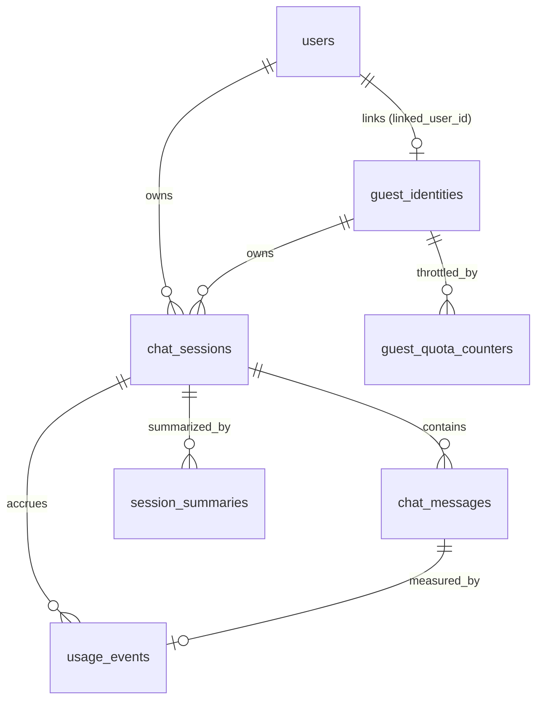

# Database Persistence Plan — PostgreSQL + SQLAlchemy + Alembic (Python MVP)

Status: Planning only. No code changes. Implementation-ready design for adding PostgreSQL persistence (users, guest identities, chat sessions, messages, summaries, usage metrics, guest quota) to the FastAPI (`backend-python/`) backend for the finalized Python-only MVP.

---

## 1) Objective, Scope, and Non-Goals

### 1.1 Objective

Add PostgreSQL persistence to the FastAPI backend so the MVP supports: Google-authenticated users, guest/anonymous users with a limited quota, multiple chat sessions per caller, persistent ordered chat messages, basic provider usage/token metrics, and long-session summarization. A single Python ORM (SQLAlchemy 2.x) plus a single migration system (Alembic) own the schema. There is no second backend, no second ORM, and no cross-ORM parity in the MVP.

### 1.2 In Scope

- PostgreSQL persistence for the FastAPI backend.
- Relational schema for users, guest identities, chat sessions, chat messages, session summaries, usage events, and guest quota counters.
- Google OAuth 2.0 login only.
- Backend verification of Google ID tokens (`google-auth`).
- App-issued signed JWT for authenticating subsequent API requests.
- FastAPI auth dependency/middleware that resolves the caller as either an authenticated `user_id` or an anonymous `guest_id`.
- Guest identity issuance and continuity.
- Limited guest quota.
- Multiple chat sessions for both authenticated and guest callers.
- Persistent, ordered chat messages.
- Basic provider usage/token accounting for both guest and authenticated sessions.
- Long-session summarization for both guest and authenticated sessions.
- Guest-to-authenticated-user linking when a guest later signs in with Google (link only, no ownership migration).
- One authoritative Python ORM/migration system (SQLAlchemy + Alembic).
- Database health/readiness check extending the existing `GET /api/health`.
- Docker Compose Postgres integration and local dev workflow.
- CI/CD integration using the reserved migration insertion points already present in `.github/workflows/cd-staging.yml` and `.github/workflows/cd-production.yml`.
- Incremental delivery plan and backlog.

### 1.3 Out of Scope (MVP)

- Node.js backend implementation.
- Node.js persistence layer.
- Prisma.
- Dual-ORM schema parity.
- Cross-ORM drift detection.
- Cross-backend feature parity.
- Non-Google authentication providers.
- Email/password authentication.
- GitHub or other social authentication.
- Generalized multi-provider auth architecture.
- Password storage or password-reset flows.
- A database-backed application `sessions` table (the MVP uses a stateless signed JWT).
- Refresh-token rotation / reuse-detection infrastructure.
- On-demand token revocation infrastructure.
- Sophisticated guest-to-user data migration or merge workflows.
- Billing-grade usage accounting, pricing tables, or financial reconciliation.
- Background workers or queues solely for summarization.
- Hierarchical or multi-level summarization.
- Automated retention / hard-delete jobs.
- Generalized repository frameworks (generic CRUD base classes, unit-of-work frameworks, one-repository-per-table symmetry).
- Financial billing, invoicing, or ledger-grade accounting.
- Event sourcing, CQRS, table partitioning, materialized views, browser fingerprinting SDKs.
- Kubernetes, Nx, Turborepo, or any new orchestration infrastructure.
- Infrastructure added only for hypothetical scale or future requirements.

### 1.4 Constraints and Assumptions

- **Runtime topology (fixed):** one FastAPI backend against one PostgreSQL database. There is no concurrent second backend and no multi-writer design.
- **Single ORM / single migration owner:** SQLAlchemy models and Alembic migrations are the only persistence implementation. There is no second schema representation.
- Backward compatibility: existing `POST /api/chat`, `POST /api/chat/stream`, and `GET /api/health` request/response contracts remain valid; persistence is additive.
- Production-aware secrets: no plain-text secrets committed; connection strings and OAuth/JWT secrets come from environment/GitHub Environment secrets.
- Incremental, low-risk delivery.

### 1.5 Current-State Repository Assessment

Observed (verified in repo):

- **No persistence exists today.** `backend-python/pyproject.toml` has `fastapi`, `uvicorn`, `openai`, `google-genai`, `pydantic-settings` — no SQLAlchemy/Alembic and no Postgres driver.
- **No authentication exists today.** There is no auth dependency, JWT issuance, or Google verification in the FastAPI app.
- **Config** is environment-driven via Pydantic `Settings` in [backend-python/app/core/config.py](../../backend-python/app/core/config.py). It does not define a database URL, JWT secret, or Google client id yet.
- **Chat domain** is stateless request/response: [backend-python/app/schemas/chat.py](../../backend-python/app/schemas/chat.py), [backend-python/app/services/chat_service.py](../../backend-python/app/services/chat_service.py). Response IDs are generated in app code as `resp_<12 hex>`.
- **Providers do not currently return token usage.** `ProviderChunk` = `{ content, finish_reason }` and `complete_chat` returns `str` ([backend-python/app/providers/base.py](../../backend-python/app/providers/base.py)). **Provider usage extraction is a proposed change** required for token accounting.
- **Health** endpoint returns `{ status, provider, version }` ([backend-python/app/routers/health.py](../../backend-python/app/routers/health.py)) and is consumed by the Docker healthcheck and CD probes; it uses the existing `Depends(get_settings)` pattern.
- **Docker Compose** ([docker-compose.yml](../../docker-compose.yml)) has `frontend`, `backend-nodejs` (profile `nodejs`), `backend-python` (profile `python`). **No `postgres` service exists.** Only the `backend-python` service is wired for persistence in this MVP.
- **CI/CD** has four workflows and reserved, no-op DB migration jobs plus reserved secrets/variables documented in [CD_STAGING.md](../../CD_STAGING.md) and [CD_PRODUCTION.md](../../CD_PRODUCTION.md) (e.g., `STAGING_DATABASE_URL`, `STAGING_DB_MIGRATION_TIMEOUT_SECONDS`, `STAGING_DB_MIGRATION_STRATEGY`). This plan fills those insertion points with Alembic migrations.
- **Frontend** already anticipates persistence: [frontend/src/types/chat.ts](../../frontend/src/types/chat.ts) declares `Message.id`, `ChatSession`, and `ChatSessionSummary`. The current `ChatRequest` payload does **not** carry a client-supplied idempotency key.

Proposed (new in this phase): Postgres service in Compose, SQLAlchemy models + Alembic migrations in the Python backend, Google ID-token verification + app JWT issuance + FastAPI caller-resolution dependency, use-case-driven persistence components, DB health/readiness probe, provider usage extraction, and CI migration gates.

---

## 2) Domain Model and Schema Design

All tables live in the default `public` schema of the single database. Field lists below are the canonical contract for the SQLAlchemy models and Alembic migrations.

**Provider/model ownership rule:** `chat_sessions` is provider/model agnostic. Provider and model are recorded per assistant response in `chat_messages` so a single session can include multiple providers/models over time.

### 2.1 Conventions

- **Primary keys:** native PostgreSQL `uuid` columns with a database `DEFAULT gen_random_uuid()`; SQLAlchemy maps them directly. Time-sortable UUIDv7 is not required because message ordering uses an explicit per-session sequence (§2.11).
- **Timestamps:** `timestamptz`, UTC. Every table has `created_at`; mutable tables have `updated_at`.
- **Enums:** implemented as PostgreSQL `text` columns with `CHECK` constraints (simple and portable; no native enum type coupling).
- **No soft-delete columns in the MVP.** Session/message deletion is not a listed MVP capability; retention/soft-delete is deferred (§15).

### 2.2 `users`

Represents only real Google-authenticated users. Guests never appear here — they live in `guest_identities`. Every `users` row is created only after a successful Google verification.

| Field              | Type                           | Req | Notes                                            |
| ------------------ | ------------------------------ | --- | ------------------------------------------------ |
| `id`               | uuid PK                        | yes | Ownership FK target for `chat_sessions.user_id`. |
| `email`            | text NULL                      | no  | From the verified Google profile.                |
| `display_name`     | text NULL                      | no  | From the verified Google `name`.                 |
| `picture_url`      | text NULL                      | no  | From the verified Google `picture`.              |
| `auth_provider`    | text NOT NULL DEFAULT `google` | yes | Every MVP row is a Google identity.              |
| `external_auth_id` | text NOT NULL                  | yes | Google `sub` claim; stable per-user identifier.  |
| `created_at`       | timestamptz                    | yes | Audit.                                           |
| `updated_at`       | timestamptz                    | yes | Audit.                                           |

Constraints: `UNIQUE (auth_provider, external_auth_id)` — the Google identity key used to resolve or create the user.

**Excluded (not part of the MVP):** `password_hash`, `email_verified`, generic credential fields, and nullable placeholders for future auth providers. `auth_provider`/`external_auth_id` are the concrete Google identity, not future-provider placeholders. No generalized authentication-provider abstraction is introduced beyond safely storing the current Google identity.

### 2.3 `guest_identities`

Server-owned guest continuity token. Guest chat is a deliberate MVP product tier (anonymous trial with a quota), **not** a workaround for missing auth. **Never trust a raw client UUID alone** (§2.10, §14).

| Field             | Type                   | Req | Notes                                                               |
| ----------------- | ---------------------- | --- | ------------------------------------------------------------------- |
| `id`              | uuid PK                | yes | Server-issued guest identity.                                       |
| `token_hash`      | text NOT NULL UNIQUE   | yes | SHA-256 of the opaque token handed to the client (store hash only). |
| `first_seen_at`   | timestamptz            | yes | Continuity.                                                         |
| `last_seen_at`    | timestamptz            | yes | Continuity.                                                         |
| `created_ip_hash` | text NULL              | no  | Optional hashed/truncated IP for basic abuse correlation.           |
| `linked_user_id`  | uuid FK→users(id) NULL | no  | Set when this guest later signs in with Google (link only, §7).     |

The client stores the opaque token (cookie/localStorage); the server stores only `token_hash`. Guest continuity = present a valid token → resolve `guest_identities.id`.

### 2.4 `chat_sessions`

| Field             | Type                              | Req | Notes                                          |
| ----------------- | --------------------------------- | --- | ---------------------------------------------- |
| `id`              | uuid PK                           | yes | Matches frontend `ChatSession.id`.             |
| `user_id`         | uuid FK→users(id) NULL            | no  | Owner if authenticated.                        |
| `guest_id`        | uuid FK→guest_identities(id) NULL | no  | Owner if guest.                                |
| `title`           | text NULL                         | no  | Populates `ChatSessionSummary.title`.          |
| `next_seq`        | integer NOT NULL DEFAULT 1        | yes | Monotonic per-session message counter (§2.11). |
| `last_message_at` | timestamptz NULL                  | no  | Ordering session lists / previews.             |
| `created_at`      | timestamptz                       | yes | Audit.                                         |
| `updated_at`      | timestamptz                       | yes | Audit.                                         |

**Ownership invariant:** exactly one owner. `CHECK ((user_id IS NOT NULL) <> (guest_id IS NOT NULL))` (XOR). Enforced in DB. The FastAPI caller-resolution dependency (§3) supplies the appropriate identity to the shared chat flow.

**Provider/model invariant:** session rows intentionally do not store provider/model because provider/model choice can vary across assistant turns in the same session.

### 2.5 `chat_messages`

Append-only; immutable after write.

| Field               | Type                                        | Req | Notes                                                                                                                                             |
| ------------------- | ------------------------------------------- | --- | ------------------------------------------------------------------------------------------------------------------------------------------------- |
| `id`                | uuid PK                                     | yes | Matches frontend `Message.id`.                                                                                                                    |
| `session_id`        | uuid FK→chat_sessions(id) ON DELETE CASCADE | yes | Owning session.                                                                                                                                   |
| `seq`               | integer NOT NULL                            | yes | Per-session monotonic order key (§2.11).                                                                                                          |
| `role`              | text NOT NULL                               | yes | CHECK in (`system`,`user`,`assistant`).                                                                                                           |
| `content`           | text NOT NULL                               | yes | Message text.                                                                                                                                     |
| `provider`          | text NULL                                   | no  | Provider that generated this message; required for `assistant`, NULL for `user`/`system`.                                                         |
| `model`             | text NULL                                   | no  | Model that generated this message; required for `assistant`, NULL for `user`/`system`.                                                            |
| `status`            | text NOT NULL DEFAULT `complete`            | yes | CHECK in (`complete`,`stopped`,`error`,`interrupted`). Mirrors frontend `Message.status`; `streaming` is transient client-only and not persisted. |
| `finish_reason`     | text NULL                                   | no  | For assistant messages.                                                                                                                           |
| `client_message_id` | text NULL                                   | no  | Optional client-provided idempotency handle (§2.11).                                                                                              |
| `created_at`        | timestamptz                                 | yes | Timestamp; not the primary ordering key.                                                                                                          |

Constraints/indexes: `UNIQUE (session_id, seq)`; `UNIQUE (session_id, client_message_id) WHERE client_message_id IS NOT NULL` (idempotent append when a key is supplied); index `(session_id, seq)` for ordered reads.

Role/provider/model application invariant:

- `role = assistant` → `provider IS NOT NULL` and `model IS NOT NULL`
- `role IN ('user','system')` → `provider IS NULL` and `model IS NULL`

This invariant can be enforced in app logic first and upgraded to an explicit DB `CHECK` constraint later.

### 2.6 `session_summaries`

Deterministic summarization boundary (§14).

| Field                | Type                                        | Req | Notes                                                         |
| -------------------- | ------------------------------------------- | --- | ------------------------------------------------------------- |
| `id`                 | uuid PK                                     | yes | Primary key.                                                  |
| `session_id`         | uuid FK→chat_sessions(id) ON DELETE CASCADE | yes | Owning session.                                               |
| `version`            | integer NOT NULL                            | yes | Increments per new summary for the session.                   |
| `covers_through_seq` | integer NOT NULL                            | yes | Summary covers all messages with `seq <= covers_through_seq`. |
| `content`            | text NOT NULL                               | yes | Summary text.                                                 |
| `provider`           | text NOT NULL                               | yes | Provider that produced the summary.                           |
| `model`              | text NOT NULL                               | yes | Model that produced the summary.                              |
| `created_at`         | timestamptz                                 | yes | Audit.                                                        |

Constraints/indexes: `UNIQUE (session_id, version)`; index `(session_id, covers_through_seq DESC)` to fetch the latest valid summary quickly.

**Context assembly rule (deterministic):** latest summary for the session (max `version`) + all `chat_messages` with `seq > covers_through_seq`, ordered by `seq`. This combines exactly one summary with only subsequent messages, with no timestamp ambiguity. Applies equally to guest and authenticated sessions.

### 2.7 `usage_events`

Append-only, lightweight product/engineering observability of provider token usage — **not** a billing ledger. One row per assistant generation (and optionally per summary generation). Recorded uniformly for guest and authenticated sessions. For chat generations, provider/model values should align with the corresponding assistant `chat_messages` row.

| Field               | Type                                        | Req | Notes                                                                           |
| ------------------- | ------------------------------------------- | --- | ------------------------------------------------------------------------------- |
| `id`                | uuid PK                                     | yes | Primary key.                                                                    |
| `session_id`        | uuid FK→chat_sessions(id) ON DELETE CASCADE | yes | Aggregation by session.                                                         |
| `user_id`           | uuid FK→users(id) NULL                      | no  | Denormalized owner for simple user-level rollups.                               |
| `guest_id`          | uuid FK→guest_identities(id) NULL           | no  | Denormalized owner for simple guest-level rollups.                              |
| `message_id`        | uuid FK→chat_messages(id) NULL              | no  | Assistant message this usage belongs to (NULL for summary usage).               |
| `kind`              | text NOT NULL DEFAULT `chat`                | yes | CHECK in (`chat`,`summary`).                                                    |
| `provider`          | text NOT NULL                               | yes | Provider used.                                                                  |
| `model`             | text NOT NULL                               | yes | Model used.                                                                     |
| `prompt_tokens`     | integer NULL                                | no  | Provider-reported or estimated (input tokens).                                  |
| `completion_tokens` | integer NULL                                | no  | Provider-reported or estimated (output tokens).                                 |
| `total_tokens`      | integer NULL                                | no  | Sum or provider-reported total.                                                 |
| `token_source`      | text NOT NULL                               | yes | CHECK in (`provider_reported`,`estimated`). Distinguishes exact vs approximate. |
| `latency_ms`        | integer NULL                                | no  | Optional, recorded only if naturally available.                                 |
| `request_id`        | text NULL                                   | no  | Optional idempotency handle for the generation (§2.11).                         |
| `created_at`        | timestamptz                                 | yes | Timestamp.                                                                      |

Constraints/indexes: `UNIQUE (request_id) WHERE request_id IS NOT NULL` (prevents double-counting on retry); indexes `(user_id, created_at)`, `(guest_id, created_at)`, `(session_id, created_at)`. Aggregation is done via queries in this phase — no rollup tables, materialized views, pricing tables, or cost columns.

### 2.8 `guest_quota_counters`

Durable, windowed guest usage for quota enforcement (distinct from any application-wide safety/provider rate limits, §2.10). Applies to guests only; authenticated users are not governed by this table.

| Field           | Type                                           | Req | Notes                                    |
| --------------- | ---------------------------------------------- | --- | ---------------------------------------- |
| `guest_id`      | uuid FK→guest_identities(id) ON DELETE CASCADE | yes | Part of composite PK.                    |
| `window_start`  | date NOT NULL                                  | yes | UTC daily bucket (part of composite PK). |
| `message_count` | integer NOT NULL DEFAULT 0                     | yes | Guest messages in window.                |
| `total_tokens`  | integer NOT NULL DEFAULT 0                     | yes | Optional token ceiling support.          |
| `updated_at`    | timestamptz                                    | yes | Audit.                                   |

Primary key: `(guest_id, window_start)`. Counter increments happen inside the append transaction via `INSERT ... ON CONFLICT (guest_id, window_start) DO UPDATE`, making the check-and-increment atomic under Postgres row locking. Quota limits (e.g., messages/day) are configuration, not schema.

### 2.9 Relationships (overview)

### 2.10 Guest continuity vs quota vs safety limits (three distinct concerns)

- **Continuity:** server-issued opaque token → `guest_identities.token_hash`. Lets a guest resume sessions.
- **Durable quota accounting:** `guest_quota_counters` persists windowed guest counts for enforcement. Guests only.
- **Application-wide safety / provider limits:** any global request or provider-level rate limits exist independently and are not part of the guest quota model. This phase implements the DB quota; a per-IP abuse limiter is optional and not required for the MVP.

### 2.11 ID generation, ordering, retries, idempotency

- **ID strategy:** native PostgreSQL `uuid` with `DEFAULT gen_random_uuid()`; SQLAlchemy maps the columns. No app-side UUIDv7 utility is needed because ordering does not depend on the key being time-sortable.
- **Deterministic message ordering:** ordering is by `chat_messages.seq` (per-session integer), **not** by timestamp. `seq` is assigned inside the append transaction by reading/incrementing `chat_sessions.next_seq` under `SELECT ... FOR UPDATE` (or `UPDATE ... RETURNING next_seq`). This yields gap-free, collision-free ordering even under identical/near-identical `created_at` values.
- **Retry/idempotency:** when the client supplies a `client_message_id`, the `UNIQUE (session_id, client_message_id)` constraint makes a retried append a no-op instead of a duplicate. Because the current `ChatRequest` payload does not include such a key, idempotent-append is enabled only when/if the frontend begins sending one; the column is nullable so behavior is unaffected until then. Generation usage may carry an optional `request_id` with a unique constraint so retried generations do not double-count tokens. Summaries are versioned via `UNIQUE (session_id, version)`.

### 2.12 Privacy notes

- PII minimization: store only a hashed guest token (`token_hash`) and, if used, a hashed/truncated IP; no raw IPs and no fingerprint payloads.
- Message content is user data. Automated retention/hard-delete is deferred (§15); the schema keeps sensible hashing now.

---

## 3) Authentication (Google OAuth + App JWT + Caller Resolution)

Authentication is part of the MVP. Every `/api/chat*` request resolves exactly one caller identity: an authenticated `user_id` or an anonymous `guest_id`.

### 3.1 Google login flow

1. The frontend obtains a Google ID token using Google's client-side sign-in integration.
2. The frontend sends the Google ID token to the FastAPI backend (a login endpoint, e.g. `POST /api/auth/google`).
3. The backend verifies the token with `google-auth`, validating signature and the expected audience (Google client id from config).
4. Verification yields `sub`, `email`, `name`, `picture`.
5. The backend resolves the user by `auth_provider = 'google'` and `external_auth_id = sub`.
6. If no user exists, it creates the row from the verified Google profile fields.
7. If the user exists, it updates only appropriate profile fields (e.g., `display_name`, `picture_url`) when they change.

Google token verification is implemented only in the Python backend.

### 3.2 App-issued authentication token

**Decision:** after successful Google verification, the FastAPI backend issues a signed application JWT (HS256 with a server secret from config, containing at minimum `sub = user_id` and an expiry). Subsequent API requests authenticate with this JWT (e.g., `Authorization: Bearer <jwt>`).

The MVP does **not** introduce a `sessions` table, refresh-token persistence, refresh-token rotation/reuse detection, token-family tracking, or revocation infrastructure. When the app JWT expires, the frontend reacquires a Google credential and exchanges it for a new app JWT.

If a refresh token later proves genuinely required by the frontend UX, it is documented as a specific requirement and implemented with the minimum secure mechanism — not added preemptively.

**Reconsider when:** long-lived sessions without Google reauthentication, explicit cross-device logout, on-demand token revocation, or device/session management become actual requirements.

### 3.3 FastAPI caller resolution

A FastAPI dependency (using the existing `Depends` pattern) resolves each chat request to a small typed caller context:

- If a valid app JWT is present → authenticated caller with `user_id`.
- Otherwise → anonymous caller; resolve or issue a `guest_id` from the guest token (§5.1).

The dependency provides this typed `CallerContext` to downstream chat logic. There is a single shared chat flow for both caller types after identity resolution; only quota policy differs (guests are quota-limited, authenticated users are not, §12).

---

## 4) Migration and Seed Strategy

### 4.1 Single owner: **Alembic** (Python)

**Decision:** SQLAlchemy models and Alembic migrations are the only persistence implementation for the MVP.

**Rationale:** the MVP has one production backend. A single ORM + single migration tool is the simplest correct setup; there is no second schema representation to keep in sync.

**Rejected alternatives:** Prisma as canonical schema with a SQLAlchemy mirror; SQLAlchemy as canonical with a Prisma mirror; ORM-neutral schema generation; cross-ORM drift detection.

**Reconsider when:** the Node.js backend is implemented post-MVP and there is a concrete requirement for both backends to share the same schema.

### 4.2 Baseline, naming, environments

- **Baseline:** since no tables exist today, the first Alembic revision is the greenfield baseline creating all §2 tables, constraints, and indexes.
- **Naming/versioning:** Alembic revision files with intent-describing messages (e.g., `init_chat_persistence`).
- **Environments:** local (Docker Compose Postgres), staging, production — same schema, separate `DATABASE_URL` values sourced from environment/secret stores. Matches reserved `STAGING_DATABASE_URL` / production equivalents in the CD contracts.

### 4.3 Roll-forward / rollback

- **Roll-forward preferred.** Use expand-contract for any later destructive change: add new structures, migrate/backfill, switch reads/writes, then contract in a later revision. Aligns with the reserved `STAGING_DB_MIGRATION_STRATEGY = expand-contract` variable.
- **Rollback:** greenfield baseline rollback = drop schema (only safe pre-traffic). Post-traffic, rollback is a forward compensating migration, never an in-place destructive down-migration.

### 4.4 Seed strategy

- A lightweight local/dev seed script inserts one demo authenticated user, one demo guest identity, one chat session, a few messages, one summary, and minimal usage data — for manual testing and fixtures. No generalized fixture/seed framework. Seeds never run in production.

---

## 5) Chat Lifecycle Flows (Write + Read)

Notation: "append flow" = the single transaction that assigns `seq`, inserts the message(s), records usage, and (for guests) upserts the quota counter.

### 5.1 Start chat as guest (quota enforced)

1. Resolve guest: validate the incoming opaque token → `token_hash` lookup. If absent/invalid, issue a new token and create `guest_identities` (return token to client).
2. Check quota: read `guest_quota_counters` for today's window; if `message_count >= limit`, reject with `quota_exceeded` (429) before any provider call.
3. Create `chat_sessions` (guest_id set, user_id null, XOR satisfied).
4. Append flow: assign `seq`, insert the user message, call the provider, insert the assistant message (including the provider/model used for that turn), record `usage_events`, increment `guest_quota_counters`.

- **Failure paths:** provider error/timeout → persist the user message + an assistant message with `status=error` (and finish_reason if any); usage row omitted or marked estimated. DB unavailable → 503, nothing persisted (transaction rolled back).

### 5.2 Start chat as authenticated user

1. Resolve the app JWT via the FastAPI auth dependency (§3.3) → `user_id`.
2. Create `chat_sessions` (user_id set, guest_id null, XOR satisfied).
3. Do **not** apply `guest_quota_counters`.
4. Continue through the shared append flow (identical to guest after identity resolution).

- **Failure paths:** same as §5.1 minus quota.

### 5.3 Append message to session

1. Resolve caller identity (user or guest) via the auth dependency.
2. Verify the caller can access the session (owned by this `user_id` or `guest_id`). Ownership mismatch → 404 (avoid leaking existence).
3. Guest: quota check as in §5.1.
4. Append the user message with correct `seq` ordering (idempotent on `client_message_id` when provided).
5. Build model context (summary + recent messages, §5.6).
6. Trigger summarization if the threshold requires it (§5.5).
7. Call the provider; persist the assistant message with that generation's `provider` and `model`.
8. Record available usage metrics; for guests, upsert the quota counter.

- **Failure paths:** duplicate `client_message_id` (when supplied) → return the existing message (idempotent). Provider failure → assistant message `status=error`; partial stream captured as far as received. Transaction boundaries stay simple and appropriate for the single-backend architecture.

### 5.4 Resume session

1. Resolve caller (user via JWT, or guest via token).
2. Fetch the session by id filtered by ownership.
3. Return messages ordered by `seq` (paginated by seq for long sessions). Powers `ChatSession`/`ChatSessionSummary` on the client.

- **Failure paths:** not found/not owned → 404. Guest token invalid → treated as a new guest (no access to prior sessions).

### 5.5 Trigger and store long-session summary

1. Trigger condition (config): message count or token threshold since the last summary.
2. Assemble input: prior latest summary (if any) + messages with `seq > covers_through_seq`.
3. Call the provider to summarize; insert `session_summaries` with `version = prev+1` and `covers_through_seq = max(seq)` at the cut point.
4. Record the summary generation in `usage_events` (`kind=summary`).

Summarization runs on the request path (no workers/queues) and applies equally to guest and authenticated sessions.

- **Failure paths:** provider failure → no summary row written; the next request retries. `UNIQUE (session_id, version)` prevents duplicate versions.

### 5.6 Use summary for subsequent context assembly

1. Load the latest summary (max `version`).
2. Load messages with `seq > covers_through_seq`, ordered by `seq`.
3. Compose provider input = summary + those messages (+ the current user message). Deterministic by construction (§2.6). Historical assistant rows retain their own provider/model provenance even when subsequent turns use a different provider/model.

- **Failure paths:** no summary yet → use full message history (bounded by config). Summary present but subsequent messages exceed budget → summarize again (§5.5) before generating.

### 5.7 Record token usage during generation

1. On generation completion, read provider-reported usage if available; else compute an estimate. Set `token_source` accordingly.
2. Insert one `usage_events` row (idempotent on `request_id` when supplied). Recorded for both guest and authenticated sessions; provider/model should match the assistant message persisted for that generation.

- **Failure paths:** provider omits usage → `token_source=estimated`, best-effort token counts.
- **Dependency:** requires provider adapters to surface usage. Today they do not (§1.5); adding usage extraction to `ProviderChunk`/`complete_chat` in the Python backend is a prerequisite task (see backlog).

### 5.8 Guest logs in with Google

1. Verify the Google ID token (§3.1).
2. Resolve or create the authenticated `users` row.
3. Set the current `guest_identities.linked_user_id` to that user.
4. Do **not** migrate existing `chat_sessions` ownership; existing guest sessions remain owned by `guest_id`.
5. Issue the app JWT.
6. New sessions created after login are owned by `user_id`.

- **Optional (only if the MVP UX requires it):** the authenticated session list may include sessions directly owned by `user_id` plus sessions owned by guest identities whose `linked_user_id` equals that user. Add this combined query only if previously created guest sessions must appear immediately after login; do not migrate ownership merely for a cleaner data model.

---

## 6) Health Checks and Observability

### 6.1 Readiness vs liveness

- **Liveness:** keep the existing `GET /api/health` returning `{ status, provider, version }` — process-up only, no DB dependency (so a DB blip doesn't kill the container).
- **Readiness:** add `GET /api/health/ready` that runs a lightweight `SELECT 1` with a short timeout and returns `{ status, db: 'ok'|'down' }`. Compose/CD use liveness for container health; readiness gates traffic/deploy verification where supported.

### 6.2 Metrics and logs

- Query latency (append flow, reads), DB error rate, connection-pool saturation.
- Quota denials (`quota_exceeded` count), summary generation outcomes (success/failure), token usage totals by provider/model.
- Structured logs already exist (Python uses `logging`) — extend with DB operation context and request ids (never log secrets, JWTs, Google tokens, or full message content at info level).

### 6.3 Alerting (staging/prod)

- Alert on readiness failing, DB error-rate spikes, pool exhaustion, and abnormal quota-denial trends. Wire into whatever host monitoring exists for the deploy targets referenced in the CD docs.

---

## 7) Guest-to-User Linking (Link, Do Not Migrate)

Guest chat is a permanent MVP product tier. When an active guest completes Google login, the system links identities without migrating data:

1. Resolve or create the Google-authenticated `users` row.
2. Set the guest identity's `linked_user_id` to that user.
3. Do **not** bulk-update existing `chat_sessions`.
4. Existing guest sessions remain owned by `guest_id`; sessions created after login are owned by `user_id`.

This preserves historical ownership and avoids bulk migration, complex transactions, duplicate-merge behavior, session-conflict rules, and repeated-login migration logic. The optional combined-history query is described in §5.8.

**Reconsider when:** future requirements demand permanent consolidation of guest data into the authenticated account, account merging, cross-device identity reconciliation, or deletion semantics requiring ownership transfer.

---

## 8) Data Access and Dependency Injection

Use the smallest set of persistence abstractions that supports the current use cases. The database schema does not dictate the abstraction structure — there is no one-repository-per-table requirement.

### 8.1 Session lifecycle

- Async engine + `async_sessionmaker` created at startup; a FastAPI dependency yields a request-scoped `AsyncSession` (commit on success, rollback on exception, close always). Injected via `Depends`, consistent with the existing `Depends(get_settings)` pattern in [backend-python/app/routers/health.py](../../backend-python/app/routers/health.py).

### 8.2 Use-case-driven persistence components

- Group data access by use case, following the existing FastAPI application structure — for example: **identity/auth persistence** (users, guest identities, guest linking, quota counters), **chat persistence** (sessions, messages, summaries, `next_seq` ordering), and **usage persistence** (`usage_events`). The exact grouping follows the app; implement only the methods current MVP flows need.
- Do **not** introduce a generic repository framework, generic CRUD base classes, unit-of-work frameworks, or per-table classes for symmetry.

### 8.3 Transaction boundaries

- The append flow (assign `next_seq` under `SELECT ... FOR UPDATE`, insert message(s), insert `usage_events`, and — for guests — upsert `guest_quota_counters`) runs inside one transaction (`async with session.begin()`), kept as simple as the single-backend architecture allows.

### 8.4 DI approach

- Persistence components are constructed from the request-scoped session dependency; `ChatService` ([backend-python/app/services/chat_service.py](../../backend-python/app/services/chat_service.py)) gains the persistence and caller-context parameters it needs.

### 8.5 Idempotency & error mapping

- Idempotency is enforced primarily by DB constraints (§2.11). When a `client_message_id`/`request_id` is supplied, a unique-violation is translated into "return existing" semantics rather than an error.
- Map SQLAlchemy exceptions to the existing `ChatServiceError` hierarchy in [backend-python/app/services/chat_service.py](../../backend-python/app/services/chat_service.py). Keep the response envelope `{ error: { code, message } }` unchanged. Connectivity/timeouts → a `db_unavailable`-style 503; not-found/ownership mismatch → 404; quota exceeded → a first-class `quota_exceeded` (429).

### 8.6 Testability

- Extend [backend-python/tests/fakes.py](../../backend-python/tests/fakes.py) with in-memory persistence fakes for unit tests; add integration tests against a real Postgres (a CI service container) for constraint/transaction behavior (ordering, idempotency, XOR ownership, quota atomicity).

---

## 9) Dockerization and Local Dev Experience

### 9.1 Postgres service in `docker-compose.yml`

- Add a `postgres` service (official `postgres` image, pinned tag), with `POSTGRES_USER/PASSWORD/DB` from `.env`/defaults, a named volume for persistence, and a `pg_isready` healthcheck.
- The `backend-python` service gains a `DATABASE_URL` env and `depends_on: postgres (condition: service_healthy)`. (The `backend-nodejs` service is not wired for persistence in this MVP.)

### 9.2 Backend service updates

- Add `sqlalchemy[asyncio]`, `asyncpg`, `alembic`, `google-auth`, and a JWT library (e.g., `pyjwt`) to `backend-python/pyproject.toml`.
- Run `alembic upgrade head` before the app starts (entrypoint or a dedicated one-shot compose step). This is the only component that mutates the schema.

### 9.3 Startup order & migration execution

1. `postgres` healthy → 2. `alembic upgrade head` applies migrations → 3. the FastAPI backend starts and connects.

### 9.4 Developer workflow commands

- Add `make` targets: `make db-migrate` (`alembic upgrade head`), `make db-revision` (`alembic revision --autogenerate -m ...`), `make db-reset`, `make db-seed`.
- Compose: `docker compose --profile python up`, plus a `migrate` one-shot.

### 9.5 Data volume & persistence

- Named Docker volume for Postgres data; a documented reset command drops the volume for a clean slate. Volume is dev-only; staging/prod use managed Postgres.

---

## 10) CI/CD Integration Plan

Fills the reserved insertion points already defined in [CD_STAGING.md](../../CD_STAGING.md) and [CD_PRODUCTION.md](../../CD_PRODUCTION.md) using Alembic.

### 10.1 PR quality (`.github/workflows/pr-quality.yml`)

- Add a Postgres service container to the Python backend job.
- Run `alembic upgrade head` against the service DB, then run pytest (unit + integration).
- Preserve existing path filtering so DB jobs only run when `backend-python` paths change.

### 10.2 Build/publish (`.github/workflows/build-publish-images.yml`)

- No schema changes to image tagging. The Python image includes SQLAlchemy/Alembic and the Alembic migration files.

### 10.3 Staging deploy (`.github/workflows/cd-staging.yml`)

- Replace the reserved `Reserved Staging DB Migration Stage (No-Op)` with a real migration stage that runs `alembic upgrade head` against `STAGING_DATABASE_URL`, **before** application deployment (order already documented in the CD contract).
- Respect `STAGING_DB_MIGRATION_TIMEOUT_SECONDS` and `STAGING_DB_MIGRATION_STRATEGY` (expand-contract).

### 10.4 Production promote (`.github/workflows/cd-production.yml`)

- Same pattern with production secrets; the migration stage is gated behind the existing "successful staging deployment for source SHA" check. Keep the manual `workflow_dispatch` + SHA validation flow.

### 10.5 Secrets/config

- Use already-reserved secrets/variables: `STAGING_DATABASE_URL` (+ production equivalent), `*_DB_MIGRATION_TIMEOUT_SECONDS`, `*_DB_MIGRATION_STRATEGY`. Add JWT signing secret and Google client id as environment secrets. No connection strings or secrets in the repo.

### 10.6 Gating, rollback, path filtering

- Deployment gated on migration success + health/readiness probe. Rollback = forward compensating migration (never in-place destructive down). Path filtering ensures DB checks/migrations trigger only for relevant changes.

---

## 11) Security and Compliance Considerations

- **PII minimization:** store hashed guest tokens (`token_hash`) and, if used, hashed/truncated IPs only; no raw IP, no fingerprint payloads.
- **Auth secrets:** Google client id and JWT signing secret come from environment/secret stores; never log JWTs or Google tokens.
- **Encryption:** TLS for DB connections in staging/prod (`sslmode=require`); rely on managed-Postgres at-rest encryption. Local dev may skip TLS.
- **Access control:** ownership enforced in DB (`chat_sessions` XOR) and at the API layer (session fetch filtered by owner; mismatches → 404). Quota checks precede provider calls.
- **Guest abuse controls:** DB quota counters; an optional per-IP limiter may be added if needed.
- **Auditability:** `created_at`/`updated_at` everywhere; append-only `chat_messages` and `usage_events` provide a trail.
- **Usage integrity (not billing):** optional idempotency keys prevent double-counting; `token_source` distinguishes exact vs estimated; explicitly non-financial.

---

## 12) Guest Quota Policy

- Guest users receive a limited quota, enforced via `guest_quota_counters` (config-driven limit, e.g., messages/day).
- Authenticated Google users are **not** governed by the guest quota. An authenticated-user quota, if ever desired, is a separate policy and does not block the MVP.
- Application-wide safety limits or provider-level rate limits may exist independently and are not part of the guest quota model.

---

## 13) Incremental Delivery Plan

### Phase 1 — Schema + Postgres in Compose

- **Objective:** Establish the schema and local Postgres.
- **Tasks:** author SQLAlchemy models for all §2 tables/constraints/indexes (including provider/model on `chat_messages` and not on `chat_sessions`); create the baseline Alembic revision; add a `postgres` service + volume + healthcheck to [docker-compose.yml](../../docker-compose.yml); add `DATABASE_URL` to the FastAPI config ([config.py](../../backend-python/app/core/config.py)); add a seed script.
- **Deliverables:** running Postgres, applied baseline schema, seed data.
- **Repository impact:** new `backend-python/app/db/` (models, engine/session) and `backend-python/alembic/`; changed `docker-compose.yml`, `config.py`, `.env.example`, `pyproject.toml`, `Makefile`.
- **Acceptance:** `alembic upgrade head` creates all tables; compose up brings Postgres healthy.
- **Risk:** Low. Mitigation: greenfield, no existing data.

### Phase 2 — Google auth + app JWT + caller resolution

- **Objective:** Authenticate users and resolve callers.
- **Tasks:** add `google-auth` + JWT deps; implement `POST /api/auth/google` (verify Google ID token, resolve/create user, issue app JWT); implement the FastAPI caller-resolution dependency returning a typed `CallerContext`.
- **Deliverables:** working Google login, app JWT, caller resolution.
- **Repository impact:** new auth module/router; changed `config.py`, `main.py`.
- **Acceptance:** valid Google token → user row + app JWT; requests resolve to `user_id` or `guest_id`.
- **Risk:** Med. Mitigation: verify audience; unit-test verification with fakes.

### Phase 3 — Guest identity + quota

- **Objective:** Issue guest identities and enforce quota.
- **Tasks:** implement guest token issuance/continuity and quota check/increment.
- **Deliverables:** guest issuance + enforced quota.
- **Repository impact:** identity/auth persistence + caller dependency updates.
- **Acceptance:** guests get a token; quota denials return 429.
- **Risk:** Low–Med.

### Phase 4 — Persistence layer + provider usage extraction

- **Objective:** Data access + token capture.
- **Tasks:** implement the use-case-driven persistence components + DB lifecycle/DI; extend providers to surface prompt/completion/total tokens (`ProviderChunk`/`complete_chat`).
- **Deliverables:** persistence components, usage-aware providers.
- **Repository impact:** new persistence modules; changed provider files, `chat_service.py`, `main.py`.
- **Acceptance:** unit tests with fakes pass; usage populated (`provider_reported` when available).
- **Risk:** Med. Mitigation: use-case interfaces + fakes.

### Phase 5 — Chat lifecycle persistence (guest + auth)

- **Objective:** Persist sessions/messages/usage; enforce guest quota; resume.
- **Tasks:** implement start/append/resume flows for both caller types, sequence ordering, and `client_message_id` idempotency where the frontend supplies it; keep existing API contracts backward-compatible; add the readiness route.
- **Deliverables:** persistent chat with quota + resume.
- **Repository impact:** changed chat routers/services; new health readiness route.
- **Acceptance:** guest quota enforced; ordered resume; invariants pass.
- **Risk:** Med–High. Mitigation: transaction boundaries + DB constraints; feature-flag persistence.

### Phase 6 — Summarization + linking + CI/CD

- **Objective:** Long-session summaries, guest→user linking, automated migrations.
- **Tasks:** implement threshold-based summarization (§5.5–5.6); implement guest→user linking on login (§5.8, §7); add Postgres service to PR jobs and wire `alembic upgrade head` into staging/prod CD (replacing the reserved no-op stages).
- **Deliverables:** summarization, linking, CI/CD migration stages.
- **Repository impact:** changed chat services, auth module, `.github/workflows/*.yml`.
- **Acceptance:** deterministic context assembly; guest identity links on login without ownership migration; staging/prod apply migrations before deploy.
- **Risk:** Med. Mitigation: versioned summaries; gate deploy on migration success + readiness.

---

## 14) Risks, Trade-offs, and Open Questions

### 14.1 Top risks & mitigations

- **Google token verification misconfiguration (wrong audience).** Mitigation: validate the expected client id; unit-test with fakes; fail closed.
- **Quota corruption on retries.** Mitigation: atomic counter upsert; optional unique constraints on `client_message_id`/`request_id`.
- **Provider usage unavailable.** Mitigation: `token_source=estimated` fallback; usage remains best-effort, non-billing.
- **Message ordering under concurrency.** Mitigation: `next_seq` assigned under row lock; `UNIQUE (session_id, seq)`.

### 14.2 Trade-offs

- **Stateless app JWT** vs a sessions table: chosen for simplicity; cost is no server-side revocation (frontend reacquires a Google credential on expiry).
- **Link-not-migrate** for guest→user: chosen to avoid bulk ownership migration; cost is an optional combined-history query if prior guest sessions must appear post-login.
- **Query-time usage aggregation** vs rollup tables: chosen for simplicity; revisit at scale.

### 14.3 Open questions

- Guest quota limits (messages/day, token ceiling) and window size — product decision.
- Summarization trigger thresholds and whether summaries use the same or a cheaper model.
- Whether the frontend needs prior guest sessions to appear immediately after login (drives the optional combined-history query, §5.8).
- Managed Postgres provider for staging/prod (aligns with the Railway/Vercel deployment targets referenced in the CD docs).

---

## 15) Retention and PII Handling

- Keep sensible schema-level privacy decisions now: hashed guest tokens and, if used, hashed/truncated IPs.
- **Deferred (post-MVP):** automated retention jobs, scheduled hard-delete jobs, elaborate retention-policy infrastructure, and generalized PII-lifecycle automation. These are documented as deferred and do not remove sensible hashing from the current schema.

---

## 16) Ready-to-Start Backlog (MVP order)

| #   | MVP backlog item                                                                                                                                                                                                                                     |
| --- | ---------------------------------------------------------------------------------------------------------------------------------------------------------------------------------------------------------------------------------------------------- |
| 1   | Finalize the Python-only PostgreSQL schema: `users`, `guest_identities`, `chat_sessions`, `chat_messages`, `session_summaries`, `usage_events`, `guest_quota_counters` (session is provider/model agnostic; assistant message stores provider/model) |
| 2   | Add PostgreSQL to Docker Compose and wire `DATABASE_URL` to the FastAPI backend                                                                                                                                                                      |
| 3   | Add SQLAlchemy 2.x models and the initial Alembic migration                                                                                                                                                                                          |
| 4   | Implement Google ID-token verification, user resolution/creation, app JWT issuance, and the FastAPI caller-resolution dependency                                                                                                                     |
| 5   | Implement guest identity issuance and guest quota checking                                                                                                                                                                                           |
| 6   | Implement the minimum use-case-driven persistence layer and FastAPI DI wiring                                                                                                                                                                        |
| 7   | Implement `chat_sessions` and `chat_messages` persistence for both authenticated and guest callers, including sequence ordering and `client_message_id` idempotency where required                                                                   |
| 8   | Extract available provider token usage and record lightweight `usage_events`                                                                                                                                                                         |
| 9   | Implement threshold-based long-session summarization using `session_summaries`                                                                                                                                                                       |
| 10  | Implement guest-to-user linking on Google login without migrating existing session ownership                                                                                                                                                         |

---

## 17) Key Architecture Decisions

### 17.1 Python/FastAPI is the only MVP backend

- **Decision:** the MVP ships a single FastAPI backend.
- **Rationale:** one backend meets every finalized MVP capability; a second backend doubles work without improving the initial UX.
- **Rejected alternatives:** shipping Node.js and Python backends together for the MVP.
- **Reconsider when:** the post-MVP Node.js backend is scheduled.

### 17.2 PostgreSQL + SQLAlchemy + Alembic is the only persistence stack

- **Decision:** one ORM (SQLAlchemy 2.x) and one migration tool (Alembic).
- **Rationale:** simplest correct setup for a single backend; no second schema representation.
- **Rejected alternatives:** Prisma canonical + SQLAlchemy mirror; SQLAlchemy canonical + Prisma mirror; ORM-neutral schema generation; cross-ORM drift detection.
- **Reconsider when:** a Node.js backend must share the schema post-MVP.

### 17.3 Google is the only MVP authentication provider

- **Decision:** Google OAuth 2.0 only; verify Google ID tokens with `google-auth`.
- **Rationale:** meets the MVP auth capability with minimal surface.
- **Rejected alternatives:** email/password, GitHub, generalized multi-provider auth.
- **Reconsider when:** a concrete second provider is required.

### 17.4 Backend-issued signed app JWT (no sessions table)

- **Decision:** issue a stateless signed app JWT after Google verification.
- **Rationale:** simplest secure mechanism for authenticating API requests in the MVP.
- **Rejected alternatives:** a DB-backed `sessions` table; server-side session state.
- **Reconsider when:** cross-device logout, revocation, or device management is required.

### 17.5 No refresh-token infrastructure unless the frontend UX requires it

- **Decision:** rely on Google credential reacquisition to mint a new app JWT on expiry.
- **Rationale:** avoids refresh-token rotation/reuse-detection complexity not currently needed.
- **Rejected alternatives:** preemptive refresh-token persistence and rotation.
- **Reconsider when:** long-lived sessions without reauthentication become a requirement.

### 17.6 Guest chat is a permanent MVP product tier

- **Decision:** guests are a deliberate anonymous, quota-limited tier — not an auth workaround.
- **Rationale:** the MVP intentionally offers a no-signup trial experience.
- **Rejected alternatives:** treating guests as temporary until auth "lands" (auth is in the MVP).
- **Reconsider when:** the product removes anonymous access.

### 17.7 Guest-to-user conversion links identities but does not migrate ownership

- **Decision:** set `linked_user_id`; leave existing guest sessions owned by `guest_id`.
- **Rationale:** preserves history and avoids bulk migration complexity.
- **Rejected alternatives:** physical ownership migration/merge on login.
- **Reconsider when:** permanent consolidation, account merging, or cross-device reconciliation is required.

### 17.8 `chat_sessions` retains XOR guest/authenticated ownership

- **Decision:** exactly one of `user_id`/`guest_id` is set, enforced by a DB CHECK.
- **Rationale:** every session has a single unambiguous owner.
- **Rejected alternatives:** nullable-both or both-set ownership.
- **Reconsider when:** a shared/multi-owner session model is required.

### 17.9 Usage tracking is lightweight observability, not billing

- **Decision:** provider/model provenance is recorded per assistant message in `chat_messages`; `usage_events` records lightweight token counts/provider/model for observability; no cost or pricing columns.
- **Rationale:** MVP needs usage visibility, not a billing ledger.
- **Rejected alternatives:** billing-grade cost accounting, pricing tables, financial reconciliation.
- **Reconsider when:** real billing is introduced.

### 17.10 Summarization is simple and threshold-based

- **Decision:** request-path, threshold-triggered, single-level summaries via `session_summaries`.
- **Rationale:** simplest implementation that reduces long-context size.
- **Rejected alternatives:** background workers/queues, hierarchical/multi-level summaries, distributed locks.
- **Reconsider when:** measured latency/throughput shows synchronous summarization is insufficient.

### 17.11 Data-access abstractions are use-case-driven, not one-per-table

- **Decision:** group persistence by use case (identity, chat, usage); implement only needed methods.
- **Rationale:** the schema should not dictate the abstraction structure; avoids overengineering.
- **Rejected alternatives:** one repository per table, generic CRUD base classes, unit-of-work frameworks.
- **Reconsider when:** complexity genuinely warrants more structure.

### 17.12 Node.js backend and cross-backend parity are post-MVP

- **Decision:** defer the Node.js backend and any cross-backend schema strategy.
- **Rationale:** there is one production backend; cross-ORM parity solves a problem the MVP does not have.
- **Rejected alternatives:** building cross-ORM parity machinery now.
- **Reconsider when:** the Node.js backend implementation begins.

---

## 18) Deferred (Post-MVP)

### Node.js backend

Implement the Node.js backend only after the Python MVP is complete and stable. **Rationale:** two equivalent backends double persistence, auth, testing, and maintenance work without improving the initial MVP UX.

### Cross-backend schema strategy

Decide how a future Node.js backend shares/consumes the PostgreSQL schema only when that implementation begins. **Rationale:** there is currently only one production backend.

### Dual-ORM drift detection

Defer any Prisma/SQLAlchemy parity checks and CI drift gates. **Rationale:** revisit only if two independently maintained ORM models become necessary.

### Advanced application sessions

Defer refresh-token rotation, server-side session management, device management, and on-demand revocation. **Rationale:** add only when concrete auth UX or security requirements demand them.

### Advanced guest/account merging

Defer physical migration of guest-owned sessions and generalized account merging. **Rationale:** linking the guest identity to the authenticated user is sufficient for MVP continuity.

### Advanced usage accounting

Defer billing-grade accounting, pricing reconciliation, and financial audit semantics. **Rationale:** the MVP requires usage visibility, not a billing ledger.

### Asynchronous summarization

Defer workers, queues, and hierarchical summarization. **Rationale:** start with the simplest threshold-based implementation and optimize only after measuring actual latency.

### Automated retention jobs

Defer automated retention and hard-delete jobs. **Rationale:** preserve sensible schema-level privacy decisions now; automate lifecycle management later.
