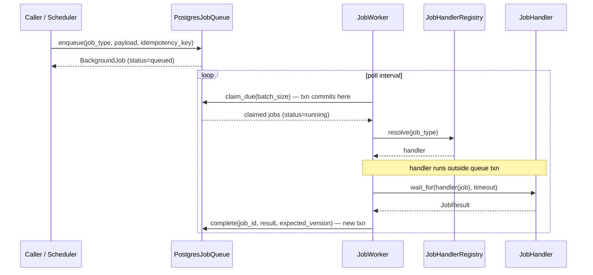
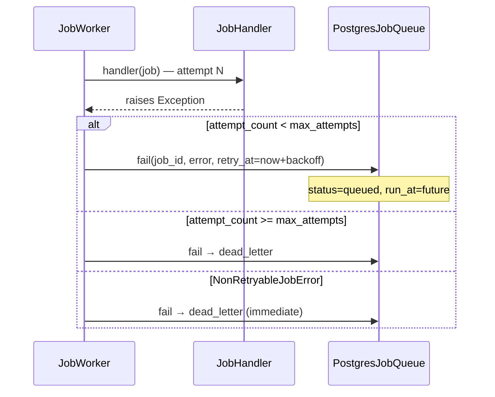
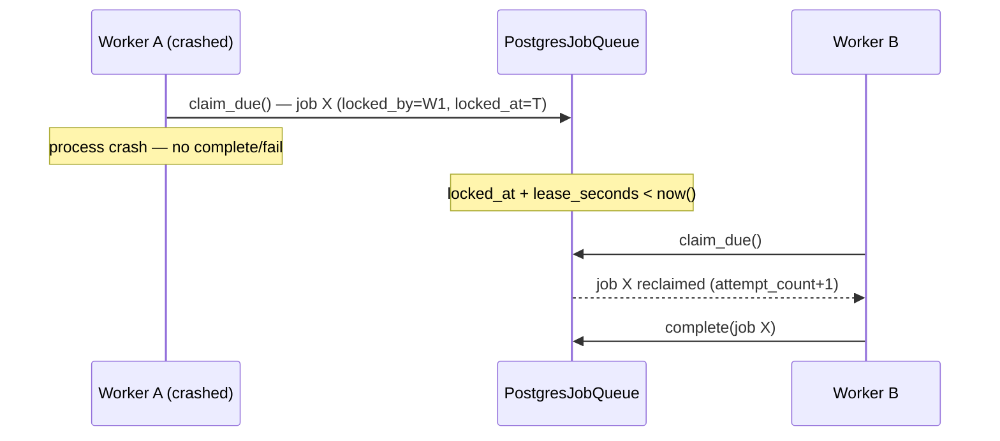

# Post-MVP V2 Epic 10 — Background Jobs

> **Agents:** Read [\_program-v2-execution-guide.md](./_program-v2-execution-guide.md). Implement **Part II** phase-by-phase; consult **Part I** for behaviour and scope questions only.

**Strategy:** [V2 architecture](../references/fullstack-ai-platform-v2-architecture-implementation-strategy.md) § "10. Background Jobs"

**Predecessor:** [Epic 09 — Human-in-the-Loop](./post-mvp-v2-epic-09-human-in-the-loop.md)

---

# Part I — Design

## Objective

Introduce a durable, provider-agnostic **background job execution platform** — a queue abstraction, a claim-based worker loop, a recurring-job scheduler, and uniform retry/backoff policies — backed by the platform's existing PostgreSQL database (no new broker/infrastructure dependency). Every prior epic that shipped a feature-flagged capability deferred at least one piece of "run this later, off the request path, and survive a process restart" work with an explicit `TODO(epic-9)`/`TODO(epic-10)` marker or a documented gap: Epic 02 deferred queue-backed document indexing (`app/ai/rag/indexing/__init__.py`, `sync_runner.py`); Epic 06 deferred `workflow_approval_timeout_hours` enforcement and `workflow_run_retention_days` cleanup; Epic 07 deferred scheduled/cron-triggered evaluation runs; Epic 09 deferred `hitl_approval_timeout_hours` enforcement, the reserved `ApprovalStatus.EXPIRED`/`CANCELLED` transitions, and the orphaned "approved-but-not-resumed" snapshot sweep after a crash between Decision Execution Stage 1 and Stage 4. This epic ships the generic primitive **and** wires it into every one of those named gaps, closing them without re-opening any frozen Part I contract from Epics 02/06/07/09.

**Delivers:** A `JobQueue` protocol with a `PostgresJobQueue` default implementation (new `background_jobs` table, claimed via `SELECT … FOR UPDATE SKIP LOCKED` with a lease timeout so a crashed worker's claim is automatically reclaimable — no separate startup reconciliation step, unlike Epic 06's `reconcile_orphaned_runs`); a `JobHandlerRegistry` mapping `job_type` strings to handler coroutines, mirroring `ToolRegistry`'s registration style; a `JobWorker` that polls, claims, executes, and retries with exponential backoff (capped, then `dead_letter`); a `JobScheduler` that evaluates interval-based `background_job_schedules` rows and enqueues idempotent jobs on their due tick; five first-class job handlers closing the named gaps above — `hitl_approval_expiry_sweep`, `hitl_orphaned_snapshot_sweep`, `workflow_run_retention_cleanup`, `rag_document_indexing` (a new `QueueIndexingRunner` implementing the existing `IndexingJob` protocol), and `scheduled_evaluation_run`; additive `chat_messages.status`/`workflow_node_executions.decision` CHECK extensions so expiry has a terminal state to land on; a read-only + operator-action **Jobs REST API** (`GET /api/jobs`, `GET /api/jobs/{id}`, `POST /api/jobs/{id}/retry`, `GET /api/jobs/schedules`); observability (job spans/metrics, health fields); reference eval scenarios covering retry exhaustion, dead-letter, worker-crash mid-job, and duplicate-claim races; and a minimal read-only frontend jobs/schedules dashboard — all behind `BACKGROUND_JOBS_ENABLED=false` (default).

**Does not ship:** a distributed message broker (Redis/Celery/RQ/SQS) — the queue is Postgres-backed by design (`workflow_provider="postgres"` precedent, "avoid over-engineering"); the `JobQueue` protocol is the swap point if a future epic needs one, but none is implemented in V2; cron-expression scheduling (interval-seconds only in V2 — see Locked Decisions); multi-process/multi-replica worker _deployment_ orchestration (the claim-and-lease mechanism is safe for N workers in N processes/replicas polling the same table, but V2 ships and documents a single in-process worker task per app instance, same "single-process posture" as Epic 06); migrating Epic 06's `schedule_run_task`/`reconcile_orphaned_runs` (initial workflow-run launch) or Epic 05's `schedule_extraction_task`/`schedule_lifecycle_task` (memory extraction) onto the new queue — those already work, are already tested, and are explicitly out of scope (see Locked Decisions "Scope of migration"); a generic "run arbitrary code" job API for plugin authors (Epic 08's own extension surface is unrelated; a plugin-triggered job type is `TODO(future):`); job priority tiers (FIFO by `run_at` only); a schedule-authoring UI (schedules are seeded via migration/config in V2, not visually authored); and an `ApprovalStatus.CANCELLED` sweep (analysis below shows no V2 code path leaves an agent tool approval orphaned-but-not-deleted — see Locked Decisions "Cancelled sweep").

Capabilities:

- Queue abstraction
- Workers
- Scheduled jobs
- Async document indexing
- Async evaluations
- Retry policies

The Background Jobs capability is additive. When disabled, existing chat, RAG, MCP, memory, voice, agent, tool, workflow, plugin, HITL, and observability pipelines remain unchanged: RAG indexing stays synchronous (`SyncIndexingRunner`), workflow runs and HITL resumes still execute via their existing in-process `asyncio.create_task` scheduling, and no approval or workflow run ever transitions to `expired`.

---

## Design Principles

- Platform-first — one `JobQueue`/`JobWorker`/`JobScheduler` triad consulted by every deferred background-work gap (HITL, workflow retention, RAG indexing, evaluation), not a bespoke poller per feature
- Composition over coupling — a **new**, additive primitive; Epic 06's `schedule_run_task` and Epic 05's `schedule_extraction_task` are left exactly as shipped (see Locked Decisions "Scope of migration") rather than forcing an unrelated rewrite of tested, working code
- No new infrastructure — the queue is backed by the same PostgreSQL instance every other durable table already uses; no Redis, no broker, no new Docker Compose service
- Interface-driven — `JobQueue` (enqueue/claim/complete/fail/cancel/get/list) and `JobHandler` (one `job_type` → one async callable) are the only two contracts callers/handler authors depend on
- Explicit lifecycle — a job's state (`queued → running → succeeded|failed|dead_letter|cancelled`) is durable in Postgres from the moment it is enqueued; a worker process crash never silently loses a job (lease expiry makes it reclaimable)
- Idempotent by construction — every enqueue accepts an optional `idempotency_key`; the scheduler always supplies one (`{schedule_name}:{tick}`) so a reconciliation replay or a double-fired scheduler tick can never double-enqueue the same scheduled work
- Handler idempotency required — the queue guarantees at-least-once delivery (lease reclaim); every handler must be safe to execute more than once
- Fail-safe retries — bounded exponential backoff with a hard `max_attempts` ceiling; a job that exhausts retries becomes `dead_letter` (visible, retriable by an operator) rather than silently disappearing or retrying forever
- Feature-flag rollout
- Avoid over-engineering — no priority queues, no cron parser, no distributed coordination protocol beyond row-level locking; reuse the codebase's existing Compare-And-Swap/claim idioms (Epic 06/09) generalized one level
- Polling over push — workers and the scheduler poll Postgres on fixed intervals rather than using `LISTEN/NOTIFY` or an external broker; polling is simpler to operate, survives connection drops without missed notifications, and is sufficient at V2 throughput (see § Throughput & Scalability Assumptions and § Polling vs Alternatives)

---

## Scope

### In Scope

- Background Jobs core (`app/ai/jobs/`): `BackgroundJob`, `JobStatus`, `JobResult`, `JobSchedule`, `ScheduleStatus`, `JobHandler`, `JobHandlerRegistry`, `JobQueue` protocol, `PostgresJobQueue`, `JobWorker`, `JobScheduler`, `JobScheduleStore`, exceptions
- `BACKGROUND_JOBS_ENABLED` feature flag (default `false`) plus per-handler/scheduling config (see § Configuration defaults)
- New tables `background_jobs`, `background_job_schedules` (Postgres); additive `chat_messages.status` CHECK gains `'expired'`; additive `workflow_node_executions.decision` CHECK gains `'expired'`
- **Claim-and-lease worker loop** — a single `SELECT … FOR UPDATE SKIP LOCKED` query claims both freshly-queued jobs (`status='queued' AND run_at<=now()`) and lease-expired in-flight jobs (`status='running' AND locked_at < now() - lease`) in one statement; no separate startup reconciliation pass is required (a design improvement generalizing Epic 06's `reconcile_orphaned_runs`, which only runs once at process start)
- **Retry policy** — uniform exponential backoff (`base_delay_seconds * 2**attempt_count`, capped at `retry_max_delay_seconds`) applied by the worker on handler failure; `dead_letter` once `attempt_count >= max_attempts`
- **Recurring jobs** — `background_job_schedules` rows evaluated by `JobScheduler` on a fixed poll interval; interval-seconds only (no cron expression parsing in V2 — see Locked Decisions)
- **Five first-class job handlers**, grouped by category (see § Job Handlers — Domain Model for full detail):
  - **Sweep jobs** — periodic scans that transition stale rows:
    1. `hitl_approval_expiry_sweep` — enforces `hitl_approval_timeout_hours` (agent tool approvals) and `workflow_approval_timeout_hours` (workflow approval nodes); transitions timed-out `pending` rows to `expired`
    2. `hitl_orphaned_snapshot_sweep` — detects `agent_tool_approvals` rows stuck `approved` with a non-null pause snapshot past a grace period (crash between Decision Execution Stage 1 and Stage 4) and attempts a safe resume, or fails the turn after exhausting attempts
  - **Cleanup jobs** — retention and purge:
    3. `workflow_run_retention_cleanup` — purges terminal (`completed`/`failed`/`cancelled`) `workflow_runs` (cascading `workflow_node_executions`) older than `workflow_run_retention_days`
  - **Processing jobs** — on-demand async work:
    4. `rag_document_indexing` via `QueueIndexingRunner` — implements the existing `IndexingJob` protocol (`app/ai/interfaces/indexing_job.py`) on top of the new queue, selectable via `rag_indexing_runner` config alongside the unchanged default `SyncIndexingRunner`
  - **Scheduled jobs** — recurring programmatic invocations:
    5. `scheduled_evaluation_run` — invokes the existing `app/ai/evaluation` runner programmatically on a schedule and stores the report summary as the job's `result`
- Jobs REST API — authenticated, operator-facing (no per-owner scoping — jobs are system-level, not user-owned records): list/detail/retry/schedules-list
- Observability hooks — `job_span` (`job_id`, `job_type`, `job_status`, `attempt_count`); **queue metrics** (`jobs_enqueued_total`, `jobs_completed_total`, `job_retries_total`, `jobs_pending_count`, `jobs_dead_letter_count`) separate from **handler metrics** (`job_duration_ms` per handler type) — see § Observability (when `OBSERVABILITY_ENABLED`)
- Evaluation cases exercising each handler's happy path plus adversarial/edge cases (retry exhaustion → dead-letter, worker crash mid-job → lease reclaim, duplicate claim race, scheduler double-tick idempotency)
- Minimal read-only frontend jobs/schedules dashboard with a manual "retry" action on dead-lettered jobs

### Out of Scope

- A distributed broker (Redis/Celery/RQ/SQS) — `JobQueue` is the swap point for a future epic, not implemented here
- Cron-expression scheduling — `background_job_schedules.interval_seconds` only; a `cron_expression` column is a documented future extension point, not added now
- Multi-process worker _orchestration_ (process supervision, autoscaling) — the claim-and-lease query is safe under concurrent pollers, but V2 runs exactly one `JobWorker` asyncio task per app instance, same posture as Epic 06's single in-process executor
- Migrating `schedule_run_task`/`reconcile_orphaned_runs` (Epic 06) or `schedule_extraction_task`/`schedule_lifecycle_task` (Epic 05) onto the new queue — both keep working exactly as shipped (see Locked Decisions "Scope of migration")
- `ApprovalStatus.CANCELLED` sweep — no V2 code path orphans an `agent_tool_approvals` row without deleting it (session deletion cascades via `ON DELETE CASCADE`); the reserved enum value remains unimplemented, deferred again (see Locked Decisions "Cancelled sweep")
- Job priority levels/tiers — strict FIFO by `run_at`
- A visual schedule-authoring UI — schedules are seeded via migration/config; the frontend dashboard is read-only plus a retry action
- RBAC-scoped job visibility, per-tenant job isolation (Epic 11)
- Moving Epic 09's HITL "Decision Execution Stages 2–4" (resume scheduled → tool execution → continuation) off the synchronous request/response cycle for the _primary_ approve flow — Epic 09 Part I named this as a future possibility, not a requirement; the decide endpoint's existing synchronous SSE-continuation behaviour is unchanged in V2 (see Locked Decisions "Decision Execution Stages")
- General-purpose plugin-triggered background jobs (Epic 08's plugin SDK is untouched)

---

## High-Level Architecture

```text
                          ┌───────────────────────────────┐
                          │           JobQueue             │
                          │  enqueue / claim / complete /  │
                          │      fail / get / list         │
                          └───────────────┬─────────────────┘
                                          │ implemented by
                                          ▼
                          ┌───────────────────────────────┐
                          │       PostgresJobQueue         │
                          │  background_jobs (+ version)   │
                          │  SELECT … FOR UPDATE SKIP LOCKED│
                          └───────────────┬─────────────────┘
                    enqueue │                          │ claim (batch)
                            │                          ▼
        ┌───────────────────┼──────────────┐   ┌─────────────────┐
        │                   │              │   │    JobWorker    │
        ▼                   │              ▼   │  poll → claim → │
 JobScheduler         REST callers    Feature   │  dispatch →     │
 (recurring ticks)    (manual retry)  code paths │  complete/fail  │
        │ uses                                   │  (backoff/DLQ)  │
        ▼                                        └────────┬────────┘
 JobScheduleStore                                         │ resolves job_type
 (list_due / advance)                                     ▼
        │                                     ┌─────────────────────┐
        ▼                                     │  JobHandlerRegistry  │
 background_job_schedules                     └──────────┬───────────┘
                                                         │
        hitl_approval_expiry_sweep · hitl_orphaned_snapshot_sweep ·
        workflow_run_retention_cleanup · rag_document_indexing ·
        scheduled_evaluation_run
                                                         │
                                                         ▼
                                   job_span / queue + handler metrics
                                   (when Observability on)
```

**One queue, many consumers:** `JobQueue`/`JobWorker` are consumed identically regardless of _why_ the work exists — a periodic sweep (via `JobScheduler`), an on-demand enqueue (`QueueIndexingRunner.submit()` called from `KnowledgeService.ingest_document`), or a manual operator retry (`POST /api/jobs/{id}/retry`) all funnel through the same `enqueue`/`claim`/`complete`/`fail` contract and the same worker loop.

---

## Locked Architectural Decisions

| Topic                                   | Decision                                                                                                                                                                                                                                                                                                                                                                                                                                                                                                                                                                                                                                                                                                                                        | Deferred to                                                                                                                                                                            |
| --------------------------------------- | ----------------------------------------------------------------------------------------------------------------------------------------------------------------------------------------------------------------------------------------------------------------------------------------------------------------------------------------------------------------------------------------------------------------------------------------------------------------------------------------------------------------------------------------------------------------------------------------------------------------------------------------------------------------------------------------------------------------------------------------------- | -------------------------------------------------------------------------------------------------------------------------------------------------------------------------------------- |
| Queue backend                           | PostgreSQL-backed (`background_jobs` table, `SELECT … FOR UPDATE SKIP LOCKED`); no Redis/Celery/RQ — matches the platform's "no new infrastructure" posture (`workflow_provider="postgres"` precedent)                                                                                                                                                                                                                                                                                                                                                                                                                                                                                                                                          | A pluggable non-Postgres `JobQueue` implementation (e.g. Redis-backed) → future, only if scale requires it                                                                             |
| Scope of migration                      | Epic 06's `schedule_run_task`/`reconcile_orphaned_runs` (workflow run launch) and Epic 05's `schedule_extraction_task`/`schedule_lifecycle_task` (memory extraction) are **not** migrated onto the new queue in V2 — both are already tested, working, in-process `asyncio.create_task` patterns; this epic adds the generic primitive and wires only the five named first-class handlers onto it                                                                                                                                                                                                                                                                                                                                               | Generalizing all in-process background tasks onto one queue → future, only if a concrete need (e.g. multi-replica deployment) arises                                                   |
| Claim mechanism                         | A single `UPDATE … WHERE id IN (SELECT … FOR UPDATE SKIP LOCKED)` claims both due `queued` jobs and lease-expired `running` jobs in one round trip; no separate "reconcile at startup" pass is needed — the next poll cycle naturally reclaims a crashed worker's job once its lease (`locked_at`) expires                                                                                                                                                                                                                                                                                                                                                                                                                                      | Distributed lease coordination beyond single-Postgres row locking → future                                                                                                             |
| Recurring schedule granularity          | `background_job_schedules.interval_seconds` (fixed interval from `next_run_at`); no cron expression parser                                                                                                                                                                                                                                                                                                                                                                                                                                                                                                                                                                                                                                      | Cron-expression scheduling → future                                                                                                                                                    |
| Retry policy                            | Exponential backoff: `retry_base_delay_seconds * 2 ** attempt_count`, capped at `retry_max_delay_seconds`; `status=dead_letter` once `attempt_count >= max_attempts` (default `3`, overridable per-enqueue)                                                                                                                                                                                                                                                                                                                                                                                                                                                                                                                                     | Per-job-type custom backoff curves → future (today all handlers share one policy, configurable per enqueue call via `max_attempts` only)                                               |
| Idempotency                             | `background_jobs.idempotency_key` is a nullable-but-unique column; `JobScheduler` always supplies `f"{schedule.name}:{scheduled_tick.isoformat()}"`; `enqueue()` treats a unique-violation on this key as "already enqueued" and returns the existing row rather than raising, so a scheduler double-tick or a reconciliation replay is a safe no-op                                                                                                                                                                                                                                                                                                                                                                                            | —                                                                                                                                                                                      |
| HITL approval expiry (agent surface)    | `hitl_approval_expiry_sweep` finds `agent_tool_approvals` rows `status='pending'` with `requested_at + hitl_approval_timeout_hours < now()` (skipped entirely when `hitl_approval_timeout_hours=0`, the default); Compare-And-Swap (CAS) transitions `pending → expired`; the linked placeholder `ChatMessage.status` is set to the new additive `'expired'` value; no tool ever executes for an expired approval                                                                                                                                                                                                                                                                                                                               | Configurable per-tool timeout overrides → future                                                                                                                                       |
| HITL approval expiry (workflow surface) | `hitl_approval_expiry_sweep` finds `workflow_node_executions` rows `node_type='approval'`, `status='waiting_approval'` with `requested_at`-equivalent (`started_at`) `+ workflow_approval_timeout_hours < now()` (skipped when `0`); Compare-And-Swap (CAS) transitions the node to `status='failed'`, `decision='expired'` (new additive CHECK value) — reusing Epic 06's existing "node failed → run follows failure/rejected edge or ends" continuation path verbatim, not a new run-state transition                                                                                                                                                                                                                                        | —                                                                                                                                                                                      |
| HITL orphaned snapshot sweep            | `hitl_orphaned_snapshot_sweep` finds `agent_tool_approvals` rows `status='approved'` with a non-null `paused_scratchpad`/`paused_state` whose `decided_at` is older than `hitl_orphan_sweep_grace_seconds` (a crash between Decision Execution Stage 1 and Stage 4 per Epic 09 § Snapshot Cleanup Strategy); the handler re-runs Stage 2–4 (rehydrate → execute any not-yet-executed approved calls → `AgentExecutor.resume_from_approval()`) exactly as `AgentApprovalService.decide()` already does, just invoked from a job instead of a request; on repeated failure past `max_attempts`, the linked `ChatMessage.status` is set to `error` and the snapshot columns are nulled (fail-safe, matching Epic 09's documented cleanup contract) | Automatic re-planning around a failed orphan-resume → future                                                                                                                           |
| Cancelled sweep                         | Not implemented — audited every V2 code path that removes a session/run/plugin: chat session deletion cascades `agent_tool_approvals` via `ON DELETE CASCADE` (hard delete, no `cancelled` transition needed); `WorkflowManager.cancel_run()` already transitions a `waiting_approval` node to `NodeStatus.CANCELLED` inline (no sweep needed — Epic 06 handles this synchronously today). `ApprovalStatus.CANCELLED` remains a reserved-but-unused enum value                                                                                                                                                                                                                                                                                  | A future resource type that soft-deletes without cascading (e.g. a shared/team-owned approval queue, Epic 11) may need this sweep                                                      |
| Workflow run retention                  | `workflow_run_retention_cleanup` deletes `workflow_runs` (cascading `workflow_node_executions` via existing `ON DELETE CASCADE`) where `status IN ('completed','failed','cancelled')` and `updated_at < now() - workflow_run_retention_days`; runs on `background_job_schedules` (default daily); `workflow_run_retention_days=90` unchanged default                                                                                                                                                                                                                                                                                                                                                                                            | Configurable retention by workflow definition or a soft-delete/archive tier instead of hard delete → future                                                                            |
| RAG queue-backed indexing               | New `rag_indexing_runner: Literal["sync", "queue"] = "sync"` config selects between the existing `SyncIndexingRunner` (unchanged default) and the new `QueueIndexingRunner`; `QueueIndexingRunner.submit()` enqueues a `rag_document_indexing` job (payload: `{"version": 1, "document_id", "user_id"}` — never raw file bytes, see § Security Model) instead of awaiting the processor inline, and `get_status()` maps `BackgroundJob.status`/`result`/`last_error` onto the existing `IndexingJobStatus` shape (`IndexingJob` protocol is unchanged — no caller-visible API break)                                                                                                                                                                                 | A durable object-storage handoff for large files (today the caller still holds bytes in memory until the worker consumes them via a re-fetch path — see Implementation Risks) → future |
| Scheduled evaluation                    | `scheduled_evaluation_run` invokes the existing `app/ai/evaluation` CLI's underlying runner function in-process (no subprocess spawn) with a configured `--level`; the produced report path/summary is stored on `BackgroundJob.result`; disabled by default (`evaluation_schedule_enabled=false`) — enabling it does not change `make eval`'s manual invocation path                                                                                                                                                                                                                                                                                                                                                                           | Storing historical eval trend data / a dedicated eval-history table → future                                                                                                           |
| Job payload/result content              | `payload`/`result` columns are `jsonb`; handlers must only place ids, small scalars, and short status strings there — never raw file bytes, provider credentials, or full tool-argument payloads (mirrors HITL's "Secrets in audit" rule)                                                                                                                                                                                                                                                                                                                                                                                                                                                                                                       | —                                                                                                                                                                                      |
| Concurrency                             | Claim uses `SELECT … FOR UPDATE SKIP LOCKED`, the same non-blocking concurrent-claim idiom used nowhere else yet in this codebase but standard Postgres practice; two workers racing for the same row never block each other or double-claim                                                                                                                                                                                                                                                                                                                                                                                                                                                                                                    | —                                                                                                                                                                                      |
| Optimistic concurrency (`version`)      | Every `background_jobs` row has a monotonic `version` column; all mutating updates require `WHERE id = :id AND version = :expected_version` and increment `version` on success — additional safeguard against concurrent admin/retry/reclaim races                                                                                                                                                                                                                                                                                                                                                                                                                                                                                              | —                                                                                                                                                                                      |
| Payload schema versioning               | Every job payload includes `"version": 1`; handlers reject unsupported versions with `NonRetryableJobError`                                                                                                                                                                                                                                                                                                                                                                                                                                                                                                                                                                                                                                       | Payload v2+ migrations → future                                                                                                                                                        |
| Schedule persistence separation         | `JobScheduleStore` owns schedule CRUD/persistence; `JobScheduler` only loads due schedules, enqueues, and advances — no direct schedule-row writes in the scheduler                                                                                                                                                                                                                                                                                                                                                                                                                                                                                                                | —                                                                                                                                                                                      |
| Handler execution timeout               | `asyncio.wait_for(handler, timeout=background_jobs_handler_timeout_seconds)`; timeout failures follow the normal retry/dead-letter path                                                                                                                                                                                                                                                                                                                                                                                                                                                                                                                                                                                                           | Per-job-type timeout overrides → future                                                                                                                                                |
| Transaction boundaries                  | `claim()` commits before handler execution; handlers run outside any queue transaction/row lock; `complete()`/`fail()`/`cancel()` each use a new short transaction — prevents holding locks during long-running handlers                                                                                                                                                                                                                                                                                                                                                                                                                                                                                                                            | —                                                                                                                                                                                      |
| Handler idempotency                     | **Required** — at-least-once delivery (lease reclaim) means duplicate execution is possible; every handler must be safe to run twice (CAS, UPSERT, unique constraints, idempotency keys)                                                                                                                                                                                                                                                                                                                                                                                                                                                                                                                                                          | —                                                                                                                                                                                      |
| Job cancellation                        | `queued → cancelled` via `JobQueue.cancel()` (immediate, non-cooperative); **running jobs are not cancellable in V2**; no REST cancel endpoint; handlers do not receive cancellation signals                                                                                                                                                                                                                                                                                                                                                                                                                                                                                                                                                      | Mid-flight cancel + REST `POST …/cancel` → future                                                                                                                                      |
| Missed schedule ticks                   | Skipped, not replayed — one job enqueued on recovery; `next_run_at` advanced past all missed intervals to the next future boundary                                                                                                                                                                                                                                                                                                                                                                                                                                                                                                                                                                                                                | —                                                                                                                                                                                      |
| Job visibility                          | Jobs are system-level (not user-owned); `GET /api/jobs`/`GET /api/jobs/{id}` are authenticated (`get_current_caller`) but **not** owner-scoped in V2 — any authenticated user can see job type/status/timing/attempt metadata (never `payload`/`result` contents beyond the redaction allowlist in § Security Model)                                                                                                                                                                                                                                                                                                                                                                                                                            | RBAC-gated operator-only visibility → Epic 11                                                                                                                                          |
| Decision Execution Stages (HITL)        | Epic 09's decide-endpoint synchronous approve→execute→continue flow is **unchanged** in V2; this epic does not move Stages 2–4 off the request/response cycle for the primary approve path (only the _orphaned_ crash-recovery case runs through the queue, via `hitl_orphaned_snapshot_sweep`)                                                                                                                                                                                                                                                                                                                                                                                                                                                 | An opt-in "enqueue instead of stream inline" approve mode → future                                                                                                                     |

---

## Job Handlers — Domain Model

New table **`background_jobs`** (Postgres) and mirrored Pydantic model `BackgroundJob`:

### Handler Categories

| Category | Purpose | V2 handlers |
| -------- | ------- | ----------- |
| **Sweep** | Periodic scan; transition stale/orphaned rows via CAS | `hitl_approval_expiry_sweep`, `hitl_orphaned_snapshot_sweep` |
| **Cleanup** | Retention purge; batch-delete terminal records | `workflow_run_retention_cleanup` |
| **Processing** | On-demand async work triggered by feature code | `rag_document_indexing` |
| **Scheduled** | Recurring programmatic invocation on a fixed interval | `scheduled_evaluation_run` |

New handlers should fit one of these categories (or justify a new category in a Part I update).

### `background_jobs` Schema

| Field                       | Type                                              | Notes                                                                                                                  |
| --------------------------- | ------------------------------------------------- | ---------------------------------------------------------------------------------------------------------------------- |
| `id`                        | `uuid`                                            | Primary key                                                                                                            |
| `job_type`                  | `text`                                            | Registered handler key, e.g. `hitl_approval_expiry_sweep`                                                              |
| `status`                    | `text` CHECK                                      | `queued` \| `running` \| `succeeded` \| `failed` \| `dead_letter` \| `cancelled`                                       |
| `payload`                   | `jsonb`                                           | Handler input — ids/scalars only (see § Security Model)                                                                |
| `result`                    | `jsonb` \| `null`                                 | Handler output on success; small summary only                                                                          |
| `attempt_count`             | `int`                                             | Starts at `0`; incremented by the claim query on every claim                                                           |
| `max_attempts`              | `int`                                             | Default `3` (config `background_jobs_default_max_attempts`); overridable per `enqueue()` call                          |
| `version`                   | `int`                                             | Optimistic-concurrency counter; starts at `1`; incremented on every successful row update (see § Optimistic Concurrency) |
| `run_at`                    | `timestamptz`                                     | Earliest eligible claim time — supports both immediate (`now()`) and delayed/backoff scheduling                        |
| `locked_by`                 | `text` \| `null`                                  | Worker instance id holding the current claim lease (format: `{hostname}:{pid}:{uuid}` — see § Worker Identity)         |
| `locked_at`                 | `timestamptz` \| `null`                           | Lease start; a lease older than `background_jobs_claim_lease_seconds` is reclaimable                                   |
| `last_error`                | `text` \| `null`                                  | Most recent handler exception summary (type name + truncated message, never a full stack trace with potential secrets) |
| `idempotency_key`           | `text` \| `null`, unique                          | Dedupe key; `null` means no dedupe (ordinary one-off enqueues)                                                         |
| `schedule_id`               | `uuid` \| `null` FK `background_job_schedules.id` | Set when this job was produced by a recurring schedule tick                                                            |
| `created_at` / `updated_at` | `timestamptz`                                     | Standard bookkeeping                                                                                                   |
| `started_at`                | `timestamptz` \| `null`                           | First claim time                                                                                                       |
| `finished_at`               | `timestamptz` \| `null`                           | Terminal transition time (`succeeded`/`failed`/`dead_letter`/`cancelled`)                                              |

New table **`background_job_schedules`** (Postgres) and mirrored Pydantic model `JobSchedule`:

| Field                       | Type                            | Notes                                                                                             |
| --------------------------- | ------------------------------- | ------------------------------------------------------------------------------------------------- |
| `id`                        | `uuid`                          | Primary key                                                                                       |
| `name`                      | `text`, unique                  | e.g. `hitl-approval-expiry-sweep` — human-readable, stable identifier used in the idempotency key |
| `job_type`                  | `text`                          | The `job_type` enqueued on each due tick                                                          |
| `payload`                   | `jsonb`                         | Static payload merged into every enqueued job (must include `"version": 1` — see § Payload Schema Versioning)         |
| `interval_seconds`          | `int`                           | Fixed interval between ticks                                                                      |
| `next_run_at`               | `timestamptz`                   | Next due time; advanced by `interval_seconds` after each tick, never drifts backward              |
| `version`                   | `int`                           | Optimistic-concurrency counter for `JobScheduleStore.advance()` (starts at `1`)                   |
| `status`                    | `text` CHECK (`ScheduleStatus`) | `enabled` \| `disabled`                                                                           |
| `created_at` / `updated_at` | `timestamptz`                   | Standard bookkeeping                                                                              |

**`chat_messages` extension (additive):**

- `status` CHECK constraint extended: `'complete' | 'stopped' | 'error' | 'interrupted' | 'waiting_approval' | 'rejected' | 'expired'`

**`workflow_node_executions` extension (additive):**

- `decision` CHECK constraint extended: `decision IS NULL OR decision IN ('approved', 'rejected', 'expired')`

**`JobResult`** (`app/ai/jobs/models.py`) — the small, uniform success-summary shape every handler returns:

```python
class JobResult(BaseModel):
    summary: str                        # one-line, human-readable outcome
    counts: dict[str, int] = Field(default_factory=dict)   # e.g. {"expired": 3, "scanned": 40}
    ref_id: str | None = None           # e.g. document_id, approval_id, run_id — for cross-linking, never raw content
```

---

## Job Lifecycle State Machine

```text
                    ┌─────────┐
        ┌──────────▶│ QUEUED  │◀────────────────┐
        │           └────┬────┘                  │ backoff re-queue
   enqueue()               │ claimed by            │ (attempt_count < max_attempts)
   (fresh or                │ JobWorker.poll()      │
    lease-reclaimed)         ▼                     │
        │           ┌─────────┐                    │
        │           │ RUNNING │────────────────────┘
        │           └────┬────┘
        │                │
        │        ┌───────┼────────────────┐
        │        ▼       ▼                ▼
        │  ┌──────────┐┌────────────┐┌───────────┐
        │  │SUCCEEDED ││DEAD_LETTER ││ CANCELLED │
        │  └──────────┘└────────────┘└───────────┘
        │   (terminal)  (terminal —    (terminal —
        │               attempt_count   operator/
        │               >= max_attempts; caller
        │               retriable via    cancel;
        │               POST …/retry)    not auto-
        │                                produced
        │                                by workers)
        │
        └── a RUNNING job whose lease (locked_at) expires past
            background_jobs_claim_lease_seconds is reclaimed by
            the next poll's claim query — treated as if it were
            freshly QUEUED, with attempt_count already incremented
            from the prior (crashed) attempt
```

`QUEUED`, `RUNNING`, `SUCCEEDED`, `FAILED` (transient — the worker immediately re-queues or dead-letters, so `failed` is not a resting state; the CHECK constraint still names it for the brief in-transaction window and for `last_error` display purposes), `DEAD_LETTER`, and `CANCELLED` are all implemented in V2 (unlike Epic 09's reserved-but-unimplemented states, every Background Jobs status has a real transition path). See § Cancellation Semantics for `CANCELLED` transition rules.

---

## Cancellation Semantics

`CANCELLED` is a terminal status for jobs that should not run. V2 implements the status and `JobQueue.cancel()` on the queue protocol; there is **no public REST cancel endpoint** in V2 (operators use dead-letter + discard for failed jobs; a `POST /api/jobs/{id}/cancel` endpoint is a documented future extension).

| From | To | Trigger | Allowed? |
| ---- | -- | ------- | -------- |
| `queued` | `cancelled` | `JobQueue.cancel()` (internal/future operator API) | **Yes** — immediate DB transition |
| `running` | `cancelled` | Any caller | **No in V2** — running jobs are not cancellable; the worker runs to completion, failure, or timeout; lease expiry reclaims if the worker crashes |
| `dead_letter` | `cancelled` | Operator acknowledge/discard | **Future** — V2 leaves dead-letter jobs visible; no cancel endpoint |
| `running` | `succeeded` | Handler returns `JobResult` | Normal path |
| `queued` | `running` | Worker claim | Normal path |

**Cancellation model:** **Immediate, non-cooperative** — `cancel()` sets `status='cancelled'`, `finished_at=now()` in a single version-checked transaction. Handlers **do not** receive cancellation signals (`asyncio.CancelledError` is never injected into handler coroutines). A queued job cancelled before claim never executes.

**Race with claim:** `cancel()` requires `status='queued'`; `claim_due()` requires `status='queued' AND run_at<=now()`. Both use row-level locking / version checks — whichever transaction commits first wins; the loser observes zero rows updated and no-ops (or raises `JobConcurrencyError` at the call site).

**Race with completion:** Cannot occur in V2 for queued-only cancellation. A `running` job that completes after a hypothetical future mid-flight cancel would be resolved by the version-checked `complete()`/`cancel()` race (first commit wins).

**Worker behaviour on cancelled rows:** Claim query excludes `cancelled` jobs. A worker that already claimed a job before cancel (future mid-flight cancel) would complete normally; V2 does not support mid-flight cancel.

---

## Claim-and-Lease Mechanism

The core of `PostgresJobQueue.claim_due()` — one statement claims both due fresh jobs and lease-expired crashed jobs:

```sql
UPDATE background_jobs
SET status = 'running',
    locked_by = :worker_id,
    locked_at = now(),
    attempt_count = attempt_count + 1,
    started_at = COALESCE(started_at, now()),
    updated_at = now(),
    version = version + 1
WHERE id IN (
    SELECT id FROM background_jobs
    WHERE (status = 'queued' AND run_at <= now())
       OR (status = 'running' AND locked_at < now() - make_interval(secs => :lease_seconds))
    ORDER BY run_at
    FOR UPDATE SKIP LOCKED
    LIMIT :batch_size
)
RETURNING *;
```

All other mutating queue operations (`complete`, `fail`, manual retry, operator cancel) use the same optimistic-concurrency guard: `UPDATE … WHERE id = :id AND version = :expected_version`, incrementing `version` on success and raising `JobConcurrencyError` (or re-reading and retrying once at the call site) when zero rows are updated.

- `FOR UPDATE SKIP LOCKED` means concurrent workers never block on each other — a row already locked by another in-flight claim transaction is simply skipped, not waited on.
- The `OR (status='running' AND locked_at < …)` branch is what makes this **self-healing**: no separate "reconcile orphaned jobs at startup" pass is required (contrast with Epic 06's `reconcile_orphaned_runs`, which only fires once at process boot). A worker that crashes mid-job leaves its claim behind; the next poll cycle across _any_ running worker instance reclaims it once the lease expires.
- `attempt_count` is incremented **on claim**, not on failure — so a lease-expired reclaim correctly counts as a new attempt even though no explicit `fail()` was ever recorded for the crashed attempt.

---

## Transaction Boundaries

Each queue operation uses its **own short database transaction**. Handlers execute **outside** any held row lock or open queue transaction. This is a deliberate design choice — holding a lock during handler execution would block concurrent workers, exhaust connection pools, and risk lock timeouts on long-running handlers (indexing, eval runs).

```text
Per-job transactional lifecycle:

  enqueue()
      │  BEGIN → INSERT (status=queued) → COMMIT
      ▼
  claim_due()                         ← separate transaction; commits BEFORE handler starts
      │  BEGIN → UPDATE (status=running, locked_by, …) → COMMIT
      ▼
  handler(job)                        ← NO queue transaction open; NO row lock held
      │  (may open its own independent DB sessions/transactions as needed)
      ▼
  complete() / fail()                 ← new transaction after handler returns
      │  BEGIN → UPDATE (status=succeeded|queued|dead_letter, …) → COMMIT
      ▼
  done
```

| Operation | Transaction scope | Lock held during handler? |
| --------- | ----------------- | ------------------------- |
| `enqueue()` | Single INSERT; commits before return | N/A |
| `claim_due()` | Batch UPDATE; **commits before** dispatching to handlers | **No** — lock released at COMMIT |
| `handler()` | Handler-managed (independent sessions) | **No** |
| `complete()` / `fail()` | Single UPDATE with version check; new transaction | N/A |
| `cancel()` | Single UPDATE with version check; new transaction | N/A |

**Why this design:** The claim-and-lease model provides **at-least-once delivery** without requiring the database to participate in handler execution. Ownership is recorded in a millisecond-scale claim transaction; execution happens unlocked; result persistence is another short transaction. If a worker crashes mid-handler, the row remains `running` with a stale lease until reclaim — no connection is held open.

**Implementation guardrail:** `JobWorker` must never wrap `handler(job)` inside the same SQLAlchemy session/transaction used by `claim_due()`. Phase 1 tests must assert the claim session is closed/committed before dispatch begins.

---

## Retry & Backoff Policy

Applied uniformly by `JobWorker` after a handler raises:

```python
def compute_backoff_seconds(attempt_count: int, *, base: float, cap: float) -> float:
    return min(base * (2 ** attempt_count), cap)
```

- On handler failure with `attempt_count < max_attempts`: `JobQueue.fail(job_id, error=..., retry_at=now() + backoff)` — sets `status='queued'`, `run_at=retry_at`, records `last_error` (truncated exception summary).
- On handler failure with `attempt_count >= max_attempts`: `status='dead_letter'`, `finished_at=now()`, `last_error` retained. A dead-lettered job is visible via the REST API and retriable via `POST /api/jobs/{id}/retry` (resets `attempt_count=0`, `status='queued'`, `run_at=now()`).
- Defaults: `background_jobs_default_max_attempts=3`, `background_jobs_retry_base_delay_seconds=5.0`, `background_jobs_retry_max_delay_seconds=300.0` — e.g. attempt 0 fails → retry in 5s, attempt 1 fails → retry in 10s, attempt 2 fails → retry in 20s, attempt 3 fails (== `max_attempts`) → `dead_letter`.
- A handler may itself decide a failure is non-retriable (e.g. a permanently malformed payload) by raising a dedicated `NonRetryableJobError` — the worker dead-letters immediately regardless of remaining attempts (see § Poison Jobs & NonRetryableJobError).

### Handler Execution Timeouts

Every handler dispatch is wrapped in `asyncio.wait_for(handler(job), timeout=background_jobs_handler_timeout_seconds)` (default `600` — 10 minutes). A timeout is treated identically to an ordinary handler failure: the worker records `last_error` (e.g. `"TimeoutError: handler exceeded 600s"`), applies backoff/retry if attempts remain, or transitions to `dead_letter` once `max_attempts` is exhausted. Handlers that legitimately need longer execution should be split into smaller jobs in a future epic rather than raising the global timeout ad hoc.

### Poison Jobs & NonRetryableJobError

A **poison job** is one that will never succeed regardless of how many times it is retried. Handlers raise `NonRetryableJobError` to signal this; the worker bypasses backoff and dead-letters immediately.

| Failure class | Example | Handler action |
| ------------- | ------- | -------------- |
| Malformed payload | Missing required field, wrong JSON shape | Raise `NonRetryableJobError("invalid payload: …")` |
| Unknown/unsupported payload version | `"version": 99` with no migration path | Raise `NonRetryableJobError("unsupported payload version: 99")` |
| Unknown handler at dispatch | Should not occur if registry is correct; caught by worker before dispatch | Worker dead-letters with `JobHandlerNotFoundError` summary (non-retriable) |
| Permanently deleted resource | `document_id` no longer exists and cannot be re-fetched | Raise `NonRetryableJobError("document not found: …")` |
| Invalid configuration | Required setting is `0`/disabled in a way that makes success impossible | Raise `NonRetryableJobError("…")` |

Transient failures (DB deadlock, provider rate limit, network blip) must **not** raise `NonRetryableJobError` — let the normal retry/backoff path handle them.

---

## Optimistic Concurrency

Every `background_jobs` row carries a monotonic `version` column (starts at `1`, default in migration). All mutating operations — claim, complete, fail, manual retry, operator cancel — require `WHERE id = :id AND version = :expected_version` and increment `version` on success. This provides an additional safeguard against unexpected concurrent modifications (e.g. an operator retry racing a lease-expired reclaim, or a future administrative tool editing a row while a worker holds a stale in-memory copy). A zero-row update raises `JobConcurrencyError`; callers may re-read the row and retry once (the worker does this for `complete`/`fail` after dispatch).

This mirrors Epic 06's `checkpoint_version` pattern on `workflow_runs`, generalized to the job table.

---

## Payload Schema Versioning

Job payloads are not arbitrary JSON bags — every payload **must** include a top-level `"version": <int>` field identifying the schema generation the handler expects. V2 ships payload version `1` for all five first-class handlers.

```json
{
  "version": 1,
  "document_id": "…",
  "user_id": "…"
}
```

Handlers validate `payload["version"]` at the start of execution; an unsupported version raises `NonRetryableJobError`. Future payload shape changes add a new version number and a handler branch (or a dedicated migration helper) rather than silently breaking in-flight jobs. Schedule seed payloads and `QueueIndexingRunner.enqueue()` both supply `"version": 1`.

---

## Handler Idempotency (Required)

The queue provides **at-least-once delivery**, not exactly-once. A handler may execute more than once for the same logical job because:

- A worker crashes after partial side effects but before `complete()` — lease expiry reclaims the job and runs the handler again.
- A lease-expired reclaim increments `attempt_count` and re-dispatches even though the prior attempt may have partially succeeded.
- Optimistic concurrency retries on `complete()`/`fail()` can re-dispatch after ambiguous failures.

**Every `JobHandler` must therefore be idempotent** — the single most important implementation invariant for this subsystem. Running a handler twice for the same `job_id` must produce the same durable outcome as running it once (or safely no-op the second time).

Recommended implementation patterns (already used elsewhere in this codebase):

| Pattern | When to use | V2 example |
| ------- | ----------- | ---------- |
| Compare-and-swap (`UPDATE … WHERE status=expected`) | Transitioning a row to a terminal state | Expiry sweep: `WHERE status='pending'` |
| UPSERT / `ON CONFLICT DO NOTHING` | Creating derived records that must exist at most once | Indexing: upsert vectors for `(document_id, chunk_id)` |
| Unique constraints | Preventing duplicate side effects | `idempotency_key` on enqueue; eval report path keyed by run |
| Idempotency keys | Caller-level dedupe before side effects | Scheduler `{name}:{tick}` keys |
| Duplicate-safe external APIs | Provider calls that may be retried | Embedding calls with stable content hashes |

Handlers that cannot be made idempotent must be split into smaller jobs or deferred to a future epic — do not ship a handler whose second execution causes double-charges, double-emails, or double-tool-execution.

---

## Worker Identity (`locked_by`)

Each worker instance generates a stable identity at startup:

```text
{hostname}:{pid}:{uuid4}
```

Example: `api-pod-7f3a2b:48291:a1b2c3d4-e5f6-7890-abcd-ef1234567890`

This format makes it easy to correlate a claimed job with the process/pod that holds the lease during operational debugging. In containerized deployments where hostname is ephemeral, the UUID suffix remains unique per process lifetime; a future epic may substitute an instance-id from the orchestrator without changing the column semantics.

---

## Graceful Worker Shutdown

Rolling deployments (Kubernetes, ECS, etc.) require a defined shutdown sequence so in-flight jobs are not orphaned prematurely:

```text
1. Stop polling      — worker loop sets a shutdown flag; no new claim_due() calls
2. Finish current job — await all in-flight handler dispatches (asyncio.gather)
3. Persist final state — complete() or fail() each finished job with version check
4. Release resources — close DB sessions, flush spans/metrics
5. Terminate         — cancel the asyncio task; lifespan handler returns
```

The claim lease (`background_jobs_claim_lease_seconds`, default 300s) is the safety net: if shutdown is forced before step 3 completes (SIGKILL, hard timeout), the job is reclaimed once the lease expires rather than lost. Operators should set pod termination grace ≥ `background_jobs_handler_timeout_seconds + 30s` so step 2 can finish under normal conditions.

`JobScheduler` follows the same pattern: stop evaluating new ticks, finish any in-flight schedule-advancement transaction, then terminate.

---

## Handler Registration Lifecycle

Startup order in `app/main.py` lifespan (when `BACKGROUND_JOBS_ENABLED=true`):

```text
1. Registry creation     — empty JobHandlerRegistry()
2. Handler registration  — register_all_handlers(registry) wires all five first-class handlers
3. Worker startup        — JobWorker.run_forever() begins polling (handlers must exist before first claim)
4. Scheduler startup     — JobScheduler.run_forever() begins evaluating due schedules
```

Handlers are registered synchronously before either background loop starts. A job whose `job_type` has no registered handler is dead-lettered immediately with a `JobHandlerNotFoundError` summary (non-retriable). Registration is idempotent (re-registering the same `job_type` replaces the handler — useful in tests).

---

## Scheduler Design

`JobScheduler` (`app/ai/jobs/scheduler.py`) runs its own polling loop (default every `background_jobs_scheduler_poll_interval_seconds=30`). It is responsible **only** for loading due schedules, computing the next execution, and enqueueing jobs — schedule CRUD and persistence live in a dedicated `JobScheduleStore` (see below).

```text
for each due schedule from JobScheduleStore.list_due():
    idempotency_key = f"{schedule.name}:{schedule.next_run_at.isoformat()}"
    queue.enqueue(job_type=schedule.job_type, payload=merge_version(schedule.payload),
                  idempotency_key=idempotency_key, run_at=now())
    JobScheduleStore.advance(schedule.id, expected_version=schedule.version,
                             next_run_at=schedule.next_run_at + interval_seconds)
```

- Advancing from the previous `next_run_at` (not from `now()`) keeps ticks aligned to the original cadence even if the scheduler itself is briefly delayed.
- The idempotency key means a scheduler running in two app instances simultaneously (a documented, safe consequence of the single-worker-posture _not_ extending to a single-scheduler guarantee) enqueues the same tick's job at most once — the second `enqueue()` call observes the unique-constraint conflict and returns the existing row instead of erroring.
- Default seeded schedules (via the Phase 2/3/4/5/6 migrations or an idempotent startup seed helper — see Phase 2 Steps): `hitl-approval-expiry-sweep` (every 5 min), `hitl-orphaned-snapshot-sweep` (every 15 min), `workflow-run-retention-cleanup` (daily), `scheduled-evaluation-run` (disabled by default — `evaluation_schedule_enabled=false`).

### Missed Ticks

If the scheduler is down or delayed long enough to miss one or more intervals, **missed ticks are skipped, not replayed**. On recovery the scheduler:

1. Enqueues **one** job for the oldest due `next_run_at` (preserving the idempotency key for that tick).
2. Advances `next_run_at` forward past all missed intervals to the **next future-aligned boundary** (`next_run_at + n * interval_seconds` where `n` is the smallest integer such that the result is `> now()`).

Example: a 5-minute schedule with `next_run_at=09:00` that doesn't run until 09:17 enqueues one job (idempotency key `…:09:00`) and sets `next_run_at=09:20` (skipping the 09:05/09:10/09:15 ticks). The next enqueue happens at 09:20. This is intentional: sweeps and cleanups are idempotent periodic work, not calendar-critical cron events — one execution on recovery is sufficient.

### Clock Assumptions

- **Postgres `now()` is authoritative** for claim eligibility (`run_at <= now()`), lease expiry (`locked_at < now() - lease`), and schedule due evaluation (`next_run_at <= now()`). Application-server clocks are not consulted for queue semantics.
- **Acceptable clock skew:** all app instances and Postgres should agree within ±2 seconds (standard NTP expectation). Larger skew can cause premature lease expiry or delayed claims but does not cause double-execution thanks to row-level locking.
- **Multiple scheduler instances:** safe — idempotency keys prevent duplicate enqueues; `JobScheduleStore.advance()` uses optimistic versioning so concurrent advances on the same schedule row produce at most one successful advance per tick.
- **Daylight saving:** not applicable — all timestamps are `timestamptz`; interval-based schedules use fixed second counts, not wall-clock calendar expressions.

### Schedule Persistence — `JobScheduleStore`

Schedule CRUD and persistence are extracted from `JobScheduler` into a dedicated store, mirroring how other subsystems separate storage from orchestration:

```python
class JobScheduleStore(Protocol):
    async def list_due(self, *, now: datetime) -> list[JobSchedule]: ...
    async def advance(self, schedule_id: UUID, *, expected_version: int, next_run_at: datetime) -> JobSchedule: ...
    async def list_all(self) -> list[JobSchedule]: ...  # REST API
```

`PostgresJobScheduleStore` is the V2 implementation (may live in `app/ai/jobs/schedule_store.py`). `JobScheduler` depends on `JobScheduleStore` + `JobQueue` only — it never writes schedule rows directly.

---

## Job Handler Registry

Mirrors `ToolRegistry`'s registration shape (`app/ai/tools/registry.py`) rather than inventing a new pattern:

```python
class JobHandler(Protocol):
    async def __call__(self, job: BackgroundJob) -> JobResult: ...

class JobHandlerRegistry:
    def register(self, job_type: str, handler: JobHandler) -> None: ...
    def resolve(self, job_type: str) -> JobHandler: ...  # raises JobHandlerNotFoundError
```

Handlers are plain async callables taking the claimed `BackgroundJob` (for `payload`/`schedule_id` access) and returning a `JobResult`; they raise on failure (caught by `JobWorker`, see § Retry & Backoff Policy) rather than encoding failure in a return value.

### Job Type Naming Conventions

All `job_type` strings use **`snake_case`** with a `{domain}_{action}` or `{domain}_{noun}_{action}` pattern. V2 first-class handlers:

| `job_type` | Pattern |
| ---------- | ------- |
| `hitl_approval_expiry_sweep` | `{domain}_{noun}_{action}` |
| `hitl_orphaned_snapshot_sweep` | `{domain}_{noun}_{action}` |
| `workflow_run_retention_cleanup` | `{domain}_{noun}_{action}` |
| `rag_document_indexing` | `{domain}_{noun}_{action}` |
| `scheduled_evaluation_run` | `{modifier}_{domain}_{noun}` |

New handlers must follow the same convention — avoid ad-hoc camelCase, abbreviations, or feature-specific one-offs that don't scan well in logs/metrics.

### Per-Handler Lifecycle (First-Class Handlers)

```text
hitl_approval_expiry_sweep:
  scan pending approvals → CAS transition to expired → return counts

hitl_orphaned_snapshot_sweep:
  scan approved+snapshot past grace → resume or fail-safe → return counts

workflow_run_retention_cleanup:
  batch-delete terminal runs + terminal jobs past retention → return counts

rag_document_indexing:
  validate payload v1 → re-fetch document bytes → index → mark succeeded

scheduled_evaluation_run:
  validate payload v1 → invoke eval runner → store report summary on result
```

---

## Sequence Diagrams

### Enqueue → Worker → Handler → Completion



### Retry / Backoff Lifecycle



### Lease Expiration & Recovery



---

## Storage Architecture

```text
New table: background_jobs (Postgres)
        │
New table: background_job_schedules (Postgres)
        │
Extended: chat_messages (status CHECK gains 'expired')
        │
Extended: workflow_node_executions (decision CHECK gains 'expired')
        │
JobHandlerRegistry (in-process, no new persistence)
        │
GET /api/jobs → BackgroundJob[]
```

No new vector/queue infrastructure. All new persistence is relational, following the existing `alembic/versions/NNNN_*.py` migration convention.

### Migration Impact Summary

| Aspect                 | Detail                                                                                                                                                                                                                                                                                                                                                                                                                                            |
| ---------------------- | ------------------------------------------------------------------------------------------------------------------------------------------------------------------------------------------------------------------------------------------------------------------------------------------------------------------------------------------------------------------------------------------------------------------------------------------------- |
| New tables             | `background_jobs`, `background_job_schedules` — both created in `0011_background_jobs.py`                                                                                                                                                                                                                                                                                                                                                         |
| Modified tables        | `chat_messages` — `status` CHECK constraint gains `expired`. `workflow_node_executions` — `decision` CHECK constraint gains `expired`                                                                                                                                                                                                                                                                                                             |
| Seed data              | The same migration inserts the four default-enabled `background_job_schedules` rows named in § Scheduler Design (idempotent — migration runs once)                                                                                                                                                                                                                                                                                                |
| Backward compatibility | All modifications are additive (new tables, new CHECK values, seeded rows); existing rows are valid under the new constraints with no backfill required; no column is renamed, retyped, or dropped                                                                                                                                                                                                                                                |
| Rollout considerations | `BACKGROUND_JOBS_ENABLED=false` means the new tables/columns exist but are unused post-migration — no behavioural change until the flag flips; downgrade drops both new tables, reverts the two extended CHECK constraints, and deletes the seeded schedule rows — safe as long as no job has transitioned a `chat_messages`/`workflow_node_executions` row to `expired` (documented operator caveat, same posture as Epic 09's `0010` downgrade) |
| Data volume            | `background_jobs` grows with sweep/schedule activity — a daily retention-cleanup schedule for `background_jobs` itself (terminal rows older than `background_jobs_retention_days`) is included in Phase 4 to prevent unbounded growth, the same pattern this epic ships for `workflow_runs`                                                                                                                                                       |

---

## Package Structure

```text
app/
└── ai/
    └── jobs/
        ├── __init__.py
        ├── models.py            # BackgroundJob, JobStatus, JobResult, JobSchedule, ScheduleStatus
        ├── queue.py             # JobQueue protocol + PostgresJobQueue (claim/enqueue/complete/fail/get/list)
        ├── registry.py          # JobHandler protocol, JobHandlerRegistry
        ├── worker.py            # JobWorker — poll/claim/dispatch/retry loop
        ├── scheduler.py         # JobScheduler — recurring-tick enqueue loop (no persistence)
        ├── schedule_store.py    # JobScheduleStore protocol + PostgresJobScheduleStore
        ├── retry.py             # compute_backoff_seconds(), NonRetryableJobError, JobConcurrencyError
        ├── exceptions.py        # JobsError, JobNotFoundError, JobHandlerNotFoundError, ScheduleNotFoundError
        └── handlers/
            ├── __init__.py      # registers all first-class handlers with JobHandlerRegistry
            ├── hitl_expiry.py           # hitl_approval_expiry_sweep
            ├── hitl_orphan_sweep.py     # hitl_orphaned_snapshot_sweep
            ├── workflow_retention.py    # workflow_run_retention_cleanup (+ background_jobs self-retention)
            ├── rag_indexing.py          # QueueIndexingRunner + rag_document_indexing handler
            └── scheduled_eval.py        # scheduled_evaluation_run

app/routers/jobs.py              # NEW — GET /api/jobs, GET /api/jobs/{id}, POST /api/jobs/{id}/retry,
                                  #        GET /api/jobs/schedules
app/schemas/jobs.py              # NEW — request/response schemas
app/core/config.py               # extend — BACKGROUND_JOBS_ENABLED + all Configuration defaults fields
app/main.py                      # modify — mount jobs_router; start/stop JobWorker + JobScheduler in lifespan
app/ai/deps.py                   # extend — get_job_queue, get_job_handler_registry, build helpers
app/ai/rag/indexing/__init__.py  # modify — export QueueIndexingRunner alongside SyncIndexingRunner
app/services/knowledge_service.py       # modify — select runner via rag_indexing_runner config
app/ai/workflow/nodes/approval_node.py  # modify — remove TODO(epic-10) comment now that timeout is enforced
app/ai/observability/metrics/instruments.py  # extend — jobs_enqueued_total, jobs_completed_total,
                                              #          job_duration_ms, job_retries_total,
                                              #          jobs_pending_count, jobs_dead_letter_count
app/ai/observability/tracing/spans.py        # extend — job_span (job_id, job_type, job_status, attempt_count)

backend-python/alembic/versions/0011_background_jobs.py   # NEW migration — background_jobs,
                                                            #   background_job_schedules, chat_messages/
                                                            #   workflow_node_executions CHECK extensions,
                                                            #   seeded default schedules

tests/ai/jobs/                          # unit tests for queue/worker/scheduler/registry/retry
tests/ai/rag/test_queue_indexing_runner.py   # QueueIndexingRunner integration tests
tests/ai/workflow/test_crash_recovery.py     # extended — retention cleanup + expiry sweep cases
tests/ai/hitl/test_adversarial_scenarios.py  # extended — expiry + orphan-sweep cases
tests/test_jobs_router.py               # NEW
```

---

## Core Components

- `JobQueue` / `PostgresJobQueue`
- `BackgroundJob` / `JobStatus` / `JobResult`
- `JobSchedule` / `ScheduleStatus`
- `JobHandlerRegistry`
- `JobWorker`
- `JobScheduler`
- `JobScheduleStore`
- `QueueIndexingRunner`
- `BACKGROUND_JOBS_ENABLED`

---

## Component Responsibilities

| Component                                | Responsibility                                                                           | Inputs                                                           | Outputs                                       | Dependencies                                               |
| ---------------------------------------- | ---------------------------------------------------------------------------------------- | ---------------------------------------------------------------- | --------------------------------------------- | ---------------------------------------------------------- |
| `JobQueue` (protocol)                    | Durable enqueue/claim/complete/fail/cancel/get/list contract                               | —                                                                | —                                             | —                                                          |
| `PostgresJobQueue`                       | Postgres-backed implementation; claim-and-lease query; idempotency-key conflict handling | SQL session                                                      | `BackgroundJob` rows                          | PostgreSQL                                                 |
| `JobHandlerRegistry`                     | Map `job_type` → `JobHandler`; resolve at dispatch time                                  | Handler registrations at startup                                 | Resolved handler or `JobHandlerNotFoundError` | —                                                          |
| `JobWorker`                              | Poll → claim batch → dispatch to registry → complete/fail with backoff                   | `JobQueue`, `JobHandlerRegistry`                                 | Job state transitions, spans/metrics          | `JobQueue`, `JobHandlerRegistry`, Observability (optional) |
| `JobScheduler`                           | Evaluate due schedules via `JobScheduleStore`; enqueue idempotent ticks; advance schedules | `JobQueue`, `JobScheduleStore`                                   | New `queued` jobs                             | `JobQueue`, `JobScheduleStore`                             |
| `JobScheduleStore` / `PostgresJobScheduleStore` | Schedule CRUD persistence: list due, advance with optimistic versioning, list all | SQL session                                                      | `JobSchedule` rows                            | PostgreSQL                                                 |
| `hitl_approval_expiry_sweep` handler     | Enforce approval timeouts on both HITL surfaces                                          | `hitl_approval_timeout_hours`, `workflow_approval_timeout_hours` | `expired` transitions                         | `AgentToolApprovalStore`, `WorkflowStore`                  |
| `hitl_orphaned_snapshot_sweep` handler   | Resume or fail-safe crash-orphaned approved approvals                                    | `hitl_orphan_sweep_grace_seconds`                                | Resumed turn or `ChatMessage.status=error`    | `AgentApprovalService`, `AgentExecutor`                    |
| `workflow_run_retention_cleanup` handler | Purge old terminal workflow runs (+ its own job table)                                   | `workflow_run_retention_days`, `background_jobs_retention_days`  | Deleted rows count                            | `WorkflowStore`, `PostgresJobQueue`                        |
| `QueueIndexingRunner`                    | `IndexingJob` protocol implementation backed by the queue                                | Pending upload bytes (staged), document/user ids                 | `job_id` (mapped to `IndexingJobStatus`)      | `JobQueue`, existing RAG ingest pipeline                   |
| `scheduled_evaluation_run` handler       | Invoke the eval runner on a schedule                                                     | `evaluation_schedule_level`                                      | `JobResult` with report summary               | `app/ai/evaluation` runner                                 |

---

## Existing V1/V2 Assets (reuse, do not duplicate)

| Asset                                                                                                         | Location                                                                            | Epic 10 role                                                                                                                                                |
| ------------------------------------------------------------------------------------------------------------- | ----------------------------------------------------------------------------------- | ----------------------------------------------------------------------------------------------------------------------------------------------------------- |
| `schedule_run_task`, `_ACTIVE_RUN_IDS`, `reconcile_orphaned_runs`                                             | `app/ai/workflow/engine/background.py`                                              | Conceptual precedent for retained-task/crash-recovery design; **not modified** (see Locked Decisions "Scope of migration")                                  |
| `schedule_extraction_task`, `schedule_lifecycle_task`                                                         | `app/ai/memory/background_tasks.py`                                                 | Same in-process pattern; **not modified**                                                                                                                   |
| `IndexingJob` protocol, `SyncIndexingRunner`, `PendingIndexingWork`                                           | `app/ai/interfaces/indexing_job.py`, `app/ai/rag/indexing/sync_runner.py`           | `QueueIndexingRunner` implements the same protocol; `SyncIndexingRunner` remains the unchanged default                                                      |
| `AgentApprovalService`, `AgentExecutor.resume_from_approval`, `AgentToolApprovalStore` (CAS decision pattern) | `app/ai/hitl/` (Epic 09)                                                            | `hitl_orphaned_snapshot_sweep` re-invokes the existing resume path; `hitl_approval_expiry_sweep` reuses the existing CAS (`WHERE status='pending'`) pattern |
| `WorkflowManager.apply_decision`, `ApprovalNodeExecutor`, Compare-And-Swap decision pattern                   | `app/ai/workflow/manager.py`, `app/ai/workflow/nodes/approval_node.py` (Epic 06/09) | `hitl_approval_expiry_sweep` reuses the same CAS idiom for the workflow-node surface                                                                        |
| `record_workflow_approval_pending_delta`, `record_agent_tool_approval_pending_delta` metric pattern           | `app/ai/observability/metrics/`                                                     | Pattern reused for `jobs_pending_count`/`jobs_dead_letter_count`                                                                                            |
| `approval_span`, `workflow_span` helper style                                                                 | `app/ai/observability/tracing/spans.py`                                             | Pattern reused for `job_span`                                                                                                                               |
| `app/ai/evaluation/` runner internals                                                                         | `app/ai/evaluation/runners.py`, `cli.py`                                            | `scheduled_evaluation_run` calls the same runner function the CLI already calls — no duplicate eval logic                                                   |
| Feature flag infrastructure                                                                                   | `app/core/config.py`                                                                | `BACKGROUND_JOBS_ENABLED`                                                                                                                                   |
| DI factories, `get_sessionmaker` background-session pattern                                                   | `app/ai/deps.py`, `app/db/engine.py`                                                | `JobWorker`/`JobScheduler` construction mirrors `build_workflow_manager_for_session`'s standalone-session style                                             |
| `get_current_caller`                                                                                          | `app/core/caller.py`                                                                | Authenticated Jobs REST API                                                                                                                                 |

When `BACKGROUND_JOBS_ENABLED=false`, none of the above behaviours change.

---

## Platform Integration Strategy

Background Jobs **adds a new subsystem** rather than inserting a decision point into an existing hot path (contrast with HITL's single gate in `ToolRunner`):

- **RAG ingest** — `KnowledgeService.ingest_document` selects `SyncIndexingRunner` (unchanged, default) or `QueueIndexingRunner` based on `rag_indexing_runner`; when queue-backed, `submit()` returns immediately after enqueue instead of awaiting the processor inline — a caller-visible latency change only when the operator opts in.
- **HITL** — no change to `ToolRunner`'s pause gate or `AgentApprovalService.decide()`'s synchronous approve path; the only new interaction is the periodic sweep transitioning long-`pending` rows to `expired` and resuming crash-orphaned `approved` rows.
- **Workflow engine** — no change to `WorkflowExecutor`/`schedule_run_task`; the only new interaction is periodic retention cleanup deleting old terminal runs, and expiry sweep failing long-`waiting_approval` approval nodes.
- **Evaluation** — no change to `make eval`'s manual CLI invocation; the scheduled handler is purely additive and disabled by default.

**Flag off:** No worker/scheduler task started; Jobs REST routes return `503 feature_disabled`; RAG indexing always uses `SyncIndexingRunner` regardless of `rag_indexing_runner`'s value (fail-safe — the config value is only honoured when the flag is on); no approval or workflow run ever reaches `expired`; no new tables read.

**Flag on:** `JobWorker` and `JobScheduler` start as background asyncio tasks in `app/main.py`'s lifespan; seeded schedules begin ticking; REST/health/observability reflect live state.

---

## Security Model

Background Jobs introduces a new, system-level (not per-user) execution surface; it does not change the trust model of the pipelines whose deferred work it now runs.

| Control                | v1 behaviour                                                                                                                                                                                                                                                                                                                |
| ---------------------- | --------------------------------------------------------------------------------------------------------------------------------------------------------------------------------------------------------------------------------------------------------------------------------------------------------------------------- |
| Who may view jobs      | Any authenticated caller (`get_current_caller`) — jobs are not user-owned records; no cross-user leakage concern in the same sense as HITL, but see payload redaction below                                                                                                                                                 |
| Who may retry          | Any authenticated caller may retry a `dead_letter` job in V2 (no RBAC yet — same deferral posture as HITL's "Caller scope")                                                                                                                                                                                                 |
| Payload/result content | Handlers place only ids, small scalars, and short status strings on `payload`/`result` — never raw file bytes, provider credentials, MCP secrets, or full tool-argument payloads; the REST layer additionally redacts any accidental large/binary-looking field defensively                                                 |
| RAG indexing payload   | `QueueIndexingRunner` enqueues `{"version": 1, "document_id": "…", "user_id": "…"}` only — the actual file bytes are re-fetched by the handler from the document's already-persisted storage location, never carried through the job payload (avoids bloating `background_jobs.payload` and avoids holding sensitive bytes in a broadly-readable table) |
| Orphan-sweep resume    | Reuses `AgentApprovalService`'s existing, already-validated resume path — no new execution surface, no new argument-validation bypass                                                                                                                                                                                       |
| Flag off               | No worker/scheduler tasks running, no policy consulted, no new tables read; byte-for-byte Epic 09 behaviour                                                                                                                                                                                                                 |

---

## RAG Queue-Backed Indexing — `QueueIndexingRunner`

Implements the existing `IndexingJob` protocol without changing its shape:

```python
class QueueIndexingRunner:
    """IndexingJob implementation backed by the Background Jobs queue."""

    def __init__(self, *, queue: JobQueue) -> None:
        self._queue = queue

    async def submit(self, *, document_id: uuid.UUID, user_id: uuid.UUID) -> str:
        job = await self._queue.enqueue(
            job_type="rag_document_indexing",
            payload={"version": 1, "document_id": str(document_id), "user_id": str(user_id)},
        )
        return str(job.id)

    async def get_status(self, job_id: str) -> IndexingJobStatus:
        job = await self._queue.get(uuid.UUID(job_id))
        if job is None:
            raise IndexingJobNotFoundError(job_id)
        return _to_indexing_job_status(job)  # maps BackgroundJob.status -> IndexingJobState
```

- `register_pending_work()` (the in-memory staged-bytes map on `SyncIndexingRunner`) has no equivalent here: the queue-backed handler re-reads already-persisted document bytes rather than relying on process-local staged state, because a different worker instance than the one that received the upload request may claim the job.
- `KnowledgeService.ingest_document` is modified only at the single call site that constructs/selects the runner (`rag_indexing_runner` config switch) — the rest of the ingest pipeline (chunking, embedding, storage) is untouched and reused by the `rag_document_indexing` handler exactly as `SyncIndexingRunner`'s processor callback already reuses it today.

### Eventual Consistency

Queue-backed indexing is **eventually consistent** — callers must not assume a document is searchable immediately after upload:

```text
Upload (HTTP 201)
    ↓
Queued (job enqueued, ingest returns quickly)
    ↓
Running (worker claimed, indexing in progress)
    ↓
Indexed (job succeeded, vectors stored)
    ↓
Searchable (visible to RAG retrieval on next query)
```

Clients should poll `IndexingJob.get_status()` (or the jobs REST API) until `state=succeeded` before treating the document as searchable. The synchronous `SyncIndexingRunner` path remains the default and preserves immediate consistency.

---

## Background Jobs REST API

Authenticated-only (`Depends(get_current_caller)`). Router: `app/routers/jobs.py`. Mounted in `app/main.py`; returns `503 feature_disabled` when `BACKGROUND_JOBS_ENABLED=false`.

| Method | Path                   | Purpose                                                                                                                                                                          |
| ------ | ---------------------- | -------------------------------------------------------------------------------------------------------------------------------------------------------------------------------- |
| `GET`  | `/api/jobs`            | List jobs. Query params: `status` (`queued`\|`running`\|`succeeded`\|`failed`\|`dead_letter`\|`cancelled`), `job_type`, pagination (`limit`/`offset`). Returns `BackgroundJob[]` |
| `GET`  | `/api/jobs/{id}`       | Detail for one job; `404` if not found                                                                                                                                           |
| `POST` | `/api/jobs/{id}/retry` | Retriable only when `status='dead_letter'`; resets `attempt_count=0`, `status='queued'`, `run_at=now()`; `409` if the job is not currently `dead_letter`                         |
| `GET`  | `/api/jobs/schedules`  | List `background_job_schedules` (read-only in V2 — no create/update/delete endpoint; schedules are seeded via migration/config)                                                  |

**Health:** extend `GET /api/health` with `background_jobs_enabled: bool`, `background_jobs_pending_count: int` (sum of `queued`+`running`), `background_jobs_dead_letter_count: int` (all `0` when flag off).

**Response rules:** never include provider credentials, MCP server secrets, plugin `metadata` bags, filesystem paths, raw document/file bytes, or full tool-argument payloads in `payload`/`result` fields (see § Security Model).

### Asynchronous API Semantics (Eventual Consistency)

Queue-backed operations are **asynchronous** — clients must not assume immediate completion. The platform follows a request-acceptance pattern:

```text
Client Request (e.g. document upload with rag_indexing_runner="queue")
    ↓
202 Accepted / 201 Created  (resource persisted; job enqueued)
    ↓
Job Queued                  (BackgroundJob.status=queued)
    ↓
Processing                  (status=running — worker claimed)
    ↓
Resource Updated            (status=succeeded — side effects durable)
    ↓
Searchable / Visible        (downstream consumers see result on next read)
```

| Surface | Sync behaviour (default) | Async behaviour (`queue` runner / background handlers) |
| ------- | ------------------------ | ------------------------------------------------------ |
| RAG ingest | Blocks until indexed; immediately searchable | Returns after enqueue; poll `IndexingJob.get_status()` until `succeeded` |
| HITL expiry | N/A (background sweep) | Approval transitions to `expired` within one scheduler cycle (~5 min) |
| Workflow retention | N/A (background cleanup) | Old runs deleted on next daily cleanup tick |
| Scheduled eval | N/A (background) | Report available after job completes; poll jobs REST API |

**Expected latency:** enqueue-to-start ≤ worker poll interval (default 5s) + claim batch wait; handler duration varies by type (sweeps: seconds; indexing: minutes). Clients should use polling or future webhook/notification support (out of V2 scope), not blocking HTTP waits.

---

## Public APIs (stable after Phase 1)

| API                                                                                                         | Kind                             |
| ----------------------------------------------------------------------------------------------------------- | -------------------------------- |
| `BACKGROUND_JOBS_ENABLED`                                                                                   | Constant/setting                 |
| `JobStatus`, `ScheduleStatus`                                                                               | Enum                             |
| `BackgroundJob`, `JobResult`, `JobSchedule`                                                                 | Model                            |
| `JobQueue`, `PostgresJobQueue`                                                                              | Class                            |
| `JobHandler`, `JobHandlerRegistry`                                                                          | Protocol / Class                 |
| `JobWorker`, `JobScheduler`                                                                                 | Class                            |
| `JobScheduleStore`, `PostgresJobScheduleStore`                                                              | Protocol / Class                 |
| `JobsError`, `JobNotFoundError`, `JobHandlerNotFoundError`, `ScheduleNotFoundError`, `NonRetryableJobError`, `JobConcurrencyError` | Exception                        |
| `QueueIndexingRunner`                                                                                       | Class (implements `IndexingJob`) |
| Jobs REST router export                                                                                     | FastAPI router                   |

Internal (may evolve): `background_jobs`/`background_job_schedules` internal column set beyond the documented model fields, claim-query SQL text, handler-internal retry/skip heuristics, test fixture helpers.

---

## Configuration defaults

| Setting                                           | Default                                                                                                                                                   |
| ------------------------------------------------- | --------------------------------------------------------------------------------------------------------------------------------------------------------- |
| `BACKGROUND_JOBS_ENABLED`                         | **`false`**                                                                                                                                               |
| `background_jobs_worker_poll_interval_seconds`    | `5`                                                                                                                                                       |
| `background_jobs_worker_batch_size`               | `10`                                                                                                                                                      |
| `background_jobs_claim_lease_seconds`             | `300`                                                                                                                                                     |
| `background_jobs_handler_timeout_seconds`         | `600` (10 min — per-handler dispatch ceiling via `asyncio.wait_for`)                                                                                    |
| `background_jobs_default_max_attempts`            | `3`                                                                                                                                                       |
| `background_jobs_retry_base_delay_seconds`        | `5.0`                                                                                                                                                     |
| `background_jobs_retry_max_delay_seconds`         | `300.0`                                                                                                                                                   |
| `background_jobs_scheduler_poll_interval_seconds` | `30`                                                                                                                                                      |
| `background_jobs_retention_days`                  | `30` (terminal `background_jobs` rows older than this are purged by `workflow_run_retention_cleanup`'s handler, which also self-cleans its own job table) |
| `hitl_orphan_sweep_grace_seconds`                 | `120` (minimum time an `approved`-with-snapshot row must age before being considered orphaned, avoiding a race with a still-in-flight normal resume)      |
| `rag_indexing_runner`                             | `"sync"` (unchanged default; `"queue"` opts into `QueueIndexingRunner`)                                                                                   |
| `evaluation_schedule_enabled`                     | `false`                                                                                                                                                   |
| `evaluation_schedule_level`                       | `"all"`                                                                                                                                                   |

Existing flags/settings honoured, unchanged behaviour when consulted (`hitl_approval_timeout_hours`, `workflow_approval_timeout_hours`, `workflow_run_retention_days` now finally _enforced_ rather than config-only; `WORKFLOW_ENGINE_ENABLED`, `PLUGINS_ENABLED`, `MCP_ENABLED`, `OBSERVABILITY_ENABLED`, `HITL_ENABLED`, `agent_runtime_enabled`, …).

---

## Dependencies

| Requires                                                                                                                                        | Provides to downstream                                                                     |
| ----------------------------------------------------------------------------------------------------------------------------------------------- | ------------------------------------------------------------------------------------------ |
| Epic 09 Human-in-the-Loop (`agent_tool_approvals`, `hitl_approval_timeout_hours`, reserved `ApprovalStatus.EXPIRED`, Snapshot Cleanup Strategy) | Enforcement of the approval-timeout and orphaned-snapshot gaps Epic 09 explicitly deferred |
| Epic 06 Workflow Engine (`workflow_approval_timeout_hours`, `workflow_run_retention_days`, `WorkflowStore`)                                     | Enforcement of the workflow-side timeout and retention gaps Epic 06 explicitly deferred    |
| Epic 07 Observability (span/metric helpers, evaluation runner internals)                                                                        | `job_span`, Background Jobs metrics, `scheduled_evaluation_run`'s reuse of the eval runner |
| Epic 02 Advanced RAG (`IndexingJob` protocol, `SyncIndexingRunner`, ingest pipeline)                                                            | `QueueIndexingRunner` as a drop-in alternative runner                                      |

**Future consumers:** Epic 11 Security & Governance (RBAC-scoped job visibility, per-tenant job isolation, rate limits on enqueue); a future epic that needs a non-Postgres `JobQueue` implementation at scale; a future epic that migrates Epic 06/05's in-process scheduling onto this queue if multi-replica deployment becomes a real requirement.

---

## Operational Runbook — Dead-Letter Jobs

### Expected Operator Workflow

1. **Detect** — monitor `background_jobs_dead_letter_count` (health endpoint or observability dashboard); investigate when count rises or a specific handler's dead-letter rate spikes.
2. **Inspect** — `GET /api/jobs?status=dead_letter` (or frontend Jobs dashboard); read `job_type`, `attempt_count`, `last_error`, timestamps. Payload/result fields are redacted per § Security Model — use `job_type` + `last_error` for triage.
3. **Investigate** — determine root cause category (see § Poison Jobs & NonRetryableJobError): transient infra issue vs permanent data/config problem.
4. **Remediate** — fix underlying cause if applicable (restore deleted resource, fix config, deploy handler fix).
5. **Retry or discard** — `POST /api/jobs/{id}/retry` resets to `queued` with `attempt_count=0` if the root cause is resolved; leave in `dead_letter` or cancel if permanently unrecoverable.

### Retry Procedure

- **When to retry:** transient failures (DB outage, provider rate limit) where the root cause is resolved; operator-fixed configuration; handler bug fixed in a new deployment.
- **When NOT to retry:** poison jobs (`NonRetryableJobError` cases — malformed payload, unsupported version, permanently deleted resource). Retrying will dead-letter again immediately.
- **Payload editing:** **not supported in V2** — the REST API has no `PATCH /api/jobs/{id}` endpoint. Operators cannot edit a job's payload before retry. If the payload is wrong, the job is permanently failed; enqueue a new job manually (future epic) or fix the upstream enqueue path.

### Permanent Failure Criteria

A job should be treated as permanently failed (do not retry) when:

- `last_error` indicates `NonRetryableJobError` or `unsupported payload version`
- The referenced resource is confirmed deleted with no recovery path
- The same job has been retried manually ≥2 times and dead-lettered again each time with the same error class

Document permanent failures in operator notes; consider a future `cancelled` transition for acknowledged poison jobs (not implemented in V2).

### Recommended Health Thresholds

Suggested monitoring thresholds for operational readiness (tune per deployment):

| Signal | Warning | Critical | Action |
| ------ | ------- | -------- | ------ |
| `background_jobs_dead_letter_count` | > 5 | > 20 | Investigate `last_error` by `job_type`; see dead-letter workflow above |
| `background_jobs_pending_count` (`queued`+`running`) | > 50 sustained 15 min | > 200 sustained 15 min | Check worker health, handler timeouts, DB connectivity |
| Retry rate (`job_retries_total` / `jobs_completed_total`) | > 10% over 1 h | > 25% over 1 h | Identify failing handler; check upstream dependencies |
| Oldest queued job age | > 10 min | > 30 min | Worker may be stuck, crashed, or under-provisioned |
| Worker poll cycle duration | > 2× poll interval | > 5× poll interval | Claim query slow — check indexes, table bloat, concurrent load |
| Handler p95 duration (`job_duration_ms`) | > 50% of timeout | > 80% of timeout | Handler approaching timeout; consider splitting job or raising timeout (future) |

These are guidelines, not hardcoded alerts — configure in your observability stack when `OBSERVABILITY_ENABLED=true`.

---

## Throughput & Scalability Assumptions

V2 is sized for a **single-tenant, single-replica** deployment posture (same as Epic 06):

| Assumption | V2 target |
| ---------- | --------- |
| Expected jobs/hour | ~100–500 (dominated by 5-min/15-min sweeps + occasional RAG indexing) |
| Expected jobs/day | ~2,000–12,000 (well within Postgres row-lock throughput) |
| Worker count | 1 asyncio worker task per app instance |
| Worker batch size | 10 jobs per poll cycle |
| Worker poll interval | 5 seconds |
| Peak concurrent handlers | ≤10 (batch size) |
| `background_jobs` table growth | Bounded by `background_jobs_retention_days` self-cleanup (default 30 days) |

These assumptions are sufficient for the platform's current scale. If sustained throughput exceeds ~1,000 jobs/hour or p95 claim latency exceeds 500ms, revisit queue backend options (see § Polling vs Alternatives).

### Operating Ranges & Tuning (Architectural)

| Scale | Jobs/day | Posture | Tuning guidance |
| ----- | -------- | ------- | --------------- |
| **V2 default** | ~2k–12k | Single worker, Postgres queue | Defaults (`batch=10`, `poll=5s`) — no tuning needed |
| **Moderate** | ~12k–50k | Single worker, Postgres queue | Consider `batch_size=20`, `poll_interval=3s`; monitor claim latency |
| **High** | ~50k–100k | Multi-worker (N replicas), Postgres queue | Increase workers; watch `background_jobs` index bloat; batch deletes in cleanup handlers |
| **Beyond Postgres** | >100k sustained | External broker | Migrate to Redis/Celery/SQS via `JobQueue` protocol swap |

**Batch size tuning:** larger batches improve throughput but increase worst-case handler concurrency (`asyncio.gather` over batch) and memory use. Keep `batch_size × handler_timeout` within pod memory/CPU budget.

**Poll interval tuning:** shorter intervals reduce enqueue-to-start latency but increase idle DB load. Halving poll interval doubles claim-query frequency — only reduce below 5s if sub-5s latency is a measured requirement.

---

## Polling vs Alternatives

**Why polling (chosen for V2):**

- **Simplicity** — no long-lived `LISTEN` connections to manage, no notification-loss edge cases on connection drop/reconnect.
- **Uniform pattern** — worker and scheduler share the same poll-loop idiom already used elsewhere in the codebase (Epic 06 background tasks).
- **Sufficient at V2 scale** — 5-second worker poll with batch-10 handles the expected ~100–500 jobs/hour comfortably; claim query is indexed.
- **Operational predictability** — load is steady and bounded; no thundering-herd on `NOTIFY` fan-out.

**Why not PostgreSQL `LISTEN/NOTIFY`:**

- Notifications are not durable — a worker disconnected during `NOTIFY` misses the signal and must poll anyway as a fallback, duplicating complexity.
- Adds connection-pool coupling (dedicated listener connection per worker).
- Marginal latency improvement (~seconds) is not worth the operational cost at V2 throughput.

**When to migrate to Redis/Celery/SQS:**

- Sustained >5,000 jobs/hour or claim-query contention on `background_jobs`
- Sub-second enqueue-to-start latency requirements
- Multi-region worker fleets needing a geographically distributed queue

The `JobQueue` protocol is the swap point — `JobWorker`, `JobScheduler`, and all handlers depend on the protocol, not Postgres specifics. A future `RedisJobQueue` or `SqsJobQueue` implementation replaces only `PostgresJobQueue` without redesigning handlers.

---

## Future Enhancements (Out of V2 Scope)

Documented extension points reserved by this epic's model and API design — **not implemented in V2**:

| Enhancement                                                               | Motivation                                                                                                   | V2 foundation                                                                                                                        |
| ------------------------------------------------------------------------- | ------------------------------------------------------------------------------------------------------------ | ------------------------------------------------------------------------------------------------------------------------------------ |
| **Non-Postgres `JobQueue` backend**                                       | Horizontal scale beyond a single Postgres instance's row-lock throughput                                     | `JobQueue` protocol is the only contract `JobWorker`/`JobScheduler`/handlers depend on                                               |
| **Cron-expression scheduling**                                            | Precise calendar-based schedules (e.g. "every Monday at 9am")                                                | `background_job_schedules` schema is additive-extensible with a future `cron_expression` column                                      |
| **Per-job-type retry curves**                                             | Some handlers may need faster/slower backoff than the shared default                                         | `max_attempts` is already per-enqueue; a per-`job_type` base-delay override is additive                                              |
| **Multi-replica worker deployment**                                       | Higher throughput / high availability                                                                        | Claim-and-lease mechanism is already safe under concurrent pollers; only deployment tooling is missing                               |
| **Migrating Epic 06/05's in-process schedulers onto this queue**          | One less bespoke pattern to maintain                                                                         | `JobQueue`/`JobHandlerRegistry` shapes are general enough to host workflow-run-launch or memory-extraction handlers without redesign |
| **`ApprovalStatus.CANCELLED` sweep for a future soft-deletable resource** | Team/shared approval queues (Epic 11) may introduce a resource that can be archived without cascading delete | `CANCELLED` remains reserved in the enum; a sweep handler would follow the same shape as the two shipped sweeps                      |
| **RBAC-scoped job visibility**                                            | Multi-tenant operator boundaries                                                                             | Jobs REST API query params are additive-extensible with a future `visible_to`/tenant filter                                          |
| **Durable eval history / trend dashboards**                               | Track eval pass-rate over time from scheduled runs                                                           | `JobResult.counts`/`summary` already capture a per-run snapshot; a history table is additive                                         |
| **Queue partitioning**                                                  | Isolate noisy handlers, enforce tenant boundaries, or shard throughput at scale                              | `JobQueue` protocol + handler-based routing is additive; partition key column on `background_jobs` is a future schema extension       |
| **Dead-letter payload editing / manual re-enqueue API**                 | Operators need to fix and retry jobs with corrected payloads                                                 | `POST …/retry` resets attempts only; a `PATCH` or manual-enqueue endpoint is additive                                               |

These items require explicit Part I updates and should remain `TODO(future):` during V2 implementation.

---

## Glossary

| Term              | Definition                                                                                                                                                                                                       |
| ----------------- | ---------------------------------------------------------------------------------------------------------------------------------------------------------------------------------------------------------------- |
| `BackgroundJob`   | The persisted record of one unit of asynchronous work — type, payload, status, attempt/retry bookkeeping, result                                                                                                 |
| `JobSchedule`     | A recurring-tick definition (`interval_seconds`, `next_run_at`) that `JobScheduler` uses to enqueue jobs on a fixed cadence                                                                                      |
| `JobQueue`        | The stateless enqueue/claim/complete/fail/get/list contract; `PostgresJobQueue` is the only V2 implementation                                                                                                    |
| `JobHandler`      | A registered async callable that performs one `job_type`'s actual work and returns a `JobResult` or raises                                                                                                       |
| Claim-and-lease   | The `SELECT … FOR UPDATE SKIP LOCKED` pattern that atomically assigns a job to one worker for a bounded lease duration, after which an incomplete claim is automatically reclaimable                             |
| Dead letter       | The terminal `dead_letter` status reached when a job's `attempt_count` exhausts `max_attempts` — visible and manually retriable, never silently dropped                                                          |
| Idempotency key   | A caller-supplied unique string that makes a duplicate `enqueue()` call (e.g. a scheduler double-tick) a safe no-op instead of a duplicate job                                                                   |
| Payload version   | Top-level `"version"` field in every job payload identifying the schema generation; unsupported versions are poison jobs (`NonRetryableJobError`)                                                               |
| Poison job        | A job that will never succeed on retry (malformed payload, deleted resource, unsupported version) — dead-lettered immediately via `NonRetryableJobError`                                                          |
| At-least-once delivery | The queue guarantee that a job executes one or more times; handlers must be idempotent because duplicate execution is possible after lease reclaim |
| Orphaned snapshot | An `agent_tool_approvals` row stuck `status='approved'` with its pause snapshot still populated because the process crashed between Decision Execution Stage 1 and Stage 4 (Epic 09 § Snapshot Cleanup Strategy) |

---

## Appendix — Handler Implementation Checklist

Use this checklist when adding a new `JobHandler` (first-class or future):

- [ ] **Payload version validated** — reject unsupported `payload["version"]` with `NonRetryableJobError`
- [ ] **Handler registered** — added to `register_all_handlers()` before worker startup
- [ ] **Idempotent implementation** — safe to run twice (CAS / UPSERT / unique constraint / idempotency key)
- [ ] **Timeout respected** — completes within `background_jobs_handler_timeout_seconds` or split into smaller jobs
- [ ] **Transaction boundaries** — handler uses its own DB sessions; never holds queue row locks
- [ ] **Metrics emitted** — contributes to `job_duration_ms` and appropriate queue counters
- [ ] **Tracing emitted** — runs inside `job_span` wrapper when observability enabled
- [ ] **Category assigned** — sweep / cleanup / processing / scheduled (or new category documented)
- [ ] **Tests implemented** — happy path, idempotent re-run, poison payload, timeout (if applicable)
- [ ] **Documentation updated** — Part I handler table, config fields, operational notes

---

## Implementation Risks

Risks specific to _how_ this epic must be built (see § Risks in Part II for delivery/mitigation tracking):

- **Claim-query correctness under concurrency** — the combined "fresh OR lease-expired" `WHERE` clause must be verified under genuinely concurrent workers (not just sequential test calls) to confirm `FOR UPDATE SKIP LOCKED` prevents double-claims; a subtle bug here silently double-executes side-effecting handlers (e.g. running `hitl_orphaned_snapshot_sweep`'s resume twice).
- **QueueIndexingRunner byte re-fetch** — unlike `SyncIndexingRunner` (bytes held in-process until consumed), the queue-backed path must re-fetch document bytes from wherever the ingest endpoint already persisted them before a background worker can process them; if that persisted-bytes location doesn't already exist independent of the in-request flow, this handler cannot be built without first ensuring upload bytes survive past the request (verify in Phase 5 before assuming feasibility — if not yet true, document the gap and keep `rag_indexing_runner="sync"` as the only supported value until a future epic adds durable upload storage).
- **Expiry sweep interacting with an in-flight decide/approve call** — the same `WHERE status='pending'` Compare-And-Swap (CAS) guard Epic 09 already uses for decide/revise prevents the expiry sweep from racing a concurrent human decision (whichever transaction commits first wins; the other observes a non-`pending` row and no-ops) — must be verified with a concurrency test, not just documented.
- **Orphan-sweep resume re-entering `AgentExecutor`** — resuming from a background job (no active request/response cycle) means the resumed turn's SSE continuation has nowhere to stream to; the handler must finalize the `ChatMessage` directly (as if the client had disconnected right after `decide()` started) rather than attempting to produce a stream, and must not assume a live HTTP response object exists.
- **Scheduler double-instance risk** — if `BACKGROUND_JOBS_ENABLED=true` on more than one app instance, more than one `JobScheduler` loop runs; the idempotency-key design makes duplicate _enqueues_ safe, but the design must be verified to also make duplicate `next_run_at` _advancement_ safe (last-write-wins on the schedule row's `updated_at` is acceptable; must not double-advance and skip a tick).
- **Retention cleanup performance** — deleting many old `workflow_runs`/`background_jobs` rows in one handler invocation must be batched (not one unbounded `DELETE`) to avoid long lock hold times on tables other requests are actively reading/writing.

---

## Design acceptance

- Flag off: zero worker/scheduler tasks started, zero new tables read, Jobs REST returns `503`; RAG indexing always synchronous; no approval/workflow-node ever reaches `expired`; all other platform paths unchanged
- Flag on: a `hitl_approval_timeout_hours`/`workflow_approval_timeout_hours` value greater than `0` causes a long-pending approval to transition to `expired` (agent surface) or `failed`/`decision=expired` (workflow surface) within one scheduler cycle, without ever executing the underlying tool
- A crash-orphaned `approved` agent tool approval (non-null pause snapshot, past the grace period) is either successfully resumed to completion or fails safely (`ChatMessage.status=error`, snapshot nulled) — never left stuck indefinitely and never double-executed
- Terminal workflow runs older than `workflow_run_retention_days` are deleted (cascading node executions) on the retention schedule; workflow runs still within the retention window are untouched
- A document submitted via `QueueIndexingRunner` (`rag_indexing_runner="queue"`) is indexed identically to one submitted via `SyncIndexingRunner`, just asynchronously — `get_status()` accurately reflects `queued`/`running`/`succeeded`/`failed` at every stage
- A scheduled evaluation run (`evaluation_schedule_enabled=true`) produces the same report shape as a manual `make eval` invocation at the configured `--level`
- A job that fails `max_attempts` times becomes `dead_letter`, is visible via `GET /api/jobs`, and is successfully retriable via `POST /api/jobs/{id}/retry`
- Two workers polling concurrently never double-claim the same job (verified under a genuine concurrency test, not just sequential calls)
- Coverage ≥80% on `app/` and `app/ai/jobs/`

---

## Architectural Invariants

These rules must remain true throughout this epic. Violations require explicit user approval and Part I update.

- **One queue, uniform contract** — every first-class handler and every future consumer goes through the same `JobQueue.enqueue/claim/complete/fail` contract; no handler gets a bespoke persistence path.
- **No new infrastructure** — the queue is Postgres-backed; introducing Redis/Celery/RQ requires an explicit Part I update, not a "just this once" exception.
- **Self-healing claims, no silent loss** — a worker crash never permanently loses a job; the lease-expiry reclaim path must always be exercised by tests, not just documented.
- **Optimistic concurrency on every mutation** — all `background_jobs` updates use `version` checks; no blind overwrites.
- **Handler idempotency is mandatory** — at-least-once delivery (lease reclaim) means every handler must be safe to execute twice; use CAS, UPSERT, unique constraints, or idempotency keys.
- **Short transaction boundaries** — `claim()` commits before handler execution; handlers never run inside a queue transaction or while holding a row lock.
- **Versioned payloads** — every enqueue supplies `"version": 1`; handlers reject unknown versions with `NonRetryableJobError`.
- **Existing schedulers untouched** — `schedule_run_task`/`reconcile_orphaned_runs` (Epic 06) and `schedule_extraction_task`/`schedule_lifecycle_task` (Epic 05) are not modified by this epic.
- **Decision status immutability preserved** — the expiry sweep transitions a `pending` approval to `expired` via the same Compare-And-Swap guard Epic 09 uses; it must never touch an already-terminal (`approved`/`rejected`) row, preserving Epic 09's "decision status is immutable once terminal" invariant.
- **No content leakage in job payloads** — `payload`/`result` carry ids, small scalars, and short status strings only — never file bytes, credentials, secrets, or full tool arguments.
- **Fail-safe, not fail-silent** — a job that exhausts retries becomes visible `dead_letter`, never a silently-dropped row.
- **Flag-off parity** — `BACKGROUND_JOBS_ENABLED=false` preserves Epic 02/06/07/09 behaviour on every hot path, including RAG indexing defaulting to sync regardless of `rag_indexing_runner`'s configured value.
- **Public APIs stable after Phase 1** — `JobQueue`, `BackgroundJob`/`JobSchedule` schema, and `JobHandler` signature require user approval to change.
- **No Epic 11+ behaviour early** — RBAC-scoped job visibility, per-tenant isolation, rate limits on enqueue — `TODO(epic-11):` only.

---

## Acceptance Criteria

- Operators can enable Background Jobs and observe, within one scheduler cycle, a long-pending HITL approval (either surface) transition to `expired` without ever executing its gated tool.
- A crash-orphaned, approved-but-not-resumed agent tool approval is safely resumed or fails cleanly by the orphan sweep, with no double execution.
- Old terminal workflow runs are purged per the existing (previously unenforced) `workflow_run_retention_days` setting.
- RAG document ingestion can run either synchronously (unchanged default) or through the new queue, producing identical end results either way.
- A scheduled evaluation run produces a report equivalent to the manual CLI invocation at the same level.
- Failed jobs retry with exponential backoff and land in a visible, operator-retriable `dead_letter` state after exhausting attempts — never silently disappearing.
- When Background Jobs is disabled, the platform behaves identically to Epic 09.
- Job-scoped tracing attributes (`job_id`, `job_type`, `job_status`, `attempt_count`) are present on every claim/dispatch span.

---

# Part II — Execution

> **Agents:** Read [\_program-v2-execution-guide.md](./_program-v2-execution-guide.md). Implement Part II phase-by-phase. Part I is frozen and is the architectural source of truth. Do not redesign architecture during implementation.

## Phase integration rules

Early phases build **the generic queue/worker/scheduler primitives in isolation** (unit tests with fixture handlers). Each first-class handler integrates in its own phase, closing one prior epic's named gap at a time. REST API, observability, eval, and frontend follow once all handlers work.

| Phase | Builds                                                                                                   | Wiring                                                            |
| ----- | -------------------------------------------------------------------------------------------------------- | ----------------------------------------------------------------- |
| 1     | Job queue & worker foundations (models, migration, flag, `PostgresJobQueue`, `JobWorker`, retry/backoff) | None                                                              |
| 2     | Job scheduler & recurring jobs                                                                           | `JobScheduler`, seeded schedules                                  |
| 3     | HITL approval expiry & orphaned-snapshot sweep                                                           | `AgentToolApprovalStore`, `WorkflowStore`, `AgentApprovalService` |
| 4     | Workflow run retention cleanup (+ jobs self-retention)                                                   | `WorkflowStore`                                                   |
| 5     | RAG queue-backed indexing                                                                                | `KnowledgeService`, `IndexingJob`                                 |
| 6     | Scheduled evaluation runs                                                                                | `app/ai/evaluation` runner                                        |
| 7     | Jobs REST API & health                                                                                   | REST only                                                         |
| 8     | Background Jobs observability                                                                            | Internal                                                          |
| 9     | Reference scenarios + eval cases                                                                         | CLI                                                               |
| 10    | Frontend jobs & schedules dashboard                                                                      | Frontend                                                          |
| 11    | Validation & release                                                                                     | —                                                                 |

## Reuse Existing Components

**DO NOT REIMPLEMENT**

| Component                                                                                           | Location                                                    |
| --------------------------------------------------------------------------------------------------- | ----------------------------------------------------------- |
| `schedule_run_task`, `_ACTIVE_RUN_IDS`, `reconcile_orphaned_runs`                                   | `app/ai/workflow/engine/background.py`                      |
| `schedule_extraction_task`, `schedule_lifecycle_task`                                               | `app/ai/memory/background_tasks.py`                         |
| `IndexingJob` protocol, `SyncIndexingRunner`, `PendingIndexingWork`                                 | `app/ai/interfaces/indexing_job.py`, `app/ai/rag/indexing/` |
| `AgentApprovalService`, `AgentExecutor.resume_from_approval`, `AgentToolApprovalStore` CAS pattern  | `app/ai/hitl/`                                              |
| `WorkflowManager.apply_decision`, `ApprovalNodeExecutor`, CAS decision pattern                      | `app/ai/workflow/`                                          |
| `app/ai/evaluation/` runner internals (`runners.py`, `cli.py`)                                      | `app/ai/evaluation/`                                        |
| `record_workflow_approval_pending_delta`, `record_agent_tool_approval_pending_delta` metric pattern | `app/ai/observability/metrics/`                             |
| `approval_span`, `workflow_span` helper style                                                       | `app/ai/observability/tracing/spans.py`                     |
| `get_current_caller`, `CallerContext`                                                               | `app/core/caller.py`                                        |
| Feature flag infrastructure                                                                         | `app/core/config.py`                                        |
| `get_sessionmaker`, `build_workflow_manager_for_session` standalone-session pattern                 | `app/db/engine.py`, `app/ai/deps.py`                        |

When `BACKGROUND_JOBS_ENABLED=false`, existing platform behaviour must remain unchanged.

---

## Not Allowed

- Reimplement or modify `schedule_run_task`/`reconcile_orphaned_runs` or `schedule_extraction_task`/`schedule_lifecycle_task`
- Introduce Redis, Celery, RQ, or any external broker
- Implement cron-expression parsing
- Let the expiry sweep touch an already-terminal (`approved`/`rejected`) approval row
- Let the orphan sweep double-execute a tool call
- Place file bytes, credentials, secrets, or full tool arguments in `background_jobs.payload`/`result`
- Implement Epic 11+ RBAC, per-tenant isolation, or enqueue rate limits
- Break feature-flag parity

---

## Baseline

_Re-verified in Epic 10 Phase 0 (2026-08-12); source of truth: [post-mvp-v2-epic10-phase-0-baseline-audit.md](../audits/post-mvp-v2-epic10-phase-0-baseline-audit.md). Epic 09 Phase 10 completion record used as the starting template only._

| Area                     | State (as of Epic 10 Phase 0)                                                   |
| ------------------------ | ------------------------------------------------------------------------------- |
| Backend tests / coverage | 2004 passed, 88.73% `app/` coverage (`make test-cov`)                           |
| HITL package coverage    | 83.8% on `app/ai/hitl/`                                                         |
| Frontend tests           | 303 passed (50 files); lint + build pass                                        |
| Integration tests        | 172 passed (Epic 09 HITL + approvals router paths)                              |
| Eval CLI                 | 15/15 `--level all`; 5/5 `--level hitl`; 3/3 `--level plugin`; regression clean |
| Feature Flag Regression  | Not re-run in Phase 0 (Epic 09 Phase 10: 1912 passed with `HITL_ENABLED=false`)   |
| Human-in-the-Loop        | Epic 09 Phases 0–10 **Completed** — release summary published                   |
| Background Jobs          | Phase 10 **Completed** (2026-08-13) — `jobsClient.ts`, `JobsPage.tsx` (jobs/schedules tabs, filters, dead-letter retry), nav/route gated on `background_jobs_enabled`, `JobsPage.test.tsx` + `jobsClient.test.ts` (14/14); Phases 0–9 deliverables retained |

---

## Phase Status

| Phase | Name                                           | Effort | Status      |
| ----- | ---------------------------------------------- | ------ | ----------- |
| 0     | Baseline Audit                                 | XS     | ✅ Completed (2026-08-12) |
| 1     | Job Queue & Worker Foundations                 | L      | ✅ Completed (2026-08-12) |
| 2     | Job Scheduler & Recurring Jobs                 | M      | ✅ Completed (2026-08-12) |
| 3     | HITL Approval Expiry & Orphaned-Snapshot Sweep | L      | ✅ Completed (2026-08-12) |
| 4     | Workflow Run Retention Cleanup                 | M      | ✅ Completed (2026-08-12) |
| 5     | RAG Queue-Backed Indexing                      | M      | ✅ Completed (2026-08-12) |
| 6     | Scheduled Evaluation Runs                      | S      | ✅ Completed (2026-08-12) |
| 7     | Jobs REST API & Health                         | S      | ✅ Completed (2026-08-12) |
| 8     | Background Jobs Observability                  | S      | ✅ Completed (2026-08-12) |
| 9     | Reference Scenarios & Eval Cases               | M      | ✅ Completed (2026-08-13) |
| 10    | Frontend Jobs & Schedules Dashboard            | S      | ✅ Completed (2026-08-13) |
| 11    | Validation & Release                           | M      | Not Started |

**Epic 10 overall:** Phase 10 complete. Next gate: user authorization to begin Phase 11.

---

# Phase 0 — Baseline Audit

**Effort:** XS
**Status:** Completed (2026-08-12 — see [post-mvp-v2-epic10-phase-0-baseline-audit.md](../audits/post-mvp-v2-epic10-phase-0-baseline-audit.md))

**Objective**

Establish a verified implementation baseline before introducing Background Jobs. Confirm Epic 09 is complete, inventory the exact extension points this epic will touch (`app/ai/workflow/engine/background.py`, `app/ai/rag/indexing/`, `app/ai/hitl/`, `app/ai/workflow/nodes/approval_node.py`, `app/core/config.py`, Alembic head), and verify no `app/ai/jobs/` package exists yet.

**Deliverables**

- `docs/audits/post-mvp-v2-epic10-phase-0-baseline-audit.md`
- Architecture inventory
- Extension point verification
- Feature flag verification
- Baseline quality metrics

**Steps**

## Platform Verification

- [x] Confirm Epic 09 Phase 10 complete / authorized for Epic 10.
- [x] Inventory `schedule_run_task`/`reconcile_orphaned_runs` (`app/ai/workflow/engine/background.py`) and confirm they will not be modified.
- [x] Inventory `schedule_extraction_task`/`schedule_lifecycle_task` (`app/ai/memory/background_tasks.py`) and confirm they will not be modified.
- [x] Inventory `IndexingJob` protocol, `SyncIndexingRunner` (`app/ai/interfaces/indexing_job.py`, `app/ai/rag/indexing/`); confirm the exact `TODO(epic-9):` markers to close.
- [x] Inventory `hitl_approval_timeout_hours`, `workflow_approval_timeout_hours`, `workflow_run_retention_days` config fields (`app/core/config.py`) and confirm none are currently enforced.
- [x] Inventory the `TODO(epic-10):` marker in `app/ai/workflow/nodes/approval_node.py` and any `TODO(epic-9):` markers in `app/ai/rag/indexing/` to confirm this epic's exact closure targets.
- [x] Verify chat, RAG, MCP, memory, voice, agent, tool, workflow, plugin, HITL, and observability pipelines operational.

## Architecture Review

- [x] Review frozen Part I architecture (v3 — incorporates final review: transaction boundaries, cancellation semantics, handler idempotency requirement, observability correlation, health thresholds, handler checklist).
- [x] Confirm `agent_tool_approvals.status` CHECK already includes `expired`/`cancelled` (Epic 09) and `chat_messages.status`/`workflow_node_executions.decision` do not yet.
- [x] Confirm no `app/ai/jobs/` package exists.

## Dependency Verification

- [x] Verify DI and feature flag patterns in `app/ai/deps.py` / `app/core/config.py`.
- [x] Verify Alembic migration numbering (head: `0011_hitl_lifecycle_audit`; next available revision: **0012** — epic Files index `0011_background_jobs.py` superseded by Epic 09).
- [x] Confirm no Redis/Celery/RQ/APScheduler dependency exists in `pyproject.toml`/`uv.lock` (this epic must not add one).

## Baseline Quality Validation

- [x] Execute lint, typecheck, unit tests, integration tests, eval suite.
- [x] Record baseline metrics in audit doc.

**Verify**

- `make lint`
- `make typecheck`
- `make test-cov`
- `make eval`

**Acceptance**

- Existing platform fully operational.
- All extension points identified.
- No Background Jobs implementation present.
- Baseline metrics recorded.

**Exit criteria**

- [x] Baseline audit published.
- [x] User confirmation to proceed to Phase 1.

**Rollback**

- [x] No rollback required (no code changes).

---

# Phase 1 — Job Queue & Worker Foundations

**Effort:** L
**Status:** Completed (2026-08-12)

**Objective**

Introduce the core `app/ai/jobs/` package, domain models, database migration, and feature flag; implement `PostgresJobQueue`'s claim-and-lease mechanism and `JobWorker`'s poll/dispatch/retry loop against fixture handlers only — no wiring into HITL/workflow/RAG/eval yet.

**Deliverables**

- `app/ai/jobs/` package scaffold
- `BackgroundJob`, `JobStatus`, `JobResult` models
- `JobHandler` protocol, `JobHandlerRegistry`
- `JobQueue` protocol, `PostgresJobQueue` (enqueue/claim/complete/fail/get/list)
- `JobWorker` (poll → claim → dispatch → complete/fail with backoff)
- `retry.py` (`compute_backoff_seconds`, `NonRetryableJobError`)
- `JobsError`, `JobNotFoundError`, `JobHandlerNotFoundError`
- `alembic/versions/0012_background_jobs.py` — `background_jobs` table (no `background_job_schedules`/seeded rows yet — added in Phase 2)
- `BACKGROUND_JOBS_ENABLED` and worker/retry config fields
- Unit tests for queue/worker/registry/retry, including a genuine-concurrency double-claim test

**Steps**

## Package Structure

- [x] Create `app/ai/jobs/` per Part I package layout (`models.py`, `queue.py`, `registry.py`, `worker.py`, `retry.py`, `exceptions.py`; `scheduler.py`/`handlers/` stubbed for Phase 2+).
- [x] Export public API from `__init__.py`.
- [x] Verify import cycle freedom.

## Models

- [x] Implement `JobStatus` enum (`queued`, `running`, `succeeded`, `failed`, `dead_letter`, `cancelled`).
- [x] Implement `BackgroundJob`, `JobResult` Pydantic models matching Part I schema (including `version` field).
- [x] Implement `JobHandler` protocol and `JobHandlerRegistry.register()`/`resolve()`.
- [x] Add `JobConcurrencyError` to `exceptions.py`.

## Migration

- [x] Create `background_jobs` table (all columns per Part I § Job Handlers — Domain Model, including `version INT NOT NULL DEFAULT 1`).
- [x] Add indexes supporting the claim query (`status`, `run_at`) and a unique index on `idempotency_key` (partial, `WHERE idempotency_key IS NOT NULL`).
- [x] Verify migration upgrade/downgrade round-trip.

## Queue Implementation

- [x] Implement `PostgresJobQueue.enqueue()` — insert; on `idempotency_key` unique-violation, fetch and return the existing row instead of raising.
- [x] Implement `PostgresJobQueue.claim_due()` — the combined fresh-or-lease-expired `SELECT … FOR UPDATE SKIP LOCKED` query per Part I § Claim-and-Lease Mechanism (increment `version` on claim).
- [x] Implement `PostgresJobQueue.complete()`/`fail()`/`cancel()`/`get()`/`list()` — all mutating ops use `WHERE id = :id AND version = :expected_version`; raise `JobConcurrencyError` on zero-row update.
- [x] Implement worker identity generation (`{hostname}:{pid}:{uuid4}`) for `locked_by`.
- [x] Enforce transaction boundaries per Part I § Transaction Boundaries — claim transaction commits before handler dispatch; handler never runs inside claim session.

## Worker Implementation

- [x] Implement `JobWorker.run_forever()` — poll loop: claim batch, dispatch each claimed job to `JobHandlerRegistry.resolve(job.job_type)`, run concurrently (`asyncio.gather`), complete/fail each.
- [x] Wrap handler dispatch in `asyncio.wait_for(..., timeout=background_jobs_handler_timeout_seconds)`.
- [x] Implement backoff computation and dead-letter transition per Part I § Retry & Backoff Policy.
- [x] Implement graceful shutdown per Part I § Graceful Worker Shutdown (stop polling → finish in-flight → persist → release → terminate).

## Configuration

- [x] Add `BACKGROUND_JOBS_ENABLED` (default `false`), worker/retry settings, and `background_jobs_handler_timeout_seconds` to `app/core/config.py`.
- [x] Document settings in `backend-python/.env.example`.

## Testing

- [x] `PostgresJobQueue` tests: enqueue, idempotent duplicate enqueue, claim, complete, fail-with-backoff, dead-letter after `max_attempts`.
- [x] **Genuine concurrency test**: two simulated workers calling `claim_due()` against the same pool of jobs concurrently — assert no job is claimed by both.
- [x] Lease-expiry reclaim test: a `running` job with a stale `locked_at` is reclaimed by a subsequent `claim_due()` call.
- [x] `JobWorker` end-to-end test against a fixture handler (success, transient failure retried, permanent failure dead-lettered, `NonRetryableJobError` dead-letters immediately, handler timeout dead-letters/retries).
- [x] Optimistic concurrency test: concurrent `complete()` on same job with stale version raises `JobConcurrencyError`.
- [x] Transaction boundary test: assert claim session is committed/closed before handler coroutine starts (no lock held during handler).
- [x] Cancellation test: `cancel()` on `queued` job prevents subsequent claim; `cancel()` on `running` job is rejected/no-op.
- [x] Migration upgrade/downgrade test.

**Verify**

- `make lint`
- `make typecheck`
- `pytest tests/ai/jobs/`

**Acceptance**

- Public APIs match Part I § Public APIs (foundation subset).
- No changes to runtime HITL/workflow/RAG/eval behaviour yet.
- Concurrent claim test passes reliably (not flaky) across repeated runs.

**Exit criteria**

- [x] Foundation tests pass.
- [x] Public model/queue/worker APIs frozen.
- [ ] User confirmation to proceed to Phase 2.

**Rollback**

- Downgrade migration; remove `app/ai/jobs/` package and config flags.
- Verify application builds without Background Jobs modules.

---

# Phase 2 — Job Scheduler & Recurring Jobs

**Effort:** M
**Status:** Completed (2026-08-12)

**Objective**

Implement `JobScheduler`'s recurring-tick evaluation loop, the `background_job_schedules` table, and seed the four default schedules this epic's handlers will consume (still against fixture handlers — real handlers land in Phases 3–6).

**Deliverables**

- `JobSchedule`, `ScheduleStatus` models
- `JobScheduleStore` protocol + `PostgresJobScheduleStore` (schedule CRUD/persistence — separate from scheduler)
- `JobScheduler` (poll → evaluate due schedules via store → idempotent enqueue → advance via store)
- Migration extension: `background_job_schedules` table + seeded rows (`hitl-approval-expiry-sweep`, `hitl-orphaned-snapshot-sweep`, `workflow-run-retention-cleanup`, `scheduled-evaluation-run` [seeded `disabled` — see `evaluation_schedule_enabled`])
- `app/main.py` lifespan wiring to start/stop `JobWorker` and `JobScheduler` (gated on `BACKGROUND_JOBS_ENABLED`)
- Unit + integration tests, including a scheduler double-tick idempotency test

**Steps**

## Models & Store

- [x] Implement `ScheduleStatus` enum (`enabled`, `disabled`) and `JobSchedule` model (including `version`).
- [x] Implement `JobScheduleStore` protocol and `PostgresJobScheduleStore` in `schedule_store.py` — `list_due()`, `advance(expected_version)`, `list_all()` with optimistic versioning per Part I § Schedule Persistence.

## Migration

- [x] Create `background_job_schedules` table (including `version INT NOT NULL DEFAULT 1`).
- [x] Seed the four default schedule rows with `"version": 1` in payload (idempotent — guarded by `name` uniqueness so re-running the migration is a no-op).
- [x] Verify migration upgrade/downgrade round-trip (downgrade removes seeded rows).

## Scheduler Implementation

- [x] Implement `JobScheduler.run_forever()` per Part I § Scheduler Design — load due schedules from `JobScheduleStore`, enqueue with `idempotency_key=f"{name}:{next_run_at.isoformat()}"`, advance via store with missed-tick skip semantics.
- [x] Ensure schedule advancement and its corresponding enqueue happen in the same transaction (no gap where a crash duplicates or skips a tick).
- [x] Register handlers before worker/scheduler startup per Part I § Handler Registration Lifecycle.

## Lifespan Wiring

- [x] Start `JobWorker.run_forever()` and `JobScheduler.run_forever()` as retained background tasks in `app/main.py`'s lifespan when `BACKGROUND_JOBS_ENABLED=true` (mirror `app/ai/workflow/engine/background.py`'s task-retention pattern so neither is garbage-collected).
- [x] Implement graceful shutdown on app teardown per Part I § Graceful Worker Shutdown (stop polling → finish in-flight → persist → release → terminate; cancel loops only after step 3).

## Testing

- [x] Scheduler tick test: a due schedule enqueues exactly one job and advances `next_run_at` by `interval_seconds`.
- [x] Missed-tick test: scheduler delayed past multiple intervals enqueues one job and skips intermediate ticks per Part I § Missed Ticks.
- [x] Double-tick idempotency test: two concurrent scheduler evaluations of the same due schedule enqueue exactly one job (simulating two app instances).
- [x] Test: a `disabled` schedule never enqueues.
- [x] Test: flag off — no worker/scheduler task starts; verify via absence of any claim activity.

**Verify**

- `pytest tests/ai/jobs/test_scheduler.py tests/ai/jobs/test_worker_lifespan.py`

**Acceptance**

- Recurring schedules reliably enqueue exactly one job per due tick, even under concurrent evaluation.
- Worker and scheduler start/stop cleanly with the app lifespan.

**Exit criteria**

- [x] Scheduler tests pass.
- [x] User confirmation to proceed to Phase 3.

**Rollback**

- Remove scheduler loop and lifespan wiring; downgrade migration; disable `BACKGROUND_JOBS_ENABLED`.
- Re-run Phase 1 test suite to confirm queue/worker foundations remain intact.

---

# Phase 3 — HITL Approval Expiry & Orphaned-Snapshot Sweep

**Effort:** L
**Status:** Completed (2026-08-12)

**Objective**

Ship the two HITL-closing handlers: `hitl_approval_expiry_sweep` (enforces `hitl_approval_timeout_hours`/`workflow_approval_timeout_hours` on both approval surfaces) and `hitl_orphaned_snapshot_sweep` (resumes or fail-safes crash-orphaned approved agent tool approvals) — closing Epic 09's two most-cited `TODO(epic-10):` items.

**Deliverables**

- `alembic` migration extension: `chat_messages.status` CHECK gains `'expired'`; `workflow_node_executions.decision` CHECK gains `'expired'`
- `app/ai/jobs/handlers/hitl_expiry.py` — `hitl_approval_expiry_sweep`
- `app/ai/jobs/handlers/hitl_orphan_sweep.py` — `hitl_orphaned_snapshot_sweep`
- `hitl_orphan_sweep_grace_seconds` config field
- Remove the `TODO(epic-10):` comment in `app/ai/workflow/nodes/approval_node.py` (superseded by the shipped handler)
- Integration tests covering both surfaces' expiry and the orphan-resume/fail-safe paths

**Steps**

## Migration Extension

- [x] Extend `chat_messages.status` CHECK to add `'expired'` (drop/recreate `status_valid`, same pattern as `0010_hitl_tables.py`).
- [x] Extend `workflow_node_executions.decision` CHECK to add `'expired'`.
- [x] Verify migration upgrade/downgrade round-trip.

## Agent Surface Expiry

- [x] Implement `hitl_approval_expiry_sweep`'s agent-tool branch: query `agent_tool_approvals` `status='pending'` with `requested_at + hitl_approval_timeout_hours < now()`; skip entirely when `hitl_approval_timeout_hours=0`.
- [x] Compare-And-Swap (CAS) transition each matched row `pending → expired` (reuse `AgentToolApprovalStore`'s existing CAS update pattern, guarded `WHERE status='pending'`).
- [x] Update the linked `ChatMessage.status = 'expired'` in the same transaction as the CAS write.
- [x] Null the pause snapshot columns on expiry (no resume will ever happen for this row — same cleanup contract as a rejection).

## Workflow Surface Expiry

- [x] Implement `hitl_approval_expiry_sweep`'s workflow-node branch: query `workflow_node_executions` `node_type='approval'`, `status='waiting_approval'` with the node's `started_at + workflow_approval_timeout_hours < now()`; skip entirely when `workflow_approval_timeout_hours=0`.
- [x] Compare-And-Swap (CAS) transition each matched row `status='failed'`, `decision='expired'`.
- [x] Confirm the run then follows its existing failure/rejected-edge path with **zero new code** in `WorkflowExecutor` (Epic 06's existing continuation logic, unchanged).

## Orphaned Snapshot Sweep

- [x] Implement `hitl_orphaned_snapshot_sweep`: query `agent_tool_approvals` `status='approved'` with non-null `paused_scratchpad`/`paused_state` and `decided_at < now() - hitl_orphan_sweep_grace_seconds`.
- [x] For each matched row, re-run Stage 2–4 (rehydrate scratchpad/state → execute any approved-but-not-yet-executed calls via `ToolExecutor` → `AgentExecutor.resume_from_approval()`), finalizing the linked `ChatMessage` directly (no SSE stream target — this runs outside any request).
- [x] On handler success, null the snapshot columns (same cleanup contract as a normal resume).
- [x] On repeated failure past `max_attempts`, set the linked `ChatMessage.status='error'` and null the snapshot columns (fail-safe terminal outcome, per Part I Locked Decisions).

## Testing

- [x] Test: agent tool approval past `hitl_approval_timeout_hours` expires; linked `ChatMessage.status='expired'`; tool never executes.
- [x] Test: `hitl_approval_timeout_hours=0` (default) → sweep finds nothing, no expiries occur regardless of age.
- [x] Test: workflow approval node past `workflow_approval_timeout_hours` expires; node `status=failed`, `decision=expired`; run follows its failure path.
- [x] Test: sweep never touches an already-terminal (`approved`/`rejected`) row (CAS guard verified).
- [x] Test: sweep racing a concurrent human decision — whichever transaction commits first wins; the other observes a non-`pending` row and no-ops (no `409` from a background sweep — it simply skips).
- [x] Test: orphaned approved snapshot (simulated crash — snapshot present, `decided_at` old) is successfully resumed to a `complete` `ChatMessage`.
- [x] Test: orphaned snapshot whose resume repeatedly fails lands on `ChatMessage.status='error'` with snapshot nulled after `max_attempts`.
- [x] Test: an `approved` row still within the grace period is **not** touched by the orphan sweep (avoids racing a normal, still-in-flight resume).
- [x] Test: flag off — no expiries, no orphan resumes, byte-for-byte Epic 09 behaviour.

**Verify**

- `pytest tests/ai/jobs/handlers/test_hitl_expiry.py tests/ai/jobs/handlers/test_hitl_orphan_sweep.py tests/ai/hitl/test_adversarial_scenarios.py`

**Acceptance**

- Both HITL surfaces' documented timeout gaps are closed without any behavioural change to Epic 09's synchronous decide/revise paths.
- Crash-orphaned approved approvals are resumed or fail safely, never left stuck indefinitely and never double-executed.
- An approval's terminal status remains immutable once set (expiry sweep never overwrites `approved`/`rejected`).

**Exit criteria**

- [x] HITL handler tests pass.
- [x] User confirmation to proceed to Phase 4.

**Rollback**

- Remove both handlers from the registry; disable their seeded schedules; downgrade the CHECK-constraint migration extension.
- Re-run the HITL and workflow test suites to confirm Epic 09/06 behaviour is unaffected.

---

# Phase 4 — Workflow Run Retention Cleanup

**Effort:** M
**Status:** Completed (2026-08-12)

**Objective**

Ship `workflow_run_retention_cleanup`, enforcing the previously config-only `workflow_run_retention_days`, and extend it to self-clean the `background_jobs` table per `background_jobs_retention_days`.

**Deliverables**

- `app/ai/jobs/handlers/workflow_retention.py` — `workflow_run_retention_cleanup`
- `background_jobs_retention_days` config field
- Batched delete implementation (no unbounded single `DELETE`)
- Integration tests

**Steps**

## Handler Implementation

- [x] Implement `workflow_run_retention_cleanup`: delete `workflow_runs` where `status IN ('completed','failed','cancelled')` and `updated_at < now() - workflow_run_retention_days`, batched (e.g. `LIMIT 500` per delete statement, looped until no more match) to bound lock hold time; rely on existing `ON DELETE CASCADE` for `workflow_node_executions`.
- [x] Extend the same handler (or a second registered `job_type`, `background_jobs_retention_cleanup`, invoked by the same schedule) to delete terminal `background_jobs` rows older than `background_jobs_retention_days`.
- [x] Return a `JobResult` with `counts={"workflow_runs_deleted": N, "background_jobs_deleted": M}`.

## Testing

- [x] Test: a terminal workflow run older than `workflow_run_retention_days` is deleted; its node executions are gone too (cascade verified).
- [x] Test: a terminal workflow run within the retention window is untouched.
- [x] Test: a `running`/`waiting_approval` run, regardless of age, is never deleted.
- [x] Test: batching correctly deletes more than one batch's worth of eligible rows across repeated handler invocations (or a single invocation looping internally).
- [x] Test: old terminal `background_jobs` rows are self-purged without deleting rows still needed for the currently-running handler's own audit trail (a job cannot delete itself while `status='running'`).

**Verify**

- `pytest tests/ai/jobs/handlers/test_workflow_retention.py`

**Acceptance**

- `workflow_run_retention_days` is now enforced; the config field is no longer a documentation-only surface.
- Retention deletes never lock tables long enough to visibly stall concurrent request traffic (verified via batching, not just asserted).

**Exit criteria**

- [x] Retention handler tests pass.
- [x] User confirmation to proceed to Phase 5.

**Rollback**

- Remove the handler from the registry; disable its seeded schedule.
- Re-run the workflow test suite to confirm Epic 06 run/retention behaviour otherwise unaffected.

---

# Phase 5 — RAG Queue-Backed Indexing

**Effort:** M
**Status:** Completed (2026-08-12)

**Objective**

Ship `QueueIndexingRunner` implementing the existing `IndexingJob` protocol on top of the new queue, selectable via `rag_indexing_runner`, closing Epic 02's deferred queue-indexing gap without changing the protocol or the default synchronous behaviour.

**Deliverables**

- `app/ai/rag/indexing/queue_runner.py` — `QueueIndexingRunner`
- `app/ai/jobs/handlers/rag_indexing.py` — `rag_document_indexing` handler
- `app/ai/rag/indexing/work.py` — shared `run_indexing_work` (sync + queue paths)
- `alembic/versions/0015_document_upload_staging.py` — durable upload byte staging
- `rag_indexing_runner` config field (`"sync" | "queue"`, default `"sync"`)
- `KnowledgeService.ingest_document` call-site update (runner selection only)
- Integration tests proving byte-for-byte identical indexing results between the two runners

**Steps**

## Feasibility Verification (do first)

- [x] Confirm uploaded document bytes are retrievable by a background handler independent of the original request (i.e. already persisted somewhere durable before `ingest_document` returns, not only held in `SyncIndexingRunner`'s in-memory `_pending` map). If not yet true, stop and document the gap per Part I § Implementation Risks — do not proceed with a runner that cannot actually fetch bytes. **Resolution:** bytes were not previously durable — added `document_upload_staging` table (migration `0015`); queue ingest persists bytes before enqueue; handler re-fetches and deletes staging on success.

## Handler Implementation

- [x] Implement `QueueIndexingRunner.submit()`/`get_status()` per Part I § RAG Queue-Backed Indexing.
- [x] Implement the `rag_document_indexing` handler: re-fetch persisted bytes for `document_id`, run the same processor callback `SyncIndexingRunner` already uses (chunk → embed → store), return `JobResult(ref_id=str(document_id))`.
- [x] Wire `rag_indexing_runner` config into `KnowledgeService`'s runner selection (single call site).

## Testing

- [x] Test: `QueueIndexingRunner.submit()` enqueues a `rag_document_indexing` job; `get_status()` reflects `queued` → `running` → `succeeded`.
- [x] Test: a document indexed via `QueueIndexingRunner` produces the same chunks/embeddings as the same document indexed via `SyncIndexingRunner` (parity test).
- [x] Test: indexing failure surfaces via `get_status()` as `failed`, matching `IndexingJobStatus`'s existing failure shape.
- [x] Test: flag off, or `rag_indexing_runner="sync"` (default) — `KnowledgeService` always uses `SyncIndexingRunner`, byte-for-byte Epic 02 behaviour.

**Verify**

- `pytest tests/ai/rag/test_queue_indexing_runner.py`

**Acceptance**

- `IndexingJob` protocol callers (existing REST/service code) work unchanged regardless of which runner is configured.
- Queue-backed and sync indexing produce identical downstream results.

**Exit criteria**

- [x] RAG queue-indexing tests pass.
- [x] User confirmation to proceed to Phase 6.

**Rollback**

- Revert `KnowledgeService`'s runner selection to always use `SyncIndexingRunner`; remove the handler from the registry.
- Re-run the RAG ingest test suite to confirm Epic 02 behaviour is unaffected.

---

# Phase 6 — Scheduled Evaluation Runs

**Effort:** S
**Status:** Completed (2026-08-12)

**Objective**

Ship `scheduled_evaluation_run`, invoking the existing evaluation runner on a configurable schedule, closing Epic 07's deferred "scheduled/cron-triggered evaluation runs" item (interval-based, not cron — see Locked Decisions).

**Deliverables**

- `app/ai/jobs/handlers/scheduled_eval.py` — `scheduled_evaluation_run`
- `evaluation_schedule_enabled`, `evaluation_schedule_level` config fields
- Integration test comparing a scheduled run's output shape to the manual CLI's

**Steps**

## Handler Implementation

- [x] Implement `scheduled_evaluation_run`: call the same runner function `app/ai/evaluation/cli.py` already calls (no subprocess spawn), using `evaluation_schedule_level`.
- [x] Store the produced report's summary/pass-rate/path on `JobResult`.
- [x] Ensure the seeded `scheduled-evaluation-run` schedule row stays `disabled` unless `evaluation_schedule_enabled=true` at startup (a startup check reconciles the schedule's `status` to match config, without a user-facing schedule-editing API).

## Testing

- [x] Test: a scheduled eval run at `--level agent` (or similar) produces a `JobResult` whose summary matches a manual CLI invocation at the same level.
- [x] Test: `evaluation_schedule_enabled=false` (default) — the seeded schedule stays disabled; no eval runs are triggered automatically.
- [x] Test: a failing eval run (regression) surfaces as a handler failure with a useful `last_error`, not a silently "successful" job.

**Verify**

- `pytest tests/ai/jobs/handlers/test_scheduled_eval.py`

**Acceptance**

- Scheduled eval runs are functionally equivalent to manual CLI runs at the same level.
- Disabled by default — no behavioural change to `make eval`'s manual path.

**Exit criteria**

- [x] Scheduled eval tests pass.
- [x] User confirmation to proceed to Phase 7.

**Rollback**

- Remove the handler from the registry; keep the seeded schedule `disabled`.

---

# Phase 7 — Jobs REST API & Health

**Effort:** S
**Status:** Completed (2026-08-12)

**Objective**

Expose the read-only Jobs/Schedules inbox and a manual dead-letter retry action; extend health with Background Jobs fields.

**Deliverables**

- `app/schemas/jobs.py`
- `app/routers/jobs.py` (`GET /api/jobs`, `GET /api/jobs/{id}`, `POST /api/jobs/{id}/retry`, `GET /api/jobs/schedules`)
- Router tests

**Steps**

## API Implementation

- [x] `GET /api/jobs` — list with `status`/`job_type` filters and pagination.
- [x] `GET /api/jobs/{id}` — detail; `404` if not found.
- [x] `POST /api/jobs/{id}/retry` — `409` if not currently `dead_letter`; otherwise reset `attempt_count=0`, `status='queued'`, `run_at=now()`.
- [x] `GET /api/jobs/schedules` — list `background_job_schedules` (read-only).
- [x] Return `503 feature_disabled` when `BACKGROUND_JOBS_ENABLED=false`.

## Health Extension

- [x] Add `background_jobs_enabled`, `background_jobs_pending_count`, `background_jobs_dead_letter_count` to health payload.

## Mount Router

- [x] Include router in `app/main.py`.

## Testing

- [x] Router tests with flag on/off.
- [x] Assert `payload`/`result` responses never include file bytes, credentials, or full tool arguments (redaction allowlist test).
- [x] Assert retry only succeeds from `dead_letter`; `409` otherwise.
- [x] Assert pagination/filter params behave correctly.

**Verify**

- `pytest tests/test_jobs_router.py`

**Acceptance**

- Authenticated callers can inspect job/schedule state and retry dead-lettered jobs.
- No secret/credential leakage.

**Exit criteria**

- [x] Router tests pass.
- [x] User confirmation to proceed to Phase 8.

**Rollback**

- Remove router mount; disable flag.

---

# Phase 8 — Background Jobs Observability

**Effort:** S
**Status:** Completed (2026-08-12)

**Objective**

Add job span/metric instrumentation, mirroring Epic 07/09's helper style.

**Deliverables**

- `job_span(job_id, job_type, job_status, attempt_count)` in `app/ai/observability/tracing/spans.py`
- `jobs_enqueued_total` (labels: `job_type`)
- `jobs_completed_total` (labels: `job_type`, `outcome` ∈ `{succeeded, dead_letter}`)
- `job_duration_ms` histogram (label: `job_type`)
- `job_retries_total` (labels: `job_type`)
- `jobs_pending_count` (`UpDownCounter`, no unbounded labels)
- `jobs_dead_letter_count` (`UpDownCounter`, no unbounded labels)
- Tests

**Steps**

## Span Helper

- [x] Implement `job_span` with fixed name `job.dispatch` and attributes `job_id`, `job_type`, `job_status`, `attempt_count`, `duration_ms` (ids are span attributes only — never metric labels).
- [x] Wrap `JobWorker`'s dispatch call when `OBSERVABILITY_ENABLED=true`; propagate `job_id`/`job_type`/`attempt_count` to structured log context per Part I § Observability Correlation.

## Metrics

- [x] Add all instruments listed in Part I § Observability (queue metrics and handler metrics), extending `ALLOWED_LABEL_KEYS` as needed; only `job_type`/`outcome` labels (small closed sets) — never `job_id`.
- [x] Document queue vs handler metric responsibilities in instrument docstrings (queue depth/throughput vs per-handler execution duration).
- [x] Increment/decrement `jobs_pending_count` on enqueue/claim-completion; `jobs_dead_letter_count` on dead-letter transition (and decrement on manual retry).

## Testing

- [x] In-memory span exporter tests for successful and failed dispatch.
- [x] Metric tests for all six instruments.
- [x] Verify flag off → no job spans/metrics.

**Verify**

- `pytest tests/ai/jobs/test_jobs_observability.py tests/ai/observability/`

**Acceptance**

- Job telemetry follows the platform's content-free invariant (ids/type/status/latency/counts only).
- No unbounded-cardinality labels.

**Exit criteria**

- [x] Observability tests pass.
- [x] User confirmation to proceed to Phase 9.

**Rollback**

- Remove job span/metric hooks only.

---

# Phase 9 — Reference Scenarios & Eval Cases

**Effort:** M
**Status:** Completed (2026-08-13)

**Objective**

Ship reference scenarios and adversarial/edge-case coverage across all five handlers, plus documentation of operator steps.

**Deliverables**

- Eval cases: HITL expiry (both surfaces), orphan-sweep resume, retention cleanup, queue indexing, scheduled eval
- Adversarial/edge-case coverage (retry exhaustion → dead-letter → manual retry succeeds; worker crash mid-job → lease reclaim → no double-execution; scheduler double-tick idempotency under real concurrency; expiry sweep racing a live decide call)
- README section documenting operator steps (flag on, seed/inspect schedules, retry a dead-lettered job)

**Steps**

## Reference Scenarios

- [x] Add `--level jobs` eval cases (or extend existing levels) gated on `BACKGROUND_JOBS_ENABLED`, following Epic 08/09's `--level plugin`/`--level hitl` precedent.
- [x] Document skip policy when Background Jobs is disabled.

## Adversarial & Concurrency Scenarios

- [x] **Retry exhaustion and manual recovery** — a handler that always fails reaches `dead_letter` after `max_attempts`; `POST …/retry` requeues it; a subsequently-succeeding handler completes it.
- [x] **Worker crash mid-job** — simulate a claimed job whose worker "disappears" (no `complete`/`fail` call); assert the next poll cycle, after the lease expires, reclaims and completes it exactly once (no double-execution side effects).
- [x] **Concurrent claim race** — N simulated workers polling the same job pool concurrently; assert the total successful-completion count equals the job count (no double-claims, no lost jobs).
- [x] **Scheduler double-tick** — two concurrent scheduler evaluations of the same due schedule; assert exactly one job is enqueued and `next_run_at` advances exactly once.
- [x] **Expiry sweep vs. live decision race** — a decide call and the expiry sweep both attempt to transition the same `pending` approval at nearly the same time; assert exactly one wins (CAS) and the other observes a no-op, never a `409` surfaced to the sweep.
- [x] **Orphan sweep grace period** — an `approved` row within `hitl_orphan_sweep_grace_seconds` is untouched even though it matches every other orphan criterion.

## Failure-Injection Scenarios

Complement unit tests with fault-injection coverage where practical (Phase 9):

- [x] **Database restart / connection drop** — handler mid-execution loses DB connection; assert retry/backoff or lease reclaim produces correct final state.
- [x] **Worker crash** — claimed job with no `complete()`/`fail()`; assert lease-expired reclaim and idempotent re-execution.
- [x] **Scheduler crash** — mid-tick between enqueue and schedule advance; assert idempotency key prevents duplicate job on recovery.
- [x] **Lease expiration** — artificially expire lease while handler still running (simulated); assert reclaim increments `attempt_count` and handler idempotency prevents double side effects.
- [x] **Optimistic concurrency conflict** — concurrent `complete()` and manual retry with stale version; assert exactly one succeeds.
- [x] **Duplicate retry execution** — manual `POST …/retry` on a job whose handler succeeds twice; assert idempotent outcome.

## Documentation

- [x] Document operator steps: enable flag, inspect seeded schedules, observe an expiry/cleanup/indexing job, retry a dead-lettered job.
- [x] Document dead-letter operational runbook per Part I § Operational Runbook — Dead-Letter Jobs (detect, inspect, investigate, retry criteria, permanent failure criteria, payload editing not supported).
- [x] Cross-reference which Epic 06/07/09 `TODO(epic-10):`/`TODO(epic-9):` markers this epic closes, and where in code they were removed.

## Testing

- [x] Integration test exercising each handler end-to-end.
- [x] Eval cases pass in CI when the flag is enabled.

**Verify**

- `pytest tests/ai/jobs/test_reference_scenarios.py tests/ai/jobs/test_adversarial_scenarios.py`
- `make eval` (with `BACKGROUND_JOBS_ENABLED=true` in test env)

**Acceptance**

- Reference scenarios demonstrate every handler's happy path.
- Adversarial/concurrency scenarios pass reliably (not flaky) under genuine concurrency, not simulated sequential calls.

**Exit criteria**

- [x] Reference scenario tests pass.
- [x] Adversarial scenario tests pass.
- [x] User confirmation to proceed to Phase 10.

**Rollback**

- Remove reference scenarios from the default eval dataset; keep `BACKGROUND_JOBS_ENABLED=false` default.

---

# Phase 10 — Frontend Jobs & Schedules Dashboard

**Effort:** S
**Status:** Completed (2026-08-13)

**Objective**

Add a minimal read-only frontend view of job/schedule state with a manual retry action for dead-lettered jobs, mirroring Epic 08's read-only Plugin Inventory page.

**Deliverables**

- `frontend/src/api/jobsClient.ts`
- `frontend/src/types/jobs.ts`
- `frontend/src/pages/JobsPage.tsx` (jobs list + schedules list, filterable by status/type)
- Retry action for `dead_letter` jobs
- Component tests

**Steps**

## API Client

- [x] `GET /api/jobs` (list, filters) and `GET /api/jobs/{id}` (detail).
- [x] `GET /api/jobs/schedules`.
- [x] `POST /api/jobs/{id}/retry`.
- [x] Handle `503 feature_disabled` with a friendly empty state.

## Jobs & Schedules UI

- [x] Jobs tab: filterable list (`status`, `job_type`), showing attempt/max-attempts, timestamps, `last_error` (truncated), and a retry button visible only on `dead_letter` rows.
- [x] Schedules tab: read-only list of `background_job_schedules` (`name`, `job_type`, `interval_seconds`, `next_run_at`, `status`).
- [x] Route + nav entry gated on `background_jobs_enabled` (mirroring Epic 09's `hitl_enabled`-gated nav link).

## Testing

- [x] MSW/mock tests for list, detail, retry, and disabled states.

**Verify**

- Frontend lint, tests, build

**Acceptance**

- Jobs/schedules views render correctly when the backend flag is on.
- No secrets, credentials, or file paths displayed.

**Exit criteria**

- [x] Frontend tests pass.
- [ ] User confirmation to proceed to Phase 11.

**Rollback**

- Remove route/page and nav entry.

---

# Phase 11 — Validation & Release

**Effort:** M

**Objective**

Full-platform validation, flag-off regression, release summary, and epic completion.

**Deliverables**

- `docs/releases/post-mvp-v2-epic10-release-summary.md`
- Updated epic Phase status and completion records
- Changelog entry

**Steps**

## Validation

- [ ] Full backend test suite + coverage ≥80% on `app/ai/jobs/`.
- [ ] Frontend tests + build.
- [ ] Integration tests (queue/worker/scheduler, all five handlers, jobs router).
- [ ] Eval suite + regression check.
- [ ] Flag-off regression: entire suite with `BACKGROUND_JOBS_ENABLED=false`.
- [ ] Confirm every `TODO(epic-10):`/`TODO(epic-9):` marker identified in Phase 0 has been removed and replaced with the shipped handler.

## Documentation

- [ ] Publish release summary.
- [ ] Update `backend-python/.env.example` with Background Jobs settings (present since Phase 1/2).

**Verify**

- `make lint`
- `make typecheck`
- `make test-cov`
- `make eval`
- Frontend lint, tests, production build

**Acceptance**

- All Part I architectural invariants preserved.
- Flag-off parity confirmed.
- Every named prior-epic gap (HITL timeout ×2 surfaces, HITL orphan sweep, workflow retention, RAG queue indexing, scheduled eval) is closed and evidenced by a passing test.

**Exit criteria**

- [ ] Release summary published.
- [ ] User authorizes Epic 11.

**Rollback**

- Disable `BACKGROUND_JOBS_ENABLED`.
- Redeploy previous release if needed.

---

# PR Map

One PR per phase.

- v2/epic-10/phase-00-baseline
- v2/epic-10/phase-01-queue-worker-foundations
- v2/epic-10/phase-02-scheduler-recurring-jobs
- v2/epic-10/phase-03-hitl-expiry-orphan-sweep
- v2/epic-10/phase-04-workflow-retention-cleanup
- v2/epic-10/phase-05-rag-queue-indexing
- v2/epic-10/phase-06-scheduled-eval
- v2/epic-10/phase-07-rest-api
- v2/epic-10/phase-08-observability
- v2/epic-10/phase-09-reference-eval
- v2/epic-10/phase-10-frontend
- v2/epic-10/phase-11-release

---

# Risks

| Risk                                                          | Mitigation                                                                                                                                                                                         |
| ------------------------------------------------------------- | -------------------------------------------------------------------------------------------------------------------------------------------------------------------------------------------------- |
| Double-claim under concurrency                                | `FOR UPDATE SKIP LOCKED` is a well-established Postgres idiom; covered by a genuine-concurrency test in Phase 1 and again in Phase 9's adversarial suite, not just sequential-call tests           |
| Worker crash silently losing a job                            | Claim-and-lease reclaim path (Part I § Claim-and-Lease Mechanism); covered by an explicit crash-simulation test in Phase 9                                                                         |
| Scheduler double-instance duplicate enqueue                   | Idempotency-key uniqueness on `background_jobs`; covered by a double-tick concurrency test in Phase 2 and Phase 9                                                                                  |
| Expiry sweep racing a live human decision                     | Reuses Epic 09's existing Compare-And-Swap `WHERE status='pending'` guard; covered by a race-condition test in Phase 3                                                                             |
| Orphan sweep double-executing a tool call                     | The sweep only acts on `status='approved'` rows past a grace period, and reuses the same execute-once contract `AgentApprovalService.decide()` already has; covered by a dedicated test in Phase 3 |
| RAG queue indexing requires bytes to survive past the request | Explicit feasibility-verification step is first in Phase 5's Steps, before any handler code is written; if infeasible, the phase stops and documents the gap rather than shipping a broken runner  |
| Retention cleanup locking tables under heavy delete volume    | Batched deletes (bounded `LIMIT` per statement, looped); covered by a batching test in Phase 4                                                                                                     |
| Metric cardinality from job ids                               | Never label metrics with `job_id` — job ids are span attributes only, never metric labels (same invariant as HITL/workflow)                                                                        |
| Job payload/result leaking sensitive content                  | Handlers place only ids/scalars/short strings; RAG indexing re-fetches bytes rather than carrying them in the payload; covered by a redaction test in Phase 7                                      |
| Optimistic concurrency race on job row                        | `version` column on all mutating updates; `JobConcurrencyError` on stale write; covered by concurrency test in Phase 1                                                                               |
| Non-idempotent handler double-executes side effects           | Handler idempotency is a required invariant (Part I § Handler Idempotency); idempotent re-run + failure-injection tests in Phases 3–9                                                                |
| Row lock held during long handler                             | Transaction boundaries (Part I § Transaction Boundaries); claim commits before dispatch; covered by transaction boundary test in Phase 1                                                             |
| Feature regression                                            | `BACKGROUND_JOBS_ENABLED` flag-off parity tests in Phase 11                                                                                                                                        |

---

# Observability

Metrics/spans this epic adds (when respective flags enabled). **Queue metrics** (infrastructure-level — how the queue is performing) are separate from **handler metrics** (domain-level — what each handler did), though both share the `job_type` label where applicable.

### Queue Metrics (infrastructure)

| Field                               | Purpose                                                                                      |
| ----------------------------------- | -------------------------------------------------------------------------------------------- |
| `jobs_enqueued_total`               | Counter of enqueues — label `job_type`                                                       |
| `jobs_completed_total`              | Counter of terminal outcomes — labels `job_type`, `outcome` ∈ `{succeeded, dead_letter}`     |
| `job_retries_total`                 | Counter of retry (re-queue) transitions — label `job_type`                                   |
| `jobs_pending_count`                | Gauge-like `UpDownCounter` of `queued`+`running` jobs (queue depth)                          |
| `jobs_dead_letter_count`            | Gauge-like `UpDownCounter` of `dead_letter` jobs                                             |
| `background_jobs_enabled`           | Health field                                                                                 |
| `background_jobs_pending_count`     | Health field                                                                                 |
| `background_jobs_dead_letter_count` | Health field                                                                                 |

### Handler Metrics (domain — per handler execution)

| Field                               | Purpose                                                                                      |
| ----------------------------------- | -------------------------------------------------------------------------------------------- |
| `job.dispatch` span                 | Per-dispatch; attributes: `job_id`, `job_type`, `job_status`, `attempt_count`, `duration_ms` |
| `job_duration_ms`                   | Histogram of per-attempt handler execution time — label `job_type` (e.g. indexing duration, cleanup duration, approval sweep duration, eval execution duration) |

### Observability Correlation

Production debugging follows a fixed correlation chain — every layer references the same identifiers:

```text
job_id  (BackgroundJob.id — primary key for queue operations)
    ↓
trace_id  (OpenTelemetry trace from job_span; propagated if handler opens child spans)
    ↓
structured logs  (log context: job_id, job_type, attempt_count — never secrets/payload content)
    ↓
metrics  (aggregated by job_type / outcome — never by job_id)
```

| Layer | Identifier | Cardinality | Use |
| ----- | ---------- | ----------- | --- |
| Queue row | `job_id` | Unbounded | Detail lookup (`GET /api/jobs/{id}`), span attribute |
| Trace | `trace_id` | Unbounded | End-to-end latency, handler sub-spans |
| Logs | `job_id` + `job_type` | Unbounded id / bounded type | Error triage, audit trail |
| Metrics | `job_type`, `outcome` | Bounded | Dashboards, alerts (see § Recommended Health Thresholds) |

**Implementation:** `JobWorker` sets `job_id`, `job_type`, `attempt_count` on the active span and in structured log context at claim time. Handlers inherit the trace context automatically when they run inside `job_span`. Never use `job_id` as a metric label.

---

# Definition of Done

- [ ] All Part I architectural invariants preserved (including handler idempotency and transaction boundaries).
- [x] Public APIs frozen after Phase 1.
- [x] Claim-and-lease queue, worker, and scheduler operational under genuine concurrency (verified, not assumed).
- [x] HITL approval-timeout enforcement operational on both surfaces; orphaned-snapshot sweep resumes or fail-safes crash-orphaned approvals.
- [x] Workflow run retention cleanup enforces `workflow_run_retention_days`.
- [x] RAG queue-backed indexing available as an opt-in alternative to the unchanged synchronous default.
- [x] Scheduled evaluation runs available, disabled by default.
- [x] Jobs REST API and frontend dashboard operational, including manual dead-letter retry.
- [x] Reference scenarios and adversarial/concurrency eval coverage shipped.
- [x] Job-scoped tracing attributes present on every dispatch.
- [ ] `BACKGROUND_JOBS_ENABLED=false` preserves Epic 09 behaviour.
- [ ] Backend coverage ≥80% on `app/ai/jobs/`.
- [ ] Release summary published.
- [ ] User authorizes Epic 11.

---

## Files index

| Path                                                       | Action | Owner    | Phase            |
| ---------------------------------------------------------- | ------ | -------- | ---------------- |
| `docs/audits/post-mvp-v2-epic10-phase-0-baseline-audit.md` | create | Docs     | 0                |
| `app/ai/jobs/**`                                           | create | Core     | 1–6              |
| `app/ai/jobs/schedule_store.py`                            | create | Core     | 2                |
| `alembic/versions/0012_background_jobs.py`                 | create | Core     | 1, 2, 3          |
| `app/core/config.py`                                       | modify | Core     | 1, 2, 3, 4, 5, 6 |
| `backend-python/.env.example`                              | modify | Docs     | 1, 11            |
| `app/main.py`                                              | modify | Adapter  | 2, 7             |
| `app/ai/deps.py`                                           | modify | Core     | 1, 2, 7          |
| `app/ai/jobs/queue.py`                                     | modify | Core     | 7                |
| `app/ai/workflow/nodes/approval_node.py`                   | modify | Core     | 3                |
| `app/ai/rag/indexing/__init__.py`                          | modify | Core     | 5                |
| `app/services/knowledge_service.py`                        | modify | Adapter  | 5                |
| `app/routers/jobs.py`                                      | create | Adapter  | 7                |
| `app/schemas/jobs.py`                                      | create | Core     | 7                |
| `app/routers/health.py`                                    | modify | Adapter  | 7                |
| `app/ai/observability/tracing/spans.py`                    | modify | Core     | 8                |
| `app/ai/observability/metrics/instruments.py`              | modify | Core     | 8                |
| `app/ai/evaluation/jobs_scenarios.py`                      | create | Core     | 9                |
| `app/ai/evaluation/datasets.py`                            | modify | Core     | 9                |
| `app/ai/evaluation/runners.py`                             | modify | Core     | 9                |
| `app/ai/evaluation/cli.py`                                 | modify | Core     | 9                |
| `app/ai/evaluation/report.py`                              | modify | Core     | 9                |
| `tests/data/evaluation/sample.yaml`                        | modify | Tests    | 9                |
| `tests/ai/jobs/scenario_helpers.py`                        | create | Tests    | 9                |
| `tests/ai/jobs/test_reference_scenarios.py`                | create | Tests    | 9                |
| `tests/ai/jobs/test_adversarial_scenarios.py`              | create | Tests    | 9                |
| `tests/ai/evaluation/test_jobs_runner.py`                  | create | Tests    | 9                |
| `backend-python/README.md`                                 | modify | Docs     | 9                |
| `tests/ai/jobs/**`                                         | create | Tests    | 1–9              |
| `tests/ai/rag/test_queue_indexing_runner.py`               | create | Tests    | 5                |
| `tests/ai/workflow/test_crash_recovery.py`                 | modify | Tests    | 4                |
| `tests/ai/hitl/test_adversarial_scenarios.py`              | modify | Tests    | 3                |
| `tests/test_jobs_router.py`                                | create | Tests    | 7                |
| `frontend/src/api/jobsClient.ts`                           | create | Frontend | 10               |
| `frontend/src/types/jobs.ts`                               | create | Frontend | 10               |
| `frontend/src/pages/JobsPage.tsx`                          | create | Frontend | 10               |
| `frontend/src/pages/JobsPage.test.tsx`                     | create | Frontend | 10               |
| `frontend/src/api/jobsClient.test.ts`                      | create | Frontend | 10               |
| `docs/releases/post-mvp-v2-epic10-release-summary.md`      | create | Docs     | 11               |

---

## Changelog

| Version | Date       | Changes                                                                                          |
| ------- | ---------- | ------------------------------------------------------------------------------------------------ |
| 3.11    | 2026-08-13 | Part II Phase 10 complete — `jobsClient.ts`, `types/jobs.ts`, `JobsPage.tsx` (jobs/schedules tabs, status/type filters, dead-letter retry, `feature_disabled` empty state), route `/jobs` + nav gated on `background_jobs_enabled`, `JobsPage.test.tsx` + `jobsClient.test.ts` (14/14), verify frontend lint + build. |
| 3.10    | 2026-08-13 | Part II Phase 9 complete — `--level jobs` eval (`JobsEvalRunner`, `jobs_scenarios.py`, six cases in `sample.yaml`), `tests/ai/jobs/test_reference_scenarios.py` (6/6), `tests/ai/jobs/test_adversarial_scenarios.py` (12/12), `tests/ai/evaluation/test_jobs_runner.py`, README operator steps + dead-letter runbook, verify `pytest tests/ai/jobs/test_reference_scenarios.py tests/ai/jobs/test_adversarial_scenarios.py` (25/25) + `--level jobs` (6/6 with `BACKGROUND_JOBS_ENABLED=true`). |
| 3.9     | 2026-08-12 | Part II Phase 8 complete — `job_span`/`record_job_dispatch_outcome` in `spans.py`, six job metrics in `instruments.py` (`jobs_enqueued_total`, `jobs_completed_total`, `job_retries_total`, `jobs_pending_count`, `jobs_dead_letter_count`, `job_duration_ms`), `JobWorker` dispatch instrumentation + log context, `PostgresJobQueue` metric hooks, `tests/ai/jobs/test_jobs_observability.py` (8/8), combined verify `tests/ai/jobs/test_jobs_observability.py tests/ai/observability/` (87/87). |
| 3.8     | 2026-08-12 | Part II Phase 7 complete — `app/schemas/jobs.py`, `app/routers/jobs.py` (list/detail/retry/schedules + payload/result redaction), health extension (`background_jobs_enabled`, `background_jobs_pending_count`, `background_jobs_dead_letter_count`), `PostgresJobQueue.retry_dead_letter`/`count_pending`/`count_dead_letter`, `get_job_queue`/`get_job_schedule_store`, `tests/test_jobs_router.py` (13/13). |
| 3.7     | 2026-08-12 | Part II Phase 6 complete — `scheduled_eval.py` handler (`scheduled_evaluation_run`), `evaluation_schedule_enabled`/`evaluation_schedule_level` config, startup schedule reconciliation (`reconcile_evaluation_schedule_status`), `PostgresJobScheduleStore.get_by_name`/`set_status`, `tests/ai/jobs/handlers/test_scheduled_eval.py` (7/7). |
| 3.6     | 2026-08-12 | Part II Phase 5 complete — migration `0015_document_upload_staging`, `QueueIndexingRunner` (`queue_runner.py`), `rag_document_indexing` handler, shared `run_indexing_work`, `rag_indexing_runner` config, `KnowledgeService` runner selection, `tests/ai/rag/test_queue_indexing_runner.py` (5/5). |
| 3.5     | 2026-08-12 | Part II Phase 4 complete — `workflow_retention.py` handler (`workflow_run_retention_cleanup`), batched terminal `workflow_runs` + `background_jobs` self-retention purge, `workflow_run_retention_days` now enforced, `tests/ai/jobs/handlers/test_workflow_retention.py`. |
| 3.4     | 2026-08-12 | Part II Phase 3 complete — migration `0014_hitl_expired_status_checks`, `hitl_expiry.py` + `hitl_orphan_sweep.py` handlers, `hitl_orphan_sweep_grace_seconds`, Epic 09/10 HITL closure, `tests/ai/jobs/handlers/test_hitl_*.py` + adversarial race coverage. |
| 3.3     | 2026-08-12 | Part II Phase 2 complete — `JobScheduler`, `PostgresJobScheduleStore`, migration `0013_background_job_schedules` (seeded schedules), lifespan wiring, `tests/ai/jobs/test_scheduler.py` + `test_worker_lifespan.py`. |
| 3.2     | 2026-08-12 | Part II Phase 1 complete — `app/ai/jobs/` queue/worker foundations, migration `0012_background_jobs`, PR review hardening, `tests/ai/jobs/test_jobs_*` suite. |
| 3.1     | 2026-08-12 | Part II Phase 0 complete — baseline audit published; Phase status updated; Alembic next revision corrected to **0012** (Epic 09 `0011_hitl_lifecycle_audit` consumed `0011`). |
| 3       | 2026-08-12 | Final review integration — transaction boundaries (claim commits before handler), cancellation semantics + state table, handler idempotency as required invariant, handler categories (sweep/cleanup/processing/scheduled), observability correlation chain (`job_id`→trace→logs→metrics), recommended health thresholds, expanded scalability operating ranges, handler implementation checklist appendix, failure-injection test scenarios, async API eventual consistency documentation. |
| 2       | 2026-08-12 | Architecture review integration — optimistic concurrency (`version` column), `JobScheduleStore` separation, payload schema versioning, handler execution timeouts, poison-job/`NonRetryableJobError` guidance, dead-letter operational runbook, scheduler clock/missed-tick semantics, graceful shutdown sequence, worker identity format, queue vs handler metrics split, throughput/scalability assumptions, sequence diagrams, handler registration lifecycle, job type naming conventions, per-handler lifecycle summaries, RAG eventual consistency, polling rationale, future queue partitioning. |
| 1       | 2026-08-12 | Initial epic draft — Part I design + Part II 12-phase execution plan (Phases 0–11). Not started. |
