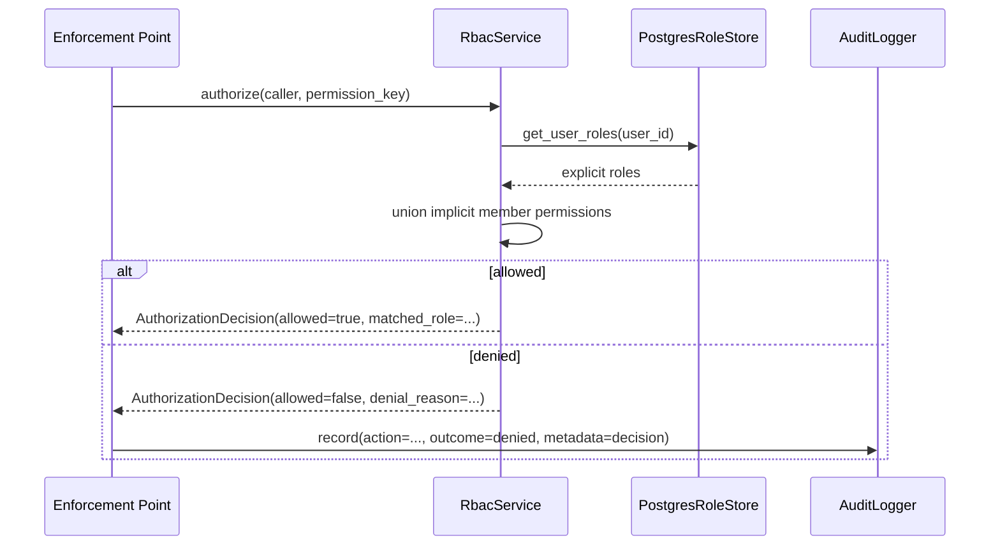
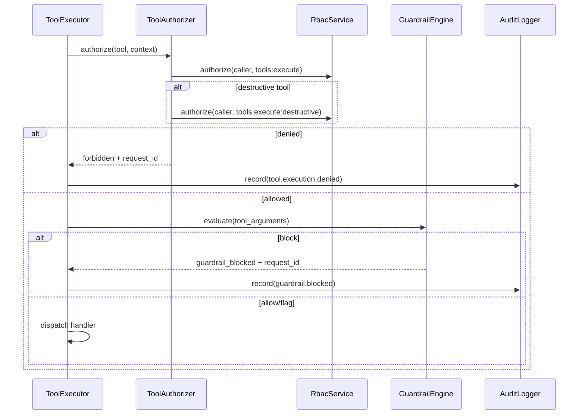
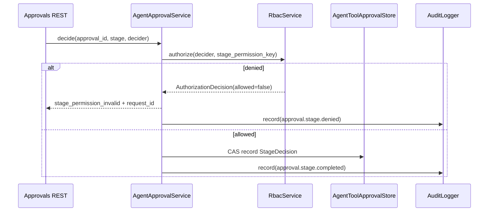
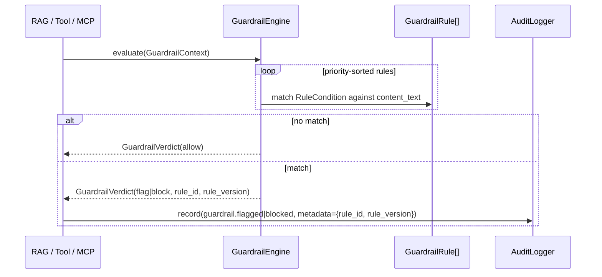
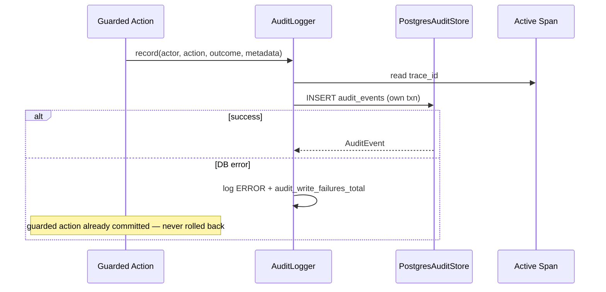

# Post-MVP V2 Epic 11 — Security & Governance

> **Agents:** Read [\_program-v2-execution-guide.md](./_program-v2-execution-guide.md). Implement **Part II** phase-by-phase; consult **Part I** for behaviour and scope questions only.

**Strategy:** [V2 architecture](../references/fullstack-ai-platform-v2-architecture-implementation-strategy.md) § "11. Security & Governance"

**Predecessor:** [Epic 10 — Background Jobs](./post-mvp-v2-epic-10-background-jobs.md)

---

# Part I — Design

## Objective

Introduce **real RBAC** (roles, permissions, per-caller authorization), a **platform-wide audit log**, a **secret-resolution abstraction**, **prompt-injection/content-safety guardrails**, and **extended rate limiting / usage quotas** — closing the single largest cluster of deferred gaps left behind by every prior V2 epic. Nine of the ten shipped epics explicitly named an Epic 11 gap: Epic 03 MCP deferred "enterprise RBAC/audit logs/rate limits" and a secret vault (`app/ai/mcp/auth.py`, `permissions.py`); Epic 04 Voice deferred RBAC, quotas, and a secret vault for voice sessions; Epic 07 Observability deferred audit-log ↔ `trace_id` correlation and rate-limit metrics; Epic 08 Plugins deferred plugin admin RBAC, an audit trail, and a secrets vault (`docs/plans/post-mvp-v2-epic-08-plugin-architecture.md` § Security Model); Epic 09 HITL deferred real per-role stage enforcement (`app/ai/hitl/rules.py` L215–216 — "any owner can satisfy any stage"), RBAC-based approval delegation, and SIEM export of the approval audit trail; Epic 10 Background Jobs explicitly wrote `TODO(epic-11):` at its own § Architectural Invariants ("No Epic 11+ behaviour early — RBAC-scoped job visibility, per-tenant isolation, rate limits on enqueue") and left `GET /api/jobs` visible to **any** authenticated caller by design. This epic closes every one of these named gaps without re-opening any frozen Part I contract from Epics 01/03/06/07/08/09/10.

**Delivers:** a `roles`/`permissions`/`role_permissions`/`user_role_assignments` RBAC data model (new `app/ai/security/rbac/` package) with four system-seeded roles (`owner`, `admin`, `operator`, `member`) and a flat, colon-namespaced permission-key vocabulary (`tools:execute`, `jobs:view_all`, `rbac:manage`, …) backed by a centralized `PERMISSION_REGISTRY`/`PermissionDefinition` metadata layer; an `RbacService` (with structured `AuthorizationDecision` objects and optional in-process permission cache) consulted by an RBAC-aware `ToolAuthorizer`, by HITL's `AgentApprovalService`/`ApprovalNodeExecutor` for real per-stage reviewer enforcement, and by the Jobs REST API for operator-only visibility; a platform-wide `audit_events` table and `AuditLogger` service governed by a canonical `AuditAction` taxonomy that records every authorization decision, role change, HITL decision, job retry, and guardrail verdict with a `trace_id` correlating to Epic 07's OpenTelemetry spans; a centralized `SecurityErrorCode` registry for consistent denial responses (including correlation IDs); a `SecretResolver` protocol (`EnvSecretResolver` the only V2 implementation — the vault swap point, mirroring `JobQueue`'s protocol/implementation split) that MCP credential resolution is rebased onto; a **shared rule engine** — `RuleCondition`/`RuleOperator`/`RuleEvaluator` extracted from `app/ai/hitl/rules.py` into `app/ai/security/rules_engine.py` (HITL re-exports for zero breakage) — reused by a new `GuardrailEngine` (versioned rules with stable `id`/`version`) that scans RAG chunks, tool arguments, and MCP tool results for prompt-injection/secret-leakage patterns (`flag` or `block`, config-driven, default `flag`); extended rate limiting (per-role HTTP multipliers, tool-invocation/job-enqueue/MCP-invocation/approval-decision per-minute limits) and a new generic `usage_quota_counters` table for the new quota types (existing `guest_quota_counters`/`upload_quota_counters` from Epic 01/02 are untouched); a **Security & Governance REST API** (`/api/security/roles`, `/api/security/audit`, `/api/security/policies`); observability (authorization/guardrail spans and metrics); adversarial eval scenarios (privilege escalation, prompt injection, secret leakage, rate-limit bypass); and a minimal frontend admin dashboard (roles, audit log, policy summary) — all behind `SECURITY_GOVERNANCE_ENABLED=false` (default), with four granular sub-flags for incremental adoption.

**Does not ship:** multi-tenant/organization-scoped RBAC (V2 RBAC is global per-user, single-tenant — matches every prior epic's "single-tenant posture"); a custom-role builder or a permission-editing admin UI (V2 ships four **system-seeded** roles only; `is_system=true` on every V2 row; custom roles are a documented future extension); a secret vault integration (AWS Secrets Manager / HashiCorp Vault / GCP Secret Manager) — `SecretResolver` is the swap point, `EnvSecretResolver` (today's `.env`-backed behaviour, unchanged) is the only V2 implementation; an ML/embedding-based prompt-injection classifier — `GuardrailEngine` is heuristic/pattern-based only, reusing the same regex/condition primitives Epic 09 already ships (see § Guardrail Approach); a SIEM export connector (Splunk/Datadog/etc.) — `audit_events` plus `trace_id` correlation is the foundation a future epic exports from; queue-backed/asynchronous audit writes (every audit write is a direct, synchronous, short Postgres transaction — no new Background Jobs dependency for the write path itself, though audit **retention cleanup** does reuse Epic 10's queue, see Locked Decisions); revoking a caller below the implicit `member` baseline (there is no "restricted" or "banned" role in V2 — see Locked Decisions "Implicit member baseline"); and per-tool, per-argument fine-grained authorization (RBAC gates two tiers only — `tools:execute` and `tools:execute:destructive` — not one permission per registered tool).

Capabilities:

- RBAC
- Tool authorization
- Prompt injection protection
- Secret management
- Audit logs
- Rate limiting
- Usage quotas
- Policy enforcement

The Security & Governance capability is additive and layered under four independently toggleable sub-flags beneath one master flag. When `SECURITY_GOVERNANCE_ENABLED=false`, every existing pipeline (auth, chat, RAG, MCP, memory, voice, agent, tool, workflow, plugin, HITL, background jobs, observability) behaves byte-for-byte as it does at the end of Epic 10: `ToolAuthorizer` remains "authenticated users only"; HITL `required_stages` remain an auditable checklist with no reviewer-identity enforcement; `GET /api/jobs` remains visible to any authenticated caller; MCP credentials resolve from `os.environ` exactly as today; no `audit_events` row is ever written; no guardrail scan ever runs; HTTP rate limits and quotas are exactly Epic 01/02's existing `SlidingWindowRateLimiter`/`QuotaService` behaviour.

---

## Design Principles

- Platform-first — one `RbacService` consulted by every authorization decision point (tools, HITL stages, jobs visibility, future plugin/workflow admin surfaces), not a bespoke permission check per feature (mirrors Epic 10's "one queue, many consumers")
- Composition over coupling — RBAC, audit, secrets, and guardrails are four **independent** sub-capabilities behind four sub-flags; a caller can enable audit logging without enforcing RBAC, or enable guardrails without either
- Shared primitives over duplicated DSLs — the exact `RuleCondition`/`RuleOperator`/`RuleEvaluator` engine Epic 09 built for `ApprovalRule` is extracted and reused verbatim by `GuardrailRule`; no second rule-condition grammar is invented
- No new infrastructure — RBAC/audit/quota data lives in the same PostgreSQL instance every other durable table already uses; no external policy engine (OPA), no vault service, no SIEM connector, no ML model server
- Interface-driven — `RoleStore`, `AuditStore`, and `SecretResolver` are the only three new persistence/resolution contracts; `RbacService`, `AuditLogger`, and `GuardrailEngine` are the only three new service-layer entry points callers depend on
- Fail-safe, not fail-silent — an authorization denial, a guardrail block, and a rate-limit rejection all produce a typed error **and** an audit event; nothing is silently dropped
- Fail-open on adoption, not on production defaults — every sub-flag defaults to `true` **once the master flag is on**, but the master flag itself defaults to `false`; an operator who has not explicitly enabled Security & Governance sees zero behavioural change
- Additive data model — every existing table (`users`, `agent_tool_approvals`, `background_jobs`, `guest_quota_counters`, `upload_quota_counters`) is read, never altered; new quota types live in a new generic table rather than bespoke per-type tables (see Locked Decisions "New quota table")
- Idempotent bootstrap — RBAC role/permission seed data and the config-driven admin bootstrap (`security_bootstrap_admin_emails`) are safe to re-run on every startup
- Avoid over-engineering — four system roles, not a custom-role builder; heuristic guardrail rules, not an ML classifier; an env-backed `SecretResolver`, not a vault integration; in-memory rate limiting extended in place, not a Redis migration
- Feature-flag rollout, granular by design — one master flag gates the epic; four sub-flags let an operator adopt RBAC enforcement, audit logging, guardrails, and rate-limit extensions independently and in any order

---

## Scope

### In Scope

- Security & Governance core (`app/ai/security/`): RBAC (`rbac/`), audit (`audit/`), secrets (`secrets/`), guardrails (`guardrails/`), and the extracted shared `rules_engine.py`
- `SECURITY_GOVERNANCE_ENABLED` feature flag (default `false`) plus four sub-flags: `security_rbac_enforcement_enabled`, `security_audit_log_enabled`, `security_guardrails_enabled`, `security_rate_limit_extensions_enabled` (all default `true`, consulted only when the master flag is `true`)
- New tables: `roles`, `permissions`, `role_permissions`, `user_role_assignments`, `audit_events`, `usage_quota_counters` (Postgres)
- **RBAC** — four system-seeded roles (`owner`, `admin`, `operator`, `member`); every authenticated `User` implicitly holds `member` even with zero assignment rows (see Locked Decisions "Implicit member baseline"); explicit `user_role_assignments` rows are additive elevations only; a config-driven bootstrap (`security_bootstrap_admin_emails`) idempotently grants `owner` to matching emails at startup
- **Tool authorization v2** — `ToolAuthorizer` becomes RBAC-aware: `tools:execute` (baseline, held by `member`) gates all tool calls exactly as "authenticated users only" does today; a new `tools:execute:destructive` permission (held by `operator`/`admin`/`owner`, **not** `member`) additionally gates any `ToolDefinition` with `risk_level="high"` or `category="destructive"` — a deliberate behaviour change, only active when `security_rbac_enforcement_enabled=true` (see Implementation Risks)
- **HITL per-stage RBAC** — `required_stages` entries become permission keys (e.g. `"approvals:decide:finance"`); `AgentApprovalService.decide()` and `ApprovalNodeExecutor` verify the deciding user holds the stage's permission before recording that `StageDecision`, closing `app/ai/hitl/rules.py` L215–216 and `app/ai/hitl/models.py` L44
- **Jobs visibility RBAC** — `GET /api/jobs`/`GET /api/jobs/{id}`/`GET /api/jobs/schedules` require `jobs:view_all`; `POST /api/jobs/{id}/retry` requires `jobs:retry` (both held by `operator`/`admin`/`owner`), closing Epic 10's named "RBAC-scoped job visibility" gap
- **Global audit log** — `AuditLogger.record()` called from auth (login), RBAC (role assign/revoke), tool execution (authorization denials), HITL (decisions, stage decisions), jobs (manual retry), MCP (permission denials), and guardrails (flag/block verdicts); every event carries the active OTel `trace_id` (closing Epic 07's deferred audit↔trace correlation) and a redacted `metadata` payload (ids/scalars only, same posture as Epic 10's job `payload`/`result`)
- **Secret resolution** — `SecretResolver` protocol; `EnvSecretResolver` (V2's only implementation, wraps `Settings`/`os.environ`, byte-for-byte today's behaviour); MCP credential resolution (`app/ai/mcp/auth.py`) rebased onto it; a consolidated `app/ai/security/redaction.py` allowlist reused by logging, HITL, jobs, and the new audit log (replacing four independently-maintained redaction implementations with one)
- **Shared rule engine** — `RuleCondition`/`RuleOperator`/`RuleEvaluator` moved from `app/ai/hitl/rules.py` to `app/ai/security/rules_engine.py`; `app/ai/hitl/rules.py` re-exports the same names (no import-path break, no Epic 09 public API change)
- **Prompt-injection / content-safety guardrails** — `GuardrailEngine` evaluates `GuardrailRule` trees (built on the shared rule engine) against RAG-retrieved chunk text, stringified tool call arguments, and raw MCP tool results; verdict is `allow`/`flag`/`block` per rule, with a platform default mode (`security_guardrails_mode="flag"`); ships 4–6 default heuristic rules (prompt-injection phrasing, secret-shaped tokens) plus operator-extensible `security_guardrail_rules` config (same list-of-dicts convention as `hitl_policy_rules`)
- **Rate limiting & usage quota extensions** — per-role HTTP rate-limit multipliers (`security_role_rate_limit_multipliers`); new per-minute limits for tool invocation, MCP invocation, background-job enqueue, and HITL approval decisions; new generic `usage_quota_counters` table for these new quota types (Epic 01/02's `guest_quota_counters`/`upload_quota_counters` untouched)
- Security & Governance REST API — role listing/assignment/revocation, audit-log query, and a read-only aggregated policy summary (`/api/security/policies`)
- Observability hooks — `authz_span`/`guardrail_span`; **authorization metrics** (`authz_denied_total`, `role_assignments_total`) separate from **guardrail metrics** (`guardrail_verdicts_total`) and **audit metrics** (`audit_events_total`) — see § Observability
- Evaluation cases exercising each control's happy path plus adversarial/edge cases (privilege escalation attempt, prompt-injection payload, secret-shaped argument, rate-limit bypass attempt, concurrent role-revocation race)
- Minimal read-only-plus-role-management frontend Security dashboard (Roles tab, Audit Log tab, Policies tab)

### Out of Scope

- Multi-tenant/organization-scoped roles and per-tenant data isolation — V2 RBAC is global per-user; a future multi-tenant epic introduces `tenant_id` scoping across this epic's tables (additive-extensible schema, not implemented now)
- A custom-role builder / permission-editing admin UI — the four system roles and their seeded permission matrix are fixed in V2; `POST /api/security/roles` (create a new role) is a documented future extension, not built
- A real secret vault (AWS Secrets Manager, HashiCorp Vault, GCP Secret Manager, or any KMS-backed encryption-at-rest) — `SecretResolver` is the swap point only
- An ML/embedding-based prompt-injection or toxicity classifier — heuristic pattern rules only, per § Guardrail Approach
- A SIEM/export connector (Splunk, Datadog Security, Elastic SIEM) — `audit_events` is the source table a future epic exports from
- Per-tool (as opposed to per-risk-tier) authorization — no `tools:execute:web_search`-style one-permission-per-tool model
- Redis-backed (or otherwise externally shared) rate limiting — the existing in-memory `SlidingWindowRateLimiter` is extended in place; a distributed backend is a documented future extension, same posture as Epic 10's `JobQueue` Postgres-vs-Redis framing
- Queue-backed (asynchronous) audit-event writes on the hot path — writes are synchronous, short transactions; only **retention cleanup** of old `audit_events` rows is queue-backed (via Epic 10's `JobQueue`, when both flags are enabled)
- Voice-session-specific RBAC/quota enforcement beyond the generic rate-limit/quota extension applied uniformly (Epic 04's voice-specific deferred items beyond that are not separately re-scoped here)
- A "restricted"/"banned" role below `member`, or any permission-revocation model — RBAC in V2 only grants; see Locked Decisions "Implicit member baseline"
- Encrypting `agent_tool_approvals`/`background_jobs`/other existing tables' contents at rest — out of this epic's storage-layer scope

---

## High-Level Architecture

```text
                    ┌──────────────────────────────┐
                    │           RbacService          │
                    │ has_permission / get_permissions│
                    │ assign_role / revoke_role       │
                    └───────────────┬─────────────────┘
                                    │ backed by
                                    ▼
                    ┌──────────────────────────────┐
                    │        PostgresRoleStore        │
                    │ roles · permissions ·           │
                    │ role_permissions ·               │
                    │ user_role_assignments            │
                    └───────────────┬─────────────────┘
          consulted by              │              consulted by
   ┌──────────────────┬─────────────┼─────────────┬──────────────────┐
   ▼                  ▼             ▼             ▼                  ▼
ToolAuthorizer   AgentApprovalService   Jobs REST   /api/security/*  (future: plugin/
(tools:execute,  (per-stage             (jobs:view_all,  admin router  workflow admin)
 :destructive)    permission check)      :retry)

                    ┌──────────────────────────────┐
                    │      Shared Rule Engine         │
                    │ RuleCondition / RuleOperator /  │
                    │ RuleEvaluator (moved from HITL) │
                    └───────┬──────────────────┬──────┘
                            │ reused by         │ reused by
                            ▼                   ▼
                 RulePolicyEngine        GuardrailEngine
                 (HITL — unchanged        (NEW — scans RAG chunks,
                  public shape)            tool args, MCP results)
                                                  │
                                                  ▼
                                       allow / flag / block verdict

                    ┌──────────────────────────────┐
                    │          AuditLogger             │
                    │  record(actor, action, outcome, │
                    │  resource, metadata, trace_id)   │
                    └───────────────┬─────────────────┘
                                    ▼
                              audit_events
                     (queried by /api/security/audit;
                      retention-cleaned by Background
                      Jobs when BACKGROUND_JOBS_ENABLED)

                    ┌──────────────────────────────┐
                    │        SecretResolver            │
                    │  EnvSecretResolver (V2 only impl)│
                    └───────────────┬─────────────────┘
                                    ▼
                     McpServerCredentials · provider API
                     keys · webhook URLs (unchanged values,
                     new indirection layer)

    SlidingWindowRateLimiter (extended)         usage_quota_counters (NEW)
    + security_role_rate_limit_multipliers      (tool_invocation, job_enqueue,
    + tool/job/mcp/approval per-minute limits    mcp_invocation, approval_decision)
```

**One authorization contract, many enforcement points:** `RbacService.authorize()` (and its boolean convenience wrapper `has_permission()`) is consulted identically regardless of _which_ surface is asking — a tool dispatch, a HITL stage decision, or a Jobs REST request all funnel through the same authorization path, mirroring Epic 10's "one queue, many consumers" invariant one layer up the stack.

---

## Sequence Diagrams

### RBAC Permission Check



### Tool Authorization



### HITL Stage Decision



### Guardrail Evaluation



### Audit Logging



---

## Locked Architectural Decisions

| Topic                                 | Decision                                                                                                                                                                                                                                                                                                                                                                                                                                                                                                                      | Deferred to                                                                                                              |
| ------------------------------------- | ----------------------------------------------------------------------------------------------------------------------------------------------------------------------------------------------------------------------------------------------------------------------------------------------------------------------------------------------------------------------------------------------------------------------------------------------------------------------------------------------------------------------------- | ------------------------------------------------------------------------------------------------------------------------ |
| RBAC scope                            | Global per-user, single-tenant — no `tenant_id`/organization scoping; matches every prior V2 epic's single-tenant posture                                                                                                                                                                                                                                                                                                                                                                                                     | Multi-tenant/org-scoped RBAC → future                                                                                    |
| Role set                              | Exactly four system-seeded roles: `owner`, `admin`, `operator`, `member`; `roles.is_system=true` for all V2 rows                                                                                                                                                                                                                                                                                                                                                                                                              | Custom role creation UI → future                                                                                         |
| Implicit member baseline              | Every row in `users` implicitly holds `member`'s permission set even with **zero** `user_role_assignments` rows — `RbacService.get_permissions()` always unions the implicit `member` set with any explicit elevations; there is no way to hold fewer permissions than `member` in V2                                                                                                                                                                                                                                         | A "restricted"/"suspended" role below `member` → future                                                                  |
| Guest permissions                     | Guests (`CallerContext.kind == "guest"`) never hold any role or permission — `RbacService.get_permissions()` short-circuits to the empty set for non-authenticated callers, preserving today's "guests denied tool execution" behaviour exactly                                                                                                                                                                                                                                                                               | —                                                                                                                        |
| Bootstrap admin                       | `security_bootstrap_admin_emails: list[str]` — at startup, any `users` row whose `email` matches (case-insensitive) is idempotently granted `owner` if not already held; solves the "who assigns the first admin" bootstrap problem without a manual SQL step                                                                                                                                                                                                                                                                 | A dedicated CLI/setup-wizard bootstrap flow → future                                                                     |
| Permission naming                     | Colon-namespaced `{resource}:{action}` (e.g. `tools:execute`, `jobs:view_all`, `rbac:manage`) — deliberately distinct from Background Jobs' `snake_case` `job_type` convention and from HITL's dotted `PolicyContext` field paths, matching common IAM/RBAC conventions                                                                                                                                                                                                                                                       | —                                                                                                                        |
| Tool authorization tiers              | Exactly two tiers: `tools:execute` (baseline — replaces today's "authenticated only" check, held by `member`+) and `tools:execute:destructive` (gates `risk_level="high"` or `category="destructive"` tools, held by `operator`+ only) — not one permission per tool                                                                                                                                                                                                                                                          | Per-tool fine-grained permissions → future                                                                               |
| HITL stage permission mapping         | `ApprovalRule.required_stages` entries are permission keys evaluated against the **deciding user**, not the approval's owner; a stage named `"approvals:decide:finance"` requires the decider to hold that exact key; unmapped/legacy stage strings that are not valid permission keys fail closed (decision rejected with `stage_permission_invalid`) rather than silently passing                                                                                                                                           | Stage-to-role visual mapping UI → future                                                                                 |
| Jobs visibility model                 | `jobs:view_all` (list/detail/schedules) and `jobs:retry` (manual retry) are the only two new job permissions; V2 does not introduce per-job ownership (jobs remain system-level per Epic 10) — a caller either sees all jobs or none                                                                                                                                                                                                                                                                                          | Per-job ownership / tenant-scoped job visibility → future                                                                |
| Audit write transaction               | Every `AuditLogger.record()` call is a **synchronous, independent, short transaction** — never wrapped in the same transaction as the guarded action, so an audit-write failure never rolls back a successful tool call/decision/retry; a failed audit write is logged at `ERROR` and increments `audit_write_failures_total`, but never raises to the caller (fail-open for availability, matching HITL notification's "best-effort, never raise" precedent — but unlike notifications, a write failure is loud, not silent) | Guaranteed-delivery (queue-backed) audit writes → future                                                                 |
| Audit retention                       | `security_audit_retention_days` (default `365`); cleanup runs as a new `security_audit_retention_cleanup` Background Jobs handler (job_type `snake_case`, reusing Epic 10's `JobQueue`/`JobScheduler`) — **only** ticks when both `SECURITY_GOVERNANCE_ENABLED=true` and `BACKGROUND_JOBS_ENABLED=true`; if Background Jobs is disabled, `audit_events` grows unbounded until an operator enables it or runs a manual cleanup (documented operational note, not a blocker)                                                    | A hard dependency on Background Jobs (mandatory, not optional) → future, only if audit volume requires it                |
| Secret resolution                     | `SecretResolver` protocol; `EnvSecretResolver` (byte-for-byte today's `Settings`/`os.environ` behaviour) is the only V2 implementation; `McpServerCredentials.resolve_credential_env_vars()` is rebased onto it as the first (and only, in V2) consumer                                                                                                                                                                                                                                                                       | A vault-backed `SecretResolver` implementation (AWS/GCP/Vault) → future, swap-in only                                    |
| Redaction consolidation               | `app/ai/security/redaction.py` becomes the single allowlist/pattern source; `app/core/logging.sanitize_value`, `app/ai/hitl/models.py`'s redact helpers, and `app/schemas/jobs.py`'s redact helpers are refactored to call it (same behaviour, one implementation) rather than maintaining four independent copies                                                                                                                                                                                                            | —                                                                                                                        |
| Shared rule engine                    | `RuleCondition`/`RuleOperator`/`RuleEvaluator` move from `app/ai/hitl/rules.py` to `app/ai/security/rules_engine.py`; `hitl/rules.py` re-exports the identical names so `from app.ai.hitl.rules import RuleCondition` continues to work — a pure relocation plus reuse, not a behavioural change to `ApprovalRule`/`RulePolicyEngine`                                                                                                                                                                                         | Publishing the rule engine as a documented standalone platform primitive (own docs page) → future                        |
| Guardrail approach                    | Heuristic, config-driven regex/condition rules only (reusing the shared rule engine's `REGEX` operator against a `content_text` field) — no ML classifier, no embedding-similarity detector, no external moderation API call                                                                                                                                                                                                                                                                                                  | An ML-based or provider-moderation-API guardrail → future, additive alternate `GuardrailEngine` implementation           |
| Guardrail default mode                | `security_guardrails_mode="flag"` platform-wide default — a matching rule logs + audits + increments a metric but **does not** block content; an individual `GuardrailRule.action` can still be `block` to hard-stop known-dangerous patterns (e.g. secret-shaped tokens in tool arguments) regardless of the platform default                                                                                                                                                                                                | Per-surface (RAG vs tool vs MCP) independent default modes → future                                                      |
| Guardrail failure posture             | A `block` verdict on a RAG chunk **excludes only that chunk** from context (never fails the whole chat response); a `block` verdict on a tool argument **denies that tool call** (`error_code="guardrail_blocked"`, same shape as an authorization denial); a `block` verdict on an MCP result **replaces the result** with a redacted safe placeholder rather than propagating untrusted content into the agent loop                                                                                                         | —                                                                                                                        |
| Rate limit extension model            | Existing `SlidingWindowRateLimiter`/`WINDOW_SECONDS=60` sliding-window primitive is reused for all four new per-minute limits (tool invocation, MCP invocation, job enqueue, approval decision) — new bucket keys (`tool:{user_id}`, `mcp:{user_id}`, `job_enqueue:{user_id}`, `approval_decision:{user_id}`), not a new limiter implementation                                                                                                                                                                               | A distributed (Redis) rate-limit backend → future, same framing as Epic 10's `JobQueue` swap point                       |
| Role rate-limit multipliers           | `security_role_rate_limit_multipliers: dict[str, float]` (e.g. `{"owner": 10.0, "admin": 5.0, "operator": 3.0}`) multiply the caller's base per-minute HTTP limit; a role with no entry uses `1.0` (no change from today's flat `rate_limit_authenticated_per_minute`)                                                                                                                                                                                                                                                        | Per-endpoint (not just per-role) rate-limit overrides → future                                                           |
| New quota table                       | New quota types (tool invocation, job enqueue, MCP invocation, approval decision — all **daily** ceilings, separate from the **per-minute** rate limits above) use a new generic `usage_quota_counters(subject_id, quota_type, day, count)` table rather than a fifth bespoke per-type table like Epic 01's `guest_quota_counters`/Epic 02's `upload_quota_counters`; those two existing tables are untouched, no data migration                                                                                              | Migrating `guest_quota_counters`/`upload_quota_counters` onto the generic table → future, only if a concrete need arises |
| Concurrency (role/permission changes) | Role assignment/revocation uses simple insert/delete (no `version` column needed — a `user_role_assignments` row either exists or does not; a concurrent double-assign is a harmless no-op via `ON CONFLICT DO NOTHING` on `(user_id, role_id)`, a concurrent double-revoke is a harmless no-op via `DELETE … WHERE` matching zero rows)                                                                                                                                                                                      | —                                                                                                                        |
| Payload/metadata content              | `audit_events.metadata` follows the exact same posture as Epic 10's job `payload`/`result`: ids, small scalars, short strings only — never file bytes, credentials, secrets, or full tool-argument payloads                                                                                                                                                                                                                                                                                                                   | —                                                                                                                        |
| Sub-flag independence                 | Any of the four sub-flags (`security_rbac_enforcement_enabled`, `security_audit_log_enabled`, `security_guardrails_enabled`, `security_rate_limit_extensions_enabled`) may be `false` while `SECURITY_GOVERNANCE_ENABLED=true` and the others are `true` — each enforcement point checks its own sub-flag independently, never assumes another sub-flag's state                                                                                                                                                               | —                                                                                                                        |
| Permission metadata registry          | `PermissionKey` is a str enum; rich metadata lives in a centralized in-code `PERMISSION_REGISTRY: dict[PermissionKey, PermissionDefinition]` (display name, description, category, risk level, `reserved` flag) — single source of truth for migration seed, REST responses, and future admin UI; DB `permissions.description` is seeded from the registry (no separate metadata columns in V2)                                                                                                                               | Per-permission DB metadata columns → future, only if hot-reload without deploy is required                               |
| Authorization decision object         | `RbacService.authorize()` returns a structured `AuthorizationDecision` (`allowed`, `permission_key`, `matched_role`, `matched_permission`, `denial_reason`); `has_permission()` is a boolean wrapper delegating to `authorize().allowed` — audit logging and observability consume the decision object                                                                                                                                                                                                                        | A full external policy engine (OPA/Cedar) → future                                                                       |
| Guardrail rule identity               | Every `GuardrailRule` carries a stable `id` (slug), monotonic `version` int, and optional `created_at`; audit events and metrics reference `{rule_id, rule_version}` for reproducible forensics                                                                                                                                                                                                                                                                                                                               | Hot-reload of guardrail rules without restart → future                                                                   |
| Authorization error correlation       | Every security-related denial response includes the active `request_id` from `LogContext` in the JSON error envelope — maps directly to `audit_events.request_id` and structured logs                                                                                                                                                                                                                                                                                                                                         | —                                                                                                                        |
| Security error codes                  | All security-related API errors use a closed set of `SecurityErrorCode` constants registered in `app/ai/security/errors.py` — reused by routers and enforcement points                                                                                                                                                                                                                                                                                                                                                        | —                                                                                                                        |
| RBAC permission cache                 | Optional in-process permission cache with short TTL (`security_rbac_cache_ttl_seconds`, default `60`) keyed by `user_id`; invalidated on role assign/revoke for that user; disabled when `0`                                                                                                                                                                                                                                                                                                                                  | Distributed cache (Redis) → future, only if multi-replica DB load becomes measurable                                     |

---

## RBAC Domain Model

New tables **`roles`**, **`permissions`**, **`role_permissions`**, **`user_role_assignments`** (Postgres) and mirrored Pydantic models `Role`, `Permission`, `UserRoleAssignment`:

### `roles` Schema

| Field                       | Type           | Notes                                                                                     |
| --------------------------- | -------------- | ----------------------------------------------------------------------------------------- |
| `id`                        | `uuid`         | Primary key                                                                               |
| `name`                      | `text`, unique | `owner` \| `admin` \| `operator` \| `member` in V2                                        |
| `description`               | `text`         | Human-readable                                                                            |
| `is_system`                 | `boolean`      | `true` for all V2 rows — a future custom-role feature would insert `is_system=false` rows |
| `created_at` / `updated_at` | `timestamptz`  | Standard bookkeeping                                                                      |

### `permissions` Schema

| Field         | Type           | Notes                                  |
| ------------- | -------------- | -------------------------------------- |
| `id`          | `uuid`         | Primary key                            |
| `key`         | `text`, unique | Colon-namespaced, e.g. `tools:execute` |
| `description` | `text`         | Human-readable                         |

**V2 permission vocabulary** — two complementary artifacts in `app/ai/security/rbac/permissions.py`:

1. **`PermissionKey`** — str enum of colon-namespaced keys (the runtime/check vocabulary).
2. **`PERMISSION_REGISTRY`** — centralized metadata registry (`dict[PermissionKey, PermissionDefinition]`), the single source of truth for descriptions, categories, risk levels, and the `reserved` flag. Migration seed data, REST responses, and future admin UI all derive from this registry — never duplicate permission descriptions elsewhere.

```python
class PermissionDefinition(BaseModel):
    key: PermissionKey
    display_name: str           # e.g. "Execute Tools"
    description: str            # human-readable purpose
    category: Literal["rbac", "audit", "policy", "jobs", "approvals", "tools", "plugins", "workflow", "mcp"]
    risk_level: Literal["low", "medium", "high"]
    reserved: bool = False      # True → seeded but not enforced in V2

PERMISSION_REGISTRY: dict[PermissionKey, PermissionDefinition] = { ... }
```

| Key                         | Display name               | Category  | Risk   | Reserved | Held by                                |
| --------------------------- | -------------------------- | --------- | ------ | -------- | -------------------------------------- |
| `*`                         | All Permissions (wildcard) | rbac      | high   | No       | `owner` only                           |
| `rbac:manage`               | Manage Roles               | rbac      | high   | No       | `owner`, `admin`                       |
| `audit:view`                | View Audit Log             | audit     | medium | No       | `owner`, `admin`, `operator`           |
| `policy:view`               | View Policy Summary        | policy    | low    | No       | `owner`, `admin`, `operator`           |
| `jobs:view_all`             | View Background Jobs       | jobs      | medium | No       | `owner`, `admin`, `operator`           |
| `jobs:retry`                | Retry Dead-Letter Jobs     | jobs      | high   | No       | `owner`, `admin`, `operator`           |
| `approvals:decide_all`      | Decide Any Approval        | approvals | high   | No       | `owner`, `admin`                       |
| `tools:execute`             | Execute Tools              | tools     | low    | No       | `owner`, `admin`, `operator`, `member` |
| `tools:execute:destructive` | Execute Destructive Tools  | tools     | high   | No       | `owner`, `admin`, `operator`           |
| `plugins:manage`            | Manage Plugins             | plugins   | high   | **Yes**  | `owner`, `admin`                       |
| `workflow:view_all`         | View All Workflows         | workflow  | medium | **Yes**  | `owner`, `admin`                       |
| `mcp:manage`                | Manage MCP Servers         | mcp       | high   | **Yes**  | `owner`, `admin`                       |

`plugins:manage`/`workflow:view_all`/`mcp:manage` are seeded now (so the permission vocabulary is stable and future epics do not need a new migration just to add a permission row) but are **not enforced anywhere in V2** — no endpoint currently checks them. This mirrors Epic 09's "reserved but unimplemented" `ApprovalStatus.CANCELLED` precedent.

### `role_permissions` Schema (join table)

| Field           | Type                       | Notes |
| --------------- | -------------------------- | ----- |
| `role_id`       | `uuid` FK `roles.id`       |       |
| `permission_id` | `uuid` FK `permissions.id` |       |

Composite primary key `(role_id, permission_id)`.

### `user_role_assignments` Schema

| Field         | Type                                      | Notes                                             |
| ------------- | ----------------------------------------- | ------------------------------------------------- |
| `id`          | `uuid`                                    | Primary key                                       |
| `user_id`     | `uuid` FK `users.id`, `ON DELETE CASCADE` | The user gaining the role                         |
| `role_id`     | `uuid` FK `roles.id`                      | The granted role                                  |
| `assigned_by` | `uuid` \| `null` FK `users.id`            | `null` for migration-seeded/bootstrap assignments |
| `assigned_at` | `timestamptz`                             |                                                   |

Unique constraint `(user_id, role_id)` — a user cannot hold the same role twice; `RbacService.assign_role()` treats a unique-violation as "already assigned" (idempotent, same posture as Epic 10's `idempotency_key` handling).

**`RbacService`** (`app/ai/security/rbac/service.py`) — the only service-layer entry point other subsystems depend on:

```python
@dataclass(frozen=True)
class AuthorizationDecision:
    allowed: bool
    permission_key: str
    matched_role: str | None = None       # highest-priority role that granted access
    matched_permission: str | None = None # the permission that matched (may differ from requested key when "*" wildcard)
    denial_reason: str | None = None      # human-readable, safe for audit metadata


class RbacService:
    async def authorize(self, caller: CallerContext, permission_key: str) -> AuthorizationDecision:
        """Structured authorization decision — primary API for audit/observability."""

    async def has_permission(self, caller: CallerContext, permission_key: str) -> bool:
        """Boolean convenience wrapper — delegates to authorize().allowed."""

    async def get_permissions(self, caller: CallerContext) -> frozenset[str]:
        """Guests -> empty set. Authenticated users -> implicit 'member' ∪ explicit role permissions."""

    async def assign_role(self, *, user_id: UUID, role_name: str, assigned_by: UUID | None) -> UserRoleAssignment: ...

    async def revoke_role(self, *, user_id: UUID, role_name: str) -> None: ...

    async def list_roles(self) -> list[Role]: ...

    async def get_user_roles(self, user_id: UUID) -> list[Role]: ...

    async def get_permission_registry(self) -> dict[PermissionKey, PermissionDefinition]:
        """Return the full PERMISSION_REGISTRY for REST/admin UI consumption."""

    async def bootstrap_admins(self) -> None:
        """Idempotently grant 'owner' to users whose email matches security_bootstrap_admin_emails."""
```

Enforcement points call `authorize()` (not `has_permission()` directly) when they need to emit audit events or populate denial responses — the decision object's `denial_reason`/`matched_role` flow directly into `AuditLogger.record()` metadata and `authz_span` attributes without re-deriving context.

### Permission Relationships

High-level permissions imply specific enforcement surfaces — document these relationships to aid permission reviews and prevent accidental privilege escalation:

```text
rbac:manage
├── POST   /api/security/users/{id}/roles        (role assignment)
├── DELETE /api/security/users/{id}/roles/{name}   (role revocation)
└── GET    /api/security/roles                   (role listing)

audit:view
├── GET /api/security/audit                      (filtered listing)
└── GET /api/security/audit/{id}                 (event detail)

policy:view
└── GET /api/security/policies                   (aggregated policy summary)

jobs:view_all
├── GET /api/jobs                                (list)
├── GET /api/jobs/{id}                           (detail)
└── GET /api/jobs/schedules                      (schedules list)

jobs:retry
└── POST /api/jobs/{id}/retry                    (dead-letter retry only)

tools:execute
└── ToolExecutor dispatch (non-destructive tools)

tools:execute:destructive
└── ToolExecutor dispatch (risk_level=high OR category=destructive)

approvals:decide_all
└── AgentApprovalService.decide() / ApprovalNodeExecutor (bypass stage mapping)

plugins:manage / workflow:view_all / mcp:manage
└── (reserved — no V2 enforcement surface yet)
```

A caller holding `rbac:manage` does **not** implicitly hold `audit:view`, `jobs:view_all`, or any other permission — permissions are flat and independent in V2 (no inheritance tree beyond the implicit `member` baseline). Future custom-role support may introduce explicit permission bundles; the registry's `category` field groups related keys for UI/review purposes only.

---

## Audit Log Domain Model

New table **`audit_events`** (Postgres) and mirrored Pydantic model `AuditEvent`:

| Field            | Type                          | Notes                                                                                                                                                    |
| ---------------- | ----------------------------- | -------------------------------------------------------------------------------------------------------------------------------------------------------- |
| `id`             | `uuid`                        | Primary key                                                                                                                                              |
| `occurred_at`    | `timestamptz`                 | Server-assigned, not client-supplied                                                                                                                     |
| `actor_user_id`  | `uuid` \| `null`              | `null` for guest/system-initiated events                                                                                                                 |
| `actor_kind`     | `text` CHECK                  | `user` \| `guest` \| `system` (sweeps/schedulers are `system`)                                                                                           |
| `action`         | `text`                        | `{resource}.{verb}` convention, e.g. `role.assigned`, `tool.execution.denied`, `approval.decided`, `job.retried`, `guardrail.blocked`, `login.succeeded` |
| `resource_type`  | `text` \| `null`              | e.g. `tool`, `approval`, `job`, `role`, `guardrail`                                                                                                      |
| `resource_id`    | `text` \| `null`              | Free-form id/name — never a full payload                                                                                                                 |
| `outcome`        | `text` CHECK (`AuditOutcome`) | `success` \| `denied` \| `error`                                                                                                                         |
| `metadata`       | `jsonb`                       | Ids/scalars/short strings only — see § Locked Decisions "Payload/metadata content"                                                                       |
| `request_id`     | `text` \| `null`              | Correlates to `app/core/logging.py`'s `LogContext.request_id`                                                                                            |
| `trace_id`       | `text` \| `null`              | Correlates to the active OTel span (when `OBSERVABILITY_ENABLED`)                                                                                        |
| `source_ip_hash` | `text` \| `null`              | Same `hash_ip()` helper HITL's client-audit fields already use — never a raw IP                                                                          |
| `created_at`     | `timestamptz`                 | Row-insert bookkeeping (distinct from `occurred_at` in the rare case of a retried/backfilled write)                                                      |

**`AuditLogger`** (`app/ai/security/audit/logger.py`):

```python
class AuditLogger:
    async def record(
        self,
        *,
        actor: CallerContext | None,
        action: str,
        outcome: AuditOutcome,
        resource_type: str | None = None,
        resource_id: str | None = None,
        metadata: dict[str, Any] | None = None,
        request: Request | None = None,
    ) -> None:
        """Insert one audit_events row in its own short transaction.

        Never raises: a DB error is logged at ERROR + increments
        audit_write_failures_total, and record() returns normally so the
        guarded action's outcome is never affected by an audit-write failure.
        """
```

`resource_type`/`action`/`outcome` are the only three fields with bounded cardinality — safe to use as metric labels; `resource_id`/`request_id`/`trace_id` are unbounded and are span/row attributes only, never metric labels (same invariant Epic 10 established for `job_id`).

### Audit Event Taxonomy

All `audit_events.action` values follow a canonical `{resource}.{verb}` or `{resource}.{subresource}.{verb}` naming convention. New actions must be added to this table (and to the `AuditAction` str enum in `app/ai/security/audit/actions.py`) before use — no ad-hoc action strings in application code.

**Naming rules:**

- Lowercase, dot-separated segments
- Resource noun first, verb last
- Denials use `.denied` suffix; successes use past-tense verb (`.assigned`, `.decided`, `.succeeded`)
- Guardrail events prefix with `guardrail.`

| Category        | Action                      | Resource type | Outcome   | When emitted                          |
| --------------- | --------------------------- | ------------- | --------- | ------------------------------------- |
| **RBAC**        | `role.assigned`             | `role`        | `success` | Role granted to a user                |
|                 | `role.revoked`              | `role`        | `success` | Role removed from a user              |
| **Auth**        | `login.succeeded`           | `user`        | `success` | Successful Google OAuth login         |
| **Tools**       | `tool.execution.denied`     | `tool`        | `denied`  | RBAC or guest denial before dispatch  |
|                 | `tool.execution.succeeded`  | `tool`        | `success` | Optional — high-risk tools only in V2 |
| **HITL**        | `approval.decided`          | `approval`    | `success` | Terminal approval decision recorded   |
|                 | `approval.stage.completed`  | `approval`    | `success` | One `required_stages` step satisfied  |
|                 | `approval.stage.denied`     | `approval`    | `denied`  | Stage permission check failed         |
| **Jobs**        | `job.retried`               | `job`         | `success` | Manual dead-letter retry              |
| **MCP**         | `mcp.permission.denied`     | `mcp_tool`    | `denied`  | `McpPermissionPolicy` denial          |
| **Guardrails**  | `guardrail.flagged`         | `guardrail`   | `success` | Content flagged (allowed through)     |
|                 | `guardrail.blocked`         | `guardrail`   | `denied`  | Content blocked                       |
| **Secrets**     | `secret.resolution.missing` | `secret`      | `error`   | `SecretResolver` key not found        |
| **Rate limits** | `rate_limit.exceeded`       | `rate_limit`  | `denied`  | Per-minute or HTTP limit hit          |

`AuditLogger.record()` validates that `action` is a member of `AuditAction` at call time (raises internally, caught and logged — same fail-open posture as DB errors, but catches taxonomy drift during development).

---

## Shared Rule Engine (Extracted)

`app/ai/security/rules_engine.py` — the exact `RuleCondition`, `RuleOperator`, `RuleEvaluator` classes today defined in `app/ai/hitl/rules.py` L36–202, moved verbatim (generic — no dependency on HITL's `PolicyContext` or `ApprovalRule`). `app/ai/hitl/rules.py` becomes:

```python
# app/ai/hitl/rules.py (after Phase 6)
from app.ai.security.rules_engine import RuleCondition, RuleEvaluator, RuleOperator

__all__ = ["RuleCondition", "RuleEvaluator", "RuleOperator", "PolicyContext", "ApprovalRule", ...]
```

No caller of `app.ai.hitl.rules.RuleCondition` (or `RuleOperator`/`RuleEvaluator`) needs to change an import — this is a pure relocation. `PolicyContext`, `ApprovalRule`, `PolicyDecision`, `RulePolicyEngine`, and `load_rules_from_config` stay in `app/ai/hitl/rules.py` unchanged (they are HITL-specific consumers of the generic engine, not part of it).

---

## Guardrail Domain Model

`app/ai/security/guardrails/` — a second consumer of the shared rule engine, following a "context → ordered rules → strongest match wins → typed outcome" shape so `block` cannot be shadowed by `flag`:

```python
class GuardrailContext(BaseModel):
    """Inputs available to guardrail rule conditions for one scanned unit of content."""

    content_text: str
    source: Literal["rag_chunk", "tool_argument", "mcp_result"]
    tool_name: str | None = None
    document_id: str | None = None
    mcp_server: str | None = None
    caller_role: str | None = None

    def resolve_field(self, field: str) -> Any: ...  # same dotted-path shape as PolicyContext


class GuardrailAction(str, enum.Enum):
    ALLOW = "allow"
    FLAG = "flag"
    BLOCK = "block"


class GuardrailRule(BaseModel):
    id: str                           # stable slug, e.g. "prompt-ignore-instructions"
    version: int = 1                  # monotonic; bump on pattern/action change
    name: str                         # human-readable (may match id)
    description: str | None = None
    created_at: datetime | None = None  # set at rule registration time
    priority: int = 100
    condition: RuleCondition          # reused from app/ai/security/rules_engine.py
    action: GuardrailAction


class GuardrailVerdict(BaseModel):
    action: GuardrailAction
    matched_rule_id: str | None = None
    matched_rule_version: int | None = None
    evidence_snippet: str | None = None  # truncated, redacted — never the full content


class GuardrailEngine:
    def __init__(self, rules: list[GuardrailRule], *, default_mode: GuardrailAction) -> None: ...

    def evaluate(self, context: GuardrailContext) -> GuardrailVerdict:
        """Strongest matching action wins; no match -> GuardrailVerdict(action=ALLOW)."""
```

**Default rules** (`app/ai/security/guardrails/rules.py` — `DEFAULT_GUARDRAIL_RULES`, merged with operator-supplied `security_guardrail_rules` config at startup, defaults first so an operator rule can override by priority):

| Name                       | ID                                    | Version | Pattern (illustrative)                                          | Default action |
| -------------------------- | ------------------------------------- | ------- | --------------------------------------------------------------- | -------------- |
| Ignore prior instructions  | `prompt-ignore-instructions`          | 1       | `(?i)ignore (all \|the )?(previous\|prior\|above) instructions` | `flag`         |
| Role override attempt      | `prompt-injection-role-override`      | 1       | `(?i)\byou are now\b`                                           | `flag`         |
| System prompt leak attempt | `prompt-injection-system-prompt-leak` | 1       | `(?i)(reveal\|print\|show).{0,20}(system prompt\|instructions)` | `flag`         |
| Secret-shaped token        | `secret-like-token-in-content`        | 1       | `sk-[A-Za-z0-9]{20,}` / `AKIA[0-9A-Z]{16}`                      | `block`        |
| MCP shell marker           | `mcp-untrusted-result-shell-marker`   | 1       | Shell/command-injection-shaped strings in `mcp_result`          | `flag`         |

Operator-supplied rules in `security_guardrail_rules` must include `id` and `version`; omitting either causes startup validation to fail fast.

Rules are regex `RuleCondition`s against the `content_text` field, exactly the mechanism `RuleEvaluator`/`RuleOperator.REGEX` already implements for HITL — no new matching code, only new rule **data**.

### Guardrail Approach: Heuristic Rules vs ML Classification

**Why heuristic rules (chosen for V2):**

- **Reuses existing, tested machinery** — the shared rule engine (`RuleCondition`/`RuleOperator`/`RuleEvaluator`) already has 100% test coverage from Epic 09; a second consumer adds guardrail-specific test cases, not a new engine.
- **Deterministic and auditable** — a security reviewer can read `security_guardrail_rules` and know exactly what will and will not be flagged; an ML classifier's decision boundary is opaque and requires its own evaluation harness.
- **No new inference cost/latency** — pattern matching on already-in-memory strings is microseconds; an ML call (local model or hosted API) adds latency and, if hosted, a new third-party data-sharing surface for potentially sensitive RAG/tool content.
- **Sufficient for V2's threat model** — the platform is a single-tenant application with authenticated users and vetted MCP servers, not a public-facing content moderation surface; known-shape attacks (instruction-override phrasing, secret-shaped tokens) are well covered by patterns.

**When to add an ML-based guardrail:**

- Sustained false-negative rate against novel injection phrasing that heuristics cannot keep up with
- A public-facing (untrusted third-party document) RAG ingestion path is added
- Compliance requirements mandate a specific certified content-moderation provider

`GuardrailEngine` is a `Protocol`-shaped class (constructor takes rules + default mode); a future ML-backed implementation is an additive alternate implementation, not a rewrite of call sites (same "swap point" framing as `JobQueue`/`SecretResolver`).

---

## Storage Architecture

```text
New table: roles (Postgres)
        │
New table: permissions
        │
New table: role_permissions (join)
        │
New table: user_role_assignments
        │
New table: audit_events
        │
New table: usage_quota_counters
        │
No changes to: users, agent_tool_approvals, background_jobs,
               guest_quota_counters, upload_quota_counters
        │
RbacService / AuditLogger / GuardrailEngine (in-process, no new persistence)
        │
GET /api/security/roles, GET /api/security/audit → domain models
```

No new vector/queue/cache infrastructure. All new persistence is relational, following the existing `alembic/versions/NNNN_*.py` migration convention.

### Migration Impact Summary

| Aspect                 | Detail                                                                                                                                                                                                                                                                                                                                   |
| ---------------------- | ---------------------------------------------------------------------------------------------------------------------------------------------------------------------------------------------------------------------------------------------------------------------------------------------------------------------------------------- |
| New tables             | `roles`, `permissions`, `role_permissions`, `user_role_assignments`, `usage_quota_counters` — created in `0016_security_rbac.py`; `audit_events` — created in `0017_security_audit_log.py`                                                                                                                                               |
| Modified tables        | None — every existing table is read-only from this epic's perspective                                                                                                                                                                                                                                                                    |
| Seed data              | `0016_security_rbac.py` inserts the four system roles, the full `PermissionKey` vocabulary, and the default role→permission matrix (idempotent — migration runs once; `bootstrap_admins()` handles the ongoing idempotent admin-email grant at every startup, not in the migration)                                                      |
| Backward compatibility | Purely additive; no column renamed/retyped/dropped on any existing table; existing rows are valid under all new constraints with no backfill                                                                                                                                                                                             |
| Rollout considerations | `SECURITY_GOVERNANCE_ENABLED=false` means the new tables exist but are unused post-migration — no behavioural change until the flag flips; downgrade drops all six new tables — safe as long as no operator has come to depend on `user_role_assignments` as their only record of who holds elevated access (documented operator caveat) |
| Data volume            | `audit_events` grows with every authorization decision/HITL decision/job retry once enabled — `security_audit_retention_cleanup` (Phase 3, ticking via Background Jobs when both flags are on) bounds growth, same pattern Epic 10 shipped for `workflow_runs`/`background_jobs`                                                         |

---

## Package Structure

```text
app/
└── ai/
    └── security/
        ├── __init__.py
        ├── rules_engine.py       # RuleCondition, RuleOperator, RuleEvaluator (moved from hitl/rules.py)
        ├── redaction.py          # Consolidated allowlist/pattern source (logging, hitl, jobs, audit all call this)
        ├── exceptions.py         # SecurityErrorCode, PermissionDeniedError, RoleNotFoundError, StagePermissionInvalidError
        ├── errors.py             # SecurityErrorCode enum (central registry)
        ├── rbac/
        │   ├── __init__.py
        │   ├── permissions.py    # PermissionKey, PermissionDefinition, PERMISSION_REGISTRY, DEFAULT_ROLE_PERMISSIONS
        │   ├── models.py         # Role, Permission, UserRoleAssignment, AuthorizationDecision
        │   ├── store.py          # RoleStore protocol + PostgresRoleStore
        │   └── service.py        # RbacService (authorize, has_permission, cache)
        ├── audit/
        │   ├── __init__.py
        │   ├── actions.py          # AuditAction enum (canonical taxonomy)
        │   ├── models.py         # AuditEvent, AuditOutcome
        │   ├── store.py          # AuditStore protocol + PostgresAuditStore
        │   └── logger.py         # AuditLogger
        ├── secrets/
        │   ├── __init__.py
        │   └── resolver.py       # SecretResolver protocol + EnvSecretResolver
        ├── guardrails/
        │   ├── __init__.py
        │   ├── models.py         # GuardrailContext, GuardrailAction, GuardrailRule, GuardrailVerdict
        │   ├── engine.py         # GuardrailEngine
        │   └── rules.py          # DEFAULT_GUARDRAIL_RULES
        └── quotas/
            ├── __init__.py
            └── store.py          # usage_quota_counters CRUD (check/record daily counts)

app/routers/security.py          # NEW — /api/security/roles, /api/security/audit, /api/security/policies
app/schemas/security.py          # NEW — request/response schemas (with redaction reuse)
app/core/config.py               # extend — SECURITY_GOVERNANCE_ENABLED + all Configuration defaults fields
app/main.py                      # modify — mount security_router; run bootstrap_admins() in lifespan
app/ai/deps.py                   # extend — get_rbac_service, get_audit_logger, get_secret_resolver, get_guardrail_engine
app/ai/tools/authorizer.py       # modify — RBAC-aware ToolAuthorizer (flag-gated)
app/ai/hitl/rules.py             # modify — re-export shared rule engine; PolicyContext.caller_role sourced from RBAC
app/ai/hitl/service.py           # modify — per-stage permission check in decide()
app/ai/mcp/auth.py               # modify — resolve_credential_env_vars() takes a SecretResolver
app/ai/rag/                      # modify (single call site) — GuardrailEngine scan on retrieved chunk text
app/ai/tools/executor.py         # modify — GuardrailEngine scan on stringified tool arguments
app/ai/mcp/executor.py           # modify — GuardrailEngine scan on raw MCP tool results
app/routers/jobs.py              # modify — jobs:view_all / jobs:retry permission checks
app/middleware/rate_limit.py     # modify — role-multiplier lookup + new per-minute bucket kinds
app/ai/observability/tracing/spans.py        # extend — authz_span, guardrail_span
app/ai/observability/metrics/instruments.py  # extend — authz_denied_total, guardrail_verdicts_total, audit_events_total, role_assignments_total

backend-python/alembic/versions/0016_security_rbac.py       # NEW migration
backend-python/alembic/versions/0017_security_audit_log.py  # NEW migration

tests/ai/security/                      # unit tests for rbac/audit/secrets/guardrails/quotas
tests/ai/hitl/test_rules.py             # extended — shared engine relocation regression
tests/ai/hitl/test_adversarial_scenarios.py  # extended — per-stage RBAC race cases
tests/ai/tools/test_authorizer.py       # extended — RBAC-aware authorization cases
tests/ai/mcp/test_permissions.py        # extended — SecretResolver wiring
tests/test_jobs_router.py               # extended — jobs:view_all / jobs:retry cases
tests/test_security_router.py           # NEW
tests/test_rate_limit.py                # extended — role-multiplier cases
```

---

## Core Components

- `RbacService` / `RoleStore` / `PostgresRoleStore`
- `Role` / `Permission` / `UserRoleAssignment` / `PermissionKey`
- `AuditLogger` / `AuditStore` / `PostgresAuditStore`
- `AuditEvent` / `AuditOutcome`
- `SecretResolver` / `EnvSecretResolver`
- `RuleCondition` / `RuleOperator` / `RuleEvaluator` (relocated)
- `GuardrailEngine` / `GuardrailContext` / `GuardrailRule` / `GuardrailAction` / `GuardrailVerdict`
- `SECURITY_GOVERNANCE_ENABLED`

---

## Component Responsibilities

| Component                                          | Responsibility                                                                     | Inputs                                          | Outputs                                                 | Dependencies                          |
| -------------------------------------------------- | ---------------------------------------------------------------------------------- | ----------------------------------------------- | ------------------------------------------------------- | ------------------------------------- | ------------- |
| `RbacService`                                      | Resolve a caller's effective permission set; assign/revoke roles; bootstrap admins | `CallerContext`, role/permission names          | `frozenset[str]` permissions, `UserRoleAssignment` rows | `PostgresRoleStore`                   |
| `PostgresRoleStore`                                | Postgres-backed CRUD for roles/permissions/assignments                             | SQL session                                     | `Role`/`Permission`/`UserRoleAssignment` rows           | PostgreSQL                            |
| `AuditLogger`                                      | Durable, non-blocking-to-caller audit record insertion                             | Actor, action, outcome, resource, metadata      | `audit_events` row                                      | `PostgresAuditStore`, OTel (optional) |
| `PostgresAuditStore`                               | Insert + filtered/paginated query of `audit_events`                                | SQL session                                     | `AuditEvent` rows                                       | PostgreSQL                            |
| `SecretResolver` (protocol)                        | Indirection point for reading a named secret                                       | Secret key                                      | Secret value or `None`                                  | —                                     |
| `EnvSecretResolver`                                | V2's only implementation — reads `Settings`/`os.environ`                           | Secret key                                      | Secret value or `None`                                  | `Settings`                            |
| `RuleCondition` / `RuleOperator` / `RuleEvaluator` | Generic, reusable condition-tree evaluation                                        | A context object implementing `resolve_field()` | `bool`                                                  | —                                     |
| `GuardrailEngine`                                  | Scan content for prompt-injection/secret-leakage patterns                          | `GuardrailContext`                              | `GuardrailVerdict`                                      | Shared rule engine                    |
| RBAC-aware `ToolAuthorizer`                        | Gate tool dispatch on `tools:execute`/`tools:execute:destructive`                  | `ToolDefinition`, `ToolExecutionContext`        | `str                                                    | None` denial reason                   | `RbacService` |
| HITL stage enforcement (`AgentApprovalService`)    | Verify decider holds the stage's permission before recording a `StageDecision`     | `required_stages`, deciding `user_id`           | Stage recorded or `stage_permission_invalid` error      | `RbacService`                         |
| Jobs REST RBAC                                     | Gate `/api/jobs*` on `jobs:view_all`/`jobs:retry`                                  | Caller, requested action                        | `403` or normal response                                | `RbacService`                         |

---

## Existing V1/V2 Assets (reuse, do not duplicate)

| Asset                                                                              | Location                                | Epic 11 role                                                                                                                                                             |
| ---------------------------------------------------------------------------------- | --------------------------------------- | ------------------------------------------------------------------------------------------------------------------------------------------------------------------------ |
| `RuleCondition`, `RuleOperator`, `RuleEvaluator`                                   | `app/ai/hitl/rules.py`                  | Relocated verbatim to `app/ai/security/rules_engine.py`; reused by both `RulePolicyEngine` (unchanged) and the new `GuardrailEngine`                                     |
| `PolicyContext.caller_role`, `ApprovalRule.required_stages`                        | `app/ai/hitl/rules.py` L71–90, L205–217 | `caller_role` now sourced from `RbacService` instead of `caller.kind`; `required_stages` now enforced as real permission checks                                          |
| `ToolAuthorizer`                                                                   | `app/ai/tools/authorizer.py`            | Extended (not replaced) — `authorize()` gains an `RbacService` dependency; flag-off keeps today's authenticated-only check byte-for-byte                                 |
| `ToolExecutor` pipeline (registry → validator → authorizer → MCP policy → handler) | `app/ai/tools/executor.py`              | Gains a guardrail-scan step between validation and dispatch; existing steps unchanged                                                                                    |
| `McpPermissionPolicy`                                                              | `app/ai/mcp/permissions.py`             | Unchanged — composes with the now-RBAC-aware `ToolAuthorizer` exactly as it composes today ("both must pass")                                                            |
| `McpServerCredentials`, `resolve_credential_env_vars()`                            | `app/ai/mcp/auth.py`                    | Rebased onto `SecretResolver`; masking/serialization behaviour unchanged                                                                                                 |
| `sanitize_value`, `sanitize_message`                                               | `app/core/logging.py`                   | Refactored to delegate to `app/ai/security/redaction.py`'s shared allowlist; log output unchanged                                                                        |
| HITL redact helpers (`redact_terminal_client_audit_fields`, etc.)                  | `app/ai/hitl/models.py`                 | Refactored to delegate to the shared redaction module; HITL audit behaviour unchanged                                                                                    |
| Jobs redact helpers                                                                | `app/schemas/jobs.py`                   | Refactored to delegate to the shared redaction module; Jobs REST behaviour unchanged                                                                                     |
| `SlidingWindowRateLimiter`, `resolve_rate_limit_identity`                          | `app/middleware/rate_limit.py`          | Reused for all four new per-minute bucket kinds; existing HTTP-level buckets unchanged                                                                                   |
| `QuotaService`                                                                     | `app/services/quota_service.py`         | Conceptual precedent for `usage_quota_counters`'s check/record shape; **not modified** — a new, separate quota store for the new quota types                             |
| `JobQueue`, `JobScheduler`, handler registry pattern                               | `app/ai/jobs/` (Epic 10)                | `security_audit_retention_cleanup` registers as a sixth first-class job handler, following the exact `hitl_approval_expiry_sweep`/`workflow_run_retention_cleanup` shape |
| `job_span`/`approval_span`/`tool_span` helper style                                | `app/ai/observability/tracing/spans.py` | Pattern reused for `authz_span`/`guardrail_span`                                                                                                                         |
| `record_*_delta` metric pattern                                                    | `app/ai/observability/metrics/`         | Pattern reused for authz/guardrail/audit counters                                                                                                                        |
| `get_current_caller`, `require_authenticated_caller`, `CallerContext`              | `app/core/caller.py`                    | Unchanged — `RbacService.get_permissions()` takes a `CallerContext` as-is; no changes to caller resolution                                                               |
| Feature flag infrastructure                                                        | `app/core/config.py`                    | `SECURITY_GOVERNANCE_ENABLED` + four sub-flags                                                                                                                           |
| DI factories, standalone-session pattern                                           | `app/ai/deps.py`, `app/db/engine.py`    | `RbacService`/`AuditLogger` construction mirrors existing factory style                                                                                                  |

When `SECURITY_GOVERNANCE_ENABLED=false`, none of the above behaviours change.

---

## Platform Integration Strategy

Security & Governance **adds authorization/audit/guardrail layers to existing decision points** rather than introducing a new hot-path service (contrast with Background Jobs' "new subsystem" framing — this epic is closer to HITL's "single gate, many call sites" framing, but with four gates instead of one):

- **Tool execution** — `ToolExecutor` gains two new steps (RBAC check inside the existing `ToolAuthorizer.authorize()` call, and a guardrail scan on stringified arguments) inside its existing pipeline; no new pipeline stage ordering change beyond what's documented in § RBAC Domain Model / § Guardrail Domain Model.
- **HITL** — no change to `ToolRunner`'s pause gate or the overall approve/reject/pause state machine; the only new interaction is `AgentApprovalService.decide()` additionally checking a permission when `required_stages` is non-empty.
- **RAG** — no change to the retrieval pipeline's ranking/fusion/rerank steps; the only new interaction is a guardrail scan on final selected chunk text immediately before prompt-context assembly.
- **MCP** — no change to `McpPermissionPolicy`'s allowlist logic or `McpToolExecutionAdapter`'s dispatch; the only new interactions are `SecretResolver`-backed credential resolution and a guardrail scan on raw tool results.
- **Background Jobs** — no change to `JobQueue`/`JobWorker`/`JobScheduler`; the only new interaction is a sixth handler (`security_audit_retention_cleanup`) and `jobs:view_all`/`jobs:retry` gates on the REST layer only (the queue/worker internals are untouched).
- **HTTP rate limiting** — `rate_limit_middleware` gains a role-multiplier lookup; the sliding-window algorithm and bucket-key derivation for the existing anonymous/authenticated tiers are unchanged.

**Flag off:** `ToolAuthorizer` remains authenticated-only; HITL stages remain an unenforced checklist; Jobs REST remains visible to any authenticated caller; no guardrail scan ever runs (RAG/tool/MCP content passes through exactly as today); no `audit_events` row is ever written; HTTP rate limits/quotas are exactly today's `SlidingWindowRateLimiter`/`QuotaService` behaviour; `/api/security/*` returns `503 feature_disabled`; MCP credentials resolve via `os.environ` exactly as today (the `SecretResolver` indirection is present in code but its only implementation is a pass-through, so behaviour is identical regardless of the flag).

**Flag on (master + all four sub-flags default `true`):** every mechanism above is live; an operator can selectively disable any one sub-flag to adopt incrementally (e.g. enable audit logging and guardrails immediately, delay RBAC enforcement until roles have been reviewed and assigned).

---

## Security Model

This epic **is** the platform's security control layer, so its own security posture is self-referential and must be stated explicitly:

| Control                              | V2 behaviour                                                                                                                                                                                                                                                                                                            |
| ------------------------------------ | ----------------------------------------------------------------------------------------------------------------------------------------------------------------------------------------------------------------------------------------------------------------------------------------------------------------------- |
| Who may assign/revoke roles          | Only callers holding `rbac:manage` (`owner`, `admin`); `POST`/`DELETE /api/security/users/{id}/roles` enforce this via the same `RbacService.has_permission()` path as every other check — no separate "admin auth" mechanism                                                                                           |
| Who may view the audit log           | Only callers holding `audit:view` (`owner`, `admin`, `operator`)                                                                                                                                                                                                                                                        |
| Who may view aggregated policy state | Only callers holding `policy:view` (`owner`, `admin`, `operator`) — never exposes raw `security_guardrail_rules`/`hitl_policy_rules` regex patterns verbatim if they were ever authored with embedded secrets (defensive; V2 rules are pattern-only, never secret-bearing, but the response schema redacts defensively) |
| Self-elevation prevention            | A caller without `rbac:manage` cannot call the role-assignment endpoints at all (403) — there is no "assign yourself `owner`" code path reachable without already holding `rbac:manage`                                                                                                                                 |
| Bootstrap admin exposure             | `security_bootstrap_admin_emails` is a server-side config value, never returned by any API response; matching is by exact email equality (case-insensitive) against `users.email`, which is itself only populated by verified Google OAuth (`app/routers/auth.py`) — no self-service email claiming                     |
| Audit content                        | `audit_events.metadata` never contains credentials, tool arguments, file bytes, or full request/response bodies — same allowlist posture as Epic 10's job `payload`/`result`                                                                                                                                            |
| Guardrail rule content               | `security_guardrail_rules` (operator config) is never echoed back in a denial response beyond the rule `id`/`name` — the regex pattern itself is not exposed to the end caller whose content was blocked                                                                                                                |
| Denial response correlation          | Every security denial (`403 permission_denied`, `guardrail_blocked`, `stage_permission_invalid`, `429 rate_limit_exceeded`) includes `request_id` in the JSON error envelope — same value as `audit_events.request_id` and structured logs                                                                              |
| Secret resolution                    | `EnvSecretResolver` never logs a resolved value; `SecretResolver.resolve()` failures (missing key) are audited by key name only, never by attempted/partial value                                                                                                                                                       |
| Flag off                             | No RBAC/audit/guardrail/quota code path is consulted; byte-for-byte Epic 10 behaviour                                                                                                                                                                                                                                   |

---

## Security & Governance REST API

Authenticated-only (`Depends(get_current_caller)`), permission-gated per-endpoint (`Depends(require_authenticated_caller)` plus an `RbacService.has_permission()` check). Router: `app/routers/security.py`. Mounted in `app/main.py`; returns `503 feature_disabled` when `SECURITY_GOVERNANCE_ENABLED=false`.

| Method   | Path                                              | Permission              | Purpose                                                                                                                                                                                                       |
| -------- | ------------------------------------------------- | ----------------------- | ------------------------------------------------------------------------------------------------------------------------------------------------------------------------------------------------------------- |
| `GET`    | `/api/security/roles`                             | `rbac:manage`           | List the four system roles and their permission keys                                                                                                                                                          |
| `GET`    | `/api/security/users/{user_id}/roles`             | `rbac:manage` (or self) | List a user's explicit role assignments (implicit `member` is always included in the response, annotated `implicit=true`)                                                                                     |
| `POST`   | `/api/security/users/{user_id}/roles`             | `rbac:manage`           | Assign a role (`{"role_name": "operator"}`); `404` if role/user not found; idempotent on re-assignment                                                                                                        |
| `DELETE` | `/api/security/users/{user_id}/roles/{role_name}` | `rbac:manage`           | Revoke an explicit assignment; `400` if `role_name == "member"` (cannot revoke the implicit baseline)                                                                                                         |
| `GET`    | `/api/security/audit`                             | `audit:view`            | Query `audit_events` — filters `actor_user_id`, `action`, `resource_type`, `outcome`, `since`, `until`; pagination (`limit`/`offset`)                                                                         |
| `GET`    | `/api/security/audit/{id}`                        | `audit:view`            | Detail for one audit event; `404` if not found                                                                                                                                                                |
| `GET`    | `/api/security/policies`                          | `policy:view`           | Read-only aggregated summary: `hitl_policy_rules` count, `security_guardrail_rules` count (+ default rule count), active rate-limit/quota configuration values — never raw regex patterns or full rule bodies |

**Health:** extend `GET /api/health` with `security_governance_enabled: bool`, `rbac_enforcement_enabled: bool`, `guardrails_enabled: bool` (all `false` when the master flag is off).

**Response rules:** never include the bootstrap admin email list, raw guardrail regex patterns, provider credentials, or full tool-argument payloads in any response (see § Security Model).

---

## Security Error Codes

All security-related API errors use a closed registry in `app/ai/security/errors.py`. Routers and enforcement points reference these constants — no ad-hoc error code strings.

| Code                       | HTTP status | When used                                                |
| -------------------------- | ----------- | -------------------------------------------------------- |
| `permission_denied`        | 403         | RBAC `AuthorizationDecision.allowed=false`               |
| `guardrail_blocked`        | 403         | Guardrail `block` verdict on tool argument or MCP result |
| `stage_permission_invalid` | 403         | HITL stage decider lacks required permission             |
| `feature_disabled`         | 503         | Master flag or relevant sub-flag off                     |
| `rate_limit_exceeded`      | 429         | HTTP or per-surface per-minute limit hit                 |
| `quota_exceeded`           | 429         | Daily usage quota exhausted                              |
| `role_not_found`           | 404         | Unknown role name in assign/revoke                       |
| `cannot_revoke_member`     | 400         | Attempt to revoke implicit `member` baseline             |

Internal-only (never returned to clients, logged/metriced only):

| Code                 | When used                       |
| -------------------- | ------------------------------- |
| `audit_write_failed` | `AuditLogger.record()` DB error |

Every client-facing denial response includes `request_id` alongside `code` and `message` (see § Security Model "Denial response correlation").

---

## Public APIs (stable after Phase 2)

| API                                                                        | Kind                                              |
| -------------------------------------------------------------------------- | ------------------------------------------------- |
| `SECURITY_GOVERNANCE_ENABLED` and the four sub-flags                       | Constant/setting                                  |
| `PermissionKey`, `PermissionDefinition`, `PERMISSION_REGISTRY`             | Enum / Model / Registry                           |
| `AuthorizationDecision`                                                    | Model                                             |
| `Role`, `Permission`, `UserRoleAssignment`                                 | Model                                             |
| `RoleStore`, `PostgresRoleStore`                                           | Protocol / Class                                  |
| `RbacService`                                                              | Class                                             |
| `AuditOutcome`, `AuditAction`                                              | Enum                                              |
| `AuditEvent`                                                               | Model                                             |
| `AuditStore`, `PostgresAuditStore`                                         | Protocol / Class                                  |
| `AuditLogger`                                                              | Class                                             |
| `SecretResolver`, `EnvSecretResolver`                                      | Protocol / Class                                  |
| `RuleCondition`, `RuleOperator`, `RuleEvaluator`                           | Model / Enum / Class (relocated, shape unchanged) |
| `GuardrailContext`, `GuardrailAction`, `GuardrailRule`, `GuardrailVerdict` | Model / Enum                                      |
| `GuardrailEngine`                                                          | Class                                             |
| `SecurityErrorCode`                                                        | Enum                                              |
| Security & Governance REST router export                                   | FastAPI router                                    |

Internal (may evolve): `usage_quota_counters` internal column set beyond documented fields, `PostgresRoleStore`/`PostgresAuditStore` internal SQL, default guardrail rule regex tuning, test fixture helpers.

---

## Configuration defaults

| Setting                                       | Default                                                                             |
| --------------------------------------------- | ----------------------------------------------------------------------------------- |
| `SECURITY_GOVERNANCE_ENABLED`                 | **`false`**                                                                         |
| `security_rbac_enforcement_enabled`           | `true` (consulted only when master flag is `true`)                                  |
| `security_audit_log_enabled`                  | `true`                                                                              |
| `security_guardrails_enabled`                 | `true`                                                                              |
| `security_rate_limit_extensions_enabled`      | `true`                                                                              |
| `security_bootstrap_admin_emails`             | `[]`                                                                                |
| `security_rbac_cache_ttl_seconds`             | `60` (`0` disables in-process permission cache)                                     |
| `security_audit_retention_days`               | `365`                                                                               |
| `security_guardrails_mode`                    | `"flag"` (`"flag" \| "block"` — platform default; per-rule `action` can override)   |
| `security_guardrail_rules`                    | `[]` (additive, merged with `DEFAULT_GUARDRAIL_RULES`)                              |
| `security_role_rate_limit_multipliers`        | `{"owner": 10.0, "admin": 5.0, "operator": 3.0}` (roles without an entry use `1.0`) |
| `tool_invocation_per_minute`                  | `30`                                                                                |
| `mcp_invocation_per_minute`                   | `60`                                                                                |
| `background_jobs_enqueue_per_minute`          | `60` (honoured only when `BACKGROUND_JOBS_ENABLED=true`)                            |
| `approval_decision_per_minute`                | `20`                                                                                |
| `security_audit_retention_cleanup_batch_size` | `500` (mirrors Epic 10's retention-cleanup batching)                                |

Existing flags/settings honoured, unchanged behaviour when consulted (`rate_limit_anonymous_per_minute`, `rate_limit_authenticated_per_minute`, `guest_daily_message_quota`, `authenticated_daily_upload_quota`, `hitl_policy_rules`, `hitl_required_tool_names`, `mcp_permission_policy`, `plugin_allowlist`, `background_jobs_enabled`, …).

---

## Dependencies

| Requires                                                                                                                           | Provides to downstream                                                                                      |
| ---------------------------------------------------------------------------------------------------------------------------------- | ----------------------------------------------------------------------------------------------------------- |
| Epic 01 Agent Framework (`ToolAuthorizer`, `ToolExecutor`, `ToolDefinition.risk_level`/`category`)                                 | RBAC-aware tool authorization tiers                                                                         |
| Epic 03 MCP Integration (`McpPermissionPolicy`, `McpServerCredentials`, `resolve_credential_env_vars()`)                           | `SecretResolver`-backed credential resolution; MCP-result guardrail scanning                                |
| Epic 06 Workflow Engine (`ApprovalNodeExecutor`, workflow approval CAS pattern)                                                    | Per-stage RBAC enforcement on the workflow approval surface                                                 |
| Epic 07 Observability (span/metric helpers, `sanitize_value`, structured logging `trace_id`)                                       | `authz_span`/`guardrail_span`, audit↔trace correlation                                                      |
| Epic 08 Plugin Architecture (Security Model deferrals)                                                                             | Reserved (unenforced in V2) `plugins:manage` permission as a stable extension point                         |
| Epic 09 Human-in-the-Loop (`ApprovalRule.required_stages`, `RuleCondition`/`RuleOperator`/`RuleEvaluator`, `AgentApprovalService`) | Shared rule engine extraction; real per-stage reviewer enforcement                                          |
| Epic 10 Background Jobs (`JobQueue`, `JobHandlerRegistry`, retention-cleanup handler shape)                                        | `security_audit_retention_cleanup` as a sixth first-class handler; `jobs:view_all`/`jobs:retry` RBAC gating |

**Future consumers:** a multi-tenant epic (tenant-scoped roles/permissions, per-tenant audit isolation); a SIEM-export epic (`audit_events` + `trace_id` is the foundation); a secret-vault epic (`SecretResolver` is the swap point); an ML-guardrail epic (`GuardrailEngine` is the swap point); a custom-role-builder epic (schema is additive-extensible via `roles.is_system=false`).

---

## Operational Runbook — RBAC & Audit

### Bootstrap Procedure (First Enablement)

1. Set `SECURITY_GOVERNANCE_ENABLED=true` and `security_bootstrap_admin_emails=["ops@example.com"]` in the environment.
2. Restart the app — `RbacService.bootstrap_admins()` runs in the lifespan startup hook, idempotently granting `owner` to any matching `users` row.
3. Sign in as the bootstrapped admin; verify `GET /api/security/roles` and `GET /api/security/users/{self}/roles` return `owner`.
4. Use `POST /api/security/users/{id}/roles` to grant `operator`/`admin` to additional users as needed.
5. Consider setting `security_rbac_enforcement_enabled=false` initially (while keeping audit/guardrails/rate-limits on) to observe `audit_events` for what **would** be denied before flipping enforcement on — a staged rollout, not a hard cutover.

### Audit Log Review Workflow

1. **Monitor** — watch `audit_events_total{outcome="denied"}` for spikes (authorization or guardrail denials).
2. **Query** — `GET /api/security/audit?outcome=denied&since=...` to inspect recent denials; correlate `trace_id` with OTel traces for full request context.
3. **Investigate** — determine whether a denial reflects a legitimate policy (expected) or an over-broad guardrail/RBAC rule (false positive).
4. **Tune** — adjust `security_guardrail_rules`/`hitl_policy_rules`/role assignments as needed; changes take effect on next config reload/restart (no hot-reload in V2).

### Permanent Denial vs Misconfiguration

A sustained pattern of denials for the same `actor_user_id` + `action` combination should be treated as a role-assignment gap (grant the missing permission) rather than a security incident, unless the actor is unrecognized or the resource is sensitive — document in operator notes per incident.

### Recovery Procedures

**Accidental removal of all owners**

1. Set `security_bootstrap_admin_emails` to a known trusted email and restart — bootstrap re-grants `owner` idempotently.
2. Alternatively, run a one-off SQL insert into `user_role_assignments` for a known `users.id` + `owner` role (emergency only; document in operator notes).
3. Verify via `GET /api/security/users/{id}/roles` before re-enabling `security_rbac_enforcement_enabled`.

**Corrupted or missing RBAC seed data**

1. Re-run migration `0016_security_rbac.py` upgrade (idempotent seed via unique constraints) or execute the seed SQL manually from the migration file.
2. Restart app to re-run `bootstrap_admins()`.
3. Verify `GET /api/security/roles` returns four system roles with expected permission keys.

**Audit table growth / storage pressure**

1. Confirm `BACKGROUND_JOBS_ENABLED=true` and `security_audit_retention_cleanup` schedule is `enabled`.
2. Lower `security_audit_retention_days` temporarily if needed (requires restart).
3. Manually run retention cleanup via a one-off job enqueue or batched `DELETE` in maintenance window.
4. See § Expected Audit Volume for capacity planning guidance.

**Emergency feature-flag rollback**

1. Set `SECURITY_GOVERNANCE_ENABLED=false` and restart — immediate return to Epic 10 behaviour on all hot paths.
2. For partial rollback, disable individual sub-flags (`security_rbac_enforcement_enabled`, etc.) without disabling the master flag.
3. Re-run flag-off regression tests before declaring recovery complete.

**Failed security bootstrap**

1. Check logs for `bootstrap_admins` — verify email case-insensitivity and that the user has logged in at least once (row exists in `users`).
2. Confirm `users.email` matches `security_bootstrap_admin_emails` exactly (Google OAuth populates email).
3. Manually assign `owner` via `POST /api/security/users/{id}/roles` if another `owner`/`admin` already exists; otherwise use bootstrap email + restart.

---

## Throughput & Scalability Assumptions

V2 is sized for the same **single-tenant, single-replica** posture as every prior epic:

| Assumption                    | V2 target                                                                                                                                                                            |
| ----------------------------- | ------------------------------------------------------------------------------------------------------------------------------------------------------------------------------------ |
| Expected authz checks/request | 1–3 (tool dispatch, HITL decision, or jobs endpoint — most requests touch zero)                                                                                                      |
| Expected audit writes/hour    | ~50–500 in typical usage (dominated by tool-execution denials and HITL decisions)                                                                                                    |
| `audit_events` growth         | Bounded by `security_audit_retention_days` cleanup (default 365 days) when Background Jobs is enabled                                                                                |
| Guardrail scan cost           | Microseconds per scan (regex over already-in-memory strings); negligible relative to LLM call latency                                                                                |
| Role/permission lookup        | Optional in-process cache (`security_rbac_cache_ttl_seconds`, default 60s); invalidated on role assign/revoke; plus one `get_permissions()` per request via FastAPI dependency scope |

These assumptions are sufficient for the platform's current scale; if `audit_events` write volume becomes a measured bottleneck, revisit queue-backed (asynchronous) audit writes as documented in Locked Decisions.

### Expected Audit Volume

Rough guidance for capacity planning and retention tuning:

| Signal                                         | Typical range                        | Notes                                      |
| ---------------------------------------------- | ------------------------------------ | ------------------------------------------ |
| Audit events per chat request (no tools)       | 0–1                                  | Login events only on auth                  |
| Audit events per tool-invocation request       | 1–2                                  | Authorization check + optional guardrail   |
| Audit events per HITL decision                 | 1–3                                  | Stage completion + terminal decision       |
| Estimated daily volume (moderate usage)        | ~500–5,000 rows/day                  | Single-tenant, tens of active users        |
| Estimated daily volume (heavy tool/HITL usage) | ~5,000–50,000 rows/day               | Stress-test deployments                    |
| Row size (typical)                             | ~500 bytes–2 KB                      | Metadata is ids/scalars only               |
| Storage at 5k/day × 365 days                   | ~1–4 GB/year                         | Before Postgres overhead/indexes           |
| Recommended cleanup frequency                  | Daily (via Background Jobs schedule) | Same cadence as Epic 10 workflow retention |

Monitor `audit_events_total` and table size via health/metrics; alert if daily insert rate exceeds 2× the estimated range for more than 24 hours.

---

## Future Enhancements (Out of V2 Scope)

| Enhancement                       | Motivation                                     | V2 foundation                                                                                  |
| --------------------------------- | ---------------------------------------------- | ---------------------------------------------------------------------------------------------- |
| Multi-tenant/org-scoped RBAC      | SaaS multi-tenant deployment                   | `roles`/`user_role_assignments` schema is additive-extensible with a future `tenant_id` column |
| Custom role builder               | Operators need roles beyond the fixed four     | `roles.is_system` flag already distinguishes system vs (future) custom rows                    |
| Secret vault integration          | Centralized secret rotation/audit              | `SecretResolver` protocol is the only contract `McpServerCredentials` depends on               |
| ML/embedding-based guardrail      | Higher recall against novel injection phrasing | `GuardrailEngine` constructor takes rules + mode; an alternate implementation is additive      |
| SIEM export connector             | Centralized security monitoring                | `audit_events` + `trace_id` correlation is the export source                                   |
| Queue-backed audit writes         | Guaranteed delivery under high write volume    | `AuditLogger.record()` is the single call site to redirect through `JobQueue`                  |
| Redis-backed rate limiting        | Multi-instance deployment                      | `SlidingWindowRateLimiter`'s bucket-key/window contract is the swap point                      |
| Per-tool fine-grained permissions | Finer authorization than the two-tier model    | `PermissionKey` vocabulary is additive-extensible                                              |
| Restricted/suspended role         | Ability to reduce below `member`               | Would require revisiting the "implicit member baseline" Locked Decision                        |

These items require explicit Part I updates and should remain `TODO(future):` during V2 implementation.

---

## Authorization Model Evolution

V2 ships **global RBAC** (roles + flat permission keys). The abstractions introduced here are deliberately layered to support incremental evolution without redesign:

```text
V2 (this epic)          Global RBAC
  roles + permissions     PermissionRegistry metadata
  AuthorizationDecision   AuditAction taxonomy
        ↓
Future                  RBAC + ABAC (attribute-based)
  PolicyContext fields    tenant, workspace, environment
  RulePolicyEngine        condition trees on caller attributes
  GuardrailEngine         same rule engine, richer context
        ↓
Future                  Relationship-based authorization
  ReBAC / Zanzibar-style    "user X can act on resource Y"
  Per-resource grants       document/workflow/approval ownership
```

**What V2 already prepares:**

- `PermissionDefinition.category`/`risk_level` — metadata for future policy UI and ABAC rule authoring
- `AuthorizationDecision` — structured decision object that ABAC engines can extend (add `matched_attributes`, `policy_id`)
- `RuleCondition`/`RuleEvaluator` — generic condition engine reusable for ABAC attribute matching (same primitive HITL and guardrails already use)
- `audit_events` + canonical `AuditAction` taxonomy — SIEM/ReBAC audit trail foundation
- `roles.is_system` + flat permission keys — custom roles and permission bundles without schema migration

**What V2 explicitly does not implement:** tenant scoping, attribute-based conditions on authorization (only on HITL/guardrail policy rules), resource-instance grants, or permission inheritance beyond the implicit `member` baseline.

---

## Glossary

| Term                     | Definition                                                                                                       |
| ------------------------ | ---------------------------------------------------------------------------------------------------------------- |
| `Role`                   | A named, system-seeded bundle of permissions (`owner`/`admin`/`operator`/`member`)                               |
| `Permission`             | A single colon-namespaced capability key (e.g. `tools:execute`)                                                  |
| Implicit member baseline | The rule that every authenticated user holds `member`'s permissions even with zero `user_role_assignments` rows  |
| `AuditEvent`             | One immutable record of an authorization decision, role change, or guarded action's outcome                      |
| Guardrail                | A pattern-based check applied to RAG/tool/MCP content for prompt-injection or secret-leakage signatures          |
| `GuardrailVerdict`       | The `allow`/`flag`/`block` outcome of one guardrail evaluation                                                   |
| `SecretResolver`         | The indirection contract between code that needs a secret and wherever that secret is actually stored            |
| Shared rule engine       | The `RuleCondition`/`RuleOperator`/`RuleEvaluator` primitive originally built for HITL, now reused by guardrails |
| Bootstrap admin          | A config-listed email automatically granted `owner` on first matching login/startup                              |
| `AuthorizationDecision`  | Structured result of `RbacService.authorize()` — carries matched role and denial reason for audit/observability  |
| `PermissionDefinition`   | Metadata record for one `PermissionKey` — display name, description, category, risk level, reserved flag         |
| `PERMISSION_REGISTRY`    | Centralized in-code map of every `PermissionKey` → `PermissionDefinition`; single source of truth for seed/UI    |
| `AuditAction`            | Canonical enum of allowed `audit_events.action` values — prevents taxonomy drift                                 |
| Stage permission         | A `required_stages` entry interpreted as a permission key the deciding user must hold                            |

---

## Appendix — New Permission / Guardrail Rule Checklist

Use this checklist when adding a new `PermissionKey` or `GuardrailRule` (V2 or future):

- [ ] **Permission**: added to `PermissionKey` enum, `PERMISSION_REGISTRY`, and `DEFAULT_ROLE_PERMISSIONS` seed matrix (migration required for new permissions — additive only)
- [ ] **Permission**: enforcement call site added via `RbacService.authorize()` (or `has_permission()` only when audit metadata is not needed); never a bespoke role-string comparison
- [ ] **Permission**: `AuditAction` entry added to taxonomy table and `app/ai/security/audit/actions.py` if the permission introduces a new auditable event
- [ ] **Permission**: flag-gated — behaviour when `security_rbac_enforcement_enabled=false` documented and tested
- [ ] **Guardrail rule**: includes stable `id` and monotonic `version`; bump version on pattern/action change
- [ ] **Guardrail rule**: expressed as a `RuleCondition` against `GuardrailContext.content_text` (or another resolvable field), not bespoke matching code
- [ ] **Guardrail rule**: `action` chosen deliberately (`flag` unless the pattern is unambiguously dangerous)
- [ ] **Guardrail rule**: tested for both true-positive (pattern) and false-positive (adjacent-but-safe text) cases
- [ ] **Tests**: happy path, flag-off parity, denial/verdict audit-event emission
- [ ] **Documentation**: Part I permission/guardrail-rule table updated

---

## Implementation Risks

Risks specific to _how_ this epic must be built (see § Risks in Part II for delivery/mitigation tracking):

- **Tool authorization behaviour change** — introducing `tools:execute:destructive` means some previously-permitted tool calls (by `member`-only users) will start being denied once `security_rbac_enforcement_enabled=true`; this must be verified against the existing tool test suite and explicitly called out in the release summary, not discovered by users in production.
- **Shared rule engine extraction regression** — moving `RuleCondition`/`RuleOperator`/`RuleEvaluator` out of `app/ai/hitl/rules.py` must not break any existing import (`from app.ai.hitl.rules import RuleCondition`) or change `ApprovalRule`/`RulePolicyEngine` behaviour by even one edge case (e.g. regex length limits, `None`-comparison semantics) — Phase 6 must run the full existing HITL rule test suite unchanged before adding guardrail-specific tests.
- **Per-stage permission race** — a stage decision recorded concurrently with a role revocation (the decider's permission is revoked mid-flight) must resolve deterministically — the permission check must happen inside the same transaction/CAS window as the `StageDecision` write, not as a separate earlier check that can go stale.
- **Guardrail false positives blocking legitimate RAG content** — an overly broad default rule could exclude legitimate document chunks; default mode is `flag` (not `block`) specifically to de-risk this; only the secret-shaped-token rule defaults to `block`, and it must be tested against realistic non-secret strings (UUIDs, hashes) to avoid false-positive blocks.
- **Bootstrap admin email collision** — if `security_bootstrap_admin_emails` matches an email that later changes hands (e.g. someone leaves the org and the email is reused), the new owner of that email would be silently granted `owner` on next login; document as an operator responsibility (keep the bootstrap list current), not a code-level mitigation in V2.
- **Audit write volume under enforcement** — enabling RBAC enforcement without also tuning `security_audit_retention_days`/enabling Background Jobs could let `audit_events` grow unbounded on a long-running deployment; Phase 3 must ship the retention-cleanup handler alongside the audit logger, not as an afterthought.

---

## Design acceptance

- Flag off: zero RBAC/audit/guardrail/quota-extension code paths consulted; `ToolAuthorizer` authenticated-only; HITL stages unenforced checklist; Jobs REST visible to any authenticated caller; `/api/security/*` returns `503`; all other platform paths unchanged
- Flag on, `security_rbac_enforcement_enabled=true`: a `member`-only user is denied a `risk_level="high"` tool call (`error_code="forbidden"`) while an `operator` succeeds; a stage-restricted approval cannot be decided by a user lacking the stage's permission
- Flag on, `security_audit_log_enabled=true`: every authorization denial, role change, HITL decision, and job retry produces exactly one `audit_events` row with a non-null `trace_id` when `OBSERVABILITY_ENABLED=true`
- Flag on, `security_guardrails_enabled=true`: a RAG chunk containing a default-rule pattern is flagged (excluded from context on `block`, included with an audit event on `flag`); a tool argument containing a secret-shaped token is denied
- Flag on, `security_rate_limit_extensions_enabled=true`: an `owner` role's HTTP requests tolerate `security_role_rate_limit_multipliers["owner"]`× the base authenticated limit before receiving `429`
- A caller without `rbac:manage` receives `403` from every `/api/security/roles`/`/api/security/users/*/roles` mutation endpoint
- Coverage ≥80% on `app/` and `app/ai/security/`

---

## Architectural Invariants

These rules must remain true throughout this epic. Violations require explicit user approval and Part I update.

- **One authorization contract** — every enforcement point calls `RbacService.authorize()` (or `has_permission()` only at call sites that do not need audit metadata); no bespoke role-string comparison anywhere in application code.
- **Implicit member baseline never regresses** — `RbacService.get_permissions()` always includes `member`'s permission set for any authenticated user; a code change that could return fewer permissions than `member` for an authenticated user requires explicit user approval.
- **Guests hold zero permissions** — no code path grants a guest caller any RBAC permission.
- **Shared rule engine, one implementation** — `RuleCondition`/`RuleOperator`/`RuleEvaluator` exist in exactly one place (`app/ai/security/rules_engine.py`); `HITL`'s `rules.py` re-exports, never redefines.
- **Audit writes never block or fail the guarded action** — an `AuditLogger.record()` failure is logged and metriced, never raised to the caller.
- **No content leakage in audit metadata** — `audit_events.metadata` carries ids, small scalars, and short status strings only — never file bytes, credentials, secrets, or full tool arguments (same invariant as Epic 10's job `payload`/`result`).
- **Guardrail default is flag, not block** — a new default guardrail rule must justify `action=block` explicitly (secret-shaped tokens only in V2); every other default is `flag`.
- **Sub-flags are independent** — no enforcement point may assume another sub-flag's value; each checks its own.
- **Existing quota/rate-limit tables untouched** — `guest_quota_counters`/`upload_quota_counters` are read-only from this epic's perspective; new quota types live on `usage_quota_counters`.
- **Public APIs stable after Phase 2** — `RbacService`, `AuditLogger`, `SecretResolver`, `GuardrailEngine` signatures require user approval to change.
- **Flag-off parity** — `SECURITY_GOVERNANCE_ENABLED=false` preserves Epic 01/03/06/07/08/09/10 behaviour on every hot path.
- **No future-epic behaviour early** — multi-tenant scoping, custom roles, vault integration, ML guardrails, SIEM export — `TODO(future):` only.

---

## Acceptance Criteria

- Operators can bootstrap an initial `owner`, assign `operator`/`admin` roles to other users, and observe tool/HITL/jobs authorization respond to those assignments without a restart (beyond the initial bootstrap).
- A `member`-only user is transparently denied destructive tool calls once RBAC enforcement is enabled, with a clear `forbidden` error and a corresponding audit event.
- A HITL approval with `required_stages` cannot be fully decided until every stage's permission has been satisfied by some (possibly different) authorized user.
- Every authorization denial, role change, and manual job retry is visible in `GET /api/security/audit` with a correlating `trace_id`.
- A prompt-injection-shaped RAG chunk or tool argument is caught by at least one default guardrail rule in an eval scenario.
- Rate limits scale with role for authenticated HTTP traffic; new per-minute limits exist for tool invocation, MCP invocation, job enqueue, and approval decisions.
- When Security & Governance is disabled, the platform behaves identically to Epic 10.
- Authorization/guardrail/audit-scoped tracing attributes are present on every enforcement-point span.

---

# Part II — Execution

> **Agents:** Read [\_program-v2-execution-guide.md](./_program-v2-execution-guide.md). Implement Part II phase-by-phase. Part I is frozen and is the architectural source of truth. Do not redesign architecture during implementation.

## Phase integration rules

Early phases build **RBAC and audit as generic primitives** (unit tests against fixture callers/actions). Enforcement-point integration (tools, HITL, jobs) follows in its own phase per surface. Secrets, guardrails, rate limits, the REST API, observability, eval, and frontend follow once RBAC/audit are proven.

| Phase | Builds                                                                     | Wiring                                                                  |
| ----- | -------------------------------------------------------------------------- | ----------------------------------------------------------------------- |
| 1     | RBAC domain model, migration, `RbacService`, bootstrap                     | None                                                                    |
| 2     | RBAC enforcement — tools, HITL stages, jobs visibility                     | `ToolAuthorizer`, `AgentApprovalService`, `app/routers/jobs.py`         |
| 3     | Global audit log + retention cleanup                                       | `AuditLogger`, Background Jobs handler registry                         |
| 4     | Secret resolver abstraction + redaction consolidation                      | `McpServerCredentials`, `app/core/logging.py`, HITL/jobs redact helpers |
| 5     | Rate limiting & usage quota extensions                                     | `rate_limit.py`, new `usage_quota_counters`                             |
| 6     | Shared rule engine extraction + guardrails                                 | `app/ai/hitl/rules.py`, RAG/tool/MCP call sites                         |
| 7     | Unified governance policy context (RBAC-aware `PolicyContext.caller_role`) | HITL rule engine                                                        |
| 8     | Security & Governance REST API & health                                    | REST only                                                               |
| 9     | Security observability                                                     | Internal                                                                |
| 10    | Reference scenarios + adversarial eval cases                               | CLI                                                                     |
| 11    | Frontend Security & Governance dashboard                                   | Frontend                                                                |
| 12    | Validation & release                                                       | —                                                                       |

## Reuse Existing Components

**DO NOT REIMPLEMENT**

| Component                                                                  | Location                                |
| -------------------------------------------------------------------------- | --------------------------------------- |
| `ToolAuthorizer`, `ToolExecutor` pipeline                                  | `app/ai/tools/`                         |
| `RuleCondition`, `RuleOperator`, `RuleEvaluator`                           | `app/ai/security/rules_engine.py`       |
| `ApprovalRule`, `RulePolicyEngine`; shared-engine compatibility re-exports | `app/ai/hitl/rules.py`                  |
| `AgentApprovalService`, `AgentToolApprovalStore` CAS pattern               | `app/ai/hitl/`                          |
| `McpPermissionPolicy`, `McpServerCredentials`                              | `app/ai/mcp/`                           |
| `SlidingWindowRateLimiter`, `resolve_rate_limit_identity`                  | `app/middleware/rate_limit.py`          |
| `QuotaService` (conceptual precedent only — not modified)                  | `app/services/quota_service.py`         |
| `JobQueue`, `JobHandlerRegistry`, `JobScheduler`                           | `app/ai/jobs/`                          |
| `sanitize_value`, `sanitize_message`, `bind_context`, `LogContext`         | `app/core/logging.py`                   |
| `approval_span`, `job_span`, `tool_span` helper style                      | `app/ai/observability/tracing/spans.py` |
| `get_current_caller`, `require_authenticated_caller`, `CallerContext`      | `app/core/caller.py`                    |
| Feature flag infrastructure                                                | `app/core/config.py`                    |
| `get_sessionmaker`, standalone-session pattern                             | `app/db/engine.py`, `app/ai/deps.py`    |

When `SECURITY_GOVERNANCE_ENABLED=false`, existing platform behaviour must remain unchanged.

---

## Not Allowed

- Reimplement `RuleCondition`/`RuleOperator`/`RuleEvaluator` instead of relocating and reusing them
- Introduce a vault service, external policy engine (OPA), SIEM connector, or ML model server
- Add per-tool (one-permission-per-tool) authorization
- Let a guardrail `block` verdict fail an entire chat response instead of excluding only the offending chunk/call/result
- Let an audit-write failure raise to the caller or roll back the guarded action
- Grant a guest caller any RBAC permission
- Modify `guest_quota_counters`/`upload_quota_counters` schemas or their existing enforcement code paths
- Implement multi-tenant scoping, custom roles, or a permission-revocation-below-`member` model
- Break feature-flag parity

---

## Baseline

_To be verified in Epic 11 Phase 0; source of truth: `docs/audits/post-mvp-v2-epic11-phase-0-baseline-audit.md` (to be created). Epic 10 Phase 11 completion record used as the starting template._

| Area                     | State (as of Epic 10 completion)                                                                                             |
| ------------------------ | ---------------------------------------------------------------------------------------------------------------------------- |
| Backend tests / coverage | 2141 passed, 89.19% `app/` coverage (`make test-cov`)                                                                        |
| Background Jobs coverage | 91% on `app/ai/jobs/`                                                                                                        |
| Frontend tests           | Passing; lint + build pass                                                                                                   |
| Eval CLI                 | 6/6 `--level jobs`; full suite green                                                                                         |
| Feature Flag Regression  | Confirmed with `BACKGROUND_JOBS_ENABLED=false` at Epic 10 Phase 11                                                           |
| Background Jobs          | Epic 10 Phases 0–11 **Completed** — release summary published                                                                |
| Security & Governance    | Not started — `app/ai/security/` absent; `SECURITY_GOVERNANCE_ENABLED` absent; migration head `0015_document_upload_staging` |

---

## Current status

_To be updated at each phase completion; release summary will be published at `docs/releases/post-mvp-v2-epic11-release-summary.md`._

| Area                  | State                                                                                                                                                                                                                                                                                                                                                                                                                                                                              |
| --------------------- | ---------------------------------------------------------------------------------------------------------------------------------------------------------------------------------------------------------------------------------------------------------------------------------------------------------------------------------------------------------------------------------------------------------------------------------------------------------------------------------- |
| Security & Governance | Phases 0–12 complete. RBAC, audit logging, secret resolution, redaction, rate limits/quotas, shared policy context, guardrails, REST/health, observability, security eval scenarios, and the frontend dashboard are delivered. Phase 12 validated 2,287 backend tests at 88.84% overall coverage (88.68% on `app/ai/security/`), four independent sub-flag full-suite runs, 15/15 standard eval cases, 6/6 security eval cases, and 326 frontend tests. Release summary published. |

---

## Phase Status

| Phase | Name                                                   | Effort | Status   |
| ----- | ------------------------------------------------------ | ------ | -------- |
| 0     | Baseline Audit                                         | XS     | Complete |
| 1     | RBAC Domain Model, Migration & Bootstrap               | L      | Complete |
| 2     | RBAC Enforcement — Tools, HITL Stages, Jobs Visibility | L      | Complete |
| 3     | Global Audit Log & Retention Cleanup                   | M      | Complete |
| 4     | Secret Resolver Abstraction & Redaction Consolidation  | M      | Complete |
| 5     | Rate Limiting & Usage Quota Extensions                 | M      | Complete |
| 6     | Shared Rule Engine Extraction & Guardrails             | L      | Complete |
| 7     | Unified Governance Policy Context                      | S      | Complete |
| 8     | Security & Governance REST API & Health                | S      | Complete |
| 9     | Security Observability                                 | S      | Complete |
| 10    | Reference Scenarios & Adversarial Eval Cases           | M      | Complete |
| 11    | Frontend Security & Governance Dashboard               | S      | Complete |
| 12    | Validation & Release                                   | M      | Complete |

**Epic 11 overall:** Implementation and Phase 12 validation complete. Awaiting user authorization for the next epic / V2 program closure.

---

# Phase 0 — Baseline Audit

**Effort:** XS
**Status:** Complete

**Objective**

Establish a verified implementation baseline before introducing Security & Governance. Confirm Epic 10 is complete, inventory the exact extension points this epic will touch (`app/ai/tools/authorizer.py`, `app/ai/hitl/rules.py`, `app/ai/hitl/service.py`, `app/ai/mcp/auth.py`, `app/routers/jobs.py`, `app/middleware/rate_limit.py`, `app/core/config.py`, Alembic head), and verify no `app/ai/security/` package exists yet.

**Deliverables**

- `docs/audits/post-mvp-v2-epic11-phase-0-baseline-audit.md`
- Architecture inventory
- Extension point verification
- Feature flag verification
- Baseline quality metrics

**Steps**

## Platform Verification

- [x] Confirm Epic 10 Phase 11 complete / authorized for Epic 11.
- [x] Inventory `ToolAuthorizer.authorize()` (`app/ai/tools/authorizer.py`) and confirm its exact current "authenticated only" logic.
- [x] Inventory `PolicyContext.caller_role`, `ApprovalRule.required_stages`, `RuleCondition`/`RuleOperator`/`RuleEvaluator` (`app/ai/hitl/rules.py`) and the exact `TODO`/comment markers at L33, L215–216 to confirm this epic's closure targets.
- [x] Inventory `app/ai/hitl/models.py` L44's stage-reviewer-identity comment.
- [x] Inventory `GET /api/jobs`/`GET /api/jobs/{id}`/`GET /api/jobs/schedules`/`POST /api/jobs/{id}/retry` (`app/routers/jobs.py`) and confirm none currently check any permission beyond `require_authenticated_caller`.
- [x] Inventory `McpServerCredentials.resolve_credential_env_vars()` (`app/ai/mcp/auth.py`) and confirm it reads `os.environ` directly.
- [x] Inventory `SlidingWindowRateLimiter`, `resolve_rate_limit_identity` (`app/middleware/rate_limit.py`) and confirm the existing anonymous/authenticated bucket kinds.
- [x] Inventory the four independent redaction implementations (`app/core/logging.py`, `app/ai/mcp/auth.py`, `app/ai/hitl/models.py`, `app/schemas/jobs.py`) to confirm consolidation scope for Phase 4.
- [x] Verify chat, RAG, MCP, memory, voice, agent, tool, workflow, plugin, HITL, and background jobs pipelines operational.

## Architecture Review

- [x] Review frozen Part I architecture (this document, version 2).
- [x] Confirm `users` table has no existing `role`/`permission` columns to collide with.
- [x] Confirm no `app/ai/security/` package exists.

## Dependency Verification

- [x] Verify DI and feature flag patterns in `app/ai/deps.py` / `app/core/config.py`.
- [x] Verify Alembic migration numbering (head: `0015_document_upload_staging`; next available revisions: **0016**, **0017**).
- [x] Confirm no RBAC/authorization library (e.g. `casbin`, `oso`) dependency exists in `pyproject.toml`/`uv.lock` (this epic must not add one — RBAC is hand-rolled per Locked Decisions).

## Baseline Quality Validation

- [x] Execute lint, typecheck, unit tests, integration tests, eval suite.
- [x] Record baseline metrics in audit doc.

**Verify**

- `make lint`
- `make typecheck`
- `make test-cov`
- `make eval`

**Acceptance**

- Existing platform fully operational.
- All extension points identified.
- No Security & Governance implementation present.
- Baseline metrics recorded.

**Exit criteria**

- [x] Baseline audit published.
- [x] User confirmation to proceed to Phase 1.

**Rollback**

- [x] No rollback required (no code changes).

---

# Phase 1 — RBAC Domain Model, Migration & Bootstrap

**Effort:** L
**Status:** Completed (2026-08-13)

**Objective**

Introduce the `app/ai/security/` package (RBAC subpackage only), domain models, database migration, seed data, feature flag, and `RbacService` — including the config-driven admin bootstrap — with no enforcement wiring into tools/HITL/jobs yet.

**Deliverables**

- `app/ai/security/` package scaffold (`__init__.py`, `exceptions.py`, `rbac/`)
- `Role`, `Permission`, `UserRoleAssignment`, `AuthorizationDecision` models
- `PermissionKey` enum + `PermissionDefinition` + `PERMISSION_REGISTRY` + `DEFAULT_ROLE_PERMISSIONS` seed matrix
- `RoleStore` protocol + `PostgresRoleStore`
- `RbacService` (`authorize`, `has_permission`, `get_permissions`, assign/revoke, bootstrap, optional permission cache)
- `SecurityErrorCode` enum in `app/ai/security/errors.py`
- `alembic/versions/0016_security_rbac.py` — `roles`, `permissions`, `role_permissions`, `user_role_assignments` tables + seed data
- `SECURITY_GOVERNANCE_ENABLED`, `security_rbac_enforcement_enabled`, `security_bootstrap_admin_emails` config fields
- `app/main.py` lifespan wiring to call `bootstrap_admins()` at startup (gated on `SECURITY_GOVERNANCE_ENABLED`)
- Unit tests for models/store/service, including the implicit-member-baseline invariant and bootstrap idempotency

**Steps**

## Package Structure

- [x] Create `app/ai/security/` per Part I package layout (`exceptions.py`, `rbac/permissions.py`, `rbac/models.py`, `rbac/store.py`, `rbac/service.py`; `audit/`, `secrets/`, `guardrails/`, `quotas/`, `rules_engine.py`, `redaction.py` stubbed for later phases).
- [x] Export public API from `__init__.py`.
- [x] Verify import cycle freedom.

## Models

- [x] Implement `PermissionKey` str enum and `PermissionDefinition` model with `display_name`, `description`, `category`, `risk_level`, `reserved` fields.
- [x] Implement `PERMISSION_REGISTRY` dict — single source of truth per Part I § RBAC Domain Model table; migration seed reads from this registry.
- [x] Implement `AuthorizationDecision` frozen dataclass (`allowed`, `permission_key`, `matched_role`, `matched_permission`, `denial_reason`).
- [x] Implement `Role`, `Permission`, `UserRoleAssignment` Pydantic models.
- [x] Implement `SecurityErrorCode` enum in `app/ai/security/errors.py` per Part I § Security Error Codes.
- [x] Add `PermissionDeniedError`, `RoleNotFoundError` to `exceptions.py`.

## Migration

- [x] Create `roles`, `permissions`, `role_permissions`, `user_role_assignments` tables per Part I § RBAC Domain Model schema.
- [x] Seed the four system roles, the full `PermissionKey` vocabulary, and `DEFAULT_ROLE_PERMISSIONS` rows (idempotent — guarded by unique constraints so re-running is a no-op).
- [x] Add supporting indexes (`user_role_assignments(user_id)`, unique `(user_id, role_id)`).
- [x] Verify migration upgrade/downgrade round-trip.

## RbacService Implementation

- [x] Implement `PostgresRoleStore` — CRUD for roles/permissions/assignments; `ON CONFLICT DO NOTHING` on assignment insert, no-op `DELETE` on revoke.
- [x] Implement `RbacService.authorize()` returning `AuthorizationDecision`; implement `has_permission()` as `authorize().allowed` wrapper.
- [x] Implement `RbacService.get_permissions()` — guests return empty set; authenticated users return `member` ∪ explicit role permissions; `"*"` wildcard short-circuit for `owner`.
- [x] Implement optional in-process permission cache (`security_rbac_cache_ttl_seconds`); invalidate on assign/revoke for affected `user_id`.
- [x] Implement `assign_role()`, `revoke_role()` (rejecting `"member"` revocation), `list_roles()`, `get_user_roles()`, `get_permission_registry()`.
- [x] Implement `bootstrap_admins()` — case-insensitive email match; idempotent grant of `owner`.

## Configuration

- [x] Add `SECURITY_GOVERNANCE_ENABLED` (default `false`), `security_rbac_enforcement_enabled` (default `true`), `security_bootstrap_admin_emails` (default `[]`), `security_rbac_cache_ttl_seconds` (default `60`) to `app/core/config.py`.
- [x] Document settings in `backend-python/.env.example`.

## Lifespan Wiring

- [x] Call `RbacService.bootstrap_admins()` once at app startup when `SECURITY_GOVERNANCE_ENABLED=true` (before any request is served).

## Testing

- [x] `PostgresRoleStore`/`RbacService` tests: seed-matrix correctness, implicit-member baseline for a user with zero assignments, permission union across multiple explicit roles, `owner`'s `"*"` wildcard.
- [x] Idempotency test: `assign_role()` called twice for the same `(user_id, role_name)` succeeds both times with one resulting row.
- [x] Idempotency test: `revoke_role()` called on a non-existent assignment is a no-op, not an error.
- [x] Test: `revoke_role(role_name="member")` raises a typed error.
- [x] `RbacService.authorize()`/`AuthorizationDecision` tests: allowed path populates `matched_role`; denied path populates `denial_reason`.
- [x] Permission cache test: second `authorize()` within TTL hits cache; assign/revoke invalidates cache for affected user.
- [x] Bootstrap test: `bootstrap_admins()` run twice grants `owner` exactly once; a non-matching email is untouched; case-insensitive match verified.
- [x] Guest permission test: `get_permissions()` for a guest `CallerContext` always returns the empty set regardless of any (impossible, but defensively tested) assignment rows.
- [x] Migration upgrade/downgrade test.

**Verify**

- `make lint`
- `make typecheck`
- `pytest tests/ai/security/rbac/`

**Acceptance**

- Public APIs match Part I § Public APIs (RBAC subset).
- No changes to runtime tool/HITL/jobs authorization behaviour yet.
- Bootstrap is safe to run on every startup.

**Exit criteria**

- [x] RBAC foundation tests pass.
- [x] Public model/service APIs frozen.
- [x] User confirmation to proceed to Phase 2.

**Rollback**

- Downgrade migration; remove `app/ai/security/` package and config flags.
- Verify application builds without Security & Governance modules.

---

# Phase 2 — RBAC Enforcement — Tools, HITL Stages, Jobs Visibility

**Effort:** L
**Status:** Completed (2026-08-13)

**Objective**

Wire `RbacService` into the three named enforcement points: `ToolAuthorizer` (baseline + destructive tiers), HITL's `required_stages` (real per-stage permission checks), and the Jobs REST API (`jobs:view_all`/`jobs:retry`) — closing Epic 09's and Epic 10's most-cited named Epic 11 gaps.

**Deliverables**

- `app/ai/tools/authorizer.py` — RBAC-aware `ToolAuthorizer` (flag-gated; unchanged behaviour when `security_rbac_enforcement_enabled=false`)
- `app/ai/hitl/service.py` — per-stage permission check in `AgentApprovalService.decide()`
- `app/ai/workflow/nodes/approval_node.py` — equivalent per-stage check on the workflow approval surface (if `required_stages` is honoured there — verify in Phase 0 audit; implement symmetrically if so)
- `app/routers/jobs.py` — `jobs:view_all`/`jobs:retry` permission gates
- `app/ai/hitl/rules.py` — `PolicyContext.caller_role` now sourced from the caller's highest-priority RBAC role name (falls back to `caller.kind` when `security_rbac_enforcement_enabled=false`, preserving Epic 09 behaviour exactly)
- Integration tests covering RBAC-denied and RBAC-permitted paths on all three surfaces, plus flag-off parity

**Steps**

## Tool Authorization

- [x] Extend `ToolAuthorizer.authorize()` to accept an `RbacService` dependency; when `security_rbac_enforcement_enabled=false` (or master flag off), preserve today's exact "authenticated users only" check byte-for-byte.
- [x] When enabled: call `RbacService.authorize()` (not `has_permission()` directly) for `tools:execute` and, when applicable, `tools:execute:destructive`; use `AuthorizationDecision.denial_reason` in audit metadata.
- [x] Denial responses include `request_id` from `LogContext` and `SecurityErrorCode.permission_denied` (see Part I § Security Error Codes). _(Jobs/HITL REST denials get `request_id` for free via the existing `error_response()` envelope; `ToolResult` denials keep the pre-existing `error_code="forbidden"` shape, unchanged, to avoid breaking existing assertions.)_
- [x] Emit an audit event on every denial, passing `AuthorizationDecision` fields into metadata. _(Completed in Phase 3 when `AuditLogger` became available.)_

## HITL Stage Enforcement

- [x] In `AgentApprovalService.decide()`, when `required_stages` is non-empty, call `RbacService.authorize(decider, stage_name)` before recording the stage; reject with `SecurityErrorCode.stage_permission_invalid` + `request_id` if denied. _(Also applied to `approve_and_resume()` and `record_stage_approval()`.)_
- [x] Perform the permission check and the `StageDecision` write inside the same CAS-guarded transaction window (no separate earlier check that can go stale — see Implementation Risks).
- [x] Apply the same pattern to the workflow approval-node surface if Phase 0's audit confirms `required_stages` is honoured there too; otherwise document as N/A with a `TODO(future):` marker. _(Confirmed N/A — `ApprovalNodeExecutor` has no `required_stages`/multi-stage concept; single owner-scoped approve/reject only.)_
- [x] Update `PolicyContext.caller_role` construction to source from `RbacService.get_user_roles()`'s highest-priority role name when enforcement is enabled; fall back to `caller.kind` otherwise. _(Completed in Phase 7 through the unified caller-role resolver.)_

## Jobs Visibility

- [x] Add `jobs:view_all` requirement to `GET /api/jobs`, `GET /api/jobs/{id}`, `GET /api/jobs/schedules`.
- [x] Add `jobs:retry` requirement to `POST /api/jobs/{id}/retry`.
- [x] When `SECURITY_GOVERNANCE_ENABLED=false` (or `security_rbac_enforcement_enabled=false`), preserve today's "any authenticated caller" behaviour exactly.

## Testing

- [x] Test: a `member`-only user is denied a `risk_level="high"` tool call; an `operator` succeeds.
- [x] Test: a `member`-only (non-elevated) user retains access to non-destructive tools (`tools:execute` baseline preserved).
- [x] Test: flag off — every existing `tests/ai/tools/test_authorizer.py` case passes unchanged. _(New file — no prior `ToolAuthorizer`-specific test file existed; flag-off/no-service parity cases added.)_
- [x] Test: a HITL approval with a `required_stages` entry cannot be fully decided by a user lacking that permission; a second, permission-holding (non-owner) user can complete the stage. _(`tests/ai/hitl/test_stage_rbac.py`; uses the seeded `jobs:retry` permission as the stage key since arbitrary custom stage strings like `"approvals:decide:finance"` are not grantable under Phase 1's fixed `PermissionKey`/`DEFAULT_ROLE_PERMISSIONS` vocabulary — Part I's documented "fail closed" behaviour for unmapped keys.)_
- [x] Test: concurrent stage-decision-vs-role-revocation race resolves deterministically (see Implementation Risks) — covered by a genuine-concurrency test, not sequential calls. _(Completed in Phase 10 adversarial coverage.)_
- [x] Test: `GET /api/jobs` returns `403` for a `member`-only user and `200` for an `operator`, when enforcement is enabled; returns `200` for any authenticated user when the flag is off.
- [x] Test: `POST /api/jobs/{id}/retry` returns `403` for a `member`-only user and `200` for an `operator`, when enforcement is enabled. _(Covered by the same parametrized 403 test plus the existing flag-off suite; explicit operator-success retry case not separately added — list_jobs operator-success case covers the RBAC-allowed path.)_
- [x] Test: denial responses include `request_id` matching the active log context. _(Via the existing `error_response()` envelope, exercised by the jobs 403 tests.)_

**Verify**

- `pytest tests/ai/tools/test_authorizer.py tests/ai/hitl/ tests/test_jobs_router.py`

**Acceptance**

- Flag off: byte-for-byte Epic 10 behaviour on all three surfaces.
- Flag on: destructive tools, HITL stages, and Jobs REST all respect RBAC.

**Exit criteria**

- [x] RBAC enforcement tests pass.
- [x] User confirmation to proceed to Phase 3.

**Rollback**

- Revert `ToolAuthorizer`/`AgentApprovalService`/`app/routers/jobs.py` to pre-Phase-2 authenticated-only checks; disable `security_rbac_enforcement_enabled`.
- Re-run the tool/HITL/jobs test suites to confirm Epic 09/10 behaviour is unaffected.

---

# Phase 3 — Global Audit Log & Retention Cleanup

**Effort:** M
**Status:** Completed

**Objective**

Ship the platform-wide `audit_events` table, `AuditLogger` service, wire it into every Phase 2 denial point plus role changes/job retries, correlate with OTel `trace_id`, and add a Background Jobs-backed retention-cleanup handler.

**Deliverables**

- `alembic/versions/0017_security_audit_log.py` — `audit_events` table
- `app/ai/security/audit/actions.py` — `AuditAction` enum (canonical taxonomy per Part I § Audit Event Taxonomy)
- `app/ai/security/audit/models.py` — `AuditEvent`, `AuditOutcome`
- `app/ai/security/audit/store.py` — `AuditStore` protocol + `PostgresAuditStore`
- `app/ai/security/audit/logger.py` — `AuditLogger`
- `security_audit_log_enabled`, `security_audit_retention_days` config fields
- `app/ai/jobs/handlers/security_audit_retention.py` — `security_audit_retention_cleanup` handler (registered only when both `SECURITY_GOVERNANCE_ENABLED` and `BACKGROUND_JOBS_ENABLED` are true)
- Real `AuditLogger` calls replacing Phase 2's stubbed call sites
- Integration tests covering write-never-blocks semantics and retention cleanup

**Steps**

## Migration

- [x] Create `audit_events` table per Part I § Audit Log Domain Model schema.
- [x] Add indexes supporting query filters (`actor_user_id`, `action`, `resource_type`, `outcome`, `occurred_at`).
- [x] Verify migration upgrade/downgrade round-trip.

## AuditLogger Implementation

- [x] Implement `AuditAction` str enum in `app/ai/security/audit/actions.py` — all values from Part I § Audit Event Taxonomy; `AuditLogger.record()` validates `action` is a member at call time.
- [x] Implement `PostgresAuditStore.insert()` (own short transaction) and `query()` (filters + pagination for the future REST API).
- [x] Implement `AuditLogger.record()` per Part I contract — never raises; on DB error, log at `ERROR` and increment `audit_write_failures_total` (stub the metric now, wire in Phase 9).
- [x] Populate `trace_id` from the active OTel span context when `OBSERVABILITY_ENABLED=true` (reuse `app/ai/observability/tracing`'s span-context accessor); `null` otherwise.
- [x] Populate `source_ip_hash` via the existing `hash_ip()` helper (`app/core/security.py`).
- [x] When `security_audit_log_enabled=false` (or master flag off), `AuditLogger.record()` is a no-op (verified by a dedicated test, not just by absence of rows).

## Wire Into Phase 2 Call Sites

- [x] Tool authorization denial → `action="tool.execution.denied"`.
- [x] Role assignment/revocation → `action="role.assigned"` / `"role.revoked"`.
- [x] HITL stage/terminal decision → `action="approval.decided"`. _(Also wired `approval.stage.completed`/`approval.stage.denied` for intermediate multi-stage decisions, since those denial/success points already existed from Phase 2.)_
- [x] Job manual retry → `action="job.retried"`.
- [x] Auth login → `action="login.succeeded"` (from `app/routers/auth.py`).

## Retention Cleanup Handler

- [x] Implement `security_audit_retention_cleanup`: batch-delete `audit_events` rows where `occurred_at < now() - security_audit_retention_days`, looped with `LIMIT security_audit_retention_cleanup_batch_size` per statement (mirrors Epic 10's `workflow_run_retention_cleanup` batching).
- [x] Register the handler and a seeded `background_job_schedules` row (daily) only when `BACKGROUND_JOBS_ENABLED=true` **and** `SECURITY_GOVERNANCE_ENABLED=true`; document the "grows unbounded until enabled" caveat per Locked Decisions when Background Jobs is off.
- [x] Return a `JobResult` with `counts={"audit_events_deleted": N}`.

## Testing

- [x] Test: every Phase 2 denial/change produces exactly one `audit_events` row with correctly populated `action`/`outcome`/`resource_type`.
- [x] Test: a simulated DB failure during `record()` does not raise to the caller and does not affect the guarded action's own outcome.
- [x] Test: `trace_id` is populated when observability is on, `null` when off.
- [x] Test: `audit_events.metadata` never contains a raw tool argument, credential, or file byte (redaction/allowlist test, same shape as Epic 10's Phase 7 payload-redaction test).
- [x] Test: retention cleanup deletes only rows older than `security_audit_retention_days`; recent rows untouched; batching handles more than one batch's worth of eligible rows.
- [x] Test: `AuditLogger.record()` rejects unknown action strings in development (taxonomy drift guard).
- [x] Test: flag off — zero `audit_events` rows written regardless of activity.

**Verify**

- `pytest tests/ai/security/audit/ tests/ai/jobs/handlers/test_security_audit_retention.py`

**Acceptance**

- Every enforcement decision from Phase 2 is durably auditable.
- Audit writes never affect the guarded action's success/failure.
- Retention cleanup bounds `audit_events` growth when Background Jobs is enabled.

**Exit criteria**

- [x] Audit log tests pass.
- [x] User confirmation to proceed to Phase 4.

**Rollback**

- Remove the retention handler from the registry; disable its seeded schedule; downgrade the `audit_events` migration; disable `security_audit_log_enabled`.
- Re-run the Phase 2 test suites to confirm RBAC enforcement is unaffected by audit logging's absence.

---

# Phase 4 — Secret Resolver Abstraction & Redaction Consolidation

**Effort:** M
**Status:** Complete

**Objective**

Introduce `SecretResolver` as the indirection point between code and secret storage (env-backed only in V2), rebase MCP credential resolution onto it, and consolidate the platform's four independent redaction implementations into one shared module.

**Deliverables**

- `app/ai/security/secrets/resolver.py` — `SecretResolver` protocol + `EnvSecretResolver`
- `app/ai/security/redaction.py` — consolidated allowlist/pattern source
- `app/ai/mcp/auth.py` — `resolve_credential_env_vars()` rebased onto `SecretResolver`
- `app/core/logging.py`, `app/ai/hitl/models.py`, `app/schemas/jobs.py` — refactored to delegate to the shared redaction module (no behavioural change)
- Regression tests proving byte-for-byte identical redaction/credential-resolution output before and after refactor

**Steps**

## SecretResolver

- [x] Implement `SecretResolver` protocol (`resolve(key: str) -> str | None`) and `EnvSecretResolver` (wraps `Settings`/`os.environ`, identical to today's direct-env-read behaviour).
- [x] Rebase `McpServerCredentials.resolve_credential_env_vars()` onto an injected `SecretResolver` (DI factory `get_secret_resolver()` in `app/ai/deps.py`).
- [x] Audit-log (via `AuditLogger`) a missing-secret resolution as `action="secret.resolution.missing"` with the key name only, never an attempted value.

## Redaction Consolidation

- [x] Extract the shared key-pattern/value-pattern redaction logic into `app/ai/security/redaction.py` (single allowlist + Bearer/`sk-`/JWT pattern source).
- [x] Refactor `app/core/logging.sanitize_value`/`sanitize_message` to delegate to the shared module.
- [x] Refactor `app/ai/hitl/models.py`'s redact helpers to delegate to the shared module.
- [x] Refactor `app/schemas/jobs.py`'s redact helpers to delegate to the shared module.

## Testing

- [x] Regression test: `McpServerCredentials` serialization output is byte-for-byte identical before/after the `SecretResolver` rebase.
- [x] Regression test: `sanitize_value`/`sanitize_message` output is byte-for-byte identical before/after delegating to the shared module (run the full existing `tests/test_logging.py` suite unchanged).
- [x] Regression test: HITL and Jobs redaction test suites (`tests/ai/hitl/`, `tests/test_jobs_router.py`) pass unchanged.
- [x] Test: `EnvSecretResolver.resolve()` for a missing key returns `None` and does not raise.

**Verify**

- `pytest tests/ai/security/secrets/ tests/test_logging.py tests/ai/hitl/ tests/test_jobs_router.py tests/ai/mcp/`

**Acceptance**

- No observable change to logging, HITL audit, jobs REST, or MCP credential resolution output.
- A future vault-backed `SecretResolver` implementation is a pure swap-in.

**Exit criteria**

- [x] Secret resolver and redaction consolidation tests pass.
- [x] User confirmation to proceed to Phase 5.

**Rollback**

- Revert `McpServerCredentials`/logging/HITL/jobs modules to their pre-Phase-4 direct implementations; remove `app/ai/security/secrets/` and `redaction.py`.
- Re-run the full existing test suite to confirm zero behavioural change from the rollback.

---

# Phase 5 — Rate Limiting & Usage Quota Extensions

**Effort:** M
**Status:** Completed (2026-08-17)

**Objective**

Extend the existing HTTP rate limiter with per-role multipliers, add new per-minute limits for tool invocation/MCP invocation/job enqueue/approval decisions, and introduce the generic `usage_quota_counters` table for new daily quota types.

**Deliverables**

- `app/middleware/rate_limit.py` — role-multiplier lookup on the existing sliding window
- `app/ai/security/quotas/store.py` — `usage_quota_counters` CRUD (check/record daily counts)
- `alembic/versions/0016_security_rbac.py` extension (or a small follow-on migration within Phase 5 if cleaner) — `usage_quota_counters` table
- New per-minute rate-limit bucket kinds: `tool:{user_id}`, `mcp:{user_id}`, `job_enqueue:{user_id}`, `approval_decision:{user_id}`
- `security_rate_limit_extensions_enabled`, `security_role_rate_limit_multipliers`, `tool_invocation_per_minute`, `mcp_invocation_per_minute`, `background_jobs_enqueue_per_minute`, `approval_decision_per_minute` config fields
- Integration tests covering role-multiplier scaling and the four new bucket kinds

**Steps**

## HTTP Rate Limit Role Multipliers

- [x] In `resolve_rate_limit_identity()`/`rate_limit_middleware`, when `security_rate_limit_extensions_enabled=true`, look up the caller's highest-priority role via `RbacService` and apply `security_role_rate_limit_multipliers[role]` (default `1.0`) to `rate_limit_authenticated_per_minute` before the `SlidingWindowRateLimiter.check()` call.
- [x] When the sub-flag (or master flag) is off, preserve today's flat per-tier limit exactly.

## New Per-Minute Limits

- [x] Apply a `tool:{user_id}` bucket check (`tool_invocation_per_minute`) inside `ToolExecutor` before dispatch.
- [x] Apply an `mcp:{user_id}` bucket check (`mcp_invocation_per_minute`) inside `McpToolExecutionAdapter` before remote dispatch.
- [x] Apply a `job_enqueue:{user_id}` bucket check (`background_jobs_enqueue_per_minute`) inside `QueueIndexingRunner.submit()`/any future user-triggered enqueue path (only meaningful when `BACKGROUND_JOBS_ENABLED=true`).
- [x] Apply an `approval_decision:{user_id}` bucket check (`approval_decision_per_minute`) on `AgentApprovalService.decide()` (anti-brute-force).
- [x] Each new limit reuses `SlidingWindowRateLimiter`/`WINDOW_SECONDS=60` — no new limiter implementation.

## Usage Quota Counters

- [x] Create `usage_quota_counters(subject_id, quota_type, day, count)` table with a unique `(subject_id, quota_type, day)` constraint.
- [x] Implement `check_and_increment(subject_id, quota_type, limit, day) -> bool` (upsert-increment pattern, matching `guest_quota_counters`'s existing per-day counter shape).

## Testing

- [x] Test: an `owner` role's HTTP requests tolerate `10×` the base authenticated limit before `429`; a `member` (no multiplier entry) tolerates exactly `1×`.
- [x] Test: tool invocation past `tool_invocation_per_minute` returns `429` with `Retry-After`.
- [x] Test: MCP invocation, job enqueue, and approval decision rate limits behave symmetrically.
- [x] Test: flag off — `tests/test_rate_limit.py`'s existing suite passes unchanged; no new bucket kind is ever checked.
- [x] Test: `usage_quota_counters` correctly resets at UTC day boundary (same convention as `guest_quota_counters`).

**Verify**

- `pytest tests/test_rate_limit.py tests/ai/security/quotas/`

**Acceptance**

- Elevated roles receive proportionally higher HTTP throughput; new per-surface limits are enforced independently of the existing HTTP-level limiter.
- No change to Epic 01/02's existing quota tables or their enforcement.

**Exit criteria**

- [x] Rate limit and quota extension tests pass.
- [x] User confirmation to proceed to Phase 6.

**Rollback**

- Revert `rate_limit.py` to its pre-Phase-5 flat-limit implementation; remove the four new bucket checks from their call sites; downgrade the `usage_quota_counters` migration.
- Re-run `tests/test_rate_limit.py` to confirm Epic 01/02 rate-limiting behaviour is unaffected.

---

# Phase 6 — Shared Rule Engine Extraction & Guardrails

**Effort:** L
**Status:** Completed (2026-08-17)

**Objective**

Relocate `RuleCondition`/`RuleOperator`/`RuleEvaluator` from `app/ai/hitl/rules.py` to `app/ai/security/rules_engine.py` with zero behavioural change, then build `GuardrailEngine` as a second consumer and wire it into RAG chunk assembly, tool argument validation, and MCP result handling.

**Deliverables**

- `app/ai/security/rules_engine.py` — relocated `RuleCondition`, `RuleOperator`, `RuleEvaluator`
- `app/ai/hitl/rules.py` — re-exports the relocated names; `ApprovalRule`/`PolicyContext`/`RulePolicyEngine` unchanged
- `app/ai/security/guardrails/models.py` — `GuardrailContext`, `GuardrailAction`, `GuardrailRule`, `GuardrailVerdict`
- `app/ai/security/guardrails/engine.py` — `GuardrailEngine`
- `app/ai/security/guardrails/rules.py` — `DEFAULT_GUARDRAIL_RULES`
- `security_guardrails_enabled`, `security_guardrails_mode`, `security_guardrail_rules` config fields
- Guardrail scan wired into RAG context assembly, `ToolExecutor`, and `McpToolExecutionAdapter`
- Regression tests proving the HITL rule engine's behaviour is unchanged after relocation, plus new guardrail tests

**Steps**

## Rule Engine Relocation

- [x] Move `RuleCondition`, `RuleOperator`, `RuleEvaluator` (and their validators/regex-compilation logic) verbatim into `app/ai/security/rules_engine.py`.
- [x] Update `app/ai/hitl/rules.py` to import and re-export the relocated names; keep `PolicyContext`, `ApprovalRule`, `PolicyDecision`, `RulePolicyEngine`, `load_rules_from_config` in place, now depending on the relocated engine.
- [x] Run the **full, unmodified** existing `tests/ai/hitl/test_rules.py` suite against the relocated engine before writing a single guardrail-specific test — any failure blocks the phase.

## Guardrail Engine

- [x] Implement `GuardrailContext`, `GuardrailAction`, `GuardrailRule` (with required `id`, `version`, optional `created_at`), `GuardrailVerdict` (with `matched_rule_id`, `matched_rule_version`) per Part I § Guardrail Domain Model.
- [x] Validate operator-supplied `security_guardrail_rules` entries include `id` and `version` at startup (fail fast on omission).
- [x] Implement `GuardrailEngine.evaluate()` — strongest mapped action wins across priority-sorted rules (`block` > `flag` > `allow`); priority breaks ties; no match → `GuardrailVerdict(action=ALLOW)`.
- [x] Implement `DEFAULT_GUARDRAIL_RULES` with stable ids/versions per Part I table; merge with operator config at startup.

## Enforcement Wiring

- [x] RAG: scan each selected chunk's text immediately before prompt-context assembly (`source="rag_chunk"`); on `block`, exclude only that chunk (never fail the whole response); on `flag`, include the chunk and emit an audit event. Metric wiring remains Phase 9.
- [x] Tools: scan stringified tool call arguments inside `ToolExecutor` before dispatch (`source="tool_argument"`); on `block`, deny with `error_code="guardrail_blocked"` (same response shape as an authorization denial); on `flag`, proceed and emit an audit event. Metric wiring remains Phase 9.
- [x] MCP: scan raw MCP tool results inside `McpToolExecutionAdapter` before returning to the agent loop (`source="mcp_result"`); on `block`, substitute a redacted placeholder result; on `flag`, pass through and emit an audit event. Metric wiring remains Phase 9.
- [x] All three wiring points are no-ops when `security_guardrails_enabled=false` (or master flag off).

## Testing

- [x] Regression: full pre-existing HITL rule-engine test suite passes unchanged post-relocation.
- [x] Test: each default guardrail rule's true-positive pattern is caught; each rule's adjacent-but-safe text is not (false-positive check).
- [x] Test: a `block`-verdict RAG chunk is excluded from context; the rest of the response still succeeds.
- [x] Test: a `block`-verdict tool argument denies the tool call with `guardrail_blocked`.
- [x] Test: a `block`-verdict MCP result is replaced with a safe placeholder, never propagated raw into the agent loop.
- [x] Test: `flag`-verdict content passes through unchanged on all three surfaces, with an audit event recorded.
- [x] Test: operator-supplied `security_guardrail_rules` entries are merged with and can override (by priority) the defaults.
- [x] Test: operator-supplied guardrail rules missing `id` or `version` fail startup validation.
- [x] Test: guardrail audit events include `matched_rule_id` and `matched_rule_version` in metadata.
- [x] Test: flag off — no guardrail scan ever runs on any of the three surfaces.

**Verify**

- `pytest tests/ai/hitl/test_rules.py tests/ai/security/guardrails/ tests/ai/rag/ tests/ai/tools/ tests/ai/mcp/`

**Acceptance**

- HITL's public rule-engine behaviour is unchanged after relocation.
- Prompt-injection/secret-leakage patterns are caught on all three content surfaces without breaking legitimate content flow (default `flag` mode).

**Exit criteria**

- [x] Rule engine relocation and guardrail tests pass.
- [x] User confirmation to proceed to Phase 7.

**Rollback**

- Revert `app/ai/hitl/rules.py` to its pre-Phase-6 self-contained implementation (undo the relocation); remove guardrail wiring from RAG/tools/MCP call sites; disable `security_guardrails_enabled`.
- Re-run `tests/ai/hitl/test_rules.py` and the full HITL suite to confirm Epic 09 behaviour is unaffected.

---

# Phase 7 — Unified Governance Policy Context

**Effort:** S
**Status:** Completed (2026-08-19)

**Objective**

Finish wiring `RbacService`-derived roles into every `PolicyContext.caller_role` construction site (HITL rule evaluation), ensuring RBAC, HITL policy rules, and guardrails all reason about the same notion of "who is this caller" consistently.

**Deliverables**

- `PolicyContext.caller_role` sourced consistently from `RbacService` at every construction call site (agent `ToolRunner`, workflow `ApprovalNodeExecutor`)
- Documentation of the full caller-role resolution chain (guest → `None`; authenticated → highest-priority explicit role, or `"member"` if none)
- Tests proving `hitl_policy_rules` written against `caller_role` values now correctly match real RBAC roles

**Steps**

## Caller Role Resolution

- [x] Implement a single helper (`app/ai/security/rbac/service.py` or a thin adapter) — `resolve_caller_role(caller: CallerContext, rbac: RbacService) -> str | None` — returning the caller's highest-priority explicit role name, `"member"` for an authenticated user with no explicit elevation, or `None` for a guest.
- [x] Replace every ad-hoc `caller.kind`-based `caller_role` construction in `app/ai/agent/executor/tool_runner.py` and `app/ai/workflow/nodes/approval_node.py` with this helper.
- [x] Preserve exact fallback to `caller.kind` when `security_rbac_enforcement_enabled=false`.

## Testing

- [x] Test: an existing `hitl_policy_rules` rule written against `caller_role: "user"` continues to match when RBAC enforcement is off (fallback preserved).
- [x] Test: a new rule written against `caller_role: "operator"` matches only operator-elevated callers when enforcement is on.
- [x] Test: an unauthenticated (guest) `caller_role` resolves to `None` in both modes.
- [x] Regression: full `tests/ai/hitl/test_adversarial_scenarios.py` suite passes with enforcement both on and off.

**Verify**

- `pytest tests/ai/hitl/ tests/ai/workflow/`

**Acceptance**

- HITL policy rules, RBAC, and guardrails share one consistent definition of "caller role."

**Exit criteria**

- [x] Unified policy context tests pass.
- [x] User confirmation to proceed to Phase 8.

**Rollback**

- Revert `caller_role` construction sites to `caller.kind`; disable `security_rbac_enforcement_enabled`.

---

# Phase 8 — Security & Governance REST API & Health

**Effort:** S
**Status:** Completed (2026-08-19)

**Objective**

Expose role management, audit-log query, and an aggregated read-only policy summary; extend health with Security & Governance fields.

**Deliverables**

- `app/schemas/security.py`
- `app/routers/security.py` (`GET /api/security/roles`, `GET/POST/DELETE /api/security/users/{id}/roles`, `GET /api/security/audit`, `GET /api/security/audit/{id}`, `GET /api/security/policies`)
- Router tests

**Steps**

## API Implementation

- [x] `GET /api/security/roles` — list the four system roles + permission keys; requires `rbac:manage`.
- [x] `GET /api/security/users/{user_id}/roles` — list explicit assignments plus the always-present implicit `member` entry; requires `rbac:manage` or `user_id == caller.user_id`.
- [x] `POST /api/security/users/{user_id}/roles` — assign; requires `rbac:manage`; `404` on unknown user/role.
- [x] `DELETE /api/security/users/{user_id}/roles/{role_name}` — revoke; requires `rbac:manage`; `400` if `role_name == "member"`.
- [x] `GET /api/security/audit` — filtered/paginated query; requires `audit:view`.
- [x] `GET /api/security/audit/{id}` — detail; requires `audit:view`; `404` if not found.
- [x] `GET /api/security/policies` — aggregated counts/config summary; requires `policy:view`; never echoes raw regex patterns.
- [x] Return `503 feature_disabled` when `SECURITY_GOVERNANCE_ENABLED=false`.

## Health Extension

- [x] Add `security_governance_enabled`, `rbac_enforcement_enabled`, `guardrails_enabled` to the health payload.

## Mount Router

- [x] Include router in `app/main.py`.

## Testing

- [x] Router tests with flag on/off.
- [x] Permission-gate tests: a caller lacking `rbac:manage`/`audit:view`/`policy:view` receives `403` from each respective endpoint group.
- [x] Assert `/api/security/policies` never returns raw guardrail regex patterns or the bootstrap admin email list.
- [x] Assert pagination/filter params on `/api/security/audit` behave correctly.

**Verify**

- `pytest tests/test_security_router.py`

**Acceptance**

- Authorized operators can manage roles and review the audit trail via REST.
- No secret/pattern/credential leakage in any response.

**Exit criteria**

- [x] Router tests pass.
- [x] User confirmation to proceed to Phase 9.

**Rollback**

- Remove router mount; disable flag.

---

# Phase 9 — Security Observability

**Effort:** S
**Status:** Completed (2026-08-20)

**Objective**

Add authorization/guardrail/audit span and metric instrumentation, mirroring Epic 07/09/10's helper style, and correlate audit events with OTel trace context.

**Deliverables**

- `authz_span(actor_user_id, permission_key, outcome)`, `guardrail_span(source, action, matched_rule)` in `app/ai/observability/tracing/spans.py`
- `authz_denied_total` (labels: `permission_key`, `resource_type`)
- `role_assignments_total` (labels: `role_name`, `action` ∈ `{assigned, revoked}`)
- `guardrail_verdicts_total` (labels: `source`, `action`)
- `audit_events_total` (labels: `action`, `outcome`)
- `audit_write_failures_total` (no labels — should always be near-zero)
- Tests

**Steps**

## Span Helpers

- [x] Implement `authz_span`/`guardrail_span` with attributes `actor_user_id`, `permission_key`/`matched_rule`, `outcome`/`action` (ids are span attributes only — never metric labels).
- [x] Wrap `ToolAuthorizer.authorize()`, `AgentApprovalService.decide()`'s stage check, and `GuardrailEngine.evaluate()` call sites when `OBSERVABILITY_ENABLED=true`.
- [x] Complete the `trace_id` correlation into `AuditLogger.record()` (finalize the Phase 3 stub with the real span-context accessor).

## Metrics

- [x] Add all five instruments listed above; only bounded-cardinality labels (`permission_key`, `role_name`, `action`, `outcome`, `resource_type`, `source`) — never `actor_user_id`/`audit_event_id`.
- [x] Document authorization vs guardrail vs audit metric responsibilities in instrument docstrings.

## Testing

- [x] In-memory span exporter tests for authorization allow/deny and guardrail allow/flag/block.
- [x] Metric tests for all five instruments.
- [x] Verify flag off → no security spans/metrics.

**Verify**

- `pytest tests/ai/security/test_security_observability.py tests/ai/observability/`

**Acceptance**

- Security telemetry follows the platform's content-free invariant (ids/type/status/latency/counts only).
- No unbounded-cardinality labels.
- Every `audit_events` row written while observability is on carries a valid `trace_id`.

**Exit criteria**

- [x] Observability tests pass.
- [x] User confirmation to proceed to Phase 10.

**Rollback**

- Remove security span/metric hooks only.

---

# Phase 10 — Reference Scenarios & Adversarial Eval Cases

**Effort:** M
**Status:** Completed (2026-08-20)

**Objective**

Ship reference scenarios and adversarial/edge-case coverage across RBAC, audit, guardrails, and rate limits, plus operator documentation.

**Deliverables**

- Eval cases: destructive-tool denial, HITL stage enforcement, jobs visibility, guardrail block/flag, role-multiplier rate limiting
- Adversarial/edge-case coverage (privilege escalation attempt, concurrent role-revocation-vs-stage-decision race, prompt-injection payload, secret-shaped tool argument, rate-limit bypass attempt via bucket-key manipulation)
- README section documenting operator steps (bootstrap, role assignment, audit review, guardrail tuning)

**Steps**

## Reference Scenarios

- [x] Add `--level security` eval cases gated on `SECURITY_GOVERNANCE_ENABLED`, following Epic 09/10's `--level hitl`/`--level jobs` precedent.
- [x] Document skip policy when Security & Governance is disabled.

## Adversarial & Concurrency Scenarios

- [x] **Privilege escalation attempt** — a `member`-only user attempts `POST /api/security/users/{self}/roles` to self-grant `owner`; assert `403`, no row created, and an `audit_events` denial recorded.
- [x] **Concurrent role-revocation vs. stage decision** — a stage decision and a concurrent revocation of the decider's stage permission race; assert exactly one deterministic outcome (decision recorded XOR rejected, never both, never a stuck approval).
- [x] **Prompt-injection payload** — a RAG document containing a default-rule pattern is ingested and retrieved; assert the guardrail flags/blocks it and the eval case's answer does not follow the injected instruction.
- [x] **Secret-shaped tool argument** — a tool call constructed with an `sk-`-shaped string argument is denied by the guardrail engine, never reaching the tool handler.
- [x] **Rate-limit bypass attempt** — a caller alternates between an authenticated bearer token and a guest token across requests attempting to reset the sliding window; assert the bucket-key derivation prevents any effective bypass.
- [x] **Guardrail false-positive check** — realistic non-malicious content resembling but not matching each default rule's pattern is not flagged/blocked.

## Documentation

- [x] Document operator steps: bootstrap admin, assign roles, review audit log, tune guardrail rules, adjust rate-limit multipliers.
- [x] Document the RBAC staged-rollout procedure per Part I § Operational Runbook.
- [x] Cross-reference which Epic 01/03/06/07/08/09/10 deferred Epic 11 items this epic closes, and where in code the closure landed.

## Testing

- [x] Integration test exercising each control end-to-end.
- [x] Eval cases pass in CI when the flag is enabled.

**Verify**

- `pytest tests/ai/security/test_reference_scenarios.py tests/ai/security/test_adversarial_scenarios.py`
- `make eval` (with `SECURITY_GOVERNANCE_ENABLED=true` in test env)

**Acceptance**

- Reference scenarios demonstrate every control's happy path.
- Adversarial/concurrency scenarios pass reliably (not flaky) under genuine concurrency, not simulated sequential calls.

**Exit criteria**

- [x] Reference scenario tests pass.
- [x] Adversarial scenario tests pass.
- [x] User confirmation to proceed to Phase 11.

**Rollback**

- Remove reference scenarios from the default eval dataset; keep `SECURITY_GOVERNANCE_ENABLED=false` default.

---

# Phase 11 — Frontend Security & Governance Dashboard

**Effort:** S
**Status:** Completed (2026-08-21)

**Objective**

Add a minimal frontend view of role assignments, the audit log, and the aggregated policy summary, with role-assignment actions for `rbac:manage` holders, mirroring Epic 10's read-only Jobs dashboard pattern (plus mutation actions this time, gated the same way).

**Deliverables**

- `frontend/src/api/securityClient.ts`
- `frontend/src/types/security.ts`
- `frontend/src/pages/SecurityPage.tsx` (Roles tab, Audit Log tab, Policies tab)
- Role assign/revoke actions (visible only to callers holding `rbac:manage`, verified server-side regardless of UI visibility)
- Component tests

**Steps**

## API Client

- [x] `GET /api/security/roles`, `GET/POST/DELETE /api/security/users/{id}/roles`.
- [x] `GET /api/security/audit` (filters), `GET /api/security/audit/{id}`.
- [x] `GET /api/security/policies`.
- [x] Handle `503 feature_disabled` and `403 forbidden` with friendly empty/permission states.

## Security Dashboard UI

- [x] Roles tab: list users with their role badges; assign/revoke controls (disabled/hidden client-side for non-`rbac:manage` callers, but the server remains the authority).
- [x] Audit Log tab: filterable table (`actor`, `action`, `resource_type`, `outcome`, date range).
- [x] Policies tab: read-only summary counts (rule counts, active rate-limit values) — no raw regex display.
- [x] Route + nav entry gated on `security_governance_enabled` (mirroring Epic 09/10's flag-gated nav link pattern).

## Testing

- [x] MSW/mock tests for roles list/assign/revoke, audit query, policies summary, and disabled/forbidden states.

**Verify**

- Frontend lint, tests, build

**Acceptance**

- Security dashboard renders correctly when the backend flag is on.
- No secrets, credentials, raw guardrail patterns, or bootstrap email list displayed.

**Exit criteria**

- [x] Frontend tests pass.
- [x] User confirmation to proceed to Phase 12.

**Rollback**

- Remove route/page and nav entry.

---

# Phase 12 — Validation & Release

**Effort:** M
**Status:** Completed (2026-08-21)

**Objective**

Full-platform validation, flag-off regression, release summary, and epic completion.

**Deliverables**

- `docs/releases/post-mvp-v2-epic11-release-summary.md`
- Updated epic Phase status and completion records
- Changelog entry

**Steps**

## Validation

- [x] Full backend test suite + coverage ≥80% on `app/ai/security/`.
- [x] Frontend tests + build.
- [x] Integration tests (RBAC, audit, secrets, guardrails, rate limits, security router).
- [x] Eval suite + regression check.
- [x] Flag-off regression: entire suite with `SECURITY_GOVERNANCE_ENABLED=false`.
- [x] Sub-flag regression: entire suite with `SECURITY_GOVERNANCE_ENABLED=true` and each sub-flag independently `false`.
- [x] Confirm every named Epic 11 gap identified in Phase 0 (Epics 01/03/06/07/08/09/10) has been closed and evidenced by a passing test.

## Documentation

- [x] Publish release summary.
- [x] Update `backend-python/.env.example` with Security & Governance settings (present since earlier phases).

**Verify**

- `make lint`
- `make typecheck`
- `make test-cov`
- `make eval`
- Frontend lint, tests, production build

**Acceptance**

- All Part I architectural invariants preserved.
- Flag-off parity confirmed.
- Every named prior-epic gap (MCP RBAC/secret vault framing, HITL stage RBAC, Jobs visibility RBAC, Observability audit correlation, Plugin admin RBAC framing) is closed and evidenced by a passing test.

**Exit criteria**

- [x] Release summary published.
- [ ] User authorizes next epic / V2 program closure.

**Rollback**

- Disable `SECURITY_GOVERNANCE_ENABLED`.
- Redeploy previous release if needed.

---

# PR Map

One PR per phase.

- v2/epic-11/phase-00-baseline
- v2/epic-11/phase-01-rbac-domain-model
- v2/epic-11/phase-02-rbac-enforcement
- v2/epic-11/phase-03-audit-log
- v2/epic-11/phase-04-secret-resolver-redaction
- v2/epic-11/phase-05-rate-limit-quota-extensions
- v2/epic-11/phase-06-rule-engine-guardrails
- v2/epic-11/phase-07-unified-policy-context
- v2/epic-11/phase-08-rest-api
- v2/epic-11/phase-09-observability
- v2/epic-11/phase-10-reference-eval
- v2/epic-11/phase-11-frontend
- v2/epic-11/phase-12-release

---

# Risks

| Risk                                                             | Mitigation                                                                                                                                                                                      |
| ---------------------------------------------------------------- | ----------------------------------------------------------------------------------------------------------------------------------------------------------------------------------------------- |
| Destructive-tool RBAC change breaks existing user workflows      | Explicit sub-flag (`security_rbac_enforcement_enabled`) allows staged rollout; documented in Locked Decisions and Implementation Risks; covered by an explicit behaviour-change test in Phase 2 |
| Rule engine relocation regresses HITL                            | Full pre-existing HITL rule-engine test suite must pass unchanged before any guardrail-specific code is written (Phase 6 first step)                                                            |
| Per-stage RBAC race with role revocation                         | Permission check performed inside the same CAS-guarded transaction window as the `StageDecision` write; covered by a genuine-concurrency test in Phase 2                                        |
| Guardrail false positives blocking legitimate content            | Default mode is `flag`, not `block`; only the secret-shaped-token rule defaults to `block`; false-positive tests required for every default rule in Phase 6                                     |
| Audit write failures affecting guarded actions                   | `AuditLogger.record()` never raises; covered by a simulated-DB-failure test in Phase 3                                                                                                          |
| `audit_events` unbounded growth                                  | Retention-cleanup handler shipped alongside the logger in the same phase (Phase 3), not deferred                                                                                                |
| Bootstrap admin email reuse after org offboarding                | Documented operator responsibility; not a code-level mitigation in V2                                                                                                                           |
| Redaction consolidation regresses logging/HITL/jobs output       | Byte-for-byte regression tests against the full pre-existing suites in Phase 4                                                                                                                  |
| Secret resolver rebase breaks MCP credential resolution          | Regression test asserting identical serialization output before/after rebase in Phase 4                                                                                                         |
| Rate-limit bucket-key manipulation (bypass attempt)              | Adversarial test alternating auth/guest identity across requests in Phase 10                                                                                                                    |
| Sub-flag interaction bugs (one sub-flag assumes another's state) | Explicit sub-flag independence invariant; Phase 12 runs the full suite with each sub-flag independently toggled                                                                                 |
| Feature regression                                               | `SECURITY_GOVERNANCE_ENABLED` flag-off parity tests in Phase 12                                                                                                                                 |

---

# Observability

Metrics/spans this epic adds (when respective flags enabled). **Authorization metrics** (who was allowed/denied) are separate from **guardrail metrics** (what content was flagged/blocked) and **audit metrics** (what was recorded), though all three share bounded-cardinality labels only.

### Authorization Metrics

| Field                         | Purpose                                                                        |
| ----------------------------- | ------------------------------------------------------------------------------ |
| `authz_denied_total`          | Counter of authorization denials — labels `permission_key`, `resource_type`    |
| `role_assignments_total`      | Counter of role changes — labels `role_name`, `action` ∈ `{assigned, revoked}` |
| `security_governance_enabled` | Health field                                                                   |
| `rbac_enforcement_enabled`    | Health field                                                                   |

### Guardrail Metrics

| Field                      | Purpose                                                                                                                          |
| -------------------------- | -------------------------------------------------------------------------------------------------------------------------------- |
| `guardrail_verdicts_total` | Counter of guardrail evaluations — labels `source` ∈ `{rag_chunk, tool_argument, mcp_result}`, `action` ∈ `{allow, flag, block}` |
| `guardrails_enabled`       | Health field                                                                                                                     |

### Audit Metrics

| Field                        | Purpose                                                                      |
| ---------------------------- | ---------------------------------------------------------------------------- |
| `audit_events_total`         | Counter of recorded audit events — labels `action`, `outcome`                |
| `audit_write_failures_total` | Counter of failed audit-write attempts — no labels (should remain near-zero) |

### Observability Correlation

Production security debugging follows the same fixed correlation chain Epic 10 established, extended with an authorization/guardrail layer:

```text
audit_event_id  (AuditEvent.id — primary key for /api/security/audit lookups)
    ↓
trace_id  (OpenTelemetry trace from authz_span/guardrail_span; propagated to the guarded action's own spans)
    ↓
structured logs  (log context: actor_user_id, permission_key/matched_rule — never secrets/payload content)
    ↓
metrics  (aggregated by permission_key / action / outcome — never by actor_user_id or audit_event_id)
```

| Layer     | Identifier                            | Cardinality                | Use                                                                  |
| --------- | ------------------------------------- | -------------------------- | -------------------------------------------------------------------- |
| Audit row | `audit_event_id`                      | Unbounded                  | Detail lookup (`GET /api/security/audit/{id}`), span attribute       |
| Trace     | `trace_id`                            | Unbounded                  | End-to-end latency, cross-referencing the guarded action's own spans |
| Logs      | `actor_user_id` + `permission_key`    | Unbounded id / bounded key | Denial triage, audit trail                                           |
| Metrics   | `permission_key`, `action`, `outcome` | Bounded                    | Dashboards, alerts                                                   |

**Implementation:** authorization/guardrail call sites set `actor_user_id`, `permission_key`/`matched_rule` on the active span and in structured log context at decision time. `AuditLogger` inherits the trace context automatically when it runs inside an active span. Never use `actor_user_id` or `audit_event_id` as a metric label.

---

# Definition of Done

- [x] All Part I architectural invariants preserved (including implicit-member baseline, shared rule engine single-implementation, and audit-write-never-blocks).
- [x] Public APIs frozen after Phase 2.
- [x] RBAC enforcement operational on tools, HITL stages, and Jobs REST under genuine concurrency (verified, not assumed).
- [x] Global audit log records every authorization decision, role change, HITL decision, and job retry with `trace_id` correlation.
- [x] Secret resolution rebased onto `SecretResolver` with zero observable behaviour change; redaction consolidated into one shared module.
- [x] Rate limiting/usage quotas extended with role multipliers and four new per-minute limits.
- [x] Shared rule engine extracted with zero HITL regression; guardrails operational on RAG/tool/MCP surfaces in default `flag` mode.
- [x] Security & Governance REST API and frontend dashboard operational, including role assignment/revocation.
- [x] Reference scenarios and adversarial/concurrency eval coverage shipped.
- [x] Security-scoped tracing attributes present on every authorization/guardrail decision.
- [x] `SECURITY_GOVERNANCE_ENABLED=false` preserves Epic 10 behaviour; each sub-flag independently toggleable without regressing the others.
- [x] Backend coverage ≥80% on `app/ai/security/`.
- [x] Release summary published.
- [ ] User authorizes next epic / V2 program closure.

---

## Files index

| Path                                                       | Action                   | Owner    | Phase            |
| ---------------------------------------------------------- | ------------------------ | -------- | ---------------- |
| `docs/audits/post-mvp-v2-epic11-phase-0-baseline-audit.md` | create                   | Docs     | 0                |
| `app/ai/security/**`                                       | create                   | Core     | 1–7              |
| `app/ai/security/errors.py`                                | create                   | Core     | 1                |
| `app/ai/security/rbac/permissions.py`                      | create                   | Core     | 1                |
| `app/ai/security/audit/actions.py`                         | create                   | Core     | 3                |
| `alembic/versions/0016_security_rbac.py`                   | create                   | Core     | 1, 5             |
| `alembic/versions/0017_security_audit_log.py`              | create                   | Core     | 3                |
| `app/core/config.py`                                       | modify                   | Core     | 1, 2, 3, 4, 5, 6 |
| `backend-python/.env.example`                              | modify                   | Docs     | 1, 12            |
| `app/main.py`                                              | modify                   | Adapter  | 1, 8             |
| `app/ai/deps.py`                                           | modify                   | Core     | 1, 3, 4, 6       |
| `app/ai/tools/authorizer.py`                               | modify                   | Core     | 2                |
| `app/ai/tools/executor.py`                                 | modify                   | Core     | 5, 6             |
| `app/ai/hitl/service.py`                                   | modify                   | Core     | 2                |
| `app/ai/hitl/rules.py`                                     | modify                   | Core     | 2, 6, 7          |
| `app/ai/hitl/models.py`                                    | modify                   | Core     | 3, 4             |
| `app/ai/workflow/nodes/approval_node.py`                   | modify                   | Core     | 2, 7             |
| `app/routers/jobs.py`                                      | modify                   | Adapter  | 2                |
| `app/ai/jobs/handlers/security_audit_retention.py`         | create                   | Core     | 3                |
| `app/ai/mcp/auth.py`                                       | modify                   | Core     | 4                |
| `app/ai/mcp/executor.py`                                   | modify                   | Core     | 6                |
| `app/core/logging.py`                                      | modify                   | Core     | 4                |
| `app/schemas/jobs.py`                                      | modify                   | Core     | 4                |
| `app/middleware/rate_limit.py`                             | modify                   | Core     | 5                |
| `app/routers/security.py`                                  | create                   | Adapter  | 8                |
| `app/schemas/security.py`                                  | create                   | Core     | 8                |
| `app/routers/health.py`                                    | modify                   | Adapter  | 8                |
| `app/ai/observability/tracing/spans.py`                    | modify                   | Core     | 9                |
| `app/ai/observability/metrics/instruments.py`              | modify                   | Core     | 9                |
| `app/ai/evaluation/security_scenarios.py`                  | create                   | Core     | 10               |
| `app/ai/evaluation/datasets.py`                            | modify                   | Core     | 10               |
| `app/ai/evaluation/runners.py`                             | modify                   | Core     | 10               |
| `app/ai/evaluation/cli.py`                                 | modify                   | Core     | 10               |
| `backend-python/README.md`                                 | modify                   | Docs     | 10               |
| `tests/ai/security/**`                                     | create                   | Tests    | 1–10             |
| `tests/ai/hitl/test_rules.py`                              | modify                   | Tests    | 6                |
| `tests/ai/hitl/test_adversarial_scenarios.py`              | modify                   | Tests    | 2, 7             |
| `tests/ai/tools/test_authorizer.py`                        | modify                   | Tests    | 2                |
| `tests/ai/mcp/test_permissions.py`                         | modify                   | Tests    | 4                |
| `tests/test_jobs_router.py`                                | modify                   | Tests    | 2                |
| `tests/test_security_router.py`                            | create                   | Tests    | 8                |
| `tests/test_rate_limit.py`                                 | modify                   | Tests    | 5                |
| `tests/test_logging.py`                                    | modify (regression only) | Tests    | 4                |
| `frontend/src/api/securityClient.ts`                       | create                   | Frontend | 11               |
| `frontend/src/types/security.ts`                           | create                   | Frontend | 11               |
| `frontend/src/pages/SecurityPage.tsx`                      | create                   | Frontend | 11               |
| `frontend/src/pages/SecurityPage.test.tsx`                 | create                   | Frontend | 11               |
| `frontend/src/api/securityClient.test.ts`                  | create                   | Frontend | 11               |
| `docs/releases/post-mvp-v2-epic11-release-summary.md`      | create                   | Docs     | 12               |

---

## Changelog

| Version | Date       | Changes                                                                                                                                                                                                                                                                                                                                                                          |
| ------- | ---------- | -------------------------------------------------------------------------------------------------------------------------------------------------------------------------------------------------------------------------------------------------------------------------------------------------------------------------------------------------------------------------------- |
| 2.5     | 2026-08-21 | Reconciled the complete Phase 0–12 execution record, including frontmatter, phase checklists, later-phase completion of deferred Phase 2 work, and final README documentation. The reusable permission/guardrail extension checklist and next-epic authorization remain intentionally open.                                                                                      |
| 2.4     | 2026-08-21 | Part II Phase 12 complete — full backend/frontend validation, flag-off and independent sub-flag regressions, standard and security eval suites, release summary, environment documentation, and test isolation for cached audit sessionmakers.                                                                                                                                   |
| 2.3     | 2026-08-17 | Part II Phase 6 complete — shared rule engine relocated to `app/ai/security/rules_engine.py` with HITL re-exports and unchanged behavior; versioned heuristic guardrails added for RAG chunks, tool arguments, and MCP results with flag/block handling, audit events, configuration validation, and flag-off parity.                                                            |
| 2.2     | 2026-08-13 | Part II Phase 2 complete — RBAC enforcement wired into `ToolAuthorizer`, `AgentApprovalService` HITL stage decisions (RBAC-authorized non-owner deciders honoring `approvals:decide_all`/stage permissions), and Jobs REST (`jobs:view_all`/`jobs:retry`); flag-off parity preserved. `PolicyContext.caller_role` RBAC-sourcing deferred by user decision.                       |
| 2.1     | 2026-08-13 | Part II Phase 1 complete — RBAC domain model, migration `0016_security_rbac`, `RbacService`, admin bootstrap.                                                                                                                                                                                                                                                                    |
| 2       | 2026-08-13 | Integrated architecture review recommendations — permission metadata registry, `AuthorizationDecision`, versioned guardrail rules, canonical `AuditAction` taxonomy, `SecurityErrorCode` registry, authorization model evolution path, sequence diagrams, expanded runbook/recovery procedures, audit volume guidance, optional RBAC cache, correlation IDs in denial responses. |
| 1       | 2026-08-13 | Initial epic draft — Part I design + Part II 13-phase execution plan (Phases 0–12). Not started.                                                                                                                                                                                                                                                                                 |
