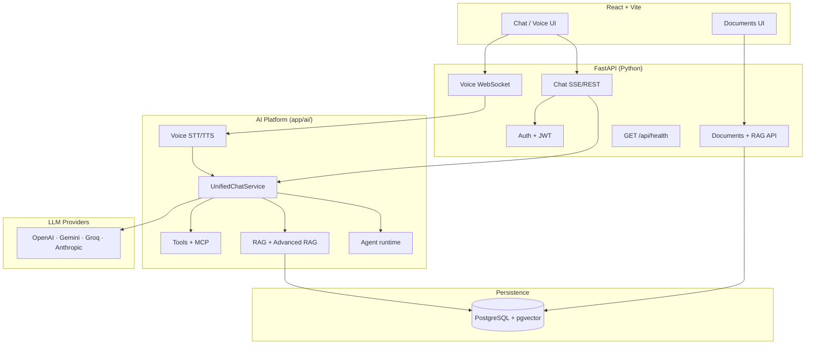

# Public Release Readiness — Implementation Plan

## Objective

Prepare the **Fullstack AI Platform** repository for public sharing with the documentation and visual assets a first-time visitor expects: a clear README, complete CHANGELOG, LICENSE, CONTRIBUTING guide, up-to-date architecture diagram(s), and representative screenshots/GIFs.

This is a **documentation and asset track**, not a feature epic. No new platform capabilities ship here; the goal is to make the existing work legible, trustworthy, and easy to run locally.

## Execution Mode

- Implement sequentially by phase (Phase 0 → Phase 7).
- After each phase verification is complete, stop and request explicit user confirmation before starting the next phase.
- Prefer **small, reviewable PRs** (one phase per PR where practical).
- Keep internal engineering history in `docs/plans/` and `docs/releases/`; surface only what helps public readers in root-level files.
- Do not commit secrets, API keys, personal emails, or production-only credentials in any new asset or doc.

## Phase Status

| Phase | Name                                 | Effort | Status      |
| ----- | ------------------------------------ | ------ | ----------- |
| 0     | Baseline Audit & Decisions           | XS     | Completed   |
| 1     | LICENSE                              | XS     | Completed   |
| 2     | CHANGELOG                            | S      | Completed   |
| 3     | CONTRIBUTING                         | S      | Completed   |
| 4     | Architecture Diagram                 | M      | Completed   |
| 5     | README Restructure                   | M      | Completed   |
| 6     | Screenshots & GIFs                   | M      | Completed   |
| 7     | Final Validation & Release Checklist | S      | Completed   |

## Scope

**In scope:**

- Root `LICENSE`, `CONTRIBUTING.md`, `CHANGELOG.md`
- Root `README.md` restructure for public audience
- Architecture diagram(s) in README and/or `docs/architecture/`
- Static media under `docs/assets/` (PNG screenshots, optional GIF demos)
- Cross-links between README, backend README, and key docs
- Pre-public secrets and PII scan
- Optional: GitHub repo metadata (description, topics, social preview image)

**Out of scope:**

- New product features or API changes
- Open-source governance (CODE_OF_CONDUCT, SECURITY.md, issue templates) — may be added later if contributions become expected
- Marketing site or separate documentation portal
- Rewriting all internal plans in `docs/plans/`
- Legal review beyond choosing a standard OSS license template

## Current Baseline (as of plan creation — 2026-07-29)

| Artifact             | Location                         | State               | Gap                                                                                                                                 |
| -------------------- | -------------------------------- | ------------------- | ----------------------------------------------------------------------------------------------------------------------------------- |
| README               | `README.md`                      | Exists (~776 lines) | Engineering changelog style; outdated system diagram (no RAG, agent, MCP, voice); no hero screenshot; dense for first-time visitors |
| CHANGELOG            | `CHANGELOG.md`                   | Partial             | Only V2 Epic 2 entries; missing MVP → V2 Epic 4 history                                                                             |
| LICENSE              | `LICENSE`                        | MIT (2026)          | README badge deferred to Phase 5                                                                                                    |
| CONTRIBUTING         | —                                | **Missing**         | Required even if contributions are not yet expected                                                                                 |
| Architecture diagram | `README.md` (Mermaid)            | Stale               | Chat-only flow; omits knowledge platform, agent runtime, MCP, voice                                                                 |
| Screenshots / GIFs   | —                                | **Missing**         | Only `frontend/public/icons.svg` exists                                                                                             |
| Release summaries    | `docs/releases/`                 | 6 files             | Authoritative source for CHANGELOG backfill (V1, V1.1, V1.1.1, V2 Epic 01, 02, 04)                                                  |
| Implementation plans | `docs/plans/`                    | Rich                | Keep as internal/historical reference; link selectively from README                                                                 |
| Version tags         | Git                              | `v0.0.1` only       | Align CHANGELOG sections with semver or documented release naming                                                                   |
| Package versions     | `pyproject.toml`, `package.json` | `0.1.0` / `0.0.0`   | Decide public version story (`0.1.0` platform vs `1.0.0` at open-source launch)                                                     |

## Locked Decisions (resolve in Phase 0)

| Topic                    | Options                                                    | Recommendation                                                                                   | Owner |
| ------------------------ | ---------------------------------------------------------- | ------------------------------------------------------------------------------------------------ | ----- |
| License                  | MIT · Apache-2.0 · Proprietary with source available       | **MIT** — common for portfolio/educational repos; simple                                         | User  |
| Public version label     | Keep `0.1.0` · Tag `v1.0.0-public` at launch               | Tag **`v1.0.0-public`** when docs complete; keep app semver at `0.1.0` until a formal API freeze | User  |
| Live demo link           | Production Railway URL · Staging · None                    | Link production demo with `DEMO_MODE_STRICT` called out                                          | User  |
| README audience          | Recruiter/hiring · OSS contributors · Both                 | **Both** — lead with product value, link to contributor docs                                     | User  |
| Internal docs visibility | Keep all `docs/plans/` public · Add `docs/README.md` index | Keep public; add **`docs/README.md`** navigation index                                           | User  |
| Architecture format      | Mermaid in README · SVG in `docs/architecture/` · Both     | **Both** — Mermaid for GitHub rendering; export SVG/PNG for README hero and social preview       | User  |

---

## Phase 0 — Baseline Audit & Decisions

**Effort:** XS

**Deliverables:** `docs/audits/public-release-readiness-phase-0-baseline-audit.md`

**Steps:**

- [x] Confirm user decisions in [Locked Decisions](#locked-decisions-resolve-in-phase-0) (license, version tag, demo URL, doc visibility).
- [x] Inventory all root-level and `docs/` markdown files; classify as **public-facing**, **developer-internal**, or **historical**.
- [x] Run secrets scan:
  - `git grep -iE '(api_key|secret|password|token)\s*=' -- ':!*.example' ':!.env*'`
  - Verify `.env`, `.env.local`, and credential files are in `.gitignore`.
  - Confirm no keys in screenshots plan (use placeholder UI or local mock data).
- [x] List release summaries to backfill CHANGELOG:
  - `docs/releases/post-mvp-v1-release-summary.md`
  - `docs/releases/post-mvp-v1.1-release-summary.md`
  - `docs/releases/post-mvp-v1.1.1-release-summary.md`
  - `docs/releases/post-mvp-v2-epic1-release-summary.md`
  - `docs/releases/post-mvp-v2-epic2-release-summary.md`
  - `docs/releases/post-mvp-v2-epic4-release-summary.md`
  - Note: V2 Epic 03 (MCP) — confirm completion status and whether Epic 03 release summary is needed before public launch.
- [x] Capture current test/coverage baselines for README badge or stats section.
- [x] Write audit doc; record metrics and open questions.
- [x] Phase 0 complete — user confirmed.

**Verify:** Manual review only; no code changes.

**Acceptance:**

- All locked decisions recorded.
- No committed secrets found (or remediation issues filed).
- CHANGELOG source list complete.

**Exit criteria:**

- Audit published; user confirmed Phase 0.

---

## Phase 1 — LICENSE

**Effort:** XS

**Deliverables:** `LICENSE` at repository root

**Steps:**

- [x] Add `LICENSE` using the chosen template (MIT recommended).
- [x] Set copyright holder and year (e.g. `Copyright (c) 2026 Laldingliana Tlau Vantawl`).
- [ ] Add license badge to README header (Phase 5) — note dependency here.
- [x] Phase 1 complete — user confirmed.

**Verify:**

```bash
test -f LICENSE && head -5 LICENSE
```

**Acceptance:**

- SPDX-identifiable license file at repo root.
- Copyright line matches author intent.

**Exit criteria:**

- `LICENSE` merged; user confirmed Phase 1.

---

## Phase 2 — CHANGELOG

**Effort:** S

**Deliverables:** Updated root `CHANGELOG.md`

**Steps:**

- [ ] Adopt [Keep a Changelog](https://keepachangelog.com/en/1.1.0/) format:
  - Header with link to repo and semver policy note.
  - Sections: `[Unreleased]`, then versioned releases newest-first.
  - Categories: `Added`, `Changed`, `Fixed`, `Removed`, `Security` (as applicable).
- [ ] Backfill from release summaries and README status sections:

  | CHANGELOG section                | Primary sources                                                                   |
  | -------------------------------- | --------------------------------------------------------------------------------- |
  | MVP (foundational chat platform) | `docs/plans/mvp-completion-implementation-plan.md`, README MVP section            |
  | Post-MVP V1                      | `docs/releases/post-mvp-v1-release-summary.md`                                    |
  | Post-MVP V1.1                    | `docs/releases/post-mvp-v1.1-release-summary.md`                                  |
  | Post-MVP V1.1.1                  | `docs/releases/post-mvp-v1.1.1-release-summary.md`                                |
  | V2 Epic 01 — Agent Framework     | `docs/releases/post-mvp-v2-epic1-release-summary.md`                              |
  | V2 Epic 02 — Advanced RAG        | `docs/releases/post-mvp-v2-epic2-release-summary.md` + existing CHANGELOG entries |
  | V2 Epic 03 — MCP Integration     | Epic 03 plan completion record (add release summary if missing)                   |
  | V2 Epic 04 — Voice Interfaces    | `docs/releases/post-mvp-v2-epic4-release-summary.md`                              |

- [ ] Write user-facing bullets (outcomes, not internal phase numbers).
- [ ] Add semver mapping note, e.g.:

  ```text
  Platform releases use internal names (Post-MVP V1.1, V2 Epic 04).
  Git tags follow semver when cut (see Releases on GitHub).
  ```

- [ ] Trim duplicate V2 Epic 2 content already in CHANGELOG; merge into unified structure.
- [ ] Phase 2 complete — user confirmed.

**Verify:** Manual review — every shipped epic in README has a CHANGELOG section.

**Acceptance:**

- CHANGELOG covers MVP through latest completed epic.
- No internal-only jargon without brief explanation.
- `[Unreleased]` section documents known in-progress work (if any).

**Exit criteria:**

- CHANGELOG merged; user confirmed Phase 2.

---

## Phase 3 — CONTRIBUTING

**Effort:** S

**Deliverables:** `CONTRIBUTING.md` at repository root

**Steps:**

- [ ] Create `CONTRIBUTING.md` with these sections (concise; ~150–250 lines max):
  1. **Welcome** — contributions welcome but not required; project is primarily a portfolio/reference implementation.
  2. **Getting started** — link to README Quick Start; prerequisites (Python 3.12+, uv, Node 20+, Docker).
  3. **Development workflow** — branch from `main`, small PRs, one app area per PR when possible.
  4. **Quality gates** — pre-commit install, per-app commands (extract from README Developer Onboarding):
     - Python: `make lint`, `make format-check`, `make typecheck`, `make test-cov`
     - Frontend: `npm run lint`, `npm run format:check`, `npm test -- --run`, `npm run build`
     - Node (optional): same pattern
  5. **PR expectations** — required CI checks, no `--no-verify` without documented reason, scope discipline.
  6. **Commit message style** — follow existing history (`feat:`, `fix:`, `docs:` prefixes).
  7. **What we are not accepting (for now)** — large refactors, new epics without discussion, dependency additions without issue.
  8. **Questions** — GitHub Issues for bugs/questions; no guaranteed response SLA.
  9. **Code of conduct** — brief respectful-collaboration statement (or link to Contributor Covenant if adopted later).

- [ ] Link `CONTRIBUTING.md` from README (Phase 5).
- [ ] Phase 3 complete — user confirmed.

**Verify:**

```bash
test -f CONTRIBUTING.md && wc -l CONTRIBUTING.md
```

**Acceptance:**

- A new contributor can install, run tests, and open a PR using CONTRIBUTING alone.
- Expectations are honest about contribution volume (low-traffic repo OK).

**Exit criteria:**

- `CONTRIBUTING.md` merged; user confirmed Phase 3.

---

## Phase 4 — Architecture Diagram

**Effort:** M

**Deliverables:**

- Updated Mermaid diagram in `README.md`
- `docs/architecture/system-overview.md` (detailed narrative + diagram)
- Optional: `docs/architecture/system-overview.svg` (exported static asset)

**Steps:**

- [ ] Replace stale README diagram with a **current** high-level view covering:

  ```text
  React Client (Chat, Documents, Voice mode)
        │  REST / SSE / WebSocket
        ▼
  FastAPI Gateway (auth, rate limits, correlation IDs)
        │
        ├─► UnifiedChatService / ToolChatService / Agent runtime (flagged)
        ├─► RAG stack (dense + Advanced RAG pipeline, flagged)
        ├─► Tool platform + MCP client (flagged)
        ├─► Voice layer (STT/TTS, WS, flagged)
        └─► ProviderFactory → OpenAI | Gemini | Groq | Anthropic
        │
        ▼
  PostgreSQL + pgvector (sessions, messages, documents, embeddings)
  ```

- [ ] Add a **feature-flag overlay** note on the diagram (default-off epics visually distinct).
- [ ] Create `docs/architecture/system-overview.md` with:
  - Layered diagram (client → API → platform services → providers → data)
  - Short description of each package (`app/ai/agent/`, `app/ai/rag/`, `app/ai/mcp/`, `app/ai/voice/`, `app/ai/tools/`)
  - Link to V2 strategy doc for roadmap context
  - Sequence sketch for one happy path (authenticated chat with documents + streaming)
- [ ] Optionally export diagram to SVG for consistent rendering outside GitHub.
- [ ] Deprecate or shorten the old chat-only diagram — do not maintain two conflicting views.
- [ ] Phase 4 complete — user confirmed.

**Verify:** Render Mermaid in GitHub preview or VS Code; confirm all major subsystems appear.

**Acceptance:**

- Diagram matches code as of V2 Epic 04 completion.
- Node.js backend shown as reference/paused, not co-equal production path.
- Voice and MCP appear as additive, flag-guarded modules.

**Exit criteria:**

- Architecture docs merged; user confirmed Phase 4.

**Suggested Mermaid skeleton (starting point):**



---

## Phase 5 — README Restructure

**Effort:** M

**Deliverables:** Rewritten root `README.md`, optional `docs/README.md` index

**Steps:**

- [x] Restructure README for **first-scan clarity** (~200–350 lines target; move depth to linked docs):

  **Recommended outline:**
  1. **Title + one-line pitch** — "Production-grade full-stack AI chat platform with RAG, tools, agents, MCP, and voice."
  2. **Badges** — license, CI status (if public), optional demo link.
  3. **Hero screenshot** — link to Phase 6 asset (`docs/assets/screenshots/chat-desktop.png`).
  4. **Features** — bullet list (8–12 items) with emoji-free, scannable text.
  5. **Architecture** — embedded Mermaid from Phase 4 (compact).
  6. **Quick Start** — minimal 5-step path (clone → env → postgres → backend → frontend).
  7. **Configuration** — link to `backend-python/README.md` for flags matrix; table of key flags only.
  8. **Demo / Deployment** — live URL, demo mode note, link to `docs/ops/public-demo-protection.md`.
  9. **Project structure** — short tree of top-level folders.
  10. **Development** — link to `CONTRIBUTING.md`; condensed command table.
  11. **Documentation map** — links to architecture, plans, releases, ops runbooks.
  12. **License** — link to `LICENSE`.

- [x] Move verbose content out of README into appropriate homes:
  - Pre-commit troubleshooting → `CONTRIBUTING.md` or `docs/tech-references/pre-commit.md`
  - Epic-by-epoch status tables → `CHANGELOG.md` + `docs/releases/`
  - Google OAuth localhost debugging → `docs/tech-references/local-google-oauth.md` (new, short)
  - CI/CD image tagging details → keep in `docs/ci-image-tagging.md`; README one-liner only

- [x] Update README status section to reflect **current** epic completion (V2 Epic 04 complete; Epic 03 status accurate).
- [x] Add `docs/README.md` index grouping: Plans, Releases, Architecture, Ops, Audits, References.
- [x] Ensure all relative links resolve.
- [x] Phase 5 complete — user confirmed.

**Verify:**

```bash
# Link check (optional, if markdown-link-check installed)
npx markdown-link-check README.md CONTRIBUTING.md CHANGELOG.md
```

**Acceptance:**

- README readable in under 3 minutes.
- Quick Start works for a fresh clone (smoke-tested once).
- No broken links to moved sections.

**Exit criteria:**

- README restructure merged; user confirmed Phase 5.

---

## Phase 6 — Screenshots & GIFs

**Effort:** M

**Deliverables:** `docs/assets/screenshots/`, optional `docs/assets/gifs/`

**Steps:**

- [x] Create asset directory structure:

  ```text
  docs/assets/
  ├── screenshots/
  │   ├── chat-desktop.png
  │   ├── chat-mobile.png
  │   ├── documents-page.png
  │   ├── voice-mode.png          # if VOICE_ENABLED demo captured
  │   └── architecture-preview.png # optional export from Phase 4
  └── gifs/
      ├── chat-streaming.gif
      └── rag-documents.gif       # optional
  ```

- [x] Capture screenshots at consistent viewport sizes:
  - Desktop: 1440×900 (chat with sidebar open)
  - Mobile: 390×844 (drawer collapsed)
  - Documents: upload list with sample files (use fake filenames, no PII)

- [ ] Recording guidelines for GIFs (deferred — optional; no GIFs committed):
  - 10–20 seconds, ≤ 5 MB each (use fps reduction or tool compression).
  - Show: send message → streaming response → stop/retry (optional).
  - Optional voice GIF only if stable local demo without API key exposure.
  - Tools: macOS Screenshot + `ffmpeg` or Kap/LICEcap.

- [x] Embed in README:

  ```markdown
  ## Screenshots

  | Chat (desktop)                                      | Documents                                                  |
  | --------------------------------------------------- | ---------------------------------------------------------- |
  |  |  |
  ```

- [x] Add alt text for accessibility.
- [x] Confirm binary assets are reasonable size (< 500 KB per PNG after optimization; use `pngquant` or ImageOptim if needed).
- [x] Phase 6 complete — user confirmed.

**Verify:** Open README on GitHub preview; images render; no secrets visible in UI.

**Acceptance:**

- At minimum: **2 desktop screenshots** (chat + documents).
- Optional GIFs enhance README but are not blockers for public release.
- All media uses sanitized demo content.

**Exit criteria:**

- Assets committed; README embeds verified; user confirmed Phase 6.

**Capture checklist:**

- [x] Empty chat state with CTAs
- [ ] Active streaming conversation (deferred — static PNGs sufficient for release)
- [x] Documents upload/list view
- [x] Mobile responsive layout
- [x] (Optional) Voice mode controls visible
- [x] (Optional) Web search / document toggles enabled

---

## Phase 7 — Final Validation & Release Checklist

**Effort:** S

**Deliverables:**

- `docs/audits/public-release-readiness-phase-7-completion.md`
- Git tag (optional): `v1.0.0-public`
- Updated GitHub repo description/topics

**Steps:**

- [x] Run full public-release checklist (below).
- [x] Re-run secrets scan from Phase 0.
- [x] Confirm CI passes on `main`.
- [ ] Smoke test Quick Start from README on a clean machine or fresh clone.
- [x] Set repository to public (user action) — already public as of 2026-07-29.
- [ ] Add GitHub topics: `fastapi`, `react`, `typescript`, `rag`, `llm`, `chatbot`, `pgvector`, `tailwindcss`.
- [x] Write completion audit with sign-off.
- [ ] Phase 7 complete — user confirmed.

**Verify:**

```bash
cd backend-python && make lint && make format-check && make typecheck && make test-cov
cd frontend && npm run lint && npm run format:check && npm test -- --run && npm run build
```

**Acceptance:**

- All Phase 0–6 deliverables present.
- Repository is safe and presentable for public audience.

**Exit criteria:**

- User authorizes public announcement / repo visibility change.

---

## Public Release Checklist

Use this as the Phase 7 gate:

### Legal & governance

- [ ] `LICENSE` present and matches README badge
- [ ] `CONTRIBUTING.md` present
- [ ] No proprietary/third-party assets without attribution
- [ ] Copyright year and holder correct

### Documentation

- [ ] `README.md` — clear pitch, Quick Start, architecture, screenshots
- [ ] `CHANGELOG.md` — complete through latest shipped epic
- [ ] `docs/architecture/system-overview.md` — current diagram
- [ ] `docs/README.md` — navigation index
- [ ] `backend-python/README.md` — still accurate for API/flags (spot-check)

### Security

- [ ] No `.env` files tracked
- [ ] `.env.example` files contain placeholders only
- [ ] Screenshots/GIFs contain no tokens, emails, or real user data
- [ ] Production URLs in docs are intentional (no admin endpoints exposed)

### Quality

- [ ] CI green on `main`
- [ ] Pre-commit documented in CONTRIBUTING
- [ ] Test counts in README roughly match current baselines

### Presentation

- [ ] At least 2 screenshots embedded
- [ ] Live demo link works (or explicitly marked "local only")
- [ ] Repo description and topics set on GitHub

---

## Files Index

| Path                                                             | Action            | Phase |
| ---------------------------------------------------------------- | ----------------- | ----- |
| `LICENSE`                                                        | create            | 1     |
| `CHANGELOG.md`                                                   | rewrite / expand  | 2     |
| `CONTRIBUTING.md`                                                | create            | 3     |
| `docs/architecture/system-overview.md`                           | create            | 4     |
| `docs/architecture/system-overview.svg`                          | create (optional) | 4     |
| `README.md`                                                      | restructure       | 5     |
| `docs/README.md`                                                 | create            | 5     |
| `docs/tech-references/local-google-oauth.md`                     | create (optional) | 5     |
| `docs/assets/screenshots/*.png`                                  | create            | 6     |
| `docs/assets/gifs/*.gif`                                         | create (optional) | 6     |
| `docs/audits/public-release-readiness-phase-0-baseline-audit.md` | create            | 0     |
| `docs/audits/public-release-readiness-phase-7-completion.md`     | create            | 7     |

## PR Map

| Branch                                     | Phase | Scope                              |
| ------------------------------------------ | ----- | ---------------------------------- |
| `docs/public-release/phase-0-audit`        | 0     | Audit only                         |
| `docs/public-release/phase-1-license`      | 1     | LICENSE                            |
| `docs/public-release/phase-2-changelog`    | 2     | CHANGELOG                          |
| `docs/public-release/phase-3-contributing` | 3     | CONTRIBUTING                       |
| `docs/public-release/phase-4-architecture` | 4     | Architecture docs + README diagram |
| `docs/public-release/phase-5-readme`       | 5     | README + docs index                |
| `docs/public-release/phase-6-assets`       | 6     | Screenshots/GIFs                   |
| `docs/public-release/phase-7-validation`   | 7     | Completion audit + tag             |

Phases 1–3 may be combined into a single **governance** PR if preferred.

## Risks

| Risk                                       | Mitigation                                                                            |
| ------------------------------------------ | ------------------------------------------------------------------------------------- |
| README becomes stale again after next epic | Add "update README + CHANGELOG" to epic Phase N validation checklist in program guide |
| Screenshots expose local env details       | Use sanitized demo account; crop browser chrome; review before commit                 |
| Over-long README refactor delays release   | Time-box Phase 5; move depth to linked docs aggressively                              |
| License choice blocks employer/IP policy   | Confirm with user in Phase 0 before adding LICENSE                                    |
| Binary assets bloat repo                   | Optimize PNGs; keep GIFs short; consider Git LFS only if files exceed ~2 MB each      |

## Definition of Done

- [ ] All seven phases completed with user confirmation
- [ ] Public Release Checklist fully ticked
- [ ] Root artifacts present: `LICENSE`, `CONTRIBUTING.md`, `CHANGELOG.md`, clear `README.md`
- [ ] Architecture diagram reflects V2 platform (through Epic 04)
- [ ] At least two screenshots embedded in README
- [ ] No committed secrets; CI green
- [ ] Repository visibility set to public (user action)

## Changelog (this plan)

| Date       | Change                                      |
| ---------- | ------------------------------------------- |
| 2026-07-29 | Initial plan                                |
| 2026-07-29 | Phase 1 complete — MIT LICENSE added        |
| 2026-07-29 | Phase 5 complete — README restructure       |
| 2026-07-29 | Phase 6 complete — screenshots & README embeds |
| 2026-07-29 | Phase 7 complete — final validation audit |
