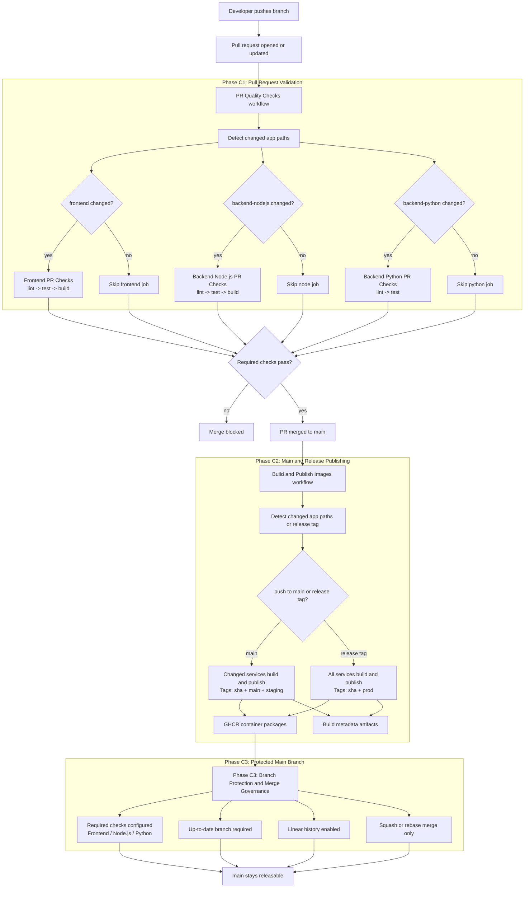
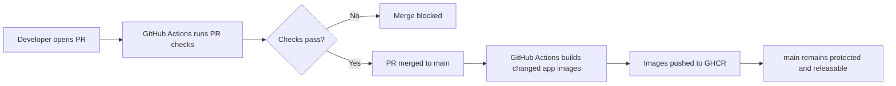
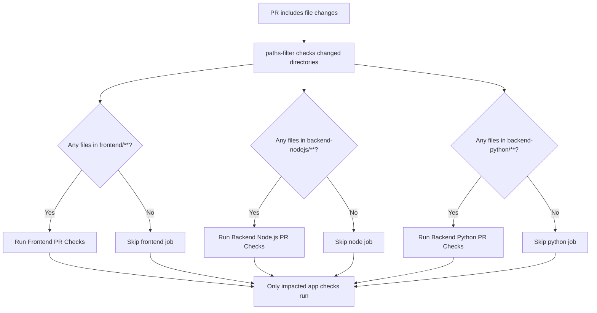

# GitHub Actions CI Implementation Summary

Status update (2026-07-15): production MVP deployment defaults to the Python backend on Railway. Node backend checks and image publishing remain in CI for post-MVP continuation, but release operations should treat Python as the active backend.

## Simple Summary

In this stage, the project learned how to check itself automatically whenever code changes are proposed or merged.

In practical terms, three important things were added.

First, every pull request now goes through automatic quality checks. The system looks at which part of the repository changed and runs only the checks that matter for that area. This keeps feedback focused and avoids wasting time on unrelated jobs.

Second, the project now builds and publishes Docker images automatically. When code is merged into `main`, the changed applications are packaged and pushed to GitHub Container Registry with clear tags, so there is a reliable record of what was built and when.

Third, the `main` branch is now protected by those checks. That means code cannot be merged freely if required validation has not passed. In simple terms, the repository now has a built-in safety gate that helps keep the main branch stable and releasable.

Taken together, Stage C moved the project from manual verification to a disciplined CI flow: check changes early, publish trusted build artifacts, and protect the main branch from avoidable regressions.

## CI Pipeline Diagram

## Simple Flow Diagram

## Path Filter Diagram

## Scope

Stage C implemented the GitHub Actions CI baseline for this monorepo across three phases:

- C1: PR quality checks
- C2: image build and publish
- C3: branch protection and merge governance

The implementation respected the monorepo boundaries:

- `frontend/`
- `backend-nodejs/`
- `backend-python/`

## Phase C1: Monorepo PR Checks

### What was implemented

- Added `.github/workflows/pr-quality.yml`
- Split PR validation into app-specific jobs:
  - `Frontend PR Checks`
  - `Backend Node.js PR Checks`
  - `Backend Python PR Checks`
- Added path filtering with `dorny/paths-filter` so only impacted app jobs run
- Pinned CI runtimes:
  - Node `24.0.0`
  - Python `3.12.7`
- Added dependency caching:
  - `npm` cache for frontend and Node backend
  - `uv` cache for Python backend

### Validation outcome

- PRs with isolated path changes triggered only the relevant app jobs
- Required check names were finalized for later branch protection use
- Lint/test/build failures correctly failed PR checks

## Phase C2: Build and Image Publish

### What was implemented

- Added `.github/workflows/build-publish-images.yml`
- Triggered image publishing on:
  - push to `main`
  - release-like tags: `v*`, `release-*`
- Built and published changed services to GHCR on `main`
- Published all services on release tags
- Standardized image names:
  - `ghcr.io/<owner>/fullstack-ai-platform-frontend`
  - `ghcr.io/<owner>/fullstack-ai-platform-backend-nodejs`
  - `ghcr.io/<owner>/fullstack-ai-platform-backend-python`
- Standardized tags:
  - immutable: `sha-<git_sha>`
  - mutable channels: `main`, `staging`, `prod`
- Uploaded per-service build metadata artifacts containing:
  - service name
  - git ref
  - commit sha
  - image digest
  - generated Docker metadata payload

### Fix applied during validation

- Frontend image publish initially failed because `npm ci` inside the Linux Docker build rejected a lockfile mismatch
- Root cause was a Linux-specific `package-lock.json` mismatch for optional dependencies used by the frontend toolchain
- Resolution:
  - regenerated `frontend/package-lock.json` in a Linux Node container
  - pinned Node Docker images to `node:24.0.0-alpine` in frontend and Node backend Dockerfiles for deterministic builds

### Validation outcome

- Confirmed release-tag publishing created `prod` and `sha-*` tags
- Confirmed `main` publishing created `main`, `staging`, and `sha-*` tags for changed services
- Confirmed skipped build jobs were expected when a service path was unchanged

## Phase C3: Branch Protection Enforcement

### What was implemented

- Configured required status checks on `main`:
  - `Frontend PR Checks`
  - `Backend Node.js PR Checks`
  - `Backend Python PR Checks`
- Required branches to be up to date before merge (`strict: true`)
- Enabled linear history on `main`
- Disabled merge commits
- Kept squash merge and rebase merge enabled
- Documented PR quality gate expectations in `README.md`

### Validation outcome

- Verified branch protection settings via GitHub API
- Created a disposable failing PR to confirm merge restriction behavior
- Confirmed GitHub blocked a normal merge while required conditions were not satisfied
- Removed the temporary validation PR and branch after verification

## Final Result

Stage C now provides:

- app-aware PR validation for a monorepo
- deterministic CI runtimes and dependency installs
- container publishing to GHCR from trusted branch/tag events
- standardized tagging for branch and release flows
- branch protection tied to real CI check names
- merge governance that keeps `main` releasable

## Key Files

- `.github/workflows/pr-quality.yml`
- `.github/workflows/build-publish-images.yml`
- `README.md`
- `frontend/Dockerfile`
- `backend-nodejs/Dockerfile`
- `frontend/package-lock.json`

## Practical Notes

- Path filters are central to keeping CI runtime low in this monorepo
- A skipped app build job is expected when that app directory was not changed
- GHCR validation should always check both:
  - release-tag path: `prod` + `sha-*`
  - `main` path: `main` + `staging` + `sha-*`
- Branch protection depends on stable check names, so workflow job names should not be changed casually after C3
